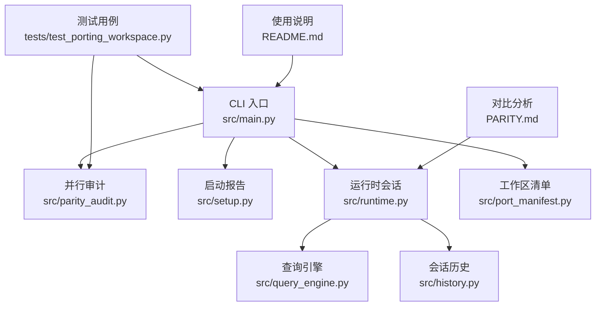
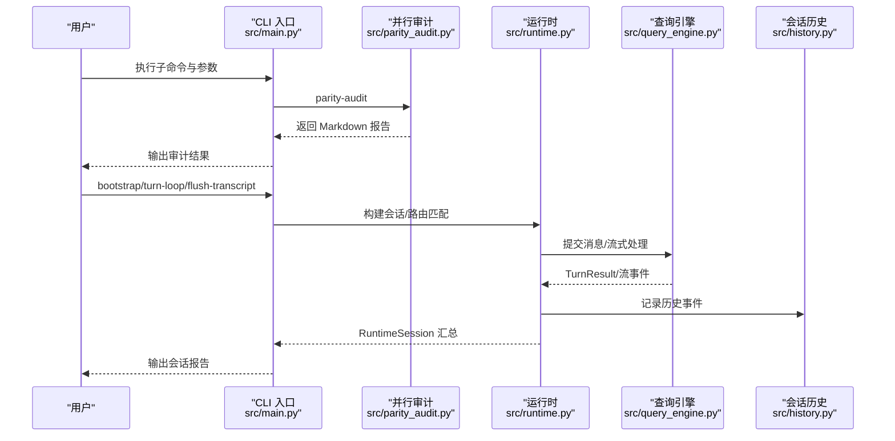
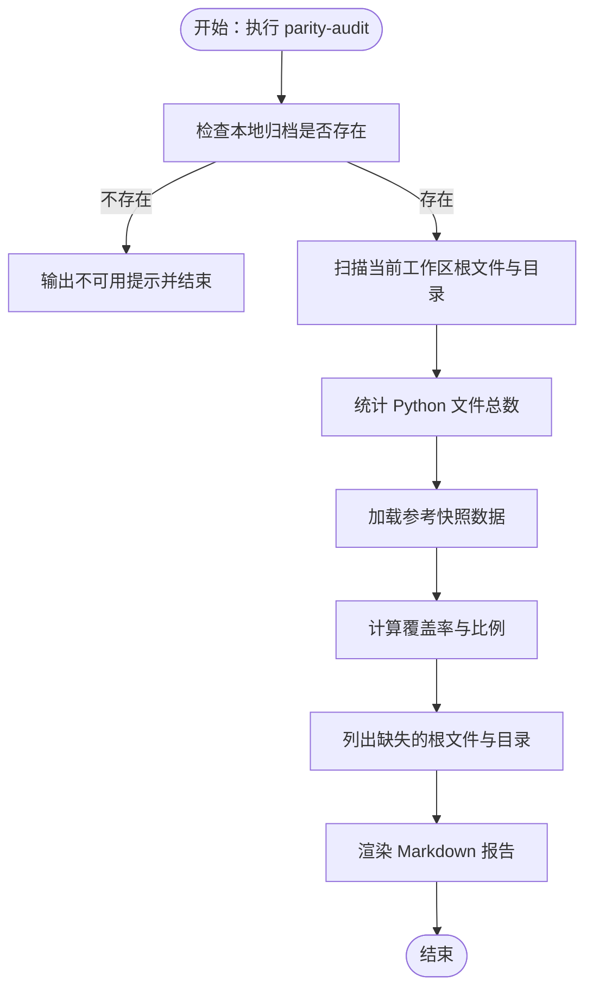
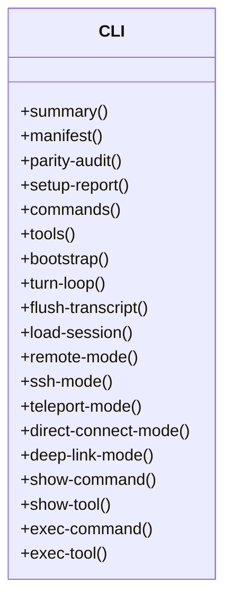
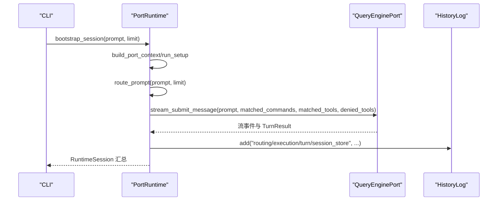
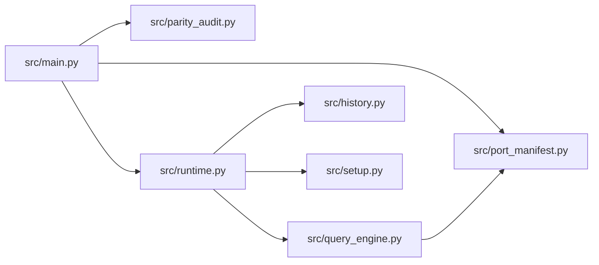

# 调试工具

<cite>
**本文引用的文件**
- [src/main.py](file://src/main.py)
- [src/parity_audit.py](file://src/parity_audit.py)
- [src/setup.py](file://src/setup.py)
- [src/runtime.py](file://src/runtime.py)
- [src/history.py](file://src/history.py)
- [src/query_engine.py](file://src/query_engine.py)
- [src/port_manifest.py](file://src/port_manifest.py)
- [README.md](file://README.md)
- [PARITY.md](file://PARITY.md)
- [tests/test_porting_workspace.py](file://tests/test_porting_workspace.py)
</cite>

## 目录
1. [简介](#简介)
2. [项目结构](#项目结构)
3. [核心组件](#核心组件)
4. [架构总览](#架构总览)
5. [详细组件分析](#详细组件分析)
6. [依赖分析](#依赖分析)
7. [性能考虑](#性能考虑)
8. [故障排查指南](#故障排查指南)
9. [结论](#结论)
10. [附录](#附录)

## 简介
本指南面向 CLAW 项目的开发者与维护者，系统讲解内置调试与诊断工具的使用方法，重点覆盖：
- 并行审计工具 parity audit 的使用与结果解读
- 命令行调试选项与参数说明
- 日志与会话历史记录的分析技巧
- 如何启用详细日志模式与收集诊断信息
- 性能分析与内存使用监控建议
- 运行时会话的可视化与回放流程

CLAW 当前以 Python 端为主，同时保留了 Rust 端的演进分支；本指南聚焦于 Python 工作区的调试能力与诊断输出。

## 项目结构
Python 端调试相关的关键模块分布如下：
- CLI 入口与子命令：src/main.py
- 并行审计工具：src/parity_audit.py
- 启动与设置报告：src/setup.py
- 运行时与会话：src/runtime.py、src/query_engine.py、src/history.py
- 工作区清单与统计：src/port_manifest.py
- 使用示例与测试：README.md、tests/test_porting_workspace.py
- Rust 端对比分析文档：PARITY.md

**图表来源**
- [src/main.py:21-91](file://src/main.py#L21-L91)
- [src/parity_audit.py:121-139](file://src/parity_audit.py#L121-L139)
- [src/setup.py:64-78](file://src/setup.py#L64-L78)
- [src/runtime.py:89-152](file://src/runtime.py#L89-L152)
- [src/query_engine.py:35-151](file://src/query_engine.py#L35-L151)
- [src/history.py:12-23](file://src/history.py#L12-L23)
- [src/port_manifest.py:30-53](file://src/port_manifest.py#L30-L53)
- [tests/test_porting_workspace.py:36-74](file://tests/test_porting_workspace.py#L36-L74)
- [README.md:112-149](file://README.md#L112-L149)
- [PARITY.md:1-215](file://PARITY.md#L1-L215)

**章节来源**
- [src/main.py:21-91](file://src/main.py#L21-L91)
- [README.md:112-149](file://README.md#L112-L149)

## 核心组件
- CLI 子命令与参数解析：提供 summary、manifest、parity-audit、setup-report、commands、tools、bootstrap、turn-loop、flush-transcript、load-session、remote-mode、ssh-mode、teleport-mode、direct-connect-mode、deep-link-mode、show-command、show-tool、exec-command、exec-tool 等子命令，并支持丰富的过滤与展示参数。
- 并行审计（parity audit）：基于本地归档快照，对比当前 Python 工作区的根文件覆盖率、目录覆盖率、Python 文件数量与命令/工具入口镜像情况，生成可读的 Markdown 报告。
- 启动与设置报告：汇总 Python 版本、平台、信任模式、预取任务、延迟初始化等信息。
- 运行时与会话：路由提示词到命令/工具，执行并记录权限拒绝、用量统计、会话持久化与历史事件。
- 查询引擎：负责单轮对话提交、流式事件产出、紧凑消息策略、会话保存与摘要渲染。
- 工作区清单：统计顶层模块与文件数量，辅助定位缺失或异常模块。
- 测试与使用示例：通过测试验证 parity audit 可运行、命令/工具列表可检索、工作区清单有效。

**章节来源**
- [src/main.py:94-210](file://src/main.py#L94-L210)
- [src/parity_audit.py:121-139](file://src/parity_audit.py#L121-L139)
- [src/setup.py:64-78](file://src/setup.py#L64-L78)
- [src/runtime.py:89-152](file://src/runtime.py#L89-L152)
- [src/query_engine.py:35-151](file://src/query_engine.py#L35-L151)
- [src/port_manifest.py:30-53](file://src/port_manifest.py#L30-L53)
- [tests/test_porting_workspace.py:36-74](file://tests/test_porting_workspace.py#L36-L74)

## 架构总览
下图展示了从 CLI 到运行时、再到查询引擎与会话存储的整体调用链路，以及审计与诊断输出的位置。

**图表来源**
- [src/main.py:94-210](file://src/main.py#L94-L210)
- [src/parity_audit.py:121-139](file://src/parity_audit.py#L121-L139)
- [src/runtime.py:89-152](file://src/runtime.py#L89-L152)
- [src/query_engine.py:61-128](file://src/query_engine.py#L61-L128)
- [src/history.py:12-23](file://src/history.py#L12-L23)

## 详细组件分析

### 并行审计工具 parity audit
- 功能概述
  - 对比当前 Python 工作区与本地归档快照，计算根文件覆盖率、目录覆盖率、Python 文件总数与命令/工具入口镜像比例，并列出缺失项。
  - 若本地归档不可用，则提示无法进行比较。
- 关键数据结构
  - ParityAuditResult：包含归档可用性、覆盖率与缺失目标等字段，并提供 to_markdown() 渲染为 Markdown 报告。
- 使用方式
  - 通过 CLI 子命令 parity-audit 触发，或在测试中直接调用 run_parity_audit()。
- 结果解读
  - Root file coverage：当前工作区根目录映射文件的覆盖程度。
  - Directory coverage：顶级子系统目录的覆盖程度。
  - Total Python files vs archived TS-like files：当前 Python 文件数与参考快照中的 TS 类似文件数之比。
  - Command/Tool entry coverage：命令与工具入口镜像数量与参考快照的比值。
  - Missing root/targets：未映射的根文件与目录清单。

**图表来源**
- [src/parity_audit.py:121-139](file://src/parity_audit.py#L121-L139)

**章节来源**
- [src/parity_audit.py:73-139](file://src/parity_audit.py#L73-L139)
- [tests/test_porting_workspace.py:36-51](file://tests/test_porting_workspace.py#L36-L51)
- [README.md:138-142](file://README.md#L138-L142)

### CLI 子命令与调试参数
- summary：渲染 Python 工作区摘要，包含清单、命令/工具表面、会话信息与用量统计。
- manifest：打印当前工作区清单，显示顶层模块与文件计数。
- parity-audit：对比工作区与本地归档，输出覆盖率与缺失项。
- setup-report：渲染启动与预取报告，包含环境、平台、信任模式与延迟初始化详情。
- commands/tools：列出镜像命令/工具条目，支持 limit、query、过滤与简单模式。
- bootstrap/turn-loop：构建会话并执行多轮对话，支持限制轮次与结构化输出。
- flush-transcript/load-session：持久化会话并输出路径，或加载已保存会话。
- remote-mode/ssh-mode/teleport-mode/direct-connect-mode/deep-link-mode：模拟不同运行分支模式。
- show-command/show-tool/exec-command/exec-tool：查看与执行单个命令/工具。

**图表来源**
- [src/main.py:21-91](file://src/main.py#L21-L91)

**章节来源**
- [src/main.py:94-210](file://src/main.py#L94-L210)
- [README.md:112-149](file://README.md#L112-L149)

### 运行时与会话调试
- 路由与执行
  - PortRuntime.route_prompt：根据提示词分词匹配命令/工具，按分数排序返回候选。
  - bootstrap_session：构建上下文、设置报告、路由匹配、执行命令/工具、记录权限拒绝、流式事件与最终 TurnResult，并持久化会话。
  - run_turn_loop：在限制轮次内循环提交消息，支持结构化输出。
- 会话历史
  - HistoryLog：记录关键阶段事件，如上下文、注册表、路由、执行、回合与会话存储，最终以 Markdown 形式输出。
- 查询引擎
  - QueryEnginePort.submit_message/stream_submit_message：提交消息、计算用量、紧凑消息、权限拒绝与停止原因（完成/达到最大轮次/超出预算），并支持结构化输出重试与回退。
  - persist_session：刷新转录并保存会话，返回持久化路径。

**图表来源**
- [src/runtime.py:89-152](file://src/runtime.py#L89-L152)
- [src/query_engine.py:61-128](file://src/query_engine.py#L61-L128)
- [src/history.py:12-23](file://src/history.py#L12-L23)

**章节来源**
- [src/runtime.py:89-193](file://src/runtime.py#L89-L193)
- [src/query_engine.py:35-194](file://src/query_engine.py#L35-L194)
- [src/history.py:12-23](file://src/history.py#L12-L23)

### 工作区清单与诊断信息
- PortManifest：统计顶层模块与文件数量，提供 Markdown 格式输出，便于快速发现缺失模块或异常计数。
- 诊断信息收集建议
  - 使用 setup-report 获取环境与启动步骤详情。
  - 使用 manifest 快速核对模块与文件数量。
  - 使用 parity-audit 对照归档快照评估移植进度。
  - 使用 flush-transcript/load-session 验证会话持久化与回放。

**章节来源**
- [src/port_manifest.py:12-53](file://src/port_manifest.py#L12-L53)
- [src/setup.py:64-78](file://src/setup.py#L64-L78)

## 依赖分析
- 组件耦合
  - CLI 作为入口，依赖 parity_audit、runtime、query_engine、port_manifest 等模块。
  - runtime 依赖 setup、query_engine、history 等模块。
  - query_engine 依赖 port_manifest、transcript 等模块。
- 外部依赖
  - argparse：用于命令行参数解析。
  - json：用于读取参考快照与渲染结构化输出。
- 循环依赖
  - 未发现直接循环导入；各模块职责清晰，接口稳定。

**图表来源**
- [src/main.py:5-18](file://src/main.py#L5-L18)
- [src/runtime.py:5-13](file://src/runtime.py#L5-L13)
- [src/query_engine.py:7-12](file://src/query_engine.py#L7-L12)

**章节来源**
- [src/main.py:5-18](file://src/main.py#L5-L18)
- [src/runtime.py:5-13](file://src/runtime.py#L5-L13)
- [src/query_engine.py:7-12](file://src/query_engine.py#L7-L12)

## 性能考虑
- Token 预算与紧凑策略
  - QueryEngineConfig 控制每回合最大轮次、预算令牌数、紧凑阈值与结构化输出重试次数。合理配置可避免内存膨胀与超预算。
- 会话紧凑
  - 当消息数量超过紧凑阈值时，仅保留最近若干条消息并压缩转录，降低内存占用。
- 路由与匹配
  - 路由采用基于关键词的评分机制，建议在提示词中明确关键术语以减少无关匹配，提高执行效率。
- 并行审计
  - parity audit 仅进行扫描与计数，开销较小；若本地归档缺失则跳过比较，避免额外 IO。

**章节来源**
- [src/query_engine.py:15-22](file://src/query_engine.py#L15-L22)
- [src/query_engine.py:129-132](file://src/query_engine.py#L129-L132)
- [src/runtime.py:89-107](file://src/runtime.py#L89-L107)

## 故障排查指南
- parity audit 报告为空或提示不可用
  - 检查本地归档是否存在于预期路径；若不存在，报告将提示无法比较。
  - 参考测试用例确保 parity-audit 子命令可正常运行。
- 命令/工具列表为空或不完整
  - 使用 commands/tools 子命令并调整 limit、query、过滤参数；必要时启用简单模式或排除特定类型。
- 会话未持久化或路径异常
  - 使用 flush-transcript 查看持久化路径与转录状态；使用 load-session 加载已有会话并核对令牌用量。
- 运行中断或预算耗尽
  - 检查 QueryEngineConfig 的 max_turns 与 max_budget_tokens 设置；适当放宽限制或优化提示词。
- 历史事件缺失
  - 确认 runtime 步骤中已正确添加历史事件；通过 RuntimeSession 的 Markdown 输出核对关键阶段。

**章节来源**
- [src/parity_audit.py:84-110](file://src/parity_audit.py#L84-L110)
- [tests/test_porting_workspace.py:36-44](file://tests/test_porting_workspace.py#L36-L44)
- [src/query_engine.py:140-150](file://src/query_engine.py#L140-L150)
- [src/runtime.py:135-139](file://src/runtime.py#L135-L139)
- [src/history.py:19-22](file://src/history.py#L19-L22)

## 结论
CLAW 的调试与诊断体系围绕 CLI、并行审计、运行时会话与查询引擎展开，提供了从工作区概览到具体执行细节的全链路可观测性。通过 parity audit 对照归档快照，结合 setup-report、manifest 与会话历史，可以高效定位移植缺口与运行问题。建议在日常开发中配合 turn-loop 与 flush-transcript 进行迭代验证，并依据 QueryEngineConfig 的配置平衡性能与稳定性。

## 附录
- 常用命令速查
  - 渲染摘要：python3 -m src.main summary
  - 打印清单：python3 -m src.main manifest
  - 并行审计：python3 -m src.main parity-audit
  - 启动报告：python3 -m src.main setup-report
  - 列出命令/工具：python3 -m src.main commands/tools
  - 会话引导：python3 -m src.main bootstrap
  - 多轮对话：python3 -m src.main turn-loop
  - 持久化会话：python3 -m src.main flush-transcript
  - 加载会话：python3 -m src.main load-session
  - 远程/SSH/传送/直连/深链模式：python3 -m src.main remote-mode/ssh-mode/teleport-mode/direct-connect-mode/deep-link-mode
  - 查看/执行命令/工具：python3 -m src.main show-command/show-tool/exec-command/exec-tool

**章节来源**
- [README.md:112-149](file://README.md#L112-L149)