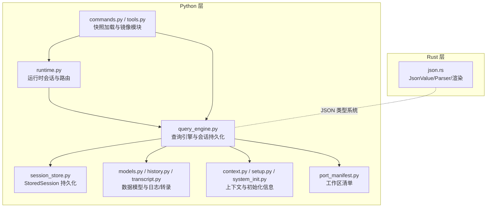
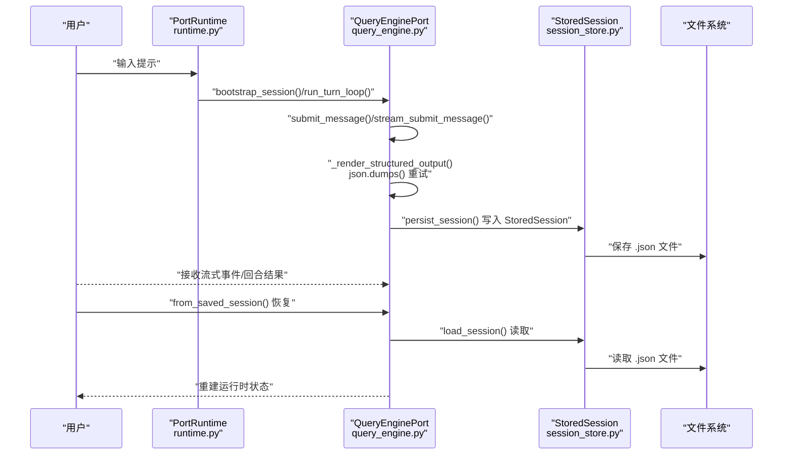
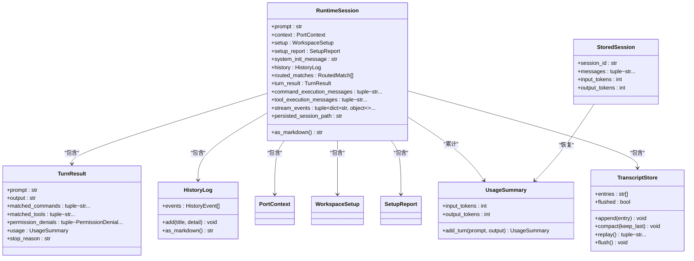
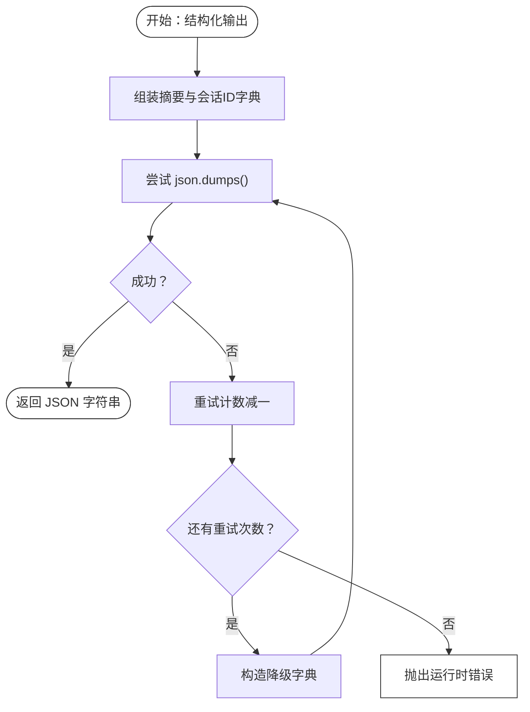
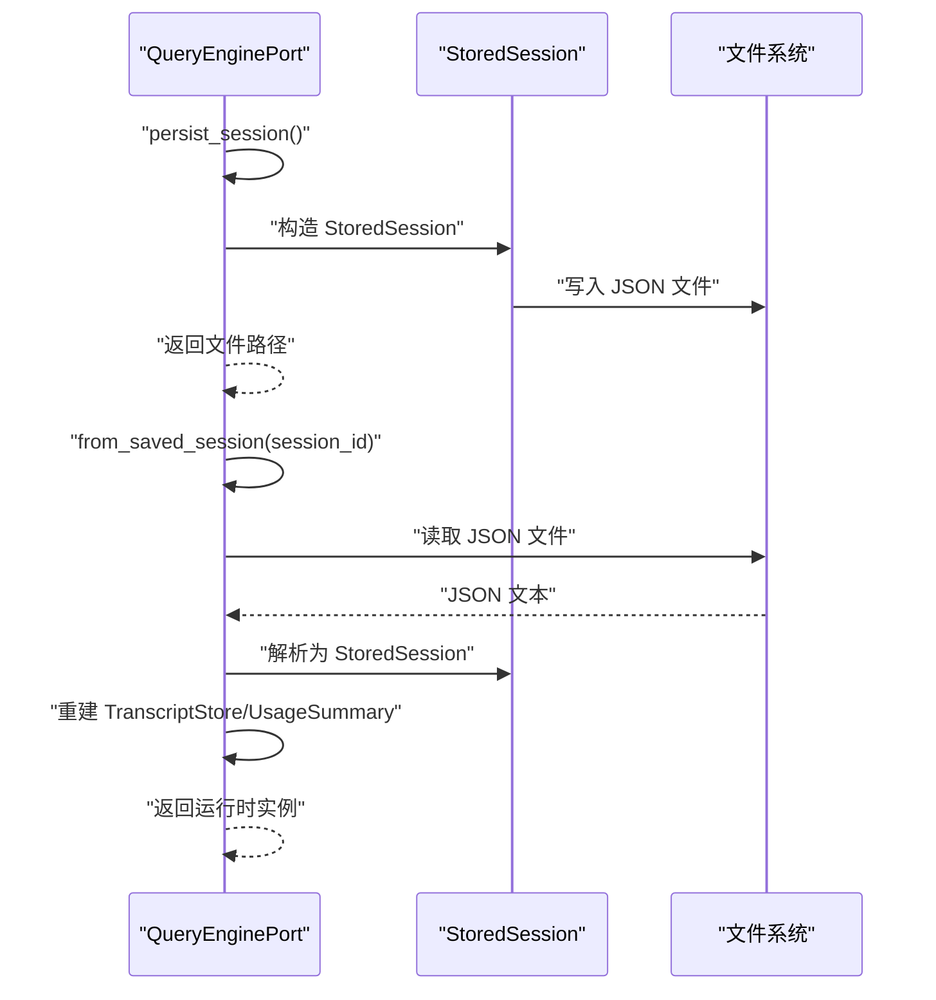
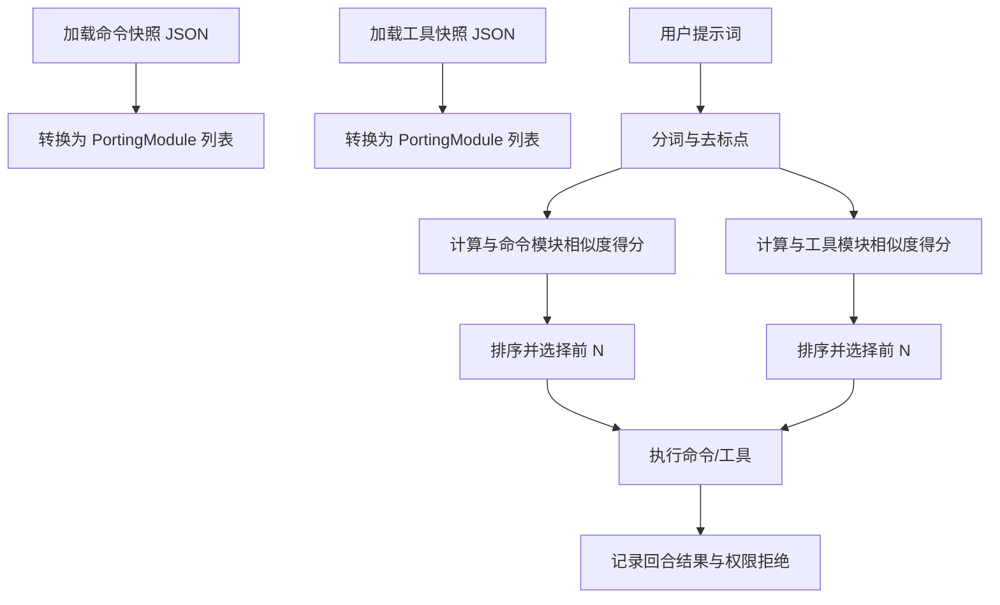
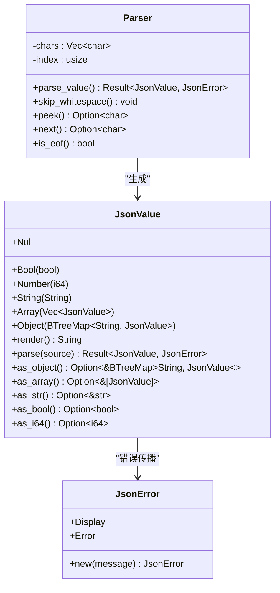
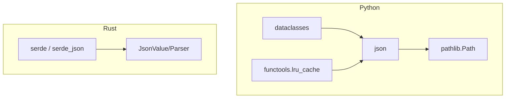

# 序列化机制

<cite>
**本文引用的文件**
- [runtime.py](file://src/runtime.py)
- [session_store.py](file://src/session_store.py)
- [query_engine.py](file://src/query_engine.py)
- [models.py](file://src/models.py)
- [history.py](file://src/history.py)
- [transcript.py](file://src/transcript.py)
- [context.py](file://src/context.py)
- [setup.py](file://src/setup.py)
- [system_init.py](file://src/system_init.py)
- [port_manifest.py](file://src/port_manifest.py)
- [commands.py](file://src/commands.py)
- [tools.py](file://src/tools.py)
- [execution_registry.py](file://src/execution_registry.py)
- [json.rs](file://rust/crates/runtime/src/json.rs)
- [Cargo.lock](file://rust/Cargo.lock)
</cite>

## 目录
1. [引言](#引言)
2. [项目结构](#项目结构)
3. [核心组件](#核心组件)
4. [架构总览](#架构总览)
5. [组件详解](#组件详解)
6. [依赖关系分析](#依赖关系分析)
7. [性能与内存优化](#性能与内存优化)
8. [故障诊断与排错指南](#故障诊断与排错指南)
9. [结论](#结论)
10. [附录](#附录)

## 引言
本文件系统性梳理 CLAW 项目的序列化机制，覆盖 Python 端的数据类序列化与 JSON 序列化、Rust 端自定义 JSON 解析与渲染、会话持久化与加载、以及运行时数据结构的序列化流程。文档同时给出性能优化建议、内存控制策略、大对象处理方法、错误诊断与修复路径，并讨论版本兼容与安全注意事项。

## 项目结构
CLAW 的序列化涉及三层：
- Python 层：以 dataclass 为核心的数据模型，配合标准库 json 实现序列化/反序列化；通过工具模块加载快照（命令与工具）。
- Rust 层：自研 JSON 抽象 JsonValue 及解析器 Parser，提供类型安全的 JSON 访问与渲染能力。
- 运行时层：查询引擎负责对话回合、令牌预算、结构化输出渲染与会话持久化。

图表来源
- [runtime.py:1-193](file://src/runtime.py#L1-L193)
- [query_engine.py:1-194](file://src/query_engine.py#L1-L194)
- [session_store.py:1-36](file://src/session_store.py#L1-L36)
- [commands.py:1-91](file://src/commands.py#L1-L91)
- [tools.py:1-97](file://src/tools.py#L1-L97)
- [models.py:1-50](file://src/models.py#L1-L50)
- [history.py:1-23](file://src/history.py#L1-L23)
- [transcript.py:1-24](file://src/transcript.py#L1-L24)
- [context.py:1-48](file://src/context.py#L1-L48)
- [setup.py:1-78](file://src/setup.py#L1-L78)
- [system_init.py:1-24](file://src/system_init.py#L1-L24)
- [port_manifest.py:1-53](file://src/port_manifest.py#L1-L53)
- [json.rs:1-358](file://rust/crates/runtime/src/json.rs#L1-L358)

章节来源
- [runtime.py:1-193](file://src/runtime.py#L1-L193)
- [query_engine.py:1-194](file://src/query_engine.py#L1-L194)
- [session_store.py:1-36](file://src/session_store.py#L1-L36)
- [commands.py:1-91](file://src/commands.py#L1-L91)
- [tools.py:1-97](file://src/tools.py#L1-L97)
- [models.py:1-50](file://src/models.py#L1-L50)
- [history.py:1-23](file://src/history.py#L1-L23)
- [transcript.py:1-24](file://src/transcript.py#L1-L24)
- [context.py:1-48](file://src/context.py#L1-L48)
- [setup.py:1-78](file://src/setup.py#L1-L78)
- [system_init.py:1-24](file://src/system_init.py#L1-L24)
- [port_manifest.py:1-53](file://src/port_manifest.py#L1-L53)
- [json.rs:1-358](file://rust/crates/runtime/src/json.rs#L1-L358)

## 核心组件
- 数据类与序列化
  - Python 使用 dataclass 定义不可变数据模型，配合标准库 json 的 dumps/loads 实现序列化与反序列化。
  - 典型数据类包括：运行时会话、查询配置、回合结果、权限拒绝、使用统计、历史事件、转录存储等。
- JSON 序列化与渲染
  - Python 查询引擎在结构化输出失败时，具备重试与降级策略，确保稳定输出。
  - Rust 提供 JsonValue 枚举与 Parser 结构体，实现 JSON 值的类型访问与字符串渲染，支持转义与错误报告。
- 会话持久化
  - 将运行时会话的关键字段（消息、令牌用量）写入 JSON 文件，支持按 session_id 加载恢复。
- 快照与镜像模块
  - 命令与工具快照以 JSON 文件形式存放在 reference_data 下，启动时加载为 PortingModule 列表，用于路由与执行。

章节来源
- [models.py:1-50](file://src/models.py#L1-L50)
- [history.py:1-23](file://src/history.py#L1-L23)
- [transcript.py:1-24](file://src/transcript.py#L1-L24)
- [query_engine.py:15-194](file://src/query_engine.py#L15-L194)
- [session_store.py:8-36](file://src/session_store.py#L8-L36)
- [commands.py:22-36](file://src/commands.py#L22-L36)
- [tools.py:23-35](file://src/tools.py#L23-L35)
- [json.rs:1-358](file://rust/crates/runtime/src/json.rs#L1-L358)

## 架构总览
下图展示从用户提示到会话持久化的完整序列化流程，涵盖 Python 端数据类与 JSON 渲染、Rust 端 JSON 抽象与解析器，以及会话读写。

图表来源
- [runtime.py:89-167](file://src/runtime.py#L89-L167)
- [query_engine.py:45-150](file://src/query_engine.py#L45-L150)
- [session_store.py:19-36](file://src/session_store.py#L19-L36)

## 组件详解

### Python 数据类与 JSON 序列化
- 数据类设计
  - 不可变数据类（frozen=True）保证线程安全与可预测性，适合跨模块传递与持久化。
  - 字段类型明确，便于序列化器推断与校验。
- JSON 序列化
  - 使用 asdict 将 dataclass 转换为字典，再由 json.dumps 输出。
  - 反序列化时将字典映射回 dataclass 构造函数参数，注意元组字段需显式转换为 tuple。
- 结构化输出渲染
  - 当启用结构化输出时，先尝试将摘要与会话 ID 组装为字典并渲染为 JSON；若失败则进行有限次重试，最终抛出运行时错误。

图表来源
- [runtime.py:24-86](file://src/runtime.py#L24-L86)
- [session_store.py:8-36](file://src/session_store.py#L8-L36)
- [query_engine.py:24-44](file://src/query_engine.py#L24-L44)
- [models.py:28-38](file://src/models.py#L28-L38)
- [history.py:12-23](file://src/history.py#L12-L23)
- [transcript.py:6-24](file://src/transcript.py#L6-L24)

章节来源
- [runtime.py:24-86](file://src/runtime.py#L24-L86)
- [session_store.py:8-36](file://src/session_store.py#L8-L36)
- [query_engine.py:24-44](file://src/query_engine.py#L24-L44)
- [models.py:28-38](file://src/models.py#L28-L38)
- [history.py:12-23](file://src/history.py#L12-L23)
- [transcript.py:6-24](file://src/transcript.py#L6-L24)

### JSON 序列化与自定义序列化器
- Python 端
  - 会话持久化：将 StoredSession 写入 JSON 文件，字段名与类型一一对应。
  - 快照加载：命令与工具快照以 JSON 文件形式存在，启动时一次性加载为不可变列表。
  - 结构化输出：当 json.dumps 失败时，触发重试逻辑，避免因单次异常导致流程中断。
- Rust 端
  - JsonValue 枚举覆盖 null/bool/number/string/array/object 六种类型，提供类型安全的访问接口。
  - Parser 实现递归下降解析，支持空白跳过、字面量识别、字符串转义与数字范围检查。
  - render 函数对 JsonValue 进行字符串渲染，内置字符串转义规则，确保合法 JSON 输出。

图表来源
- [query_engine.py:161-169](file://src/query_engine.py#L161-L169)

章节来源
- [session_store.py:19-36](file://src/session_store.py#L19-L36)
- [commands.py:22-36](file://src/commands.py#L22-L36)
- [tools.py:23-35](file://src/tools.py#L23-L35)
- [query_engine.py:161-169](file://src/query_engine.py#L161-L169)
- [json.rs:36-113](file://rust/crates/runtime/src/json.rs#L36-L113)
- [json.rs:146-329](file://rust/crates/runtime/src/json.rs#L146-L329)

### 会话持久化与恢复
- 保存流程
  - 查询引擎在 persist_session 中将当前会话 ID、消息列表、令牌用量封装为 StoredSession。
  - 使用 json.dumps 写入目标目录，默认为 .port_sessions，文件名为 session_id.json。
- 加载流程
  - 通过 session_id 读取 JSON 文件，解析为字典后映射到 StoredSession。
  - 从 StoredSession 恢复 TranscriptStore、UsageSummary 等运行时状态。

图表来源
- [query_engine.py:140-150](file://src/query_engine.py#L140-L150)
- [session_store.py:19-36](file://src/session_store.py#L19-L36)

章节来源
- [query_engine.py:140-150](file://src/query_engine.py#L140-L150)
- [session_store.py:19-36](file://src/session_store.py#L19-L36)

### 快照与镜像模块
- 命令与工具快照
  - 通过 LRU 缓存加载 JSON 快照，转换为 PortingModule 列表，作为路由与执行的基础。
  - 支持过滤与权限上下文筛选，便于在不同模式下选择可用模块。
- 路由与执行
  - PortRuntime 基于提示词分词与模块属性评分，选择匹配的命令/工具并执行。
  - 执行结果与权限拒绝记录在回合结果中，供后续渲染与持久化。

图表来源
- [commands.py:22-36](file://src/commands.py#L22-L36)
- [tools.py:23-35](file://src/tools.py#L23-L35)
- [runtime.py:89-107](file://src/runtime.py#L89-L107)
- [execution_registry.py:47-52](file://src/execution_registry.py#L47-L52)

章节来源
- [commands.py:22-36](file://src/commands.py#L22-L36)
- [tools.py:23-35](file://src/tools.py#L23-L35)
- [runtime.py:89-107](file://src/runtime.py#L89-L107)
- [execution_registry.py:47-52](file://src/execution_registry.py#L47-L52)

### Rust JSON 抽象与解析
- JsonValue
  - 表示 JSON 值的统一抽象，支持对象、数组、字符串、数字、布尔与空值。
  - 提供 as_object/as_array/as_str/as_bool/as_i64 等类型安全访问方法。
- Parser
  - 递归下降解析器，支持字面量、字符串、数组、对象与数字解析。
  - 错误类型 JsonError 提供统一的错误描述与显示实现。
- 渲染
  - render 函数将 JsonValue 渲染为合法 JSON 字符串，内置字符串转义与控制字符处理。

图表来源
- [json.rs:4-113](file://rust/crates/runtime/src/json.rs#L4-L113)
- [json.rs:146-329](file://rust/crates/runtime/src/json.rs#L146-L329)

章节来源
- [json.rs:4-113](file://rust/crates/runtime/src/json.rs#L4-L113)
- [json.rs:146-329](file://rust/crates/runtime/src/json.rs#L146-L329)

## 依赖关系分析
- Python 依赖
  - dataclasses：用于定义不可变数据模型。
  - json：用于序列化/反序列化。
  - pathlib：用于文件路径操作。
  - functools.lru_cache：用于快照缓存。
- Rust 依赖
  - serde/serde_json：用于 JSON 序列化与反序列化（在 Cargo.lock 中可见）。
  - 自研 JsonValue/Parser：用于类型安全的 JSON 访问与渲染。

图表来源
- [Cargo.lock:1247-1288](file://rust/Cargo.lock#L1247-L1288)
- [json.rs:1-358](file://rust/crates/runtime/src/json.rs#L1-L358)

章节来源
- [Cargo.lock:1247-1288](file://rust/Cargo.lock#L1247-L1288)
- [json.rs:1-358](file://rust/crates/runtime/src/json.rs#L1-L358)

## 性能与内存优化
- 数据类不可变化
  - frozen=True 的数据类减少拷贝与并发修改开销，提升序列化与传输效率。
- 缓存策略
  - 命令与工具快照使用 LRU 缓存，避免重复 IO 与解析。
- 令牌预算与紧凑策略
  - 查询引擎维护输入/输出令牌预算，超过阈值提前停止，防止过度增长。
  - 长对话自动紧凑保留最近若干轮消息，降低内存占用。
- 结构化输出重试
  - 在渲染失败时进行有限次重试，避免因偶发异常导致失败风暴。
- Rust JSON 解析
  - 自研解析器避免引入额外依赖，减少二进制体积与启动时间；字符串转义与控制字符处理确保高效渲染。

章节来源
- [query_engine.py:68-104](file://src/query_engine.py#L68-L104)
- [query_engine.py:129-132](file://src/query_engine.py#L129-L132)
- [query_engine.py:161-169](file://src/query_engine.py#L161-L169)
- [commands.py:22-36](file://src/commands.py#L22-L36)
- [tools.py:23-35](file://src/tools.py#L23-L35)
- [json.rs:146-329](file://rust/crates/runtime/src/json.rs#L146-L329)

## 故障诊断与排错指南
- JSON 序列化失败
  - 现象：结构化输出渲染抛出运行时错误。
  - 排查：确认 payload 字段是否可被 json.dumps 序列化；检查是否有循环引用或非标量类型。
  - 处理：利用重试逻辑，必要时降级为简单文本输出。
- 会话持久化异常
  - 现象：保存或加载 JSON 文件失败。
  - 排查：检查目标目录权限、磁盘空间、文件名合法性；确认 JSON 格式正确且字段齐全。
  - 处理：清理损坏文件，重建会话；在加载时捕获异常并回退到默认状态。
- 快照加载异常
  - 现象：命令/工具快照无法解析。
  - 排查：确认 JSON 文件完整性与编码；核对字段名称与类型。
  - 处理：替换为备份快照；在加载失败时打印详细错误并终止初始化。
- Rust JSON 解析错误
  - 现象：parse 返回 JsonError。
  - 排查：检查输入字符串是否包含非法字符、未闭合的引号或越界数字。
  - 处理：在上层捕获错误并返回友好提示；必要时进行预处理清洗。

章节来源
- [query_engine.py:161-169](file://src/query_engine.py#L161-L169)
- [session_store.py:19-36](file://src/session_store.py#L19-L36)
- [commands.py:22-36](file://src/commands.py#L22-L36)
- [tools.py:23-35](file://src/tools.py#L23-L35)
- [json.rs:161-174](file://rust/crates/runtime/src/json.rs#L161-L174)

## 结论
CLAW 的序列化机制以 Python 数据类为核心，结合标准库 json 实现可靠的数据持久化与传输；同时通过 Rust 的 JsonValue/Parser 提供类型安全的 JSON 抽象与解析能力。整体设计强调稳定性（重试与降级）、性能（缓存与紧凑策略）与安全性（权限拒绝与错误处理）。未来可在以下方面持续优化：引入更高效的二进制序列化（如 MessagePack）、增强快照版本管理与向后兼容策略、完善 Rust 侧 serde 的集成以统一序列化生态。

## 附录
- 版本兼容与向后兼容策略
  - JSON 字段变更：新增字段应保持默认值，旧字段删除需提供迁移脚本。
  - 数据类扩展：新增字段使用默认值，避免破坏现有持久化文件。
  - 快照演进：快照文件命名或结构变更时，提供版本标识与自动迁移。
- 安全考虑
  - 输入验证：对用户输入与外部 JSON 进行严格校验，避免注入与越界。
  - 权限控制：在路由阶段对工具执行进行权限拒绝，避免高危操作。
  - 错误隔离：结构化输出失败时进行降级与重试，避免影响主流程。