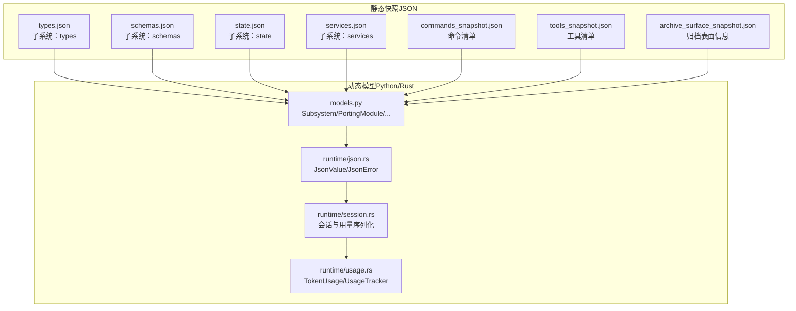
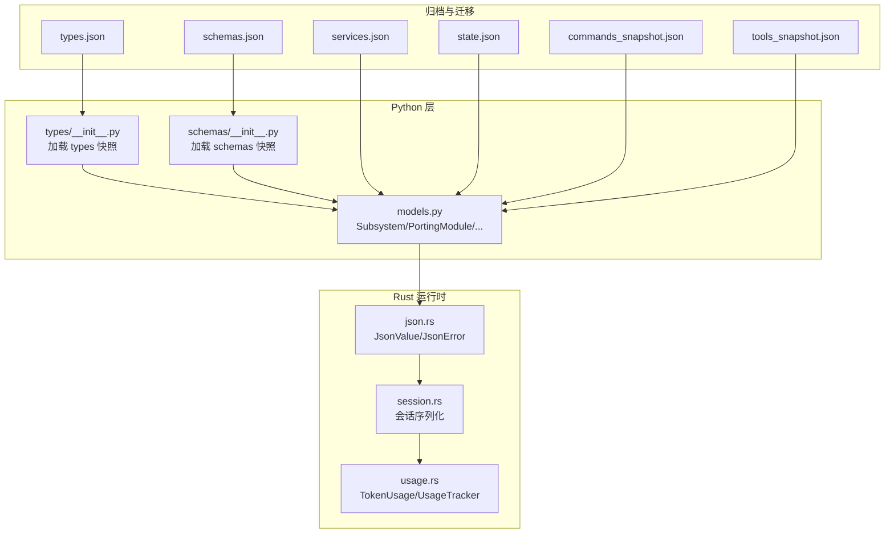
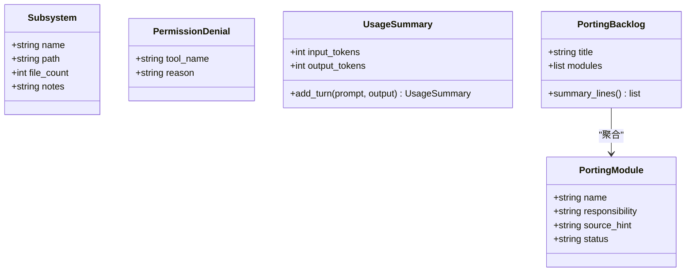
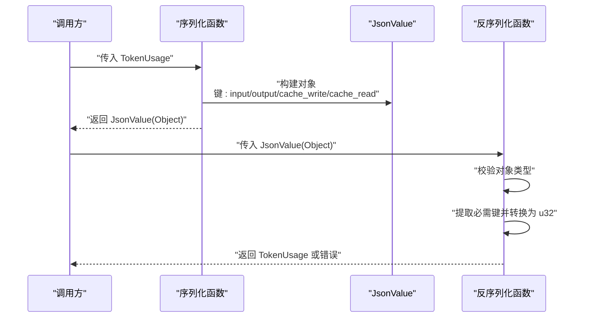
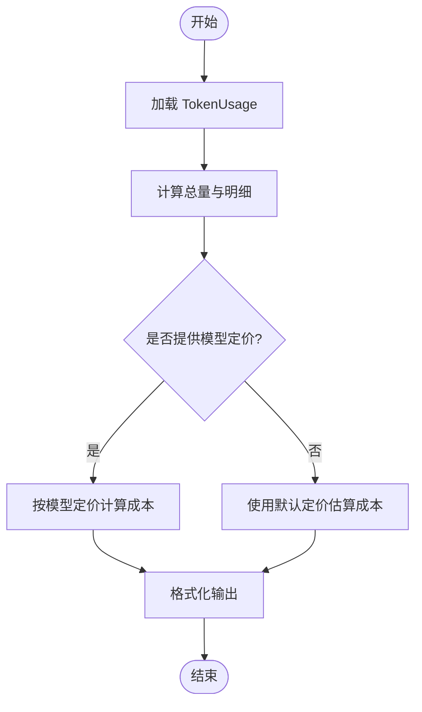
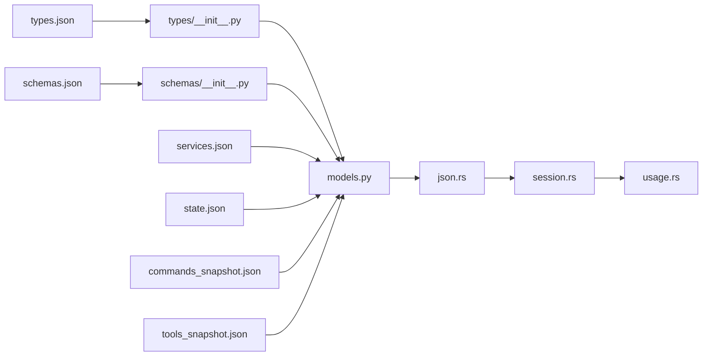

# 数据模型

<cite>
**本文引用的文件**
- [src/models.py](file://src/models.py)
- [src/types/__init__.py](file://src/types/__init__.py)
- [src/schemas/__init__.py](file://src/schemas/__init__.py)
- [src/reference_data/subsystems/types.json](file://src/reference_data/subsystems/types.json)
- [src/reference_data/subsystems/schemas.json](file://src/reference_data/subsystems/schemas.json)
- [src/reference_data/subsystems/state.json](file://src/reference_data/subsystems/state.json)
- [src/reference_data/subsystems/services.json](file://src/reference_data/subsystems/services.json)
- [src/reference_data/commands_snapshot.json](file://src/reference_data/commands_snapshot.json)
- [src/reference_data/tools_snapshot.json](file://src/reference_data/tools_snapshot.json)
- [src/reference_data/archive_surface_snapshot.json](file://src/reference_data/archive_surface_snapshot.json)
- [rust/crates/runtime/src/json.rs](file://rust/crates/runtime/src/json.rs)
- [rust/crates/runtime/src/session.rs](file://rust/crates/runtime/src/session.rs)
- [rust/crates/runtime/src/usage.rs](file://rust/crates/runtime/src/usage.rs)
</cite>

## 目录
1. [简介](#简介)
2. [项目结构](#项目结构)
3. [核心组件](#核心组件)
4. [架构总览](#架构总览)
5. [详细组件分析](#详细组件分析)
6. [依赖分析](#依赖分析)
7. [性能考虑](#性能考虑)
8. [故障排查指南](#故障排查指南)
9. [结论](#结论)
10. [附录](#附录)

## 简介
本文件系统性梳理 CLAW 项目的“数据模型”，聚焦于以下方面：
- 核心数据结构与实体关系
- 字段定义、类型约束与业务规则
- 数据验证规则、序列化与反序列化机制
- 使用示例与最佳实践
- 演进与版本管理策略
- 数据完整性与一致性保障

CLAW 项目通过 Python 的数据类与 JSON 快照来描述迁移目标（如 types、schemas、services、state 等子系统），并通过 Rust 运行时对会话与用量等运行期数据进行结构化存储与计算。

## 项目结构
CLAW 的数据模型由两类来源构成：
- 静态快照：以 JSON 文件形式记录已归档子系统的元信息与模块清单
- 动态模型：以 Python 数据类与 Rust 结构体表达运行期数据与交互契约

图表来源
- [src/reference_data/subsystems/types.json:1-18](file://src/reference_data/subsystems/types.json#L1-L18)
- [src/reference_data/subsystems/schemas.json:1-8](file://src/reference_data/subsystems/schemas.json#L1-L8)
- [src/reference_data/subsystems/state.json:1-13](file://src/reference_data/subsystems/state.json#L1-L13)
- [src/reference_data/subsystems/services.json:1-32](file://src/reference_data/subsystems/services.json#L1-L32)
- [src/reference_data/commands_snapshot.json:1-1037](file://src/reference_data/commands_snapshot.json#L1-L1037)
- [src/reference_data/tools_snapshot.json:1-922](file://src/reference_data/tools_snapshot.json#L1-L922)
- [src/reference_data/archive_surface_snapshot.json:1-63](file://src/reference_data/archive_surface_snapshot.json#L1-L63)
- [src/models.py:1-50](file://src/models.py#L1-L50)
- [rust/crates/runtime/src/json.rs:1-34](file://rust/crates/runtime/src/json.rs#L1-L34)
- [rust/crates/runtime/src/session.rs:327-369](file://rust/crates/runtime/src/session.rs#L327-L369)
- [rust/crates/runtime/src/usage.rs:93-247](file://rust/crates/runtime/src/usage.rs#L93-L247)

章节来源
- [src/reference_data/subsystems/types.json:1-18](file://src/reference_data/subsystems/types.json#L1-L18)
- [src/reference_data/subsystems/schemas.json:1-8](file://src/reference_data/subsystems/schemas.json#L1-L8)
- [src/reference_data/subsystems/state.json:1-13](file://src/reference_data/subsystems/state.json#L1-L13)
- [src/reference_data/subsystems/services.json:1-32](file://src/reference_data/subsystems/services.json#L1-L32)
- [src/reference_data/commands_snapshot.json:1-1037](file://src/reference_data/commands_snapshot.json#L1-L1037)
- [src/reference_data/tools_snapshot.json:1-922](file://src/reference_data/tools_snapshot.json#L1-L922)
- [src/reference_data/archive_surface_snapshot.json:1-63](file://src/reference_data/archive_surface_snapshot.json#L1-L63)
- [src/models.py:1-50](file://src/models.py#L1-L50)
- [rust/crates/runtime/src/json.rs:1-34](file://rust/crates/runtime/src/json.rs#L1-L34)
- [rust/crates/runtime/src/session.rs:327-369](file://rust/crates/runtime/src/session.rs#L327-L369)
- [rust/crates/runtime/src/usage.rs:93-247](file://rust/crates/runtime/src/usage.rs#L93-L247)

## 核心组件
- Python 数据类（只读/可变）
  - Subsystem：描述归档子系统的基本信息（名称、路径、文件数、备注）
  - PortingModule：描述迁移模块（名称、职责、来源提示、状态）
  - PermissionDenial：权限拒绝记录（工具名、原因）
  - UsageSummary：简单令牌用量汇总（输入/输出词数）
  - PortingBacklog：迁移任务清单（标题、模块列表），并提供摘要行生成
- Rust JSON 抽象
  - JsonValue：统一的 JSON 值域（Null/Bool/Number/String/Array/Object）
  - JsonError：错误封装
- Rust 会话与用量
  - TokenUsage：单轮对话用量（输入/输出/缓存写/缓存读）
  - UsageTracker：累计用量跟踪器（最新轮次、累计值、轮次数）
  - 会话序列化：将 TokenUsage 转为/从 JsonValue 反序列化

章节来源
- [src/models.py:6-50](file://src/models.py#L6-L50)
- [rust/crates/runtime/src/json.rs:4-34](file://rust/crates/runtime/src/json.rs#L4-L34)
- [rust/crates/runtime/src/session.rs:327-369](file://rust/crates/runtime/src/session.rs#L327-L369)
- [rust/crates/runtime/src/usage.rs:162-209](file://rust/crates/runtime/src/usage.rs#L162-L209)

## 架构总览
下图展示数据模型在系统中的位置与流转：

图表来源
- [src/reference_data/subsystems/types.json:1-18](file://src/reference_data/subsystems/types.json#L1-L18)
- [src/reference_data/subsystems/schemas.json:1-8](file://src/reference_data/subsystems/schemas.json#L1-L8)
- [src/reference_data/subsystems/services.json:1-32](file://src/reference_data/subsystems/services.json#L1-L32)
- [src/reference_data/subsystems/state.json:1-13](file://src/reference_data/subsystems/state.json#L1-L13)
- [src/reference_data/commands_snapshot.json:1-1037](file://src/reference_data/commands_snapshot.json#L1-L1037)
- [src/reference_data/tools_snapshot.json:1-922](file://src/reference_data/tools_snapshot.json#L1-L922)
- [src/types/__init__.py:1-17](file://src/types/__init__.py#L1-L17)
- [src/schemas/__init__.py:1-17](file://src/schemas/__init__.py#L1-L17)
- [src/models.py:1-50](file://src/models.py#L1-L50)
- [rust/crates/runtime/src/json.rs:1-34](file://rust/crates/runtime/src/json.rs#L1-L34)
- [rust/crates/runtime/src/session.rs:327-369](file://rust/crates/runtime/src/session.rs#L327-L369)
- [rust/crates/runtime/src/usage.rs:162-209](file://rust/crates/runtime/src/usage.rs#L162-L209)

## 详细组件分析

### Python 数据类模型
- 设计要点
  - 使用 frozen=True 的数据类确保不可变性，便于跨模块共享与缓存
  - 默认值与可选字段用于兼容不同迁移阶段的状态
- 关键字段与约束
  - Subsystem：name、path、file_count、notes；建议唯一标识由 name/path 组合承担
  - PortingModule：name、responsibility、source_hint、status（默认 planned）
  - PermissionDenial：tool_name、reason；建议 tool_name 唯一
  - UsageSummary：input_tokens、output_tokens；累加逻辑基于词数统计
  - PortingBacklog：title、modules；summary_lines 提供格式化输出
- 复杂度与性能
  - UsageSummary.add_turn 为 O(n)（按词分割），适合短文本；长文本建议预分词或缓存
  - PortingBacklog.summary_lines 为 O(n) 列表推导，n 为模块数

图表来源
- [src/models.py:6-50](file://src/models.py#L6-L50)

章节来源
- [src/models.py:6-50](file://src/models.py#L6-L50)

### JSON 抽象与序列化/反序列化
- JsonValue
  - 支持 Null、Bool、Number、String、Array、Object 六种类型
  - 采用有序字典存储对象键值，利于稳定序列化
- 会话与用量的序列化流程
  - 序列化：TokenUsage -> JsonValue 对象（键包括 input_tokens、output_tokens、cache_creation_input_tokens、cache_read_input_tokens）
  - 反序列化：从 JsonValue 对象中提取必需键，转换为 TokenUsage；缺失键抛出格式错误
- 错误处理
  - JsonError 封装消息，便于上层捕获与报告
  - 反序列化失败时返回 SessionError（来自 session.rs）

图表来源
- [rust/crates/runtime/src/json.rs:4-34](file://rust/crates/runtime/src/json.rs#L4-L34)
- [rust/crates/runtime/src/session.rs:327-369](file://rust/crates/runtime/src/session.rs#L327-L369)

章节来源
- [rust/crates/runtime/src/json.rs:4-34](file://rust/crates/runtime/src/json.rs#L4-L34)
- [rust/crates/runtime/src/session.rs:327-369](file://rust/crates/runtime/src/session.rs#L327-L369)

### 用量统计与成本估算
- TokenUsage
  - 字段：input_tokens、output_tokens、cache_creation_input_tokens、cache_read_input_tokens
- UsageTracker
  - 记录最新轮次用量、累计用量、轮次数
  - 提供汇总行生成，支持按模型定价或默认估算
- 成本估算
  - 按每百万 token 的单价计算输入/输出/缓存写/缓存读的成本
  - 输出格式化字符串保留固定小数位

图表来源
- [rust/crates/runtime/src/usage.rs:93-160](file://rust/crates/runtime/src/usage.rs#L93-L160)

章节来源
- [rust/crates/runtime/src/usage.rs:93-160](file://rust/crates/runtime/src/usage.rs#L93-L160)
- [rust/crates/runtime/src/usage.rs:162-209](file://rust/crates/runtime/src/usage.rs#L162-L209)

### 子系统快照与迁移清单
- types.json/schemas.json/state.json/services.json
  - 描述归档子系统名称、包名、模块数量与示例文件路径
  - 作为 Python 占位包的元数据来源，便于迁移与审计
- commands_snapshot.json/tools_snapshot.json
  - 列举命令与工具模块的名称、来源提示与职责说明
  - 用于生成迁移计划与回溯清单
- archive_surface_snapshot.json
  - 归档根目录、根文件与目录、TS 类似文件总数、命令/工具入口计数
  - 用于评估迁移规模与进度

章节来源
- [src/reference_data/subsystems/types.json:1-18](file://src/reference_data/subsystems/types.json#L1-L18)
- [src/reference_data/subsystems/schemas.json:1-8](file://src/reference_data/subsystems/schemas.json#L1-L8)
- [src/reference_data/subsystems/state.json:1-13](file://src/reference_data/subsystems/state.json#L1-L13)
- [src/reference_data/subsystems/services.json:1-32](file://src/reference_data/subsystems/services.json#L1-L32)
- [src/reference_data/commands_snapshot.json:1-1037](file://src/reference_data/commands_snapshot.json#L1-L1037)
- [src/reference_data/tools_snapshot.json:1-922](file://src/reference_data/tools_snapshot.json#L1-L922)
- [src/reference_data/archive_surface_snapshot.json:1-63](file://src/reference_data/archive_surface_snapshot.json#L1-L63)

## 依赖分析
- Python 层
  - types/__init__.py 与 schemas/__init__.py 依赖各自快照 JSON，读取后暴露常量
  - models.py 中的数据类被 Rust 层的序列化/反序列化间接消费
- Rust 层
  - json.rs 为通用 JSON 抽象
  - session.rs 依赖 json.rs 并实现 TokenUsage 的序列化/反序列化
  - usage.rs 依赖 TokenUsage 进行统计与成本估算
- 迁移清单
  - commands_snapshot.json 与 tools_snapshot.json 作为 Python 层的输入，驱动迁移任务生成

图表来源
- [src/types/__init__.py:1-17](file://src/types/__init__.py#L1-L17)
- [src/schemas/__init__.py:1-17](file://src/schemas/__init__.py#L1-L17)
- [src/models.py:1-50](file://src/models.py#L1-L50)
- [rust/crates/runtime/src/json.rs:1-34](file://rust/crates/runtime/src/json.rs#L1-L34)
- [rust/crates/runtime/src/session.rs:327-369](file://rust/crates/runtime/src/session.rs#L327-L369)
- [rust/crates/runtime/src/usage.rs:162-209](file://rust/crates/runtime/src/usage.rs#L162-L209)

章节来源
- [src/types/__init__.py:1-17](file://src/types/__init__.py#L1-L17)
- [src/schemas/__init__.py:1-17](file://src/schemas/__init__.py#L1-L17)
- [src/models.py:1-50](file://src/models.py#L1-L50)
- [rust/crates/runtime/src/json.rs:1-34](file://rust/crates/runtime/src/json.rs#L1-L34)
- [rust/crates/runtime/src/session.rs:327-369](file://rust/crates/runtime/src/session.rs#L327-L369)
- [rust/crates/runtime/src/usage.rs:162-209](file://rust/crates/runtime/src/usage.rs#L162-L209)

## 性能考虑
- Python
  - UsageSummary.add_turn 的词数统计为线性复杂度；对超长文本建议预处理或缓存分词结果
  - PortingBacklog.summary_lines 为 O(n)，n 为模块数；批量渲染时可考虑分页或懒加载
- Rust
  - JsonValue 使用有序字典存储对象键值，序列化稳定且内存占用可控
  - TokenUsage 的累加在 UsageTracker 中为 O(1) 操作，适合高频更新场景
- I/O
  - JSON 快照读取为一次性操作；建议在进程启动时缓存，避免重复解析

## 故障排查指南
- 反序列化失败
  - 现象：从 JsonValue 反序列化 TokenUsage 报错
  - 排查：确认对象类型为 Object，且包含必需键；检查键值类型是否为整数
  - 参考
    - [rust/crates/runtime/src/session.rs:348-358](file://rust/crates/runtime/src/session.rs#L348-L358)
- 缺少必需字段
  - 现象：缺少 input_tokens、output_tokens、cache_creation_input_tokens、cache_read_input_tokens
  - 排查：核对序列化端是否完整写出；必要时增加默认值或校验
- 成本估算异常
  - 现象：成本为估算或模型为空
  - 排查：确认模型定价表是否可用；若不可用，系统将使用默认估算
  - 参考
    - [rust/crates/runtime/src/usage.rs:115-129](file://rust/crates/runtime/src/usage.rs#L115-L129)

章节来源
- [rust/crates/runtime/src/session.rs:348-358](file://rust/crates/runtime/src/session.rs#L348-L358)
- [rust/crates/runtime/src/usage.rs:115-129](file://rust/crates/runtime/src/usage.rs#L115-L129)

## 结论
- CLAW 的数据模型通过“静态快照 + 动态模型”的方式，清晰地刻画了归档子系统与迁移清单，并在运行时以稳定的 JSON 抽象与结构化用量进行支撑
- Python 层强调不可变性与简洁性，Rust 层强调类型安全与可维护性
- 建议在后续演进中进一步完善字段级约束与校验，增强版本化与兼容性策略

## 附录

### 字段定义与约束清单
- Subsystem
  - name: string（建议唯一）
  - path: string（建议唯一）
  - file_count: int（>=0）
  - notes: string（可空）
- PortingModule
  - name: string（建议唯一）
  - responsibility: string（非空）
  - source_hint: string（非空）
  - status: string（默认 planned；建议枚举）
- PermissionDenial
  - tool_name: string（建议唯一）
  - reason: string（非空）
- UsageSummary
  - input_tokens: int（>=0）
  - output_tokens: int（>=0）
- PortingBacklog
  - title: string（非空）
  - modules: list[PortingModule]（非空时至少一个）
- TokenUsage（Rust）
  - input_tokens: u32
  - output_tokens: u32
  - cache_creation_input_tokens: u32
  - cache_read_input_tokens: u32

章节来源
- [src/models.py:6-50](file://src/models.py#L6-L50)
- [rust/crates/runtime/src/session.rs:327-369](file://rust/crates/runtime/src/session.rs#L327-L369)

### 使用示例与最佳实践
- Python
  - 创建只读模型实例，避免在多模块间共享可变状态
  - 使用 PortingBacklog.summary_lines 生成标准化摘要
- Rust
  - 在序列化前校验 TokenUsage 字段完整性
  - 使用 UsageTracker 累积用量并在会话结束时输出成本摘要
- 迁移清单
  - 以 commands_snapshot.json 与 tools_snapshot.json 为依据生成迁移计划
  - 通过 archive_surface_snapshot.json 评估整体规模

章节来源
- [src/models.py:40-50](file://src/models.py#L40-L50)
- [rust/crates/runtime/src/usage.rs:162-209](file://rust/crates/runtime/src/usage.rs#L162-L209)
- [src/reference_data/commands_snapshot.json:1-1037](file://src/reference_data/commands_snapshot.json#L1-L1037)
- [src/reference_data/tools_snapshot.json:1-922](file://src/reference_data/tools_snapshot.json#L1-L922)
- [src/reference_data/archive_surface_snapshot.json:1-63](file://src/reference_data/archive_surface_snapshot.json#L1-L63)

### 演进与版本管理策略
- 版本化
  - JSON 快照包含 archive_name、package_name、module_count 等元信息，可用于追踪版本与变更
- 兼容性
  - 新增字段建议保持向后兼容，旧字段标记弃用并保留读取逻辑
- 迁移策略
  - 以 types.json/schemas.json/state.json/services.json 为基线，逐步替换为 Python 占位包与实际实现
  - 使用 commands_snapshot.json/tools_snapshot.json 驱动自动化迁移脚本

章节来源
- [src/reference_data/subsystems/types.json:1-18](file://src/reference_data/subsystems/types.json#L1-L18)
- [src/reference_data/subsystems/schemas.json:1-8](file://src/reference_data/subsystems/schemas.json#L1-L8)
- [src/reference_data/subsystems/state.json:1-13](file://src/reference_data/subsystems/state.json#L1-L13)
- [src/reference_data/subsystems/services.json:1-32](file://src/reference_data/subsystems/services.json#L1-L32)
- [src/types/__init__.py:1-17](file://src/types/__init__.py#L1-L17)
- [src/schemas/__init__.py:1-17](file://src/schemas/__init__.py#L1-L17)

### 数据完整性与一致性保证
- Python
  - 使用 frozen=True 的数据类减少并发修改风险
  - 对外暴露只读视图，内部通过工厂方法构造
- Rust
  - JsonValue/JsonError 提供强类型与错误传播
  - 反序列化严格校验键存在性与类型
- 运行时
  - UsageTracker 通过原子性累加与轮次计数，确保用量统计一致

章节来源
- [src/models.py:6-50](file://src/models.py#L6-L50)
- [rust/crates/runtime/src/json.rs:4-34](file://rust/crates/runtime/src/json.rs#L4-L34)
- [rust/crates/runtime/src/session.rs:348-358](file://rust/crates/runtime/src/session.rs#L348-L358)
- [rust/crates/runtime/src/usage.rs:162-209](file://rust/crates/runtime/src/usage.rs#L162-L209)