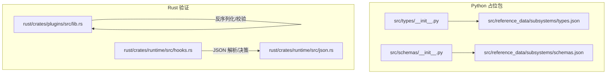
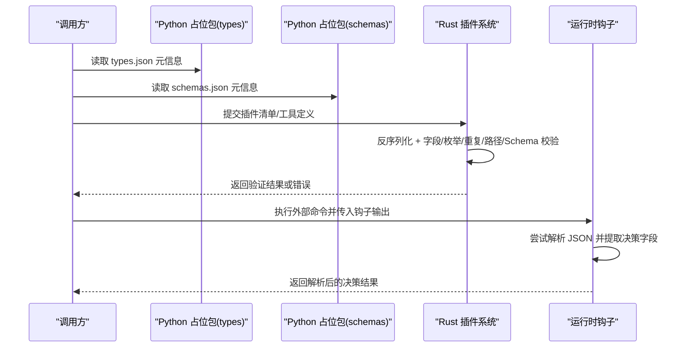
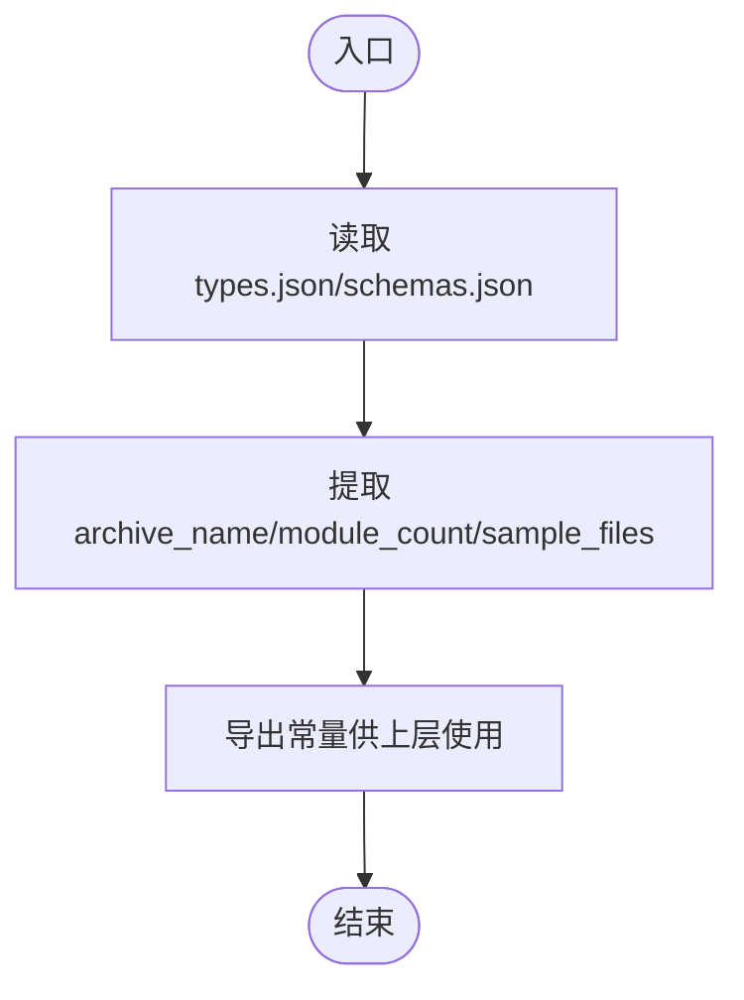
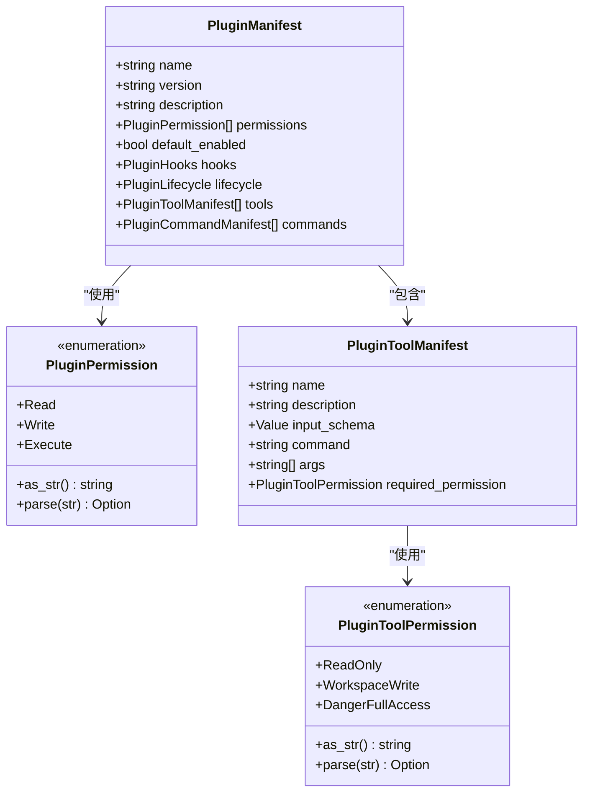
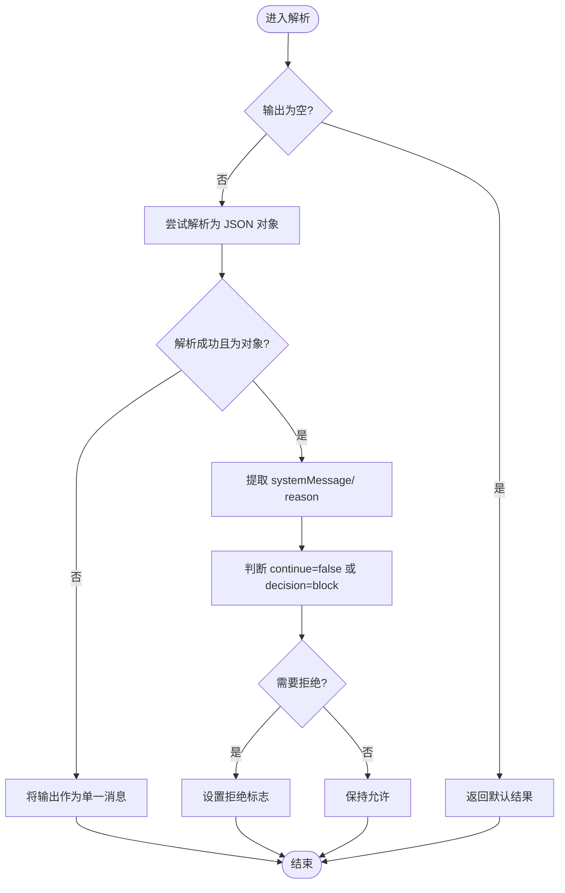
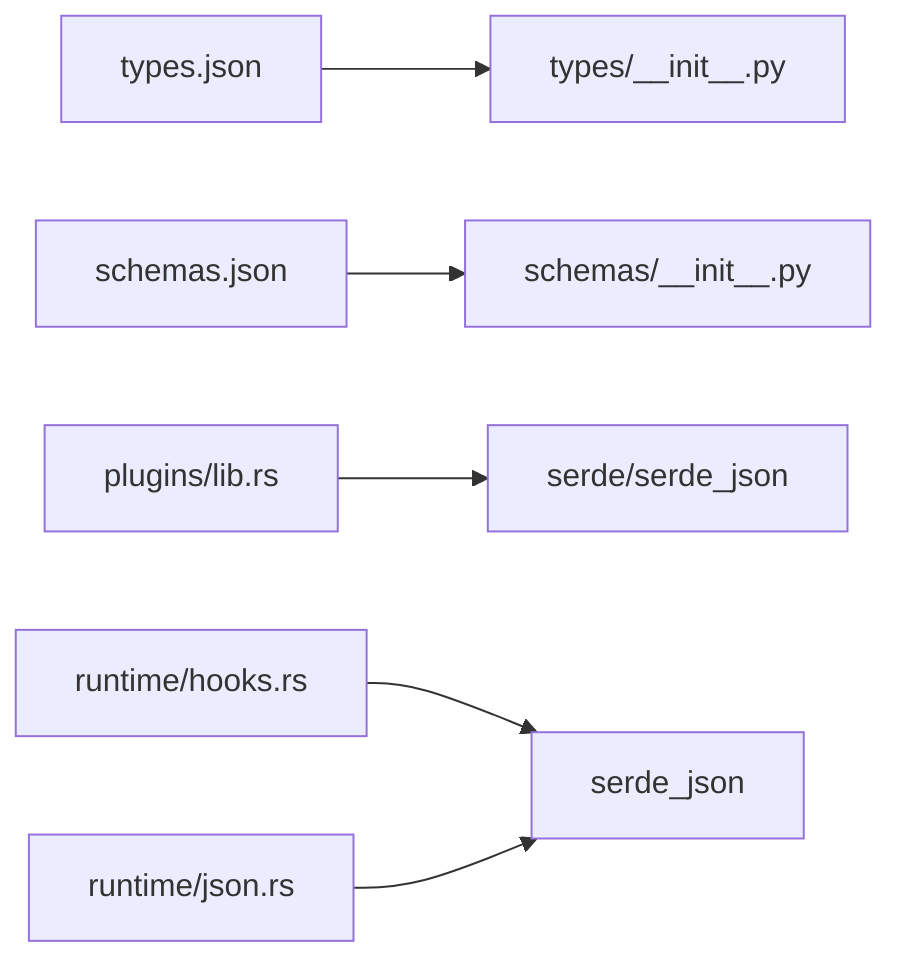

# 数据验证规则

<cite>
**本文引用的文件**
- [src/models.py](file://src/models.py)
- [src/schemas/__init__.py](file://src/schemas/__init__.py)
- [src/types/__init__.py](file://src/types/__init__.py)
- [src/reference_data/subsystems/schemas.json](file://src/reference_data/subsystems/schemas.json)
- [src/reference_data/subsystems/types.json](file://src/reference_data/subsystems/types.json)
- [rust/crates/plugins/src/lib.rs](file://rust/crates/plugins/src/lib.rs)
- [rust/crates/runtime/src/hooks.rs](file://rust/crates/runtime/src/hooks.rs)
- [rust/crates/runtime/src/json.rs](file://rust/crates/runtime/src/json.rs)
</cite>

## 目录
1. [引言](#引言)
2. [项目结构](#项目结构)
3. [核心组件](#核心组件)
4. [架构总览](#架构总览)
5. [详细组件分析](#详细组件分析)
6. [依赖分析](#依赖分析)
7. [性能考虑](#性能考虑)
8. [故障排查指南](#故障排查指南)
9. [结论](#结论)
10. [附录](#附录)

## 引言
本文件聚焦 CLAW 项目中的“数据验证规则”，系统性梳理与验证相关的实现机制、规则与约束，覆盖以下方面：
- Python 层：数据模型与快照归档包的占位实现
- Rust 层：插件清单与工具输入模式的强类型验证、权限校验与错误信息格式化
- 运行时层：钩子输出解析与 JSON 结构校验
- 验证失败常见场景与解决方案
- 性能优化与最佳实践
- 规则扩展与自定义方法

## 项目结构
CLAW 的验证相关能力横跨 Python 与 Rust 两部分：
- Python 占位包：通过读取 reference_data 中的 JSON 快照，导出归档名称、模块数量与示例文件列表，作为“类型/模式”归档的占位实现，不直接进行运行时验证
- Rust 插件系统：对插件清单（manifest）进行强类型反序列化与多维度校验，包括字段非空、重复项、路径存在性、权限枚举合法性、工具输入 Schema 类型等
- 运行时钩子：对外部命令输出进行 JSON 解析，并按约定字段进行业务决策（如拒绝）

图示来源
- [src/types/__init__.py:1-17](file://src/types/__init__.py#L1-L17)
- [src/schemas/__init__.py:1-17](file://src/schemas/__init__.py#L1-L17)
- [src/reference_data/subsystems/types.json:1-18](file://src/reference_data/subsystems/types.json#L1-L18)
- [src/reference_data/subsystems/schemas.json:1-8](file://src/reference_data/subsystems/schemas.json#L1-L8)
- [rust/crates/plugins/src/lib.rs:1-200](file://rust/crates/plugins/src/lib.rs#L1-L200)
- [rust/crates/runtime/src/hooks.rs:520-544](file://rust/crates/runtime/src/hooks.rs#L520-L544)
- [rust/crates/runtime/src/json.rs:1-34](file://rust/crates/runtime/src/json.rs#L1-L34)

章节来源
- [src/types/__init__.py:1-17](file://src/types/__init__.py#L1-L17)
- [src/schemas/__init__.py:1-17](file://src/schemas/__init__.py#L1-L17)
- [src/reference_data/subsystems/types.json:1-18](file://src/reference_data/subsystems/types.json#L1-L18)
- [src/reference_data/subsystems/schemas.json:1-8](file://src/reference_data/subsystems/schemas.json#L1-L8)
- [rust/crates/plugins/src/lib.rs:1-200](file://rust/crates/plugins/src/lib.rs#L1-L200)
- [rust/crates/runtime/src/hooks.rs:520-544](file://rust/crates/runtime/src/hooks.rs#L520-L544)
- [rust/crates/runtime/src/json.rs:1-34](file://rust/crates/runtime/src/json.rs#L1-L34)

## 核心组件
- Python 占位包
  - types 包：从 types.json 读取归档元信息，导出常量用于迁移/占位用途
  - schemas 包：从 schemas.json 读取归档元信息，导出常量用于迁移/占位用途
- Rust 插件系统
  - 插件清单模型与枚举：对权限、工具权限、清单字段进行强类型约束
  - 清单验证器：对字段非空、重复项、路径存在性、输入 Schema 类型、权限枚举值等进行逐一校验
  - 错误类型：统一格式化错误消息，便于定位问题
- 运行时钩子
  - 输出解析：尝试解析为 JSON 对象；若失败则回退为纯文本消息
  - 决策逻辑：根据约定键值（如 continue/false 或 decision/block）决定是否拒绝

章节来源
- [src/types/__init__.py:1-17](file://src/types/__init__.py#L1-L17)
- [src/schemas/__init__.py:1-17](file://src/schemas/__init__.py#L1-L17)
- [rust/crates/plugins/src/lib.rs:106-196](file://rust/crates/plugins/src/lib.rs#L106-L196)
- [rust/crates/plugins/src/lib.rs:814-856](file://rust/crates/plugins/src/lib.rs#L814-L856)
- [rust/crates/runtime/src/hooks.rs:520-544](file://rust/crates/runtime/src/hooks.rs#L520-L544)

## 架构总览
下图展示验证在各层的职责与交互：

图示来源
- [src/types/__init__.py:1-17](file://src/types/__init__.py#L1-L17)
- [src/schemas/__init__.py:1-17](file://src/schemas/__init__.py#L1-L17)
- [rust/crates/plugins/src/lib.rs:106-196](file://rust/crates/plugins/src/lib.rs#L106-L196)
- [rust/crates/runtime/src/hooks.rs:520-544](file://rust/crates/runtime/src/hooks.rs#L520-L544)

## 详细组件分析

### Python 占位包：types 与 schemas
- 设计意图
  - 通过 JSON 快照暴露归档名称、模块数量与示例文件列表，作为“类型/模式”归档的占位实现
  - 不直接执行运行时验证，避免与 Rust 层的强类型验证产生重复或冲突
- 关键点
  - 从 reference_data 下的 JSON 文件读取并缓存
  - 导出常量供上层迁移/占位流程使用

图示来源
- [src/types/__init__.py:1-17](file://src/types/__init__.py#L1-L17)
- [src/schemas/__init__.py:1-17](file://src/schemas/__init__.py#L1-L17)
- [src/reference_data/subsystems/types.json:1-18](file://src/reference_data/subsystems/types.json#L1-L18)
- [src/reference_data/subsystems/schemas.json:1-8](file://src/reference_data/subsystems/schemas.json#L1-L8)

章节来源
- [src/types/__init__.py:1-17](file://src/types/__init__.py#L1-L17)
- [src/schemas/__init__.py:1-17](file://src/schemas/__init__.py#L1-L17)
- [src/reference_data/subsystems/types.json:1-18](file://src/reference_data/subsystems/types.json#L1-L18)
- [src/reference_data/subsystems/schemas.json:1-8](file://src/reference_data/subsystems/schemas.json#L1-L8)

### Rust 插件系统：清单与工具验证
- 数据模型与枚举
  - 清单模型包含名称、版本、描述、权限列表、默认启用状态、钩子与生命周期脚本、工具与命令列表等
  - 权限枚举与工具权限枚举均提供字符串表示与解析函数，确保输入合法
- 验证规则
  - 字段非空：工具名称、描述、命令等字段必须非空
  - 去重：工具名称去重，重复时报错
  - 路径存在性：命令路径需存在
  - 输入 Schema 类型：工具的 inputSchema 必须为 JSON 对象
  - 权限枚举：requiredPermission 必须属于预定义集合
- 错误类型与消息格式化
  - 统一的错误枚举，针对不同违规场景输出明确可读的消息，便于定位问题

图示来源
- [rust/crates/plugins/src/lib.rs:106-196](file://rust/crates/plugins/src/lib.rs#L106-L196)
- [rust/crates/plugins/src/lib.rs:124-150](file://rust/crates/plugins/src/lib.rs#L124-L150)
- [rust/crates/plugins/src/lib.rs:170-196](file://rust/crates/plugins/src/lib.rs#L170-L196)

章节来源
- [rust/crates/plugins/src/lib.rs:106-196](file://rust/crates/plugins/src/lib.rs#L106-L196)
- [rust/crates/plugins/src/lib.rs:124-150](file://rust/crates/plugins/src/lib.rs#L124-L150)
- [rust/crates/plugins/src/lib.rs:170-196](file://rust/crates/plugins/src/lib.rs#L170-L196)

### 运行时钩子：输出解析与决策
- JSON 解析
  - 若输出为空，返回默认结果
  - 若输出不是 JSON 对象，将整段输出作为消息列表中的一个条目
  - 否则解析对象，提取 systemMessage、reason 等字段作为消息
- 决策逻辑
  - 当 continue 为 false 或 decision 为 block 时，标记为拒绝

图示来源
- [rust/crates/runtime/src/hooks.rs:520-544](file://rust/crates/runtime/src/hooks.rs#L520-L544)

章节来源
- [rust/crates/runtime/src/hooks.rs:520-544](file://rust/crates/runtime/src/hooks.rs#L520-L544)

### JSON 错误模型与运行时 JSON 抽象
- JsonError：统一的错误封装，支持从消息构造并实现 Display 与错误 trait
- JsonValue：对 JSON 值的受控抽象（Null/Bool/Number/String/Array/Object），便于后续校验与转换

章节来源
- [rust/crates/runtime/src/json.rs:1-34](file://rust/crates/runtime/src/json.rs#L1-L34)

## 依赖分析
- Python 占位包依赖 reference_data 中的 JSON 快照，二者通过相对路径关联
- Rust 插件系统内部依赖 serde 进行反序列化，依赖标准库集合类型进行去重与校验
- 运行时钩子依赖 serde_json 进行输出解析

图示来源
- [src/types/__init__.py:1-17](file://src/types/__init__.py#L1-L17)
- [src/schemas/__init__.py:1-17](file://src/schemas/__init__.py#L1-L17)
- [src/reference_data/subsystems/types.json:1-18](file://src/reference_data/subsystems/types.json#L1-L18)
- [src/reference_data/subsystems/schemas.json:1-8](file://src/reference_data/subsystems/schemas.json#L1-L8)
- [rust/crates/plugins/src/lib.rs:1-200](file://rust/crates/plugins/src/lib.rs#L1-L200)
- [rust/crates/runtime/src/hooks.rs:520-544](file://rust/crates/runtime/src/hooks.rs#L520-L544)
- [rust/crates/runtime/src/json.rs:1-34](file://rust/crates/runtime/src/json.rs#L1-L34)

章节来源
- [src/types/__init__.py:1-17](file://src/types/__init__.py#L1-L17)
- [src/schemas/__init__.py:1-17](file://src/schemas/__init__.py#L1-L17)
- [rust/crates/plugins/src/lib.rs:1-200](file://rust/crates/plugins/src/lib.rs#L1-L200)
- [rust/crates/runtime/src/hooks.rs:520-544](file://rust/crates/runtime/src/hooks.rs#L520-L544)
- [rust/crates/runtime/src/json.rs:1-34](file://rust/crates/runtime/src/json.rs#L1-L34)

## 性能考虑
- 字符串裁剪与去重
  - 工具名称在进入校验前进行 trim，减少因空白字符导致的误判
  - 使用集合进行去重，时间复杂度 O(n)，适合中等规模清单
- JSON 解析
  - 钩子输出解析仅在非空时尝试解析，避免不必要的反序列化开销
  - 失败回退到纯文本消息，降低异常处理成本
- 枚举解析
  - 权限枚举解析采用常量映射，O(1) 判定，避免正则或复杂匹配
- 建议
  - 对大规模清单，优先在上游阶段进行去重与清洗
  - 对频繁调用的钩子解析，可考虑缓存已知合法输出的解析结果

## 故障排查指南
- 常见验证失败场景
  - 字段为空：工具名称、描述或命令为空
  - 重复条目：工具名称重复
  - 路径不存在：命令路径指向的文件不存在
  - 输入 Schema 非对象：inputSchema 不是 JSON 对象
  - 权限枚举非法：requiredPermission 不在允许集合内
- 定位与修复
  - 查看错误消息中的具体字段与上下文（如工具名）
  - 逐项修正后重新提交清单
  - 对于钩子输出，确认其是否符合 JSON 对象规范，或在失败时提供清晰的文本消息
- 相关实现参考
  - 插件清单验证器与错误消息格式化
  - 钩子输出解析与拒绝判定

章节来源
- [rust/crates/plugins/src/lib.rs:814-856](file://rust/crates/plugins/src/lib.rs#L814-L856)
- [rust/crates/plugins/src/lib.rs:1532-1569](file://rust/crates/plugins/src/lib.rs#L1532-L1569)
- [rust/crates/runtime/src/hooks.rs:520-544](file://rust/crates/runtime/src/hooks.rs#L520-L544)

## 结论
- Python 占位包通过 JSON 快照提供“类型/模式”归档的元信息，不承担运行时验证职责
- Rust 插件系统以强类型模型与详尽的验证规则保障清单与工具定义的正确性，错误消息清晰可读
- 运行时钩子对输出进行稳健解析，并基于约定字段做出拒绝决策
- 建议在上游阶段完成数据清洗与去重，在下游阶段以最小代价完成必要校验，确保整体性能与可维护性

## 附录
- 扩展与自定义建议
  - 新增字段：在对应模型中添加字段并补充校验分支，同时更新错误消息
  - 新增枚举值：在枚举解析函数中加入映射，并在权限/工具权限等处同步
  - 自定义业务规则：在钩子解析阶段增加新的键值判断，或在插件验证器中新增规则分支
- 最佳实践
  - 保持错误消息可读性与上下文完整性
  - 在解析失败时提供回退策略，避免吞掉用户可见信息
  - 对大规模数据采用分批处理与缓存策略