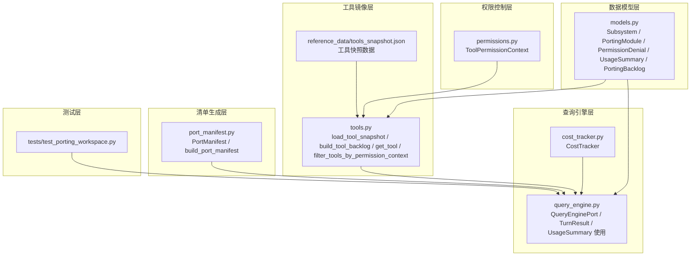
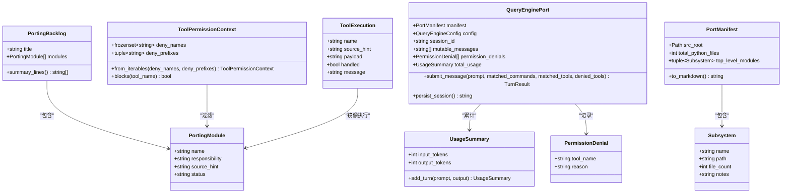
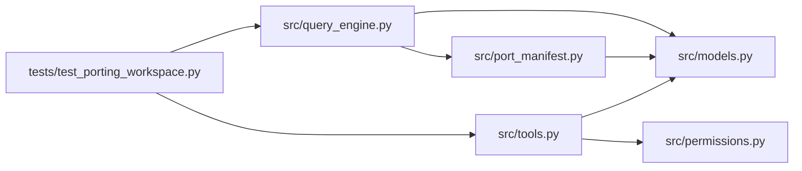

# 核心数据结构

<cite>
**本文档引用的文件**
- [src/models.py](file://src/models.py)
- [src/tools.py](file://src/tools.py)
- [src/port_manifest.py](file://src/port_manifest.py)
- [src/query_engine.py](file://src/query_engine.py)
- [src/permissions.py](file://src/permissions.py)
- [src/cost_tracker.py](file://src/cost_tracker.py)
- [src/reference_data/tools_snapshot.json](file://src/reference_data/tools_snapshot.json)
- [tests/test_porting_workspace.py](file://tests/test_porting_workspace.py)
</cite>

## 目录
1. [引言](#引言)
2. [项目结构](#项目结构)
3. [核心组件](#核心组件)
4. [架构总览](#架构总览)
5. [详细组件分析](#详细组件分析)
6. [依赖分析](#依赖分析)
7. [性能考虑](#性能考虑)
8. [故障排查指南](#故障排查指南)
9. [结论](#结论)
10. [附录](#附录)

## 引言
本文件聚焦 CLAW 项目的“核心数据结构”，系统性阐述 Subsystem、PortingModule、PermissionDenial、UsageSummary、PortingBacklog 等关键数据类的设计理念、字段语义、默认值与验证策略、冻结属性设计、序列化与持久化路径，以及它们在查询引擎、工具镜像、权限控制与会话管理中的协作关系。目标是帮助读者快速理解并正确使用这些数据结构，同时为扩展与维护提供清晰的参考。

## 项目结构
围绕核心数据结构的相关模块分布如下：
- 数据模型层：定义不可变数据结构（frozen dataclass）与可变聚合结构
- 工具镜像层：从 JSON 快照构建工具模块集合，并提供检索与过滤能力
- 权限控制层：基于名称与前缀的拒绝策略
- 查询引擎层：会话状态、令牌用量统计与预算控制
- 清单生成层：扫描源码树，汇总子系统元数据
- 测试层：覆盖端到端行为与边界条件

图表来源
- [src/models.py:6-50](file://src/models.py#L6-L50)
- [src/tools.py:23-42](file://src/tools.py#L23-L42)
- [src/permissions.py:6-21](file://src/permissions.py#L6-L21)
- [src/query_engine.py:35-104](file://src/query_engine.py#L35-L104)
- [src/port_manifest.py:12-53](file://src/port_manifest.py#L12-L53)
- [src/cost_tracker.py:6-14](file://src/cost_tracker.py#L6-L14)
- [src/reference_data/tools_snapshot.json:1-20](file://src/reference_data/tools_snapshot.json#L1-L20)
- [tests/test_porting_workspace.py:15-249](file://tests/test_porting_workspace.py#L15-L249)

章节来源
- [src/models.py:6-50](file://src/models.py#L6-L50)
- [src/tools.py:23-42](file://src/tools.py#L23-L42)
- [src/permissions.py:6-21](file://src/permissions.py#L6-L21)
- [src/query_engine.py:35-104](file://src/query_engine.py#L35-L104)
- [src/port_manifest.py:12-53](file://src/port_manifest.py#L12-L53)
- [src/cost_tracker.py:6-14](file://src/cost_tracker.py#L6-L14)
- [src/reference_data/tools_snapshot.json:1-20](file://src/reference_data/tools_snapshot.json#L1-L20)
- [tests/test_porting_workspace.py:15-249](file://tests/test_porting_workspace.py#L15-L249)

## 核心组件
本节对五个核心数据结构进行逐项解析，包括字段定义、默认值、冻结属性设计、使用场景与典型操作。

- Subsystem
  - 字段
    - name: 子系统名称（字符串）
    - path: 子系统路径（字符串）
    - file_count: 文件数量（整数）
    - notes: 备注说明（字符串）
  - 设计要点
    - 不可变（frozen=True），用于稳定地描述源码树的顶层模块与统计信息
    - 通常由 PortManifest 构建，作为工作区清单的一部分
  - 典型用法
    - 在清单渲染时输出子系统摘要
  - 章节来源
    - [src/models.py:6-12](file://src/models.py#L6-L12)
    - [src/port_manifest.py:48-52](file://src/port_manifest.py#L48-L52)

- PortingModule
  - 字段
    - name: 模块名称（字符串）
    - responsibility: 责任描述（字符串）
    - source_hint: 源提示（字符串，指向原始 TypeScript 位置）
    - status: 状态（字符串，默认值为 "planned"；在工具快照加载后被设置为 "mirrored"）
  - 设计要点
    - 不可变（frozen=True），用于描述镜像工具模块的元信息
    - 默认值 status 提供了“计划态”到“镜像态”的迁移语义
  - 典型用法
    - 作为工具快照的载体；参与工具检索、过滤与权限判定
  - 章节来源
    - [src/models.py:14-20](file://src/models.py#L14-L20)
    - [src/tools.py:23-34](file://src/tools.py#L23-L34)

- PermissionDenial
  - 字段
    - tool_name: 工具名（字符串）
    - reason: 拒绝原因（字符串）
  - 设计要点
    - 不可变（frozen=True），用于记录权限拒绝事件
  - 典型用法
    - 在查询引擎提交消息时，作为 TurnResult 的一部分返回
  - 章节来源
    - [src/models.py:22-26](file://src/models.py#L22-L26)
    - [src/query_engine.py:24-33](file://src/query_engine.py#L24-L33)

- UsageSummary
  - 字段
    - input_tokens: 输入令牌数（整数，默认 0）
    - output_tokens: 输出令牌数（整数，默认 0）
  - 方法
    - add_turn(prompt: str, output: str) -> UsageSummary：按词数估算增量并返回新的 UsageSummary（不可变累加）
  - 设计要点
    - 不可变（frozen=True），通过函数式方式累加，避免副作用
    - 默认值确保初始状态安全
  - 典型用法
    - 查询引擎中累计对话令牌用量，配合预算控制
  - 章节来源
    - [src/models.py:28-38](file://src/models.py#L28-L38)
    - [src/query_engine.py:61-104](file://src/query_engine.py#L61-L104)

- PortingBacklog
  - 字段
    - title: 背景标题（字符串）
    - modules: 模块列表（默认空列表）
  - 方法
    - summary_lines() -> list[str]：格式化输出模块摘要行
  - 设计要点
    - 非冻结（可变），便于动态追加模块
    - 与工具快照结合，形成“工具表面”的可读视图
  - 典型用法
    - 渲染工具清单摘要；与命令清单并列展示
  - 章节来源
    - [src/models.py:40-50](file://src/models.py#L40-L50)
    - [src/tools.py:40-42](file://src/tools.py#L40-L42)

## 架构总览
下图展示了核心数据结构在系统中的交互关系与职责分工：

图表来源
- [src/models.py:6-50](file://src/models.py#L6-L50)
- [src/permissions.py:6-21](file://src/permissions.py#L6-L21)
- [src/query_engine.py:35-104](file://src/query_engine.py#L35-L104)
- [src/port_manifest.py:12-53](file://src/port_manifest.py#L12-L53)
- [src/tools.py:14-21](file://src/tools.py#L14-L21)

## 详细组件分析

### Subsystem 分析
- 设计理念
  - 描述源码树的顶层模块，提供文件计数与注释，便于生成工作区清单
- 字段与语义
  - name/path/file_count/notes：直观表达模块身份、定位与规模
- 使用场景
  - 清单生成与渲染；与 PortManifest 协作输出 Markdown 摘要
- 章节来源
  - [src/models.py:6-12](file://src/models.py#L6-L12)
  - [src/port_manifest.py:18-27](file://src/port_manifest.py#L18-L27)
  - [src/port_manifest.py:48-52](file://src/port_manifest.py#L48-L52)

### PortingModule 分析
- 设计理念
  - 将 TypeScript 原生工具以模块化方式镜像到 Python，保留来源线索与责任描述
- 字段与语义
  - name/responsibility/source_hint/status：完整元信息，status 支持“计划/镜像”状态演进
- 默认值与验证
  - status 默认 "planned"；在工具快照加载时统一更新为 "mirrored"
- 使用场景
  - 工具检索、过滤、权限判定、执行回显
- 章节来源
  - [src/models.py:14-20](file://src/models.py#L14-L20)
  - [src/tools.py:23-34](file://src/tools.py#L23-L34)
  - [src/tools.py:48-53](file://src/tools.py#L48-L53)

### PermissionDenial 分析
- 设计理念
  - 记录因权限策略导致的工具拒绝事件，便于审计与用户反馈
- 字段与语义
  - tool_name/reason：明确拒绝对象与原因
- 使用场景
  - 查询引擎提交消息时，将拒绝记录写入 TurnResult
- 章节来源
  - [src/models.py:22-26](file://src/models.py#L22-L26)
  - [src/query_engine.py:24-33](file://src/query_engine.py#L24-L33)

### UsageSummary 分析
- 设计理念
  - 以不可变方式跟踪输入/输出令牌用量，支持增量计算与预算控制
- 字段与语义
  - input_tokens/output_tokens：默认 0，保证安全初始状态
  - add_turn：按词数估算，返回新实例，不修改原实例
- 使用场景
  - 查询引擎累计用量、预算检查、会话持久化
- 章节来源
  - [src/models.py:28-38](file://src/models.py#L28-L38)
  - [src/query_engine.py:61-104](file://src/query_engine.py#L61-L104)
  - [src/query_engine.py:140-150](file://src/query_engine.py#L140-L150)

### PortingBacklog 分析
- 设计理念
  - 聚合一组 PortingModule，提供统一的摘要输出接口
- 字段与语义
  - title/modules：标题与模块列表
  - summary_lines：格式化输出每条模块摘要
- 使用场景
  - 渲染“工具表面”或“命令表面”的概览
- 章节来源
  - [src/models.py:40-50](file://src/models.py#L40-L50)
  - [src/tools.py:40-42](file://src/tools.py#L40-L42)

### 工具快照与工具清单
- 数据来源
  - tools_snapshot.json：包含 name/source_hint/responsibility 等字段
- 加载流程
  - load_tool_snapshot：读取 JSON 并转换为 PortingModule 元组，status 统一设为 "mirrored"
  - build_tool_backlog：将快照封装为 PortingBacklog
- 章节来源
- [src/tools.py:23-42](file://src/tools.py#L23-L42)
- [src/reference_data/tools_snapshot.json:1-20](file://src/reference_data/tools_snapshot.json#L1-L20)

### 权限上下文与过滤
- ToolPermissionContext
  - deny_names：拒绝的工具名集合（大小写无关）
  - deny_prefixes：拒绝的前缀集合（大小写无关）
  - blocks：判断工具名是否被拒绝
- 过滤逻辑
  - filter_tools_by_permission_context：根据上下文过滤工具集合
- 章节来源
- [src/permissions.py:6-21](file://src/permissions.py#L6-L21)
- [src/tools.py:56-72](file://src/tools.py#L56-L72)

### 查询引擎与会话生命周期
- 关键类型
  - QueryEnginePort：承载清单、配置、会话消息、权限拒绝与总用量
  - TurnResult：单轮对话结果，包含匹配的命令/工具、权限拒绝、用量与停止原因
- 生命周期要点
  - submit_message：校验轮次与预算，累计用量，记录权限拒绝，返回 TurnResult
  - persist_session：将消息与用量持久化为 StoredSession
- 章节来源
- [src/query_engine.py:35-104](file://src/query_engine.py#L35-L104)
- [src/query_engine.py:140-150](file://src/query_engine.py#L140-L150)

### 序列化与持久化
- JSON 序列化
  - tools_snapshot.json：工具快照的 JSON 表示
  - QueryEnginePort 在持久化时将 total_usage 的 input_tokens/output_tokens 写入存储
- 章节来源
- [src/reference_data/tools_snapshot.json:1-20](file://src/reference_data/tools_snapshot.json#L1-L20)
- [src/query_engine.py:140-150](file://src/query_engine.py#L140-L150)

## 依赖分析
- 组件耦合
  - tools.py 依赖 models.py（PortingBacklog/PortingModule）与 permissions.py（ToolPermissionContext）
  - query_engine.py 依赖 models.py（PermissionDenial/UsageSummary）与 port_manifest.py（PortManifest）
  - port_manifest.py 依赖 models.py（Subsystem）
- 可能的循环依赖
  - 当前未发现直接循环导入；各模块职责清晰，数据结构为纯数据载体
- 外部依赖
  - JSON 文件作为只读数据源；Python 标准库 dataclasses/lru_cache/pathlib/json 等

图表来源
- [src/tools.py:8](file://src/tools.py#L8)
- [src/query_engine.py:7-12](file://src/query_engine.py#L7-L12)
- [src/port_manifest.py:7](file://src/port_manifest.py#L7)
- [tests/test_porting_workspace.py:8-12](file://tests/test_porting_workspace.py#L8-L12)

章节来源
- [src/tools.py:8](file://src/tools.py#L8)
- [src/query_engine.py:7-12](file://src/query_engine.py#L7-L12)
- [src/port_manifest.py:7](file://src/port_manifest.py#L7)
- [tests/test_porting_workspace.py:8-12](file://tests/test_porting_workspace.py#L8-L12)

## 性能考虑
- 不可变数据结构的优势
  - UsageSummary 与 Subsystem/PortingModule/PermissionDenial 采用 frozen=True，避免并发修改风险，便于缓存与复用
- 缓存策略
  - 工具快照使用 lru_cache(maxsize=1)，减少重复解析 JSON 的开销
- 时间复杂度
  - UsageSummary.add_turn：O(n)（按词切分），n 为 prompt+output 的词数
  - 工具检索与过滤：线性遍历工具集合，适合当前规模；如需更高性能，可引入索引结构（如按 name/source_hint 的字典映射）
- 内存占用
  - QueryEnginePort 中的 mutable_messages 会在超过阈值时截断，避免无限增长

## 故障排查指南
- 常见问题与定位
  - 工具未找到：确认 tools_snapshot.json 是否存在且包含对应 name；检查 get_tool 的大小写归一化逻辑
  - 权限拒绝过多：检查 ToolPermissionContext 的 deny_names 与 deny_prefixes 设置
  - 预算超支：检查 QueryEngineConfig 的 max_budget_tokens 与 UsageSummary 的累计逻辑
  - 会话持久化失败：确认持久化字段（input_tokens/output_tokens）是否正确写入
- 测试覆盖点
  - 端到端测试覆盖了清单生成、工具与命令 CLI、权限过滤、会话加载与转录清理等关键路径
- 章节来源
- [src/tools.py:48-53](file://src/tools.py#L48-L53)
- [src/permissions.py:18-21](file://src/permissions.py#L18-L21)
- [src/query_engine.py:89-91](file://src/query_engine.py#L89-L91)
- [tests/test_porting_workspace.py:15-249](file://tests/test_porting_workspace.py#L15-L249)

## 结论
本文档系统梳理了 CLAW 项目的核心数据结构及其在工具镜像、权限控制、会话管理与清单生成中的角色。通过冻结属性设计、默认值与预算控制、JSON 序列化与缓存策略，这些数据结构在保证安全性与可维护性的同时，提供了清晰的扩展空间。建议在新增字段或功能时遵循现有模式（frozen 数据类、默认值、不可变累加、显式过滤与权限判定），以维持整体一致性。

## 附录
- 实际使用示例（以路径代替具体代码内容）
  - 创建 UsageSummary 并累加一轮用量
    - 示例路径：[src/models.py:33-37](file://src/models.py#L33-L37)
  - 构建工具快照并生成工具清单
    - 示例路径：[src/tools.py:23-42](file://src/tools.py#L23-L42)
  - 基于权限上下文过滤工具集合
    - 示例路径：[src/tools.py:56-72](file://src/tools.py#L56-L72)
  - 查询引擎提交消息并持久化会话
    - 示例路径：[src/query_engine.py:61-104](file://src/query_engine.py#L61-L104)
    - 示例路径：[src/query_engine.py:140-150](file://src/query_engine.py#L140-L150)
  - 生成子系统清单摘要
    - 示例路径：[src/port_manifest.py:18-27](file://src/port_manifest.py#L18-L27)