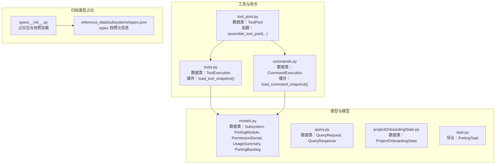
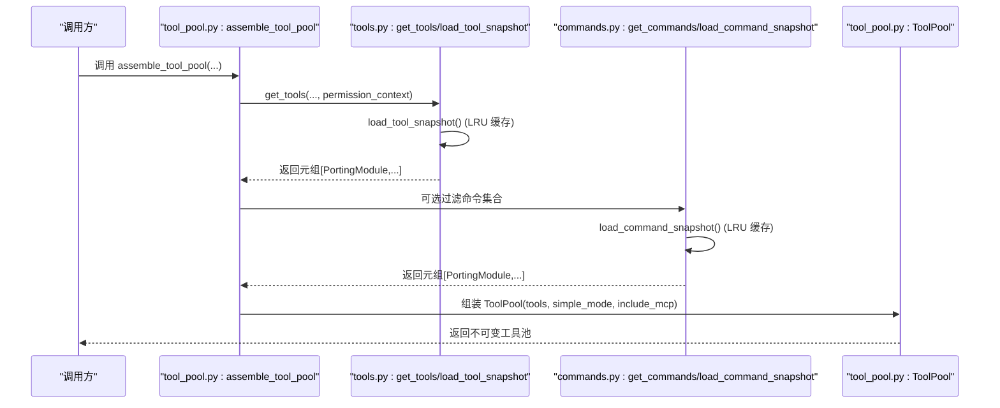
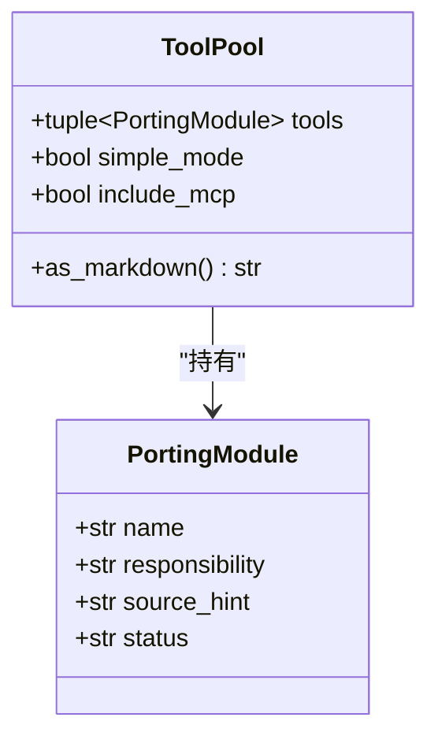
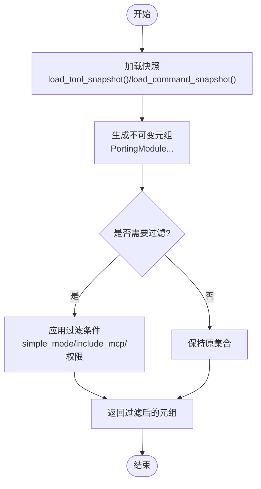
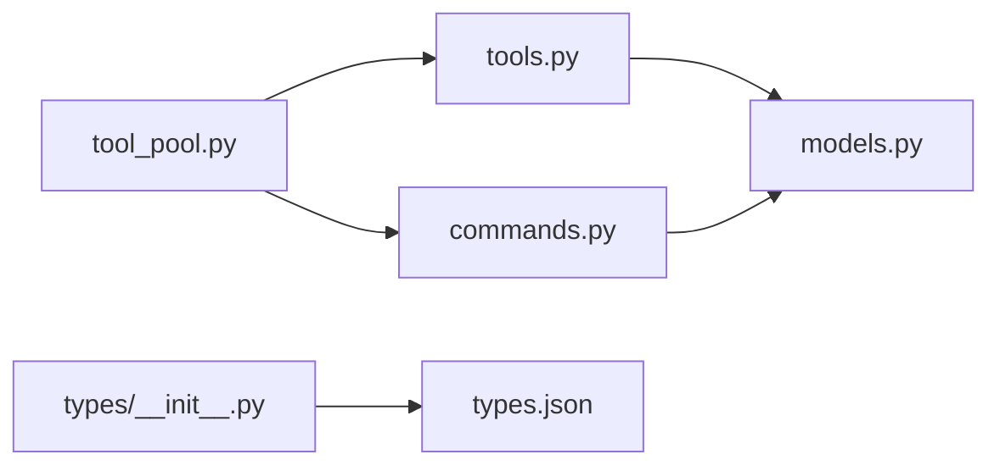

# 类型定义

<cite>
**本文引用的文件**
- [src/types/__init__.py](file://src/types/__init__.py)
- [src/reference_data/subsystems/types.json](file://src/reference_data/subsystems/types.json)
- [src/models.py](file://src/models.py)
- [src/tool_pool.py](file://src/tool_pool.py)
- [src/tools.py](file://src/tools.py)
- [src/commands.py](file://src/commands.py)
- [src/query.py](file://src/query.py)
- [src/projectOnboardingState.py](file://src/projectOnboardingState.py)
- [src/task.py](file://src/task.py)
</cite>

## 目录
1. [引言](#引言)
2. [项目结构](#项目结构)
3. [核心组件](#核心组件)
4. [架构总览](#架构总览)
5. [详细组件分析](#详细组件分析)
6. [依赖分析](#依赖分析)
7. [性能考量](#性能考量)
8. [故障排查指南](#故障排查指南)
9. [结论](#结论)
10. [附录](#附录)

## 引言
本文件聚焦于 CLAW 项目中“类型定义”的技术文档，围绕 Python 类型系统在项目中的使用方式展开，涵盖类型注解、类型推断、数据类（dataclass）的定义与使用、类型别名与泛型的实践建议、类型安全与兼容性最佳实践、复杂类型结构示例与性能优化策略，并提供类型定义的维护与演进建议。  
需要特别说明的是：当前仓库中与“类型”直接相关的核心实现以 Python 数据类为主，同时保留了对已归档子系统“types”的占位包与快照信息；因此本文在“类型系统”层面的讨论主要基于 Python 的数据类与类型注解实践，而非 Rust 或 TypeScript 的类型系统。

## 项目结构
CLAW 项目在 Python 层通过数据类统一表达领域模型，配合类型注解提升可读性与静态检查能力。与“类型”相关的模块分布如下：
- 占位包与快照：src/types/__init__.py 与 src/reference_data/subsystems/types.json 提供已归档“types”子系统的元信息与样例路径。
- 领域模型：src/models.py 定义了若干数据类，作为跨模块共享的类型载体。
- 工具与命令镜像：src/tools.py、src/commands.py 通过数据类封装执行结果与索引查询结果。
- 工具池装配：src/tool_pool.py 将工具集合以不可变元组形式组织，便于类型安全传递。
- 查询请求/响应：src/query.py 定义了查询交互的数据结构。
- 其他类型：src/projectOnboardingState.py、src/task.py 等提供状态与任务类型。

图表来源
- [src/models.py:1-50](file://src/models.py#L1-L50)
- [src/query.py:1-13](file://src/query.py#L1-L13)
- [src/projectOnboardingState.py:1-11](file://src/projectOnboardingState.py#L1-L11)
- [src/task.py:1-6](file://src/task.py#L1-L6)
- [src/tool_pool.py:1-38](file://src/tool_pool.py#L1-L38)
- [src/tools.py:1-97](file://src/tools.py#L1-L97)
- [src/commands.py:1-91](file://src/commands.py#L1-L91)
- [src/types/__init__.py:1-17](file://src/types/__init__.py#L1-L17)
- [src/reference_data/subsystems/types.json:1-18](file://src/reference_data/subsystems/types.json#L1-L18)

章节来源
- [src/types/__init__.py:1-17](file://src/types/__init__.py#L1-L17)
- [src/reference_data/subsystems/types.json:1-18](file://src/reference_data/subsystems/types.json#L1-L18)

## 核心组件
本节从类型系统角度梳理关键数据类及其职责，强调类型注解与不可变性带来的类型安全收益。

- 模型层（models.py）
  - Subsystem：描述子系统名称、路径、文件数与备注，用于类型化元信息。
  - PortingModule：描述迁移模块的名称、职责、来源提示与状态，是工具与命令镜像的核心类型。
  - PermissionDenial：描述权限拒绝的工具名与原因。
  - UsageSummary：统计输入/输出 token 数，提供不可变加法操作，返回新的聚合实例。
  - PortingBacklog：承载标题与模块列表，提供摘要行渲染等方法。

- 工具与命令层（tools.py、commands.py）
  - ToolExecution：封装工具执行结果（名称、来源提示、载荷、处理标记、消息）。
  - CommandExecution：封装命令执行结果（名称、来源提示、提示词、处理标记、消息）。
  - 缓存加载：通过 LRU 缓存加载工具与命令快照，返回不可变元组，保证类型一致性与运行时稳定性。

- 工具池（tool_pool.py）
  - ToolPool：以不可变元组保存工具集，简单模式与是否包含 MCP 的布尔标志，提供 Markdown 渲染辅助。

- 查询层（query.py）
  - QueryRequest：查询请求的不可变结构。
  - QueryResponse：查询响应的不可变结构。

- 其他类型（projectOnboardingState.py、task.py）
  - ProjectOnboardingState：项目引导状态，含布尔字段与默认值。
  - task.py：导出 PortingTask 类型标识。

章节来源
- [src/models.py:1-50](file://src/models.py#L1-L50)
- [src/tool_pool.py:1-38](file://src/tool_pool.py#L1-L38)
- [src/tools.py:1-97](file://src/tools.py#L1-L97)
- [src/commands.py:1-91](file://src/commands.py#L1-L91)
- [src/query.py:1-13](file://src/query.py#L1-L13)
- [src/projectOnboardingState.py:1-11](file://src/projectOnboardingState.py#L1-L11)
- [src/task.py:1-6](file://src/task.py#L1-L6)

## 架构总览
下图展示类型系统在各模块间的协作关系：工具与命令通过数据类封装执行上下文，ToolPool 聚合工具集合并以不可变形式传递；模型层为跨模块共享的类型基础；查询层提供端到端的请求/响应类型。

图表来源
- [src/tool_pool.py:28-38](file://src/tool_pool.py#L28-L38)
- [src/tools.py:62-73](file://src/tools.py#L62-L73)
- [src/commands.py:60-67](file://src/commands.py#L60-L67)

## 详细组件分析

### 数据类与类型注解
- 不可变数据类（frozen=True）
  - 多个数据类采用冻结属性，确保类型安全与并发安全性，避免意外修改。
  - 示例：models.py 中的多个数据类均声明为不可变，适合在多模块间传递与缓存。
- 可变数据类
  - 少量数据类未冻结，允许在局部作用域内更新，但需谨慎控制其生命周期与可见范围。
- 类型注解
  - 在函数参数、返回值与数据类字段上广泛使用类型注解，结合 from __future__ import annotations 支持前向引用，提升可读性与静态检查友好度。

章节来源
- [src/models.py:1-50](file://src/models.py#L1-L50)
- [src/tool_pool.py:1-38](file://src/tool_pool.py#L1-L38)
- [src/tools.py:1-97](file://src/tools.py#L1-L97)
- [src/commands.py:1-91](file://src/commands.py#L1-L91)
- [src/query.py:1-13](file://src/query.py#L1-L13)

### 工具池与工具集合
- 不可变元组
  - 工具集合以元组形式存储，避免运行期误改；配合 frozen 数据类，形成强一致的类型契约。
- 条件筛选
  - 支持按简单模式与是否包含 MCP 进行过滤，返回新的元组，保持类型一致性。
- 权限上下文
  - 通过 ToolPermissionContext 过滤工具，返回新的元组，体现类型安全的组合式过滤。

图表来源
- [src/tool_pool.py:10-26](file://src/tool_pool.py#L10-L26)
- [src/models.py:14-20](file://src/models.py#L14-L20)

章节来源
- [src/tool_pool.py:1-38](file://src/tool_pool.py#L1-L38)
- [src/models.py:14-20](file://src/models.py#L14-L20)

### 工具与命令执行结果
- ToolExecution/CommandExecution
  - 两类数据类分别封装工具与命令的执行结果，字段覆盖名称、来源提示、输入/载荷、处理标记与消息。
  - 通过不可变结构与类型注解，确保调用方能以类型安全的方式消费执行结果。
- 快照加载与缓存
  - 使用 LRU 缓存加载工具与命令快照，返回不可变元组，减少重复 IO 并保证类型一致性。

图表来源
- [src/tools.py:23-34](file://src/tools.py#L23-L34)
- [src/commands.py:22-34](file://src/commands.py#L22-L34)
- [src/tools.py:62-73](file://src/tools.py#L62-L73)
- [src/commands.py:60-67](file://src/commands.py#L60-L67)

章节来源
- [src/tools.py:1-97](file://src/tools.py#L1-L97)
- [src/commands.py:1-91](file://src/commands.py#L1-L91)

### 查询请求/响应
- QueryRequest/QueryResponse
  - 以不可变数据类表达查询交互的输入与输出，字段清晰、类型明确，便于上层逻辑进行类型校验与处理。

章节来源
- [src/query.py:1-13](file://src/query.py#L1-L13)

### 归档类型占位与迁移
- types 子系统占位
  - src/types/__init__.py 加载 types.json 快照，导出归档名称、模块数量与示例文件列表，作为迁移过程中的类型参考与追踪依据。
- 迁移建议
  - 建议在迁移过程中逐步替换 Python 数据类为更严格的类型注解或引入第三方类型验证库（如 pydantic），并在 CI 中启用类型检查工具（如 mypy）。

章节来源
- [src/types/__init__.py:1-17](file://src/types/__init__.py#L1-L17)
- [src/reference_data/subsystems/types.json:1-18](file://src/reference_data/subsystems/types.json#L1-L18)

## 依赖分析
- 内聚与耦合
  - 工具与命令模块依赖 models.PortingModule，形成稳定的类型契约；ToolPool 依赖工具模块与权限上下文，保持较低耦合。
- 循环依赖
  - 当前模块间无明显循环导入；task.py 导出 PortingTask，但其实际定义位于其他模块，此处仅做导出。
- 外部依赖
  - 使用标准库 dataclasses、functools.lru_cache、json、pathlib 等，类型注解与数据类组合提供了良好的静态检查支持。

图表来源
- [src/tool_pool.py:1-38](file://src/tool_pool.py#L1-L38)
- [src/tools.py:1-97](file://src/tools.py#L1-L97)
- [src/commands.py:1-91](file://src/commands.py#L1-L91)
- [src/models.py:1-50](file://src/models.py#L1-L50)
- [src/types/__init__.py:1-17](file://src/types/__init__.py#L1-L17)
- [src/reference_data/subsystems/types.json:1-18](file://src/reference_data/subsystems/types.json#L1-L18)

章节来源
- [src/task.py:1-6](file://src/task.py#L1-L6)

## 性能考量
- 不可变性与缓存
  - 使用 frozen 数据类与 LRU 缓存（如 load_tool_snapshot、load_command_snapshot）降低重复计算与内存占用，提升整体性能。
- 元组 vs 列表
  - 工具与命令集合以元组存储，避免运行期修改带来的额外开销与竞态风险。
- 类型检查成本
  - 类型注解与数据类在运行时几乎零开销；在开发阶段可通过静态检查工具提前发现类型问题，减少运行时错误与调试成本。

[本节为通用性能指导，不直接分析具体文件]

## 故障排查指南
- 类型不匹配
  - 若出现类型不匹配错误，优先检查数据类字段类型与调用方传参是否一致；确认 from __future__ import annotations 是否正确启用以支持前向引用。
- 不可变对象修改
  - 若尝试修改 frozen 数据类字段导致异常，应改为构造新实例或使用数据类的 replace/辅助方法（如 UsageSummary.add_turn 返回新实例）。
- 缓存失效
  - 若工具/命令快照未更新，检查 LRU 缓存键与输入参数是否一致，必要时调整缓存策略或清理缓存。
- 权限过滤异常
  - 若工具被错误过滤，检查 ToolPermissionContext 的 blocks 实现与工具名称大小写处理逻辑。

章节来源
- [src/models.py:28-38](file://src/models.py#L28-L38)
- [src/tools.py:23-34](file://src/tools.py#L23-L34)
- [src/commands.py:22-34](file://src/commands.py#L22-L34)

## 结论
CLAW 项目在 Python 层通过数据类与类型注解构建了清晰、可维护的类型体系：不可变数据类确保类型安全与并发安全；LRU 缓存与元组集合提升性能与稳定性；类型注解与前向引用增强可读性与静态检查友好度。对于“types”归档子系统，当前以占位包与快照形式保留迁移线索。建议在后续演进中引入更强的类型验证与静态检查流程，持续提升类型系统的健壮性与可维护性。

[本节为总结性内容，不直接分析具体文件]

## 附录
- 最佳实践清单
  - 优先使用 frozen 数据类表达不可变领域对象。
  - 在函数签名与数据类字段上使用明确的类型注解。
  - 对外暴露的集合使用元组或不可变容器，避免隐式修改。
  - 合理使用 LRU 缓存，确保键与输入稳定。
  - 在 CI 中启用类型检查工具，将类型错误前置到开发阶段。
- 复杂类型结构建议
  - 对于嵌套结构，优先拆分为多个小的数据类，保持单一职责。
  - 对于可选字段，使用 Optional[T] 明确表达可空语义。
  - 对于枚举值，使用 Enum 或 Literal 提升类型约束与可读性。
- 维护与演进指南
  - 迁移归档子系统时，先以占位包与快照保留线索，再逐步替换为强类型实现。
  - 对既有数据类进行重构时，遵循“先扩展、后收紧”的原则，确保向后兼容。
  - 在团队内推广类型注解规范与静态检查流程，建立类型安全的文化。

[本节为通用指导，不直接分析具体文件]