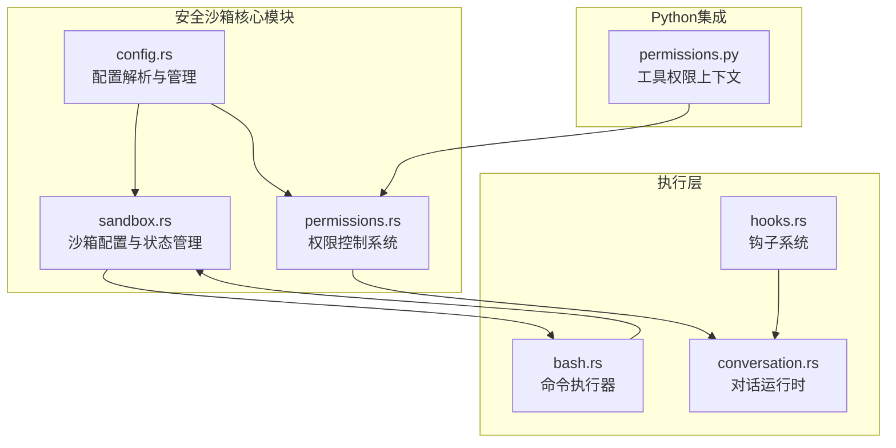
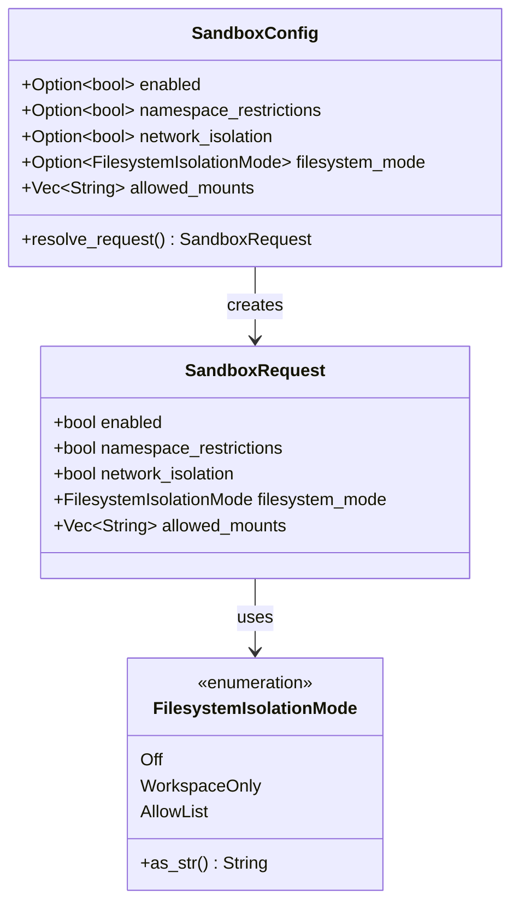
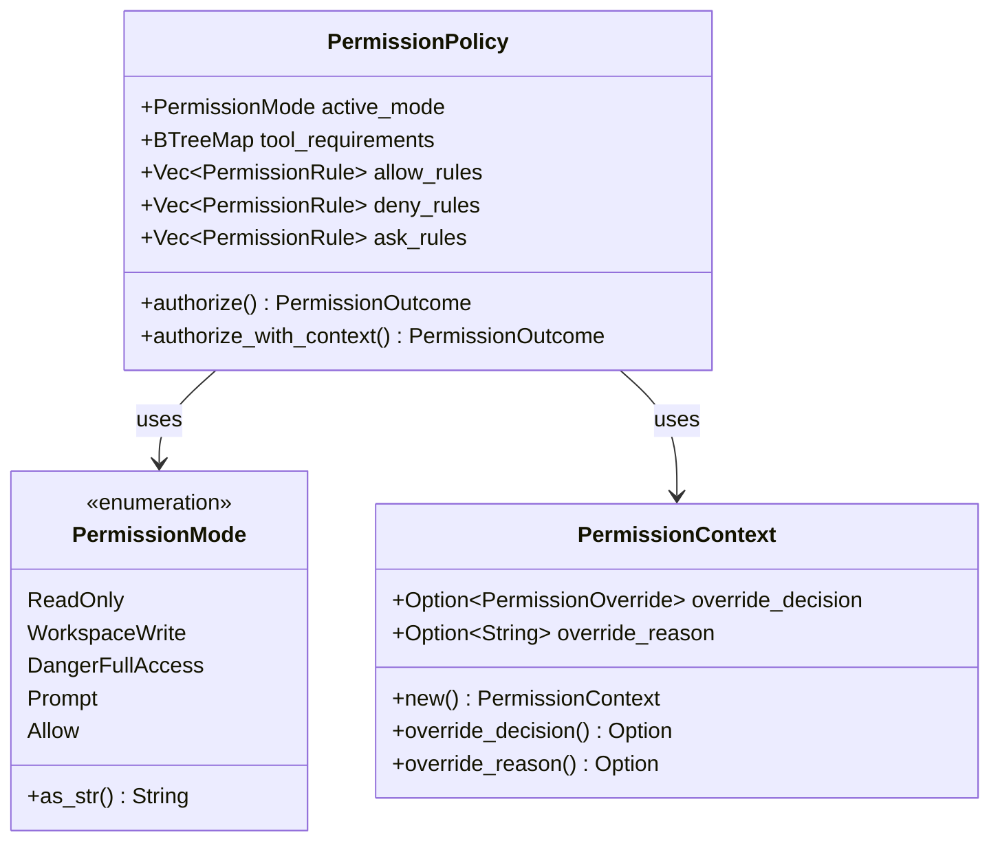
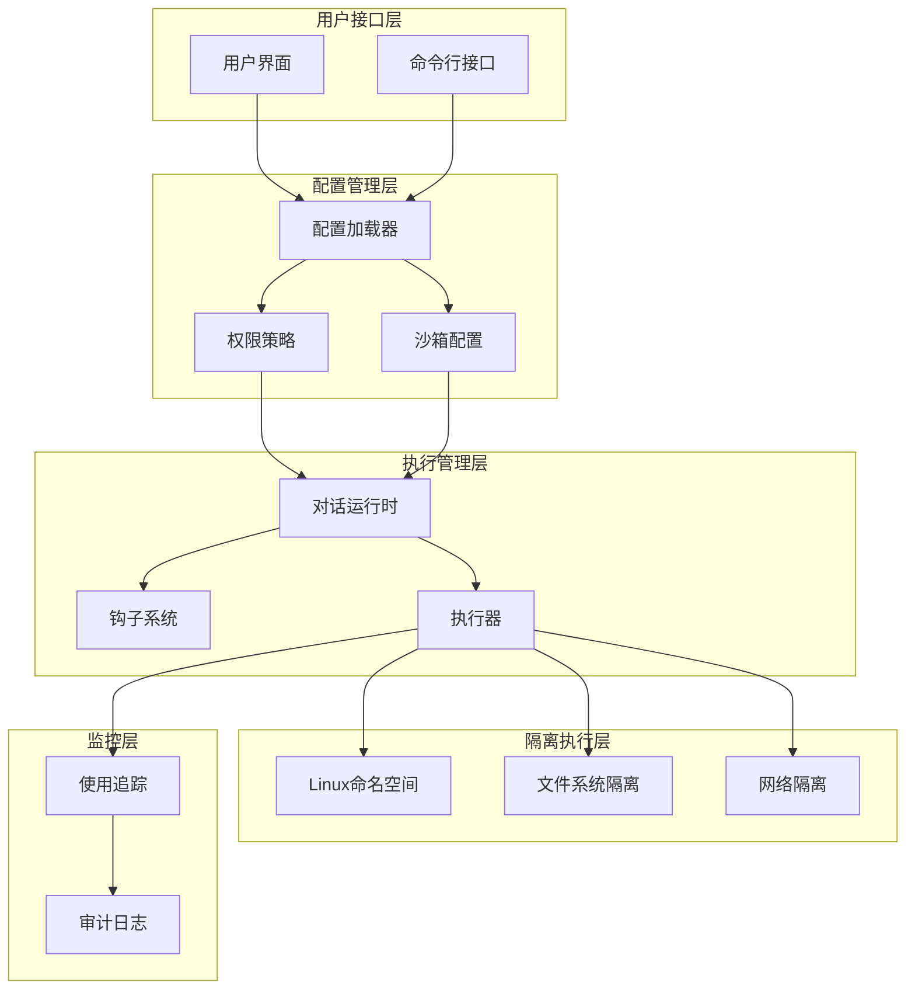
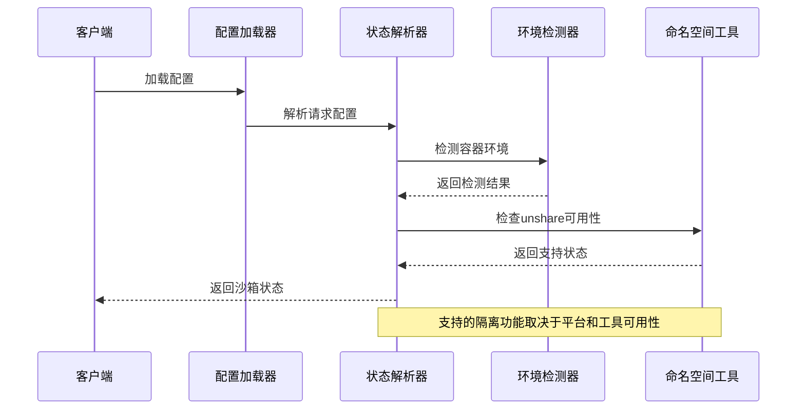
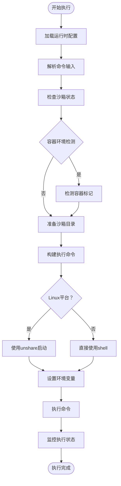
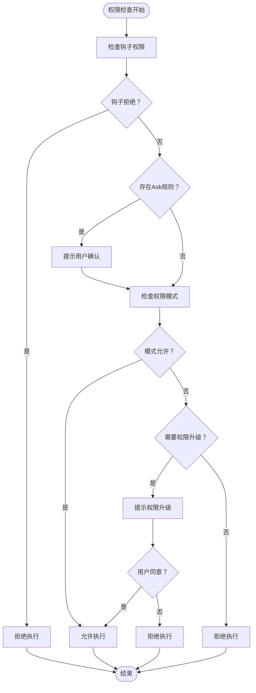
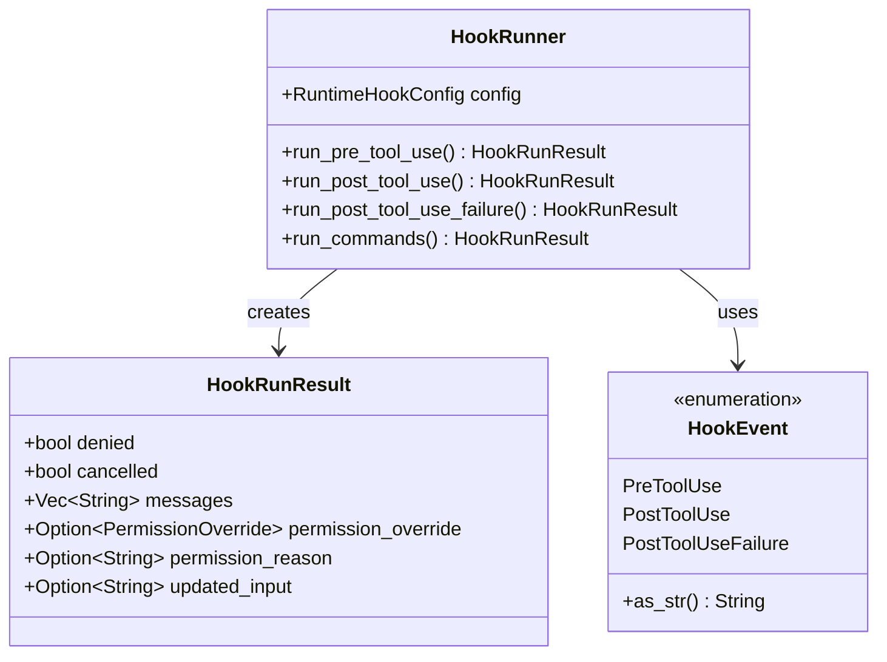
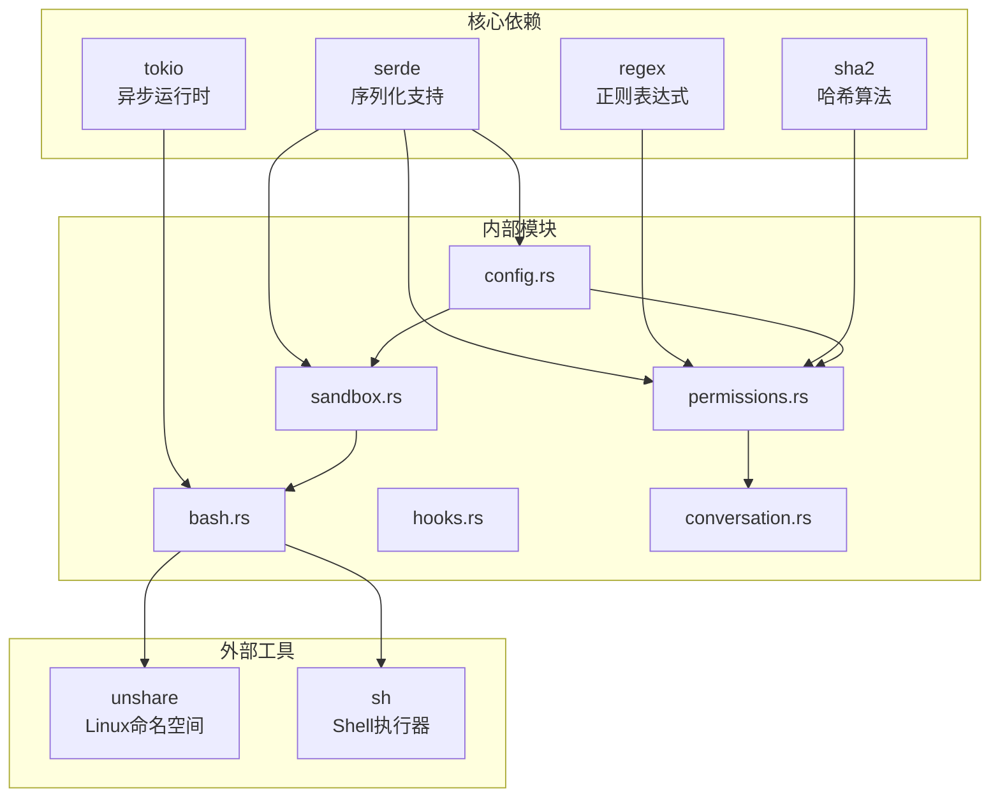

# 安全沙箱机制

<cite>
**本文档引用的文件**
- [sandbox.rs](file://rust/crates/runtime/src/sandbox.rs)
- [permissions.rs](file://rust/crates/runtime/src/permissions.rs)
- [config.rs](file://rust/crates/runtime/src/config.rs)
- [bash.rs](file://rust/crates/runtime/src/bash.rs)
- [hooks.rs](file://rust/crates/runtime/src/hooks.rs)
- [conversation.rs](file://rust/crates/runtime/src/conversation.rs)
- [Cargo.toml](file://rust/crates/runtime/Cargo.toml)
- [lib.rs](file://rust/crates/runtime/src/lib.rs)
- [permissions.py](file://src/permissions.py)
</cite>

## 目录
1. [引言](#引言)
2. [项目结构](#项目结构)
3. [核心组件](#核心组件)
4. [架构概览](#架构概览)
5. [详细组件分析](#详细组件分析)
6. [依赖关系分析](#依赖关系分析)
7. [性能考虑](#性能考虑)
8. [故障排除指南](#故障排除指南)
9. [结论](#结论)

## 引言

CLAW项目的安全沙箱机制是一个多层次的安全防护系统，旨在为工具执行提供受控的隔离环境。该机制通过Linux命名空间隔离、文件系统隔离和权限控制系统，确保工具在受限环境中安全执行。

本系统的核心设计原则包括：
- **最小权限原则**：默认拒绝所有操作，仅允许明确授权的工具和操作
- **深度防御**：多层安全检查，包括容器检测、权限验证和访问控制
- **可审计性**：完整的执行记录和状态追踪
- **灵活性**：支持多种隔离模式和配置选项

## 项目结构

CLAW项目采用模块化架构，安全沙箱机制主要分布在以下模块中：

**图表来源**
- [sandbox.rs:1-365](file://rust/crates/runtime/src/sandbox.rs#L1-L365)
- [permissions.rs:1-676](file://rust/crates/runtime/src/permissions.rs#L1-L676)
- [config.rs:1-800](file://rust/crates/runtime/src/config.rs#L1-L800)

**章节来源**
- [Cargo.toml:1-20](file://rust/crates/runtime/Cargo.toml#L1-L20)
- [lib.rs:1-94](file://rust/crates/runtime/src/lib.rs#L1-L94)

## 核心组件

### 沙箱配置系统

沙箱配置系统提供了灵活的隔离策略配置，支持多种隔离模式：

**图表来源**
- [sandbox.rs:27-43](file://rust/crates/runtime/src/sandbox.rs#L27-L43)
- [sandbox.rs:7-25](file://rust/crates/runtime/src/sandbox.rs#L7-L25)

### 权限控制系统

权限控制系统实现了基于角色的访问控制（RBAC），支持多种权限级别：

**图表来源**
- [permissions.rs:91-97](file://rust/crates/runtime/src/permissions.rs#L91-L97)
- [permissions.rs:7-27](file://rust/crates/runtime/src/permissions.rs#L7-L27)
- [permissions.rs:36-63](file://rust/crates/runtime/src/permissions.rs#L36-L63)

**章节来源**
- [sandbox.rs:27-106](file://rust/crates/runtime/src/sandbox.rs#L27-L106)
- [permissions.rs:91-325](file://rust/crates/runtime/src/permissions.rs#L91-L325)

## 架构概览

CLAW安全沙箱机制的整体架构如下：

**图表来源**
- [config.rs:32-57](file://rust/crates/runtime/src/config.rs#L32-L57)
- [conversation.rs:104-119](file://rust/crates/runtime/src/conversation.rs#L104-L119)
- [hooks.rs:145-148](file://rust/crates/runtime/src/hooks.rs#L145-L148)

## 详细组件分析

### 沙箱状态管理

沙箱状态管理系统负责检测当前环境并确定可用的隔离功能：

**图表来源**
- [sandbox.rs:156-208](file://rust/crates/runtime/src/sandbox.rs#L156-L208)
- [sandbox.rs:108-153](file://rust/crates/runtime/src/sandbox.rs#L108-L153)

### 命令执行流程

命令执行流程展示了从输入到执行的完整过程：

**图表来源**
- [bash.rs:67-165](file://rust/crates/runtime/src/bash.rs#L67-L165)
- [bash.rs:182-239](file://rust/crates/runtime/src/bash.rs#L182-L239)

### 权限决策流程

权限决策流程体现了多层权限控制机制：

**图表来源**
- [permissions.rs:167-284](file://rust/crates/runtime/src/permissions.rs#L167-L284)
- [hooks.rs:313-402](file://rust/crates/runtime/src/hooks.rs#L313-L402)

**章节来源**
- [bash.rs:67-165](file://rust/crates/runtime/src/bash.rs#L67-L165)
- [permissions.rs:167-284](file://rust/crates/runtime/src/permissions.rs#L167-L284)

### 钩子系统集成

钩子系统提供了扩展的安全控制点：

**图表来源**
- [hooks.rs:145-148](file://rust/crates/runtime/src/hooks.rs#L145-L148)
- [hooks.rs:81-143](file://rust/crates/runtime/src/hooks.rs#L81-L143)
- [hooks.rs:19-35](file://rust/crates/runtime/src/hooks.rs#L19-L35)

**章节来源**
- [hooks.rs:162-301](file://rust/crates/runtime/src/hooks.rs#L162-L301)
- [conversation.rs:377-432](file://rust/crates/runtime/src/conversation.rs#L377-L432)

## 依赖关系分析

安全沙箱机制的依赖关系如下：

**图表来源**
- [Cargo.toml:8-19](file://rust/crates/runtime/Cargo.toml#L8-L19)
- [lib.rs:1-94](file://rust/crates/runtime/src/lib.rs#L1-L94)

**章节来源**
- [Cargo.toml:1-20](file://rust/crates/runtime/Cargo.toml#L1-L20)
- [lib.rs:20-85](file://rust/crates/runtime/src/lib.rs#L20-L85)

## 性能考虑

安全沙箱机制在设计时充分考虑了性能影响：

### 启动开销优化
- **延迟初始化**：沙箱目录仅在需要时创建
- **缓存机制**：配置信息和权限状态进行缓存
- **条件检查**：仅在必要时执行昂贵的系统调用

### 执行效率
- **异步处理**：使用Tokio异步运行时提高并发性能
- **超时控制**：防止长时间阻塞操作影响系统响应
- **资源限制**：通过命名空间实现进程资源隔离

### 内存管理
- **零拷贝优化**：尽量减少数据复制操作
- **智能释放**：及时清理临时文件和资源
- **内存池**：复用常用对象避免频繁分配

## 故障排除指南

### 常见问题诊断

#### 沙箱功能不可用
**症状**：沙箱状态显示不支持某些隔离功能
**可能原因**：
- 缺少必要的系统工具（如unshare）
- 非Linux平台环境
- 权限不足无法创建命名空间

**解决方案**：
1. 检查系统是否为Linux平台
2. 验证unshare工具是否安装
3. 确认具有足够的系统权限

#### 权限拒绝错误
**症状**：工具执行被拒绝但未提示用户确认
**可能原因**：
- 权限模式设置过于严格
- 规则配置错误
- 钩子系统阻止了执行

**解决方案**：
1. 检查权限模式配置
2. 验证规则表达式语法
3. 查看钩子输出消息

#### 超时问题
**症状**：命令执行超时但无输出
**可能原因**：
- 命令本身耗时过长
- 死锁或无限循环
- 系统资源不足

**解决方案**：
1. 增加超时时间配置
2. 分析命令逻辑
3. 检查系统资源使用情况

**章节来源**
- [bash.rs:109-134](file://rust/crates/runtime/src/bash.rs#L109-L134)
- [permissions.rs:174-181](file://rust/crates/runtime/src/permissions.rs#L174-L181)

## 结论

CLAW项目的安全沙箱机制通过多层次的安全控制实现了强大的隔离和保护能力。该系统的主要优势包括：

### 设计优势
- **模块化设计**：清晰的职责分离便于维护和扩展
- **灵活配置**：支持多种隔离模式适应不同场景需求
- **深度集成**：与权限系统和钩子系统紧密协作

### 安全特性
- **容器检测**：自动识别容器环境并调整安全策略
- **多层验证**：权限检查贯穿整个执行流程
- **审计追踪**：完整的执行记录便于安全审计

### 可扩展性
- **插件架构**：支持通过钩子系统扩展安全控制
- **配置驱动**：通过配置文件灵活调整安全策略
- **平台兼容**：针对不同平台提供最优的隔离方案

该安全沙箱机制为CLAW项目提供了坚实的安全基础，能够在保证功能完整性的同时有效防范各种潜在的安全威胁。