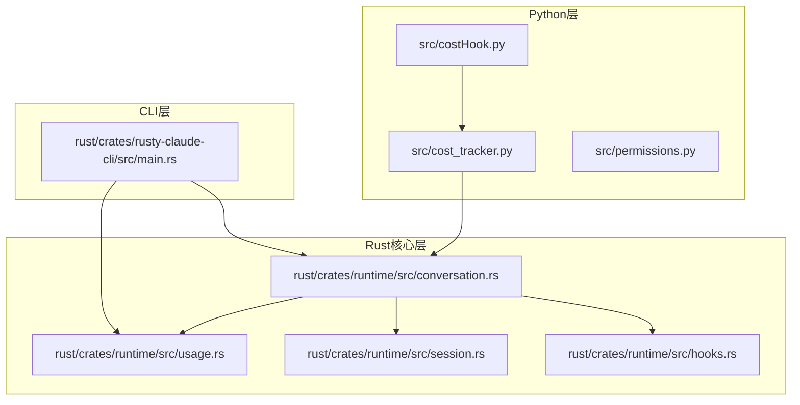
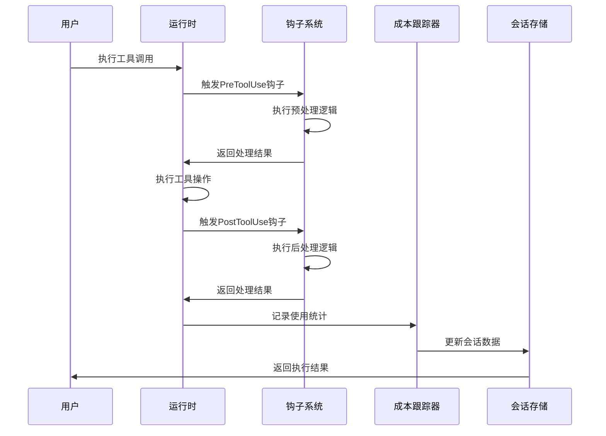
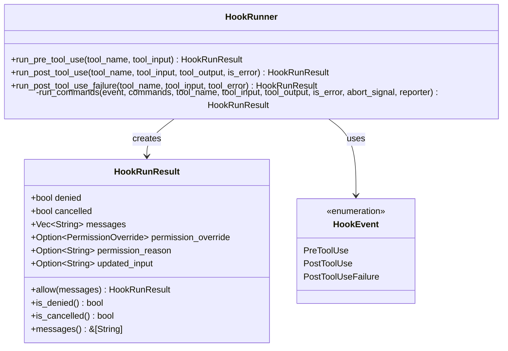
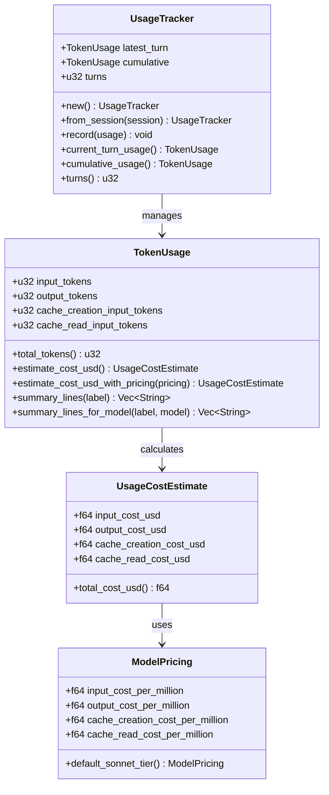
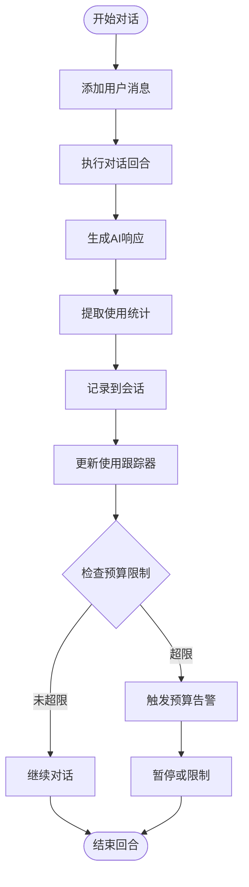
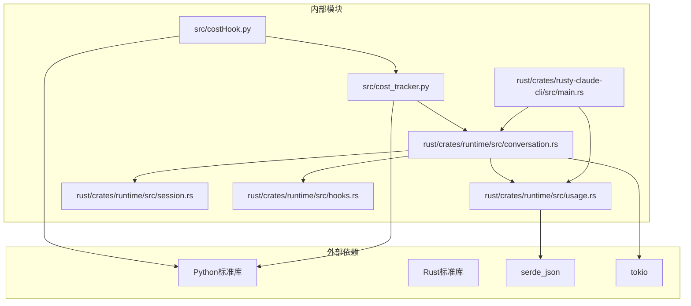

# 成本跟踪系统

<cite>
**本文档引用的文件**
- [src/costHook.py](file://src/costHook.py)
- [src/cost_tracker.py](file://src/cost_tracker.py)
- [rust/crates/runtime/src/usage.rs](file://rust/crates/runtime/src/usage.rs)
- [rust/crates/runtime/src/conversation.rs](file://rust/crates/runtime/src/conversation.rs)
- [rust/crates/runtime/src/session.rs](file://rust/crates/runtime/src/session.rs)
- [rust/crates/runtime/src/hooks.rs](file://rust/crates/runtime/src/hooks.rs)
- [rust/crates/rusty-claude-cli/src/main.rs](file://rust/crates/rusty-claude-cli/src/main.rs)
- [src/permissions.py](file://src/permissions.py)
</cite>

## 目录
1. [简介](#简介)
2. [项目结构](#项目结构)
3. [核心组件](#核心组件)
4. [架构概览](#架构概览)
5. [详细组件分析](#详细组件分析)
6. [依赖关系分析](#依赖关系分析)
7. [性能考虑](#性能考虑)
8. [故障排除指南](#故障排除指南)
9. [结论](#结论)

## 简介

CLAW项目成本跟踪系统是一个多层次的成本管理框架，旨在为AI助手应用提供全面的成本监控、统计和控制功能。该系统通过Python和Rust两种语言实现，结合了轻量级的成本追踪器和基于会话的令牌使用统计功能。

系统的核心目标包括：
- 实时成本计算和跟踪
- 多维度成本统计分析
- 预算控制和阈值告警
- 成本钩子的事件驱动处理
- 权限控制与成本管理的集成

## 项目结构

CLAW项目的成本跟踪系统采用分层架构设计，主要分为以下层次：

**图表来源**
- [src/costHook.py:1-9](file://src/costHook.py#L1-L9)
- [src/cost_tracker.py:1-14](file://src/cost_tracker.py#L1-L14)
- [rust/crates/runtime/src/usage.rs:1-309](file://rust/crates/runtime/src/usage.rs#L1-L309)
- [rust/crates/runtime/src/conversation.rs:1-800](file://rust/crates/runtime/src/conversation.rs#L1-L800)

**章节来源**
- [src/costHook.py:1-9](file://src/costHook.py#L1-L9)
- [src/cost_tracker.py:1-14](file://src/cost_tracker.py#L1-L14)
- [rust/crates/runtime/src/usage.rs:1-309](file://rust/crates/runtime/src/usage.rs#L1-L309)

## 核心组件

### Python成本跟踪器

Python层提供了轻量级的成本跟踪功能，主要包含两个核心组件：

**CostTracker类**：负责基本的成本记录和统计
- 总成本单位累加
- 事件历史记录
- 简单的成本标签系统

**apply_cost_hook函数**：提供统一的成本钩子接口
- 接受CostTracker实例
- 支持自定义成本标签
- 返回更新后的跟踪器

### Rust核心成本引擎

Rust层实现了更复杂和精确的成本计算系统：

**TokenUsage结构体**：表示令牌使用情况
- 输入令牌数
- 输出令牌数  
- 缓存创建令牌数
- 缓存读取令牌数

**UsageTracker结构体**：跟踪对话过程中的使用情况
- 当前回合使用统计
- 累积使用统计
- 回合计数

**ModelPricing结构体**：模型定价信息
- 按百万令牌计价
- 支持多种模型类型
- 默认定价策略

**章节来源**
- [src/cost_tracker.py:6-14](file://src/cost_tracker.py#L6-L14)
- [src/costHook.py:6-8](file://src/costHook.py#L6-L8)
- [rust/crates/runtime/src/usage.rs:28-107](file://rust/crates/runtime/src/usage.rs#L28-L107)
- [rust/crates/runtime/src/usage.rs:162-209](file://rust/crates/runtime/src/usage.rs#L162-L209)

## 架构概览

CLAW成本跟踪系统采用事件驱动的架构模式，通过钩子机制实现成本数据的自动收集和处理：

**图表来源**
- [rust/crates/runtime/src/conversation.rs:317-501](file://rust/crates/runtime/src/conversation.rs#L317-L501)
- [rust/crates/runtime/src/hooks.rs:166-212](file://rust/crates/runtime/src/hooks.rs#L166-L212)

系统的关键特性包括：

1. **多层成本计算**：从基础的令牌统计到复杂的模型定价
2. **实时监控**：在工具执行过程中实时收集成本数据
3. **灵活配置**：支持不同模型和定价策略
4. **权限集成**：成本控制与权限管理紧密结合

## 详细组件分析

### 成本钩子系统

成本钩子系统是整个成本跟踪的核心机制，通过事件驱动的方式实现成本数据的自动收集：

**图表来源**
- [rust/crates/runtime/src/hooks.rs:145-476](file://rust/crates/runtime/src/hooks.rs#L145-L476)

**章节来源**
- [rust/crates/runtime/src/hooks.rs:19-35](file://rust/crates/runtime/src/hooks.rs#L19-L35)
- [rust/crates/runtime/src/hooks.rs:81-143](file://rust/crates/runtime/src/hooks.rs#L81-L143)

### 令牌使用统计系统

令牌使用统计系统提供了精确的使用量跟踪和成本估算功能：

**图表来源**
- [rust/crates/runtime/src/usage.rs:28-107](file://rust/crates/runtime/src/usage.rs#L28-L107)
- [rust/crates/runtime/src/usage.rs:162-209](file://rust/crates/runtime/src/usage.rs#L162-L209)

**章节来源**
- [rust/crates/runtime/src/usage.rs:79-107](file://rust/crates/runtime/src/usage.rs#L79-L107)
- [rust/crates/runtime/src/usage.rs:169-209](file://rust/crates/runtime/src/usage.rs#L169-L209)

### 会话成本集成

会话系统将成本数据与对话历史紧密集成，确保每个消息都包含相应的使用统计：

**图表来源**
- [rust/crates/runtime/src/conversation.rs:317-501](file://rust/crates/runtime/src/conversation.rs#L317-L501)
- [rust/crates/runtime/src/session.rs:35-46](file://rust/crates/runtime/src/session.rs#L35-L46)

**章节来源**
- [rust/crates/runtime/src/conversation.rs:344-348](file://rust/crates/runtime/src/conversation.rs#L344-L348)
- [rust/crates/runtime/src/session.rs:163-170](file://rust/crates/runtime/src/session.rs#L163-L170)

### Python成本钩子实现

Python层提供了简化的成本钩子接口，便于与现有系统集成：

**章节来源**
- [src/costHook.py:6-8](file://src/costHook.py#L6-L8)
- [src/cost_tracker.py:11-13](file://src/cost_tracker.py#L11-L13)

## 依赖关系分析

成本跟踪系统的依赖关系呈现清晰的分层结构：

**图表来源**
- [src/costHook.py:1-3](file://src/costHook.py#L1-L3)
- [rust/crates/runtime/src/usage.rs:1-7](file://rust/crates/runtime/src/usage.rs#L1-L7)

**章节来源**
- [rust/crates/runtime/src/usage.rs:1-7](file://rust/crates/runtime/src/usage.rs#L1-L7)
- [rust/crates/runtime/src/hooks.rs:1-15](file://rust/crates/runtime/src/hooks.rs#L1-L15)

## 性能考虑

成本跟踪系统在设计时充分考虑了性能优化：

### 内存效率
- 使用固定大小的数据结构避免内存泄漏
- 令牌统计采用增量更新而非全量重算
- 会话数据按需加载和缓存

### 计算优化
- 成本计算使用高效的数学运算
- 定价查询采用字符串匹配优化
- 钩子执行支持异步处理

### 存储优化
- 会话数据序列化为紧凑的JSON格式
- 使用B树映射保证有序访问
- 支持大文件的流式处理

## 故障排除指南

### 常见问题诊断

**成本数据不准确**
- 检查令牌统计是否正确记录
- 验证模型定价配置
- 确认会话数据完整性

**钩子执行失败**
- 查看钩子命令返回码
- 检查环境变量设置
- 验证权限配置

**性能问题**
- 监控内存使用情况
- 检查磁盘I/O性能
- 优化会话文件大小

**章节来源**
- [rust/crates/runtime/src/hooks.rs:404-475](file://rust/crates/runtime/src/hooks.rs#L404-L475)
- [rust/crates/runtime/src/usage.rs:211-309](file://rust/crates/runtime/src/usage.rs#L211-L309)

## 结论

CLAW项目成本跟踪系统通过精心设计的分层架构，成功实现了从简单到复杂的多维度成本管理功能。系统的主要优势包括：

1. **模块化设计**：Python和Rust两层架构提供了灵活性和性能的平衡
2. **事件驱动**：通过钩子机制实现成本数据的自动收集
3. **精确计算**：基于令牌使用的成本估算确保准确性
4. **权限集成**：成本控制与权限管理紧密结合
5. **可扩展性**：支持自定义定价策略和报告格式

该系统为AI助手应用的成本管理提供了坚实的技术基础，能够有效帮助用户控制和优化AI服务的使用成本。