# 权限控制系统

<cite>
**本文档引用的文件**
- [src/permissions.py](file://src/permissions.py)
- [src/tool_pool.py](file://src/tool_pool.py)
- [src/models.py](file://src/models.py)
- [src/runtime.py](file://src/runtime.py)
- [src/query_engine.py](file://src/query_engine.py)
- [src/cost_tracker.py](file://src/cost_tracker.py)
- [src/costHook.py](file://src/costHook.py)
- [src/main.py](file://src/main.py)
- [rust/crates/runtime/src/permissions.rs](file://rust/crates/runtime/src/permissions.rs)
- [rust/crates/runtime/src/sandbox.rs](file://rust/crates/runtime/src/sandbox.rs)
- [rust/crates/commands/src/lib.rs](file://rust/crates/commands/src/lib.rs)
</cite>

## 目录
1. [简介](#简介)
2. [项目结构](#项目结构)
3. [核心组件](#核心组件)
4. [架构总览](#架构总览)
5. [详细组件分析](#详细组件分析)
6. [依赖关系分析](#依赖关系分析)
7. [性能考量](#性能考量)
8. [故障排查指南](#故障排查指南)
9. [结论](#结论)
10. [附录](#附录)

## 简介
本文件面向 CLAW 项目的权限控制系统，系统由两部分组成：Python 端的工具白名单与细粒度拒绝列表（ToolPermissionContext），以及 Rust 端的权限策略引擎（PermissionPolicy）与安全沙箱（Sandbox）。前者负责在工具选择阶段进行快速过滤，后者负责运行时的细粒度授权、规则匹配、提示确认与钩子干预，并通过沙箱隔离执行高风险操作。

该系统支持：
- 细粒度权限模型与模式切换
- 基于规则的允许/拒绝/询问策略
- 钩子驱动的强制允许/拒绝/询问
- 成本追踪与钩子集成
- 审计与合规（权限拒绝记录、会话持久化）
- 安全沙箱（Linux 命名空间与文件系统隔离）

## 项目结构
围绕权限控制的关键模块分布如下：
- Python 端
  - 工具权限上下文：src/permissions.py
  - 工具池装配：src/tool_pool.py
  - 运行时会话与权限拒绝推断：src/runtime.py
  - 查询引擎与权限拒绝记录：src/query_engine.py
  - 成本追踪与钩子：src/cost_tracker.py、src/costHook.py
  - 入口参数解析与工具展示：src/main.py
- Rust 端
  - 权限策略与规则匹配：rust/crates/runtime/src/permissions.rs
  - 安全沙箱与容器检测：rust/crates/runtime/src/sandbox.rs
  - 权限模式命令入口：rust/crates/commands/src/lib.rs

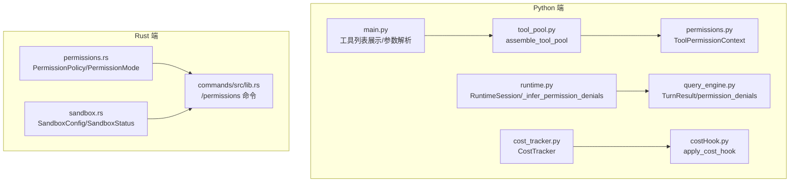

图表来源
- [src/tool_pool.py:28-37](file://src/tool_pool.py#L28-L37)
- [src/permissions.py:6-21](file://src/permissions.py#L6-L21)
- [src/runtime.py:169-174](file://src/runtime.py#L169-L174)
- [src/query_engine.py:25-42](file://src/query_engine.py#L25-L42)
- [src/cost_tracker.py:6-14](file://src/cost_tracker.py#L6-L14)
- [src/costHook.py:6-9](file://src/costHook.py#L6-L9)
- [src/main.py:130-141](file://src/main.py#L130-L141)
- [rust/crates/runtime/src/permissions.rs:91-325](file://rust/crates/runtime/src/permissions.rs#L91-L325)
- [rust/crates/runtime/src/sandbox.rs:27-68](file://rust/crates/runtime/src/sandbox.rs#L27-L68)
- [rust/crates/commands/src/lib.rs:77-83](file://rust/crates/commands/src/lib.rs#L77-L83)

章节来源
- [src/permissions.py:6-21](file://src/permissions.py#L6-L21)
- [src/tool_pool.py:28-37](file://src/tool_pool.py#L28-L37)
- [src/runtime.py:169-174](file://src/runtime.py#L169-L174)
- [src/query_engine.py:25-42](file://src/query_engine.py#L25-L42)
- [src/cost_tracker.py:6-14](file://src/cost_tracker.py#L6-L14)
- [src/costHook.py:6-9](file://src/costHook.py#L6-L9)
- [src/main.py:130-141](file://src/main.py#L130-L141)
- [rust/crates/runtime/src/permissions.rs:91-325](file://rust/crates/runtime/src/permissions.rs#L91-L325)
- [rust/crates/runtime/src/sandbox.rs:27-68](file://rust/crates/runtime/src/sandbox.rs#L27-L68)
- [rust/crates/commands/src/lib.rs:77-83](file://rust/crates/commands/src/lib.rs#L77-L83)

## 核心组件
- 工具权限上下文（Python）
  - ToolPermissionContext：维护拒绝名称集合与前缀集合，提供 blocks 判定，用于工具筛选阶段快速拒绝。
- 工具池装配（Python）
  - assemble_tool_pool：将 ToolPermissionContext 注入工具加载过程，形成最终可用工具集。
- 运行时权限拒绝推断（Python）
  - _infer_permission_denials：对匹配到的工具进行二次判定，如发现高危工具则生成 PermissionDenial。
- 查询引擎与权限记录（Python）
  - TurnResult.permission_denials：记录每轮对话中的权限拒绝项；QueryEnginePort 负责聚合与持久化。
- 成本追踪与钩子（Python）
  - CostTracker：累计单位并记录事件；apply_cost_hook：在调用点记录成本。
- 权限策略引擎（Rust）
  - PermissionPolicy：基于活动模式、工具需求模式、规则集（allow/deny/ask）与钩子上下文进行授权决策。
- 安全沙箱（Rust）
  - SandboxConfig/SandboxStatus：配置与状态；build_linux_sandbox_command：在 Linux 上构建带命名空间/网络/文件系统隔离的执行命令。

章节来源
- [src/permissions.py:6-21](file://src/permissions.py#L6-L21)
- [src/tool_pool.py:28-37](file://src/tool_pool.py#L28-L37)
- [src/runtime.py:169-174](file://src/runtime.py#L169-L174)
- [src/query_engine.py:25-42](file://src/query_engine.py#L25-L42)
- [src/cost_tracker.py:6-14](file://src/cost_tracker.py#L6-L14)
- [src/costHook.py:6-9](file://src/costHook.py#L6-L9)
- [rust/crates/runtime/src/permissions.rs:91-325](file://rust/crates/runtime/src/permissions.rs#L91-L325)
- [rust/crates/runtime/src/sandbox.rs:27-68](file://rust/crates/runtime/src/sandbox.rs#L27-L68)

## 架构总览
下图展示了从用户输入到工具执行的权限控制路径，包括 Python 端的工具筛选与运行时拒绝推断，以及 Rust 端的权限策略与沙箱隔离。

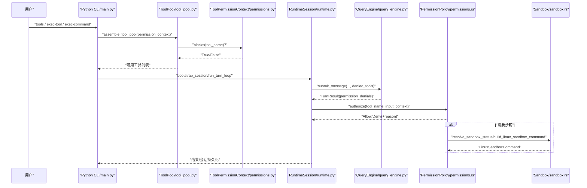

图表来源
- [src/main.py:130-141](file://src/main.py#L130-L141)
- [src/tool_pool.py:28-37](file://src/tool_pool.py#L28-L37)
- [src/permissions.py:18-21](file://src/permissions.py#L18-L21)
- [src/runtime.py:109-152](file://src/runtime.py#L109-L152)
- [src/query_engine.py:61-104](file://src/query_engine.py#L61-L104)
- [rust/crates/runtime/src/permissions.rs:156-284](file://rust/crates/runtime/src/permissions.rs#L156-L284)
- [rust/crates/runtime/src/sandbox.rs:155-262](file://rust/crates/runtime/src/sandbox.rs#L155-L262)

## 详细组件分析

### Python 工具权限上下文（ToolPermissionContext）
- 设计要点
  - 使用不可变数据结构存储拒绝集合，保证线程安全与可缓存性。
  - 支持大小写不敏感的名称与前缀匹配，便于灵活控制。
- 复杂度
  - 检查复杂度 O(n)（n 为前缀数量），通常 n 很小，实际开销可忽略。
- 错误处理
  - 未显式抛错；若传入空集合则等价于不拒绝任何工具。
- 性能建议
  - 将 deny_names 使用 frozenset 提升查找效率；保持 deny_prefixes 短小。

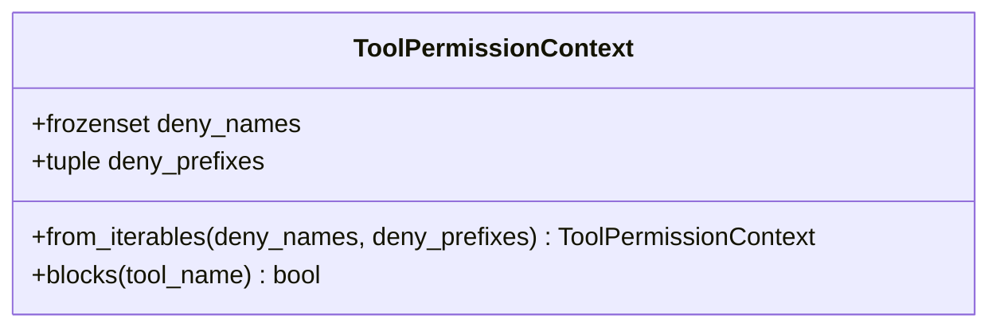

图表来源
- [src/permissions.py:6-21](file://src/permissions.py#L6-L21)

章节来源
- [src/permissions.py:6-21](file://src/permissions.py#L6-L21)

### Python 工具池装配（assemble_tool_pool）
- 设计要点
  - 将 ToolPermissionContext 注入工具加载函数，形成最终工具池。
- 依赖关系
  - 依赖 ToolPermissionContext 与工具加载器（get_tools）。
- 性能建议
  - 在批量工具加载场景中复用 ToolPermissionContext 实例以避免重复构造。

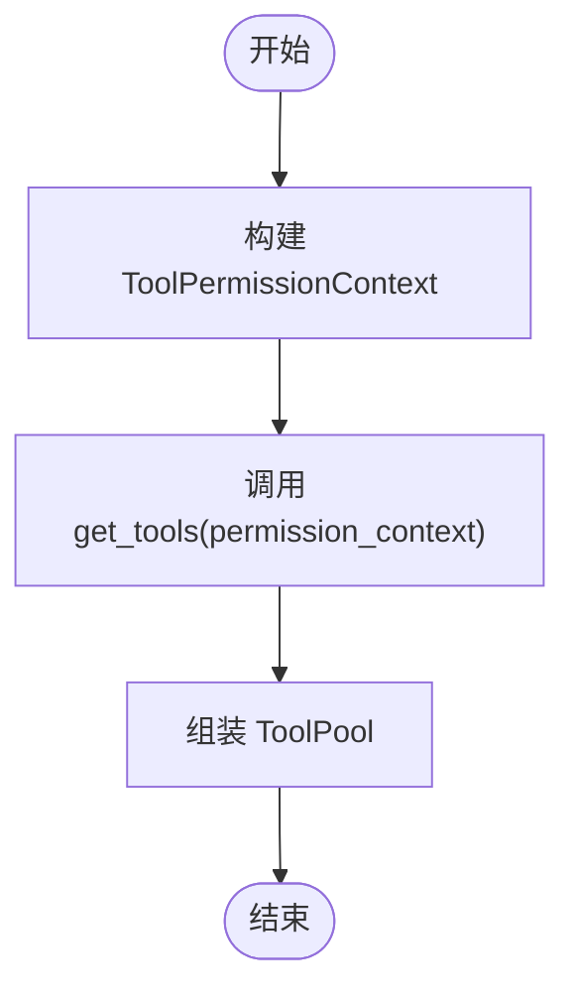

图表来源
- [src/tool_pool.py:28-37](file://src/tool_pool.py#L28-L37)
- [src/permissions.py:11-16](file://src/permissions.py#L11-L16)

章节来源
- [src/tool_pool.py:28-37](file://src/tool_pool.py#L28-L37)
- [src/permissions.py:11-16](file://src/permissions.py#L11-L16)

### 运行时权限拒绝推断（_infer_permission_denials）
- 设计要点
  - 对匹配到的工具进行二次判定，针对高危工具（如包含 bash 的工具）直接生成 PermissionDenial。
- 输出
  - 返回 PermissionDenial 列表，供查询引擎记录与上报。
- 合规性
  - 通过集中拒绝高危工具，降低误操作风险。

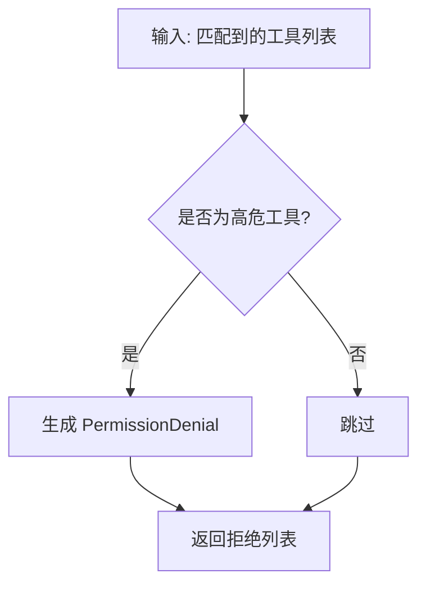

图表来源
- [src/runtime.py:169-174](file://src/runtime.py#L169-L174)
- [src/models.py:22-26](file://src/models.py#L22-L26)

章节来源
- [src/runtime.py:169-174](file://src/runtime.py#L169-L174)
- [src/models.py:22-26](file://src/models.py#L22-L26)

### 查询引擎与权限记录（TurnResult/permission_denials）
- 设计要点
  - TurnResult 记录每轮的权限拒绝项；QueryEnginePort 聚合并持久化会话。
- 数据流
  - runtime 侧生成拒绝列表 → query_engine 接收并记录 → 持久化会话。
- 审计价值
  - 会话中保留权限拒绝历史，便于审计与回溯。

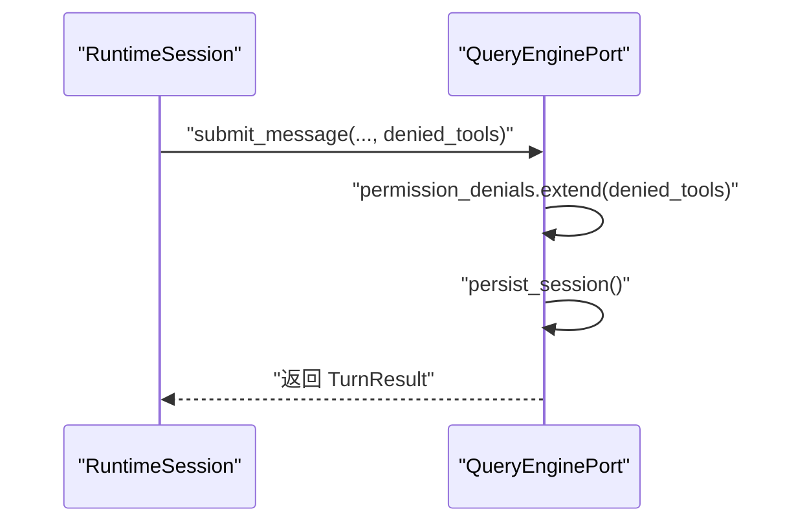

图表来源
- [src/runtime.py:121-133](file://src/runtime.py#L121-L133)
- [src/query_engine.py:61-104](file://src/query_engine.py#L61-L104)
- [src/query_engine.py:140-150](file://src/query_engine.py#L140-L150)

章节来源
- [src/runtime.py:121-133](file://src/runtime.py#L121-L133)
- [src/query_engine.py:61-104](file://src/query_engine.py#L61-L104)
- [src/query_engine.py:140-150](file://src/query_engine.py#L140-L150)

### 成本追踪与钩子（CostTracker/apply_cost_hook）
- 设计要点
  - CostTracker 累计单位并记录事件；apply_cost_hook 在调用点注入成本记录。
- 集成点
  - 可在工具执行前后调用，统一纳入成本统计。
- 性能建议
  - 事件列表按需截断或压缩，避免无限增长。

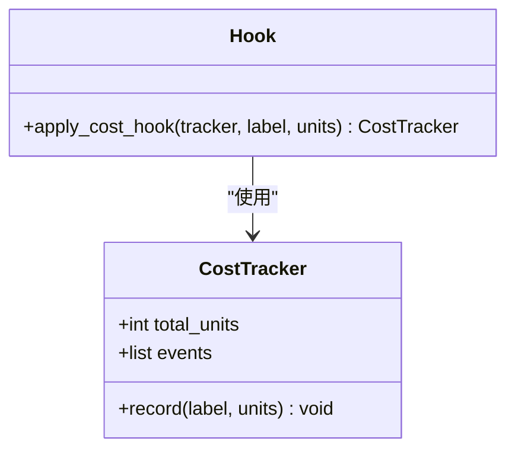

图表来源
- [src/cost_tracker.py:6-14](file://src/cost_tracker.py#L6-L14)
- [src/costHook.py:6-9](file://src/costHook.py#L6-L9)

章节来源
- [src/cost_tracker.py:6-14](file://src/cost_tracker.py#L6-L14)
- [src/costHook.py:6-9](file://src/costHook.py#L6-L9)

### Rust 权限策略引擎（PermissionPolicy）
- 权限模式
  - ReadOnly、WorkspaceWrite、DangerFullAccess、Prompt、Allow。
- 决策流程
  - 优先检查 deny 规则；随后根据钩子上下文（Allow/Deny/Ask）决定是否提示或直接放行；再检查 ask/allow 规则与当前模式与所需模式比较；最后在需要提升权限时触发提示。
- 规则匹配
  - 支持任意匹配、精确匹配、前缀匹配；从输入 JSON 中提取 subject 字段（如 command/path/url 等）进行匹配。
- 提示器接口
  - PermissionPrompter：外部可插拔的用户确认逻辑。

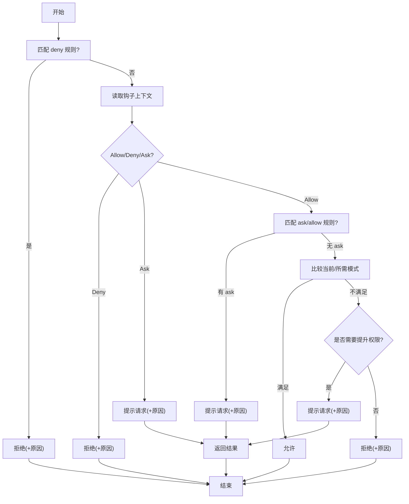

图表来源
- [rust/crates/runtime/src/permissions.rs:156-284](file://rust/crates/runtime/src/permissions.rs#L156-L284)
- [rust/crates/runtime/src/permissions.rs:318-383](file://rust/crates/runtime/src/permissions.rs#L318-L383)

章节来源
- [rust/crates/runtime/src/permissions.rs:7-35](file://rust/crates/runtime/src/permissions.rs#L7-L35)
- [rust/crates/runtime/src/permissions.rs:91-140](file://rust/crates/runtime/src/permissions.rs#L91-L140)
- [rust/crates/runtime/src/permissions.rs:156-284](file://rust/crates/runtime/src/permissions.rs#L156-L284)
- [rust/crates/runtime/src/permissions.rs:318-383](file://rust/crates/runtime/src/permissions.rs#L318-L383)

### 安全沙箱（Sandbox）
- 隔离模式
  - Off、WorkspaceOnly、AllowList；支持命名空间限制、网络隔离、文件系统隔离。
- 状态解析
  - resolve_sandbox_status_for_request：综合配置与环境能力，计算是否可用及激活状态。
- Linux 启动器
  - build_linux_sandbox_command：在 Linux 上使用 unshare 构建带多种隔离的命令启动器。
- 容器检测
  - detect_container_environment：从环境变量、容器标记文件与 cgroup 信息判断容器环境。

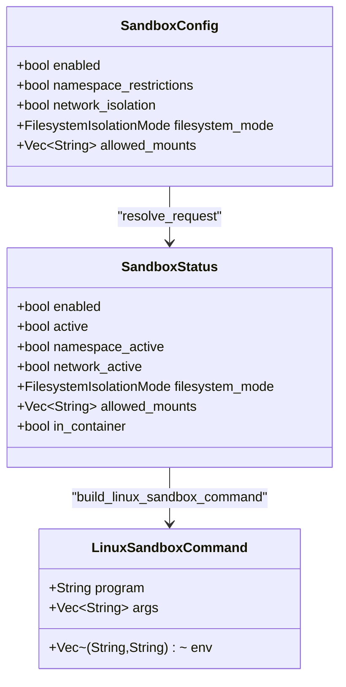

图表来源
- [rust/crates/runtime/src/sandbox.rs:27-68](file://rust/crates/runtime/src/sandbox.rs#L27-L68)
- [rust/crates/runtime/src/sandbox.rs:155-208](file://rust/crates/runtime/src/sandbox.rs#L155-L208)
- [rust/crates/runtime/src/sandbox.rs:210-262](file://rust/crates/runtime/src/sandbox.rs#L210-L262)

章节来源
- [rust/crates/runtime/src/sandbox.rs:27-68](file://rust/crates/runtime/src/sandbox.rs#L27-L68)
- [rust/crates/runtime/src/sandbox.rs:155-208](file://rust/crates/runtime/src/sandbox.rs#L155-L208)
- [rust/crates/runtime/src/sandbox.rs:210-262](file://rust/crates/runtime/src/sandbox.rs#L210-L262)

### 权限模式命令入口（/permissions）
- 功能
  - 显示或切换当前权限模式（read-only/workspace-write/danger-full-access）。
- 集成
  - 作为 SlashCommand 解析与执行，与 Rust 端的 PermissionMode 对应。

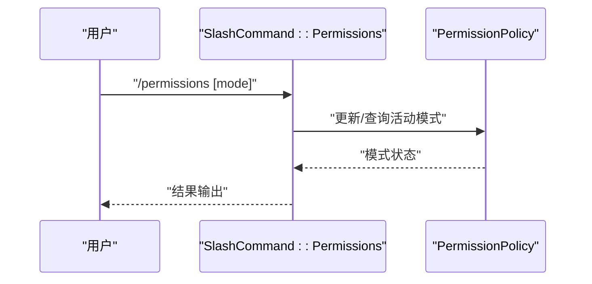

图表来源
- [rust/crates/commands/src/lib.rs:77-83](file://rust/crates/commands/src/lib.rs#L77-L83)
- [rust/crates/commands/src/lib.rs:253-255](file://rust/crates/commands/src/lib.rs#L253-L255)

章节来源
- [rust/crates/commands/src/lib.rs:77-83](file://rust/crates/commands/src/lib.rs#L77-L83)
- [rust/crates/commands/src/lib.rs:253-255](file://rust/crates/commands/src/lib.rs#L253-L255)

## 依赖关系分析
- Python 端
  - ToolPermissionContext 仅依赖标准库；ToolPool 依赖 ToolPermissionContext 与工具加载器；RuntimeSession 依赖 QueryEngine 与模型；QueryEngine 依赖会话存储与转录存储。
- Rust 端
  - PermissionPolicy 依赖配置与规则解析；Sandbox 依赖环境检测与系统命令存在性检查。
- 跨语言交互
  - Python CLI 通过工具池与运行时会话与 Rust 权限策略/沙箱解耦；权限策略与沙箱通过命令行与配置文件对接。

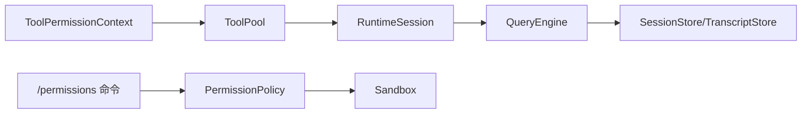

图表来源
- [src/permissions.py:6-21](file://src/permissions.py#L6-L21)
- [src/tool_pool.py:28-37](file://src/tool_pool.py#L28-L37)
- [src/runtime.py:109-152](file://src/runtime.py#L109-L152)
- [src/query_engine.py:45-59](file://src/query_engine.py#L45-L59)
- [rust/crates/runtime/src/permissions.rs:91-140](file://rust/crates/runtime/src/permissions.rs#L91-L140)
- [rust/crates/runtime/src/sandbox.rs:155-208](file://rust/crates/runtime/src/sandbox.rs#L155-L208)
- [rust/crates/commands/src/lib.rs:253-255](file://rust/crates/commands/src/lib.rs#L253-L255)

章节来源
- [src/permissions.py:6-21](file://src/permissions.py#L6-L21)
- [src/tool_pool.py:28-37](file://src/tool_pool.py#L28-L37)
- [src/runtime.py:109-152](file://src/runtime.py#L109-L152)
- [src/query_engine.py:45-59](file://src/query_engine.py#L45-L59)
- [rust/crates/runtime/src/permissions.rs:91-140](file://rust/crates/runtime/src/permissions.rs#L91-L140)
- [rust/crates/runtime/src/sandbox.rs:155-208](file://rust/crates/runtime/src/sandbox.rs#L155-L208)
- [rust/crates/commands/src/lib.rs:253-255](file://rust/crates/commands/src/lib.rs#L253-L255)

## 性能考量
- 工具筛选阶段
  - ToolPermissionContext 使用 frozenset 与元组存储拒绝集合，查找为常数级；前缀匹配遍历短数组，整体开销极低。
- 运行时决策
  - PermissionPolicy 的规则匹配采用线性扫描，规则数量有限时可忽略；建议将高频规则前置，减少平均匹配时间。
- 成本追踪
  - 事件列表增长需控制，可在达到阈值后进行压缩或持久化。
- 沙箱启动
  - Linux 启动器构建涉及系统命令检查与路径规范化，建议在启动前完成一次预检，避免运行时失败。

[本节为通用性能建议，无需特定文件来源]

## 故障排查指南
- 工具未显示或被拒绝
  - 检查 ToolPermissionContext 的 deny_names 与 deny_prefixes 是否误命中；确认 assemble_tool_pool 是否正确传入上下文。
- 运行时权限拒绝
  - 查看 TurnResult.permission_denials 是否包含目标工具；确认 runtime 的 _infer_permission_denials 逻辑是否覆盖该工具类别。
- 权限策略拒绝
  - 检查 deny/ask/allow 规则是否匹配；确认钩子上下文（Allow/Deny/Ask）是否影响了决策；必要时启用 Prompt 模式进行人工确认。
- 沙箱不可用
  - 查看 SandboxStatus.fallback_reason 是否给出具体原因（如缺少 unshare 或未配置挂载）；确认宿主平台与内核支持情况。
- 成本统计异常
  - 检查 apply_cost_hook 是否在正确位置调用；确认 CostTracker.total_units 与 events 是否按预期增长。

章节来源
- [src/permissions.py:18-21](file://src/permissions.py#L18-L21)
- [src/tool_pool.py:28-37](file://src/tool_pool.py#L28-L37)
- [src/runtime.py:169-174](file://src/runtime.py#L169-L174)
- [src/query_engine.py:93-94](file://src/query_engine.py#L93-L94)
- [rust/crates/runtime/src/permissions.rs:174-181](file://rust/crates/runtime/src/permissions.rs#L174-L181)
- [rust/crates/runtime/src/sandbox.rs:168-207](file://rust/crates/runtime/src/sandbox.rs#L168-L207)
- [src/costHook.py:6-9](file://src/costHook.py#L6-L9)
- [src/cost_tracker.py:11-14](file://src/cost_tracker.py#L11-L14)

## 结论
CLAW 的权限控制系统通过“工具筛选 + 运行时决策 + 沙箱隔离”的分层设计，在保障安全性的同时兼顾易用性与可观测性。Python 端负责快速过滤与运行时审计，Rust 端提供细粒度策略与可扩展的规则体系，二者协同实现从入口到执行的全链路权限治理。

[本节为总结性内容，无需特定文件来源]

## 附录

### 自定义权限策略开发指南与最佳实践
- 规则语法
  - 支持任意匹配（*）、精确匹配（字符串）、前缀匹配（字符串:*）；规则内容支持转义括号与反斜杠。
- 规则应用顺序
  - deny 优先于 ask/allow；钩子 Allow/Deny/Ask 优先于规则；ask 优先于模式比较。
- 最佳实践
  - 将高风险工具默认 deny，通过 ask 规则要求确认；对常用工具使用 allow 规则；利用钩子在 CI/本地环境差异化控制。
  - 为每个 ask 规则提供清晰的原因，便于审计与用户理解。
  - 在生产环境默认关闭危险模式，仅在受控场景开启。

章节来源
- [rust/crates/runtime/src/permissions.rs:342-394](file://rust/crates/runtime/src/permissions.rs#L342-L394)
- [rust/crates/runtime/src/permissions.rs:174-284](file://rust/crates/runtime/src/permissions.rs#L174-L284)

### 审计与合规
- 权限拒绝记录
  - QueryEngine 会话中记录 permission_denials 与累计用量，便于审计与合规报告。
- 会话持久化
  - 通过 persist_session 将对话与权限历史一并保存，支持后续回放与审查。

章节来源
- [src/query_engine.py:171-193](file://src/query_engine.py#L171-L193)
- [src/query_engine.py:140-150](file://src/query_engine.py#L140-L150)

### 安全威胁分析与防护
- 威胁类型
  - 未授权的高危工具执行、权限提升绕过、规则误配置导致的过度放行。
- 防护措施
  - deny 规则优先；ask 规则强制确认；钩子 Allow/Deny/Ask 严格控制；沙箱隔离高风险操作。
  - 审计日志与会话持久化确保可追溯。

章节来源
- [rust/crates/runtime/src/permissions.rs:174-181](file://rust/crates/runtime/src/permissions.rs#L174-L181)
- [rust/crates/runtime/src/sandbox.rs:168-207](file://rust/crates/runtime/src/sandbox.rs#L168-L207)
- [src/query_engine.py:171-193](file://src/query_engine.py#L171-L193)