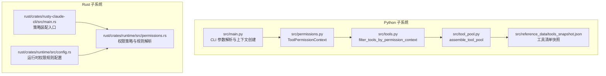
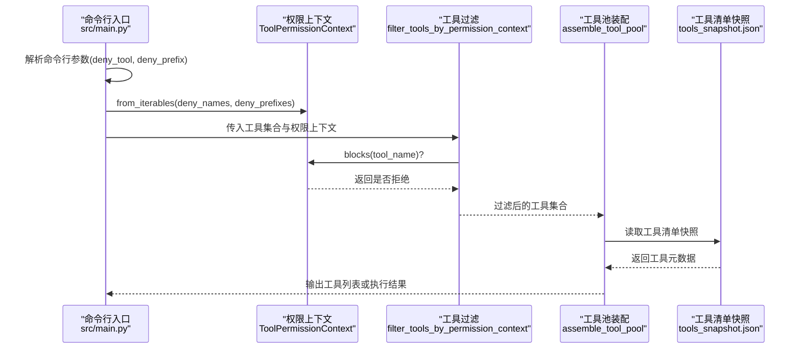
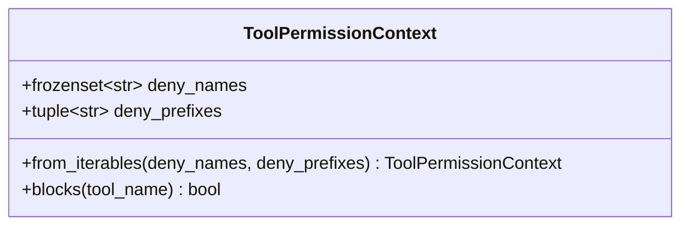
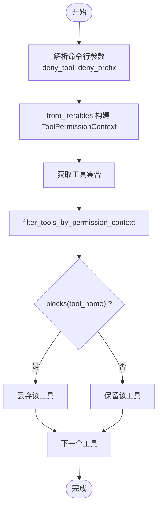
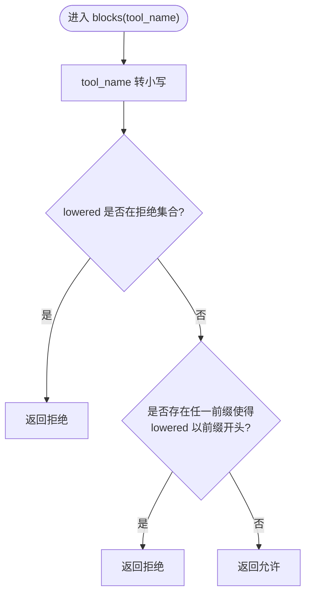
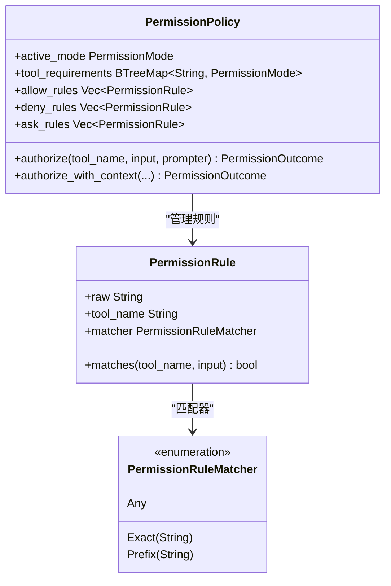
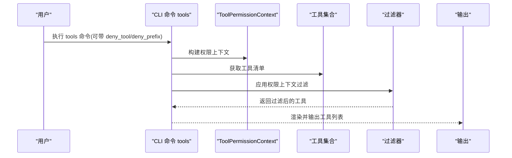
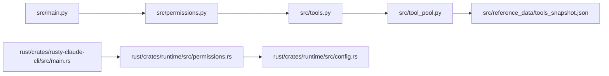

# 权限模型设计

<cite>
**本文档引用的文件**
- [src/permissions.py](file://src/permissions.py)
- [src/tools.py](file://src/tools.py)
- [src/tool_pool.py](file://src/tool_pool.py)
- [src/main.py](file://src/main.py)
- [src/reference_data/tools_snapshot.json](file://src/reference_data/tools_snapshot.json)
- [rust/crates/runtime/src/permissions.rs](file://rust/crates/runtime/src/permissions.rs)
- [rust/crates/runtime/src/config.rs](file://rust/crates/runtime/src/config.rs)
- [rust/crates/rusty-claude-cli/src/main.rs](file://rust/crates/rusty-claude-cli/src/main.rs)
</cite>

## 目录
1. [简介](#简介)
2. [项目结构](#项目结构)
3. [核心组件](#核心组件)
4. [架构总览](#架构总览)
5. [详细组件分析](#详细组件分析)
6. [依赖关系分析](#依赖关系分析)
7. [性能考量](#性能考量)
8. [故障排除指南](#故障排除指南)
9. [结论](#结论)
10. [附录](#附录)

## 简介
本文件面向 CLAW 项目的权限模型设计，重点围绕 Python 层的 ToolPermissionContext 数据结构展开，系统阐述其设计理念、实现原理与使用方式，并结合 Rust 层的权限策略与规则解析能力，给出跨语言的权限控制闭环。内容涵盖：
- ToolPermissionContext 的字段设计与冻结不可变特性
- 拒绝名单与前缀匹配算法及大小写处理策略
- 权限上下文的创建、配置与验证机制
- 在命令系统与工具系统中的应用路径
- 使用示例与最佳实践
- 与 Rust 层权限策略（含规则解析、模式判断、提示器）的集成方式

## 项目结构
CLAW 的权限相关代码主要分布在 Python 与 Rust 两个子系统中：
- Python 子系统：提供 ToolPermissionContext 用于工具过滤；通过 CLI 参数构建权限上下文并影响工具池装配。
- Rust 子系统：提供更完整的权限策略（模式、规则、提示器），支持 allow/deny/ask 规则与输入主题提取。

**图表来源**
- [src/main.py:130-141](file://src/main.py#L130-L141)
- [src/permissions.py:6-20](file://src/permissions.py#L6-L20)
- [src/tools.py:56-72](file://src/tools.py#L56-L72)
- [src/tool_pool.py:28-37](file://src/tool_pool.py#L28-L37)
- [rust/crates/runtime/src/permissions.rs:91-325](file://rust/crates/runtime/src/permissions.rs#L91-L325)
- [rust/crates/runtime/src/config.rs:495-515](file://rust/crates/runtime/src/config.rs#L495-L515)
- [rust/crates/rusty-claude-cli/src/main.rs:3738-3749](file://rust/crates/rusty-claude-cli/src/main.rs#L3738-L3749)

**章节来源**
- [src/main.py:130-141](file://src/main.py#L130-L141)
- [src/permissions.py:6-20](file://src/permissions.py#L6-L20)
- [src/tools.py:56-72](file://src/tools.py#L56-L72)
- [src/tool_pool.py:28-37](file://src/tool_pool.py#L28-L37)
- [rust/crates/runtime/src/permissions.rs:91-325](file://rust/crates/runtime/src/permissions.rs#L91-L325)
- [rust/crates/runtime/src/config.rs:495-515](file://rust/crates/runtime/src/config.rs#L495-L515)
- [rust/crates/rusty-claude-cli/src/main.rs:3738-3749](file://rust/crates/rusty-claude-cli/src/main.rs#L3738-L3749)

## 核心组件
- ToolPermissionContext（Python）
  - 字段：拒绝名称集合（冻结集合）、拒绝前缀元组
  - 方法：从可迭代构造、判断某工具名是否被拒绝
  - 设计要点：冻结不可变、大小写统一转小写、前缀匹配采用 starts-with
- 工具过滤与装配
  - 过滤函数：基于 ToolPermissionContext.blocks 对工具集合进行筛选
  - 装配函数：将过滤后的工具集合封装为 ToolPool
- CLI 集成
  - 命令行参数解析后创建 ToolPermissionContext，并传递给工具装配流程

**章节来源**
- [src/permissions.py:6-20](file://src/permissions.py#L6-L20)
- [src/tools.py:56-72](file://src/tools.py#L56-L72)
- [src/tool_pool.py:28-37](file://src/tool_pool.py#L28-L37)
- [src/main.py:130-141](file://src/main.py#L130-L141)

## 架构总览
下图展示了从 CLI 到工具装配再到权限上下文生效的整体流程，以及与 Rust 层权限策略的关系：

**图表来源**
- [src/main.py:130-141](file://src/main.py#L130-L141)
- [src/permissions.py:11-20](file://src/permissions.py#L11-L20)
- [src/tools.py:56-72](file://src/tools.py#L56-L72)
- [src/tool_pool.py:28-37](file://src/tool_pool.py#L28-L37)
- [src/reference_data/tools_snapshot.json:1-20](file://src/reference_data/tools_snapshot.json#L1-L20)

## 详细组件分析

### ToolPermissionContext 数据结构
- 冻结不可变性：使用 frozen=True，确保权限上下文一旦创建即不可修改，避免并发与误用风险
- 拒绝集合与前缀集合：分别用于精确拒绝与前缀拒绝，提升灵活性
- 大小写处理：构造时统一转为小写，比较时也统一转小写，保证匹配一致性
- 匹配逻辑：先查拒绝集合，再查前缀集合，满足“精确优先”的语义

**图表来源**
- [src/permissions.py:6-20](file://src/permissions.py#L6-L20)

**章节来源**
- [src/permissions.py:6-20](file://src/permissions.py#L6-L20)

### 权限上下文创建与配置
- CLI 创建：命令行解析 deny_tool 与 deny_prefix 后，调用 ToolPermissionContext.from_iterables 构造
- 工具过滤：filter_tools_by_permission_context 接收 ToolPermissionContext，对工具集合逐一调用 blocks 进行筛选
- 工具池装配：assemble_tool_pool 将过滤后的工具集合封装为 ToolPool，供后续展示或执行

**图表来源**
- [src/main.py:130-141](file://src/main.py#L130-L141)
- [src/permissions.py:11-20](file://src/permissions.py#L11-L20)
- [src/tools.py:56-72](file://src/tools.py#L56-L72)

**章节来源**
- [src/main.py:130-141](file://src/main.py#L130-L141)
- [src/permissions.py:11-20](file://src/permissions.py#L11-L20)
- [src/tools.py:56-72](file://src/tools.py#L56-L72)

### 权限拒绝列表与前缀匹配算法
- 拒绝列表：精确匹配工具名，命中即拒绝
- 前缀匹配：对工具名进行 starts-with 判断，支持批量拒绝以某个前缀命名的工具
- 大小写策略：全部转换为小写后再匹配，避免大小写差异导致的不一致

**图表来源**
- [src/permissions.py:18-20](file://src/permissions.py#L18-L20)

**章节来源**
- [src/permissions.py:18-20](file://src/permissions.py#L18-L20)

### Rust 层权限策略与规则解析（补充）
虽然本节重点在 Python 的 ToolPermissionContext，但 Rust 层提供了更丰富的权限策略与规则解析能力，包括：
- 权限模式（只读、工作区写、危险全权、提示、允许）
- 规则类型（允许、拒绝、询问），支持按工具名与输入主题进行匹配
- 输入主题提取：从 JSON 输入中抽取 command、path、file_path、url、pattern、code、message 等键值
- 提示器接口：在需要升级或确认时触发用户交互

**图表来源**
- [rust/crates/runtime/src/permissions.rs:91-325](file://rust/crates/runtime/src/permissions.rs#L91-L325)
- [rust/crates/runtime/src/permissions.rs:327-383](file://rust/crates/runtime/src/permissions.rs#L327-L383)

**章节来源**
- [rust/crates/runtime/src/permissions.rs:91-325](file://rust/crates/runtime/src/permissions.rs#L91-L325)
- [rust/crates/runtime/src/permissions.rs:327-383](file://rust/crates/runtime/src/permissions.rs#L327-L383)

### 权限模型在命令系统与工具系统中的应用
- 命令系统：CLI 子命令 tools 在输出工具列表前，会根据 ToolPermissionContext 过滤工具，确保仅显示未被拒绝的工具
- 工具系统：工具清单来自 tools_snapshot.json，工具池装配时会应用权限上下文，最终影响可用工具集

**图表来源**
- [src/main.py:130-141](file://src/main.py#L130-L141)
- [src/tools.py:56-72](file://src/tools.py#L56-L72)
- [src/reference_data/tools_snapshot.json:1-20](file://src/reference_data/tools_snapshot.json#L1-L20)

**章节来源**
- [src/main.py:130-141](file://src/main.py#L130-L141)
- [src/tools.py:56-72](file://src/tools.py#L56-L72)
- [src/reference_data/tools_snapshot.json:1-20](file://src/reference_data/tools_snapshot.json#L1-L20)

## 依赖关系分析
- Python 层依赖链：CLI → ToolPermissionContext → filter_tools_by_permission_context → ToolPool → 工具清单快照
- Rust 层依赖链：策略装配入口 → 权限策略与规则解析 → 运行时配置

**图表来源**
- [src/main.py:130-141](file://src/main.py#L130-L141)
- [src/permissions.py:6-20](file://src/permissions.py#L6-L20)
- [src/tools.py:56-72](file://src/tools.py#L56-L72)
- [src/tool_pool.py:28-37](file://src/tool_pool.py#L28-L37)
- [rust/crates/rusty-claude-cli/src/main.rs:3738-3749](file://rust/crates/rusty-claude-cli/src/main.rs#L3738-L3749)
- [rust/crates/runtime/src/permissions.rs:91-325](file://rust/crates/runtime/src/permissions.rs#L91-L325)
- [rust/crates/runtime/src/config.rs:495-515](file://rust/crates/runtime/src/config.rs#L495-L515)

**章节来源**
- [src/main.py:130-141](file://src/main.py#L130-L141)
- [src/permissions.py:6-20](file://src/permissions.py#L6-L20)
- [src/tools.py:56-72](file://src/tools.py#L56-L72)
- [src/tool_pool.py:28-37](file://src/tool_pool.py#L28-L37)
- [rust/crates/rusty-claude-cli/src/main.rs:3738-3749](file://rust/crates/rusty-claude-cli/src/main.rs#L3738-L3749)
- [rust/crates/runtime/src/permissions.rs:91-325](file://rust/crates/runtime/src/permissions.rs#L91-L325)
- [rust/crates/runtime/src/config.rs:495-515](file://rust/crates/runtime/src/config.rs#L495-L515)

## 性能考量
- ToolPermissionContext 的 blocks 操作为 O(n) 前缀检查，其中 n 为前缀数量；若前缀数量较多，建议限制在合理范围内
- 过滤函数对工具集合进行线性扫描，整体复杂度 O(m·n)，m 为工具数，n 为前缀数
- 大小写转换与 frozenset 查找均为常量或近似常量时间，整体开销可控
- 建议在 CLI 层尽早构建并复用 ToolPermissionContext，避免重复构造

[本节为通用性能讨论，无需列出具体文件来源]

## 故障排除指南
- 工具未出现在列表中
  - 检查 CLI 参数 deny_tool 与 deny_prefix 是否包含目标工具名或其前缀
  - 确认工具名大小写是否与快照一致（内部已统一转小写）
- 权限上下文未生效
  - 确认命令为 tools 子命令且传入了 deny_tool 或 deny_prefix
  - 检查工具清单快照是否正确加载
- 与 Rust 层策略冲突
  - 若存在更严格的 Rust 层规则（如 deny 规则），即使 Python 层允许也可能被拒绝
  - 可通过 Rust 层的 ask 规则触发提示器，或调整运行时权限规则配置

**章节来源**
- [src/main.py:130-141](file://src/main.py#L130-L141)
- [src/tools.py:56-72](file://src/tools.py#L56-L72)
- [rust/crates/runtime/src/permissions.rs:167-284](file://rust/crates/runtime/src/permissions.rs#L167-L284)

## 结论
ToolPermissionContext 以简洁的数据结构与高效的匹配算法，为 CLAW 的工具系统提供了基础而可靠的权限控制能力。通过 CLI 参数快速构建权限上下文，并在工具装配阶段应用过滤，实现了“所见即所得”的工具可见性控制。配合 Rust 层的权限策略与规则解析，形成了从 Python 到 Rust 的完整权限闭环，既满足日常使用场景，也为更复杂的权限需求预留了扩展空间。

[本节为总结性内容，无需列出具体文件来源]

## 附录

### 使用示例与最佳实践
- 示例：仅允许 BashTool 与 File* 工具
  - 步骤：deny_tool 传入除 BashTool 与 File* 外的其他工具名；deny_prefix 传入除 BashTool 与 File* 外的其他前缀
  - 注意：大小写不敏感，内部统一转小写
- 最佳实践
  - 将 deny_tool 与 deny_prefix 控制在最小必要范围，避免过度拒绝
  - 在团队协作中，建议通过配置文件或环境变量集中管理权限上下文
  - 对于高风险工具（如 BashTool），建议结合 Rust 层 ask/deny 规则进行二次校验

[本节为概念性指导，无需列出具体文件来源]