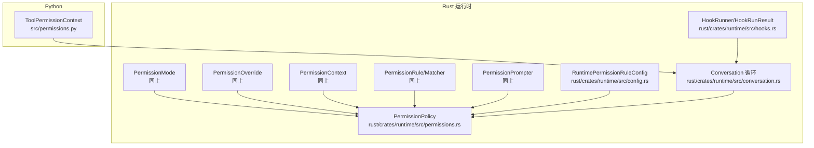
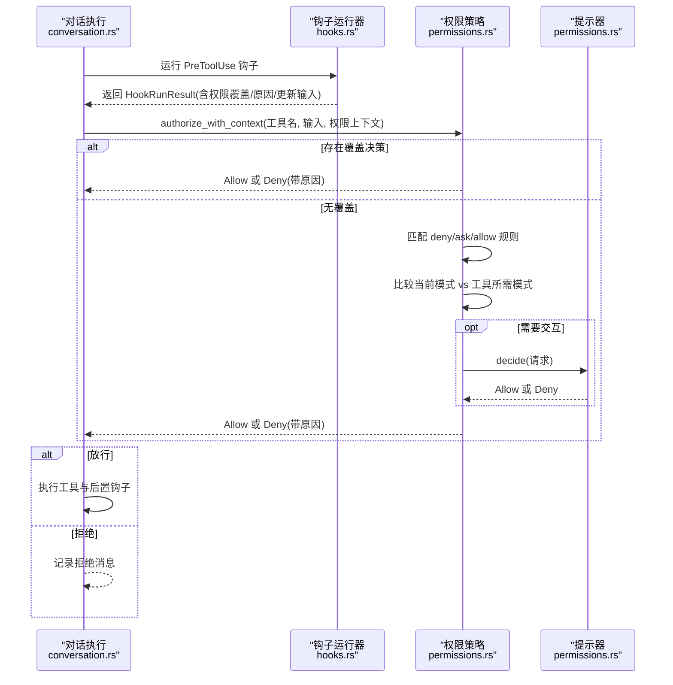
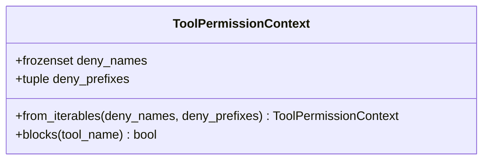
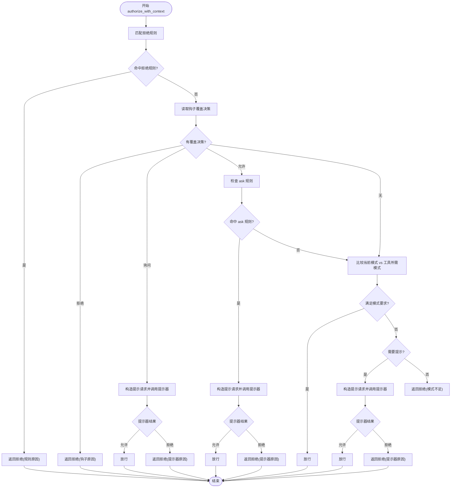
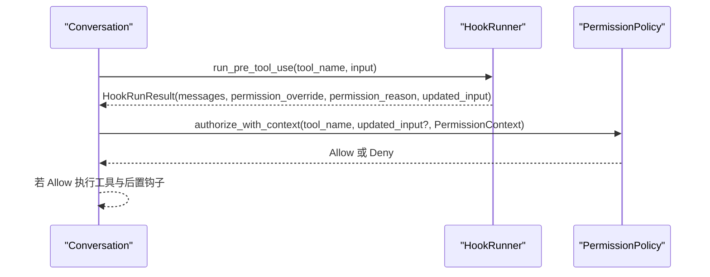
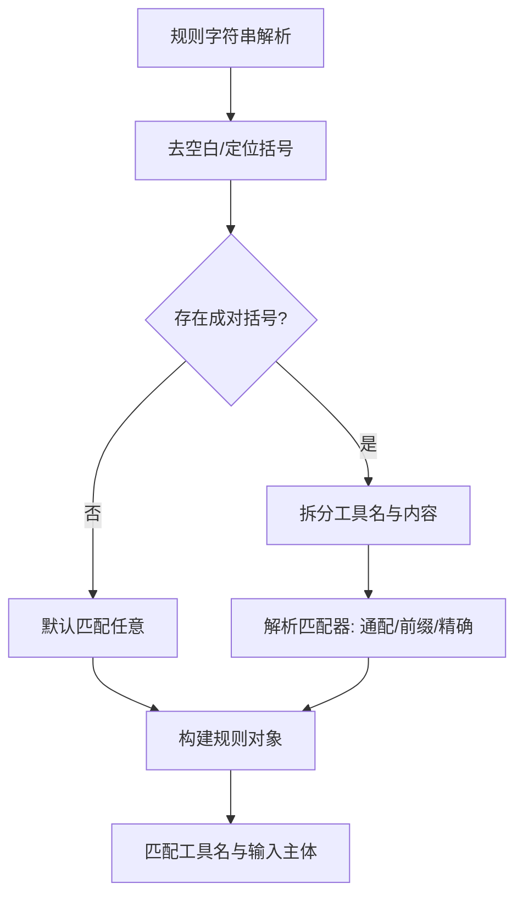
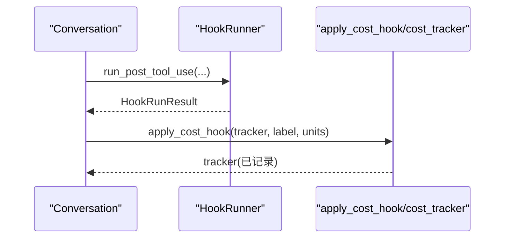
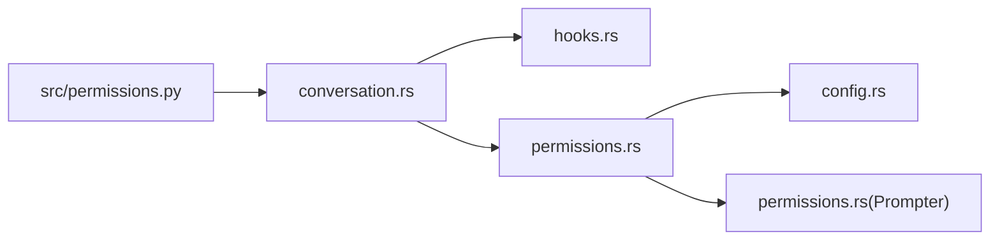

# 权限验证机制

<cite>
**本文引用的文件**
- [src/permissions.py](file://src/permissions.py)
- [rust/crates/runtime/src/permissions.rs](file://rust/crates/runtime/src/permissions.rs)
- [rust/crates/runtime/src/hooks.rs](file://rust/crates/runtime/src/hooks.rs)
- [rust/crates/runtime/src/conversation.rs](file://rust/crates/runtime/src/conversation.rs)
- [rust/crates/runtime/src/config.rs](file://rust/crates/runtime/src/config.rs)
- [src/costHook.py](file://src/costHook.py)
- [src/cost_tracker.py](file://src/cost_tracker.py)
</cite>

## 目录
1. [引言](#引言)
2. [项目结构](#项目结构)
3. [核心组件](#核心组件)
4. [架构总览](#架构总览)
5. [详细组件分析](#详细组件分析)
6. [依赖关系分析](#依赖关系分析)
7. [性能考虑](#性能考虑)
8. [故障排查指南](#故障排查指南)
9. [结论](#结论)
10. [附录](#附录)

## 引言
本文件系统性阐述 CLAW 项目的权限验证机制，覆盖执行流程、决策逻辑、规则匹配、缓存策略、触发时机、错误处理、性能优化（批量与异步）、自定义规则开发与集成，以及权限验证与成本钩子的协作方式。目标是帮助开发者在不深入源码的前提下理解并正确扩展权限体系。

## 项目结构
围绕权限验证的关键代码分布在 Python 与 Rust 两部分：
- Python 层：提供工具级权限上下文数据结构，用于描述禁止使用的工具名或前缀集合。
- Rust 层：实现完整的权限策略引擎、规则解析、提示器接口、钩子结果与权限上下文传递、对话执行中的权限决策与钩子编排。

**图表来源**
- [src/permissions.py:1-21](file://src/permissions.py#L1-L21)
- [rust/crates/runtime/src/permissions.rs:1-676](file://rust/crates/runtime/src/permissions.rs#L1-L676)
- [rust/crates/runtime/src/hooks.rs:1-200](file://rust/crates/runtime/src/hooks.rs#L1-L200)
- [rust/crates/runtime/src/conversation.rs:360-559](file://rust/crates/runtime/src/conversation.rs#L360-L559)
- [rust/crates/runtime/src/config.rs:66-71](file://rust/crates/runtime/src/config.rs#L66-L71)

**章节来源**
- [src/permissions.py:1-21](file://src/permissions.py#L1-L21)
- [rust/crates/runtime/src/permissions.rs:1-676](file://rust/crates/runtime/src/permissions.rs#L1-L676)
- [rust/crates/runtime/src/hooks.rs:1-200](file://rust/crates/runtime/src/hooks.rs#L1-L200)
- [rust/crates/runtime/src/conversation.rs:360-559](file://rust/crates/runtime/src/conversation.rs#L360-L559)
- [rust/crates/runtime/src/config.rs:66-71](file://rust/crates/runtime/src/config.rs#L66-L71)

## 核心组件
- 工具权限上下文（Python）：提供工具名与前缀的禁止集合，支持大小写不敏感匹配，便于快速判定是否阻断某工具调用。
- 权限策略引擎（Rust）：基于活动模式、工具需求模式、允许/拒绝/询问规则集进行决策；支持钩子注入的覆盖决策；可选提示器进行交互式审批。
- 钩子系统（Rust）：在工具使用前后执行外部命令，产出消息、权限覆盖、输入更新等，驱动权限上下文与后续流程。
- 对话执行循环（Rust）：在每次工具调用前运行预钩子，生成权限上下文，再由策略引擎决定是否放行；放行后执行工具与后置钩子。
- 规则配置（Rust）：允许/拒绝/询问规则以字符串形式配置，解析为规则对象并按工具名与输入主体匹配。

**章节来源**
- [src/permissions.py:6-21](file://src/permissions.py#L6-L21)
- [rust/crates/runtime/src/permissions.rs:90-325](file://rust/crates/runtime/src/permissions.rs#L90-L325)
- [rust/crates/runtime/src/hooks.rs:81-143](file://rust/crates/runtime/src/hooks.rs#L81-L143)
- [rust/crates/runtime/src/conversation.rs:360-559](file://rust/crates/runtime/src/conversation.rs#L360-L559)
- [rust/crates/runtime/src/config.rs:66-71](file://rust/crates/runtime/src/config.rs#L66-L71)

## 架构总览
下图展示从对话到工具执行的权限验证主路径，包括钩子、策略与提示器的协作。

**图表来源**
- [rust/crates/runtime/src/conversation.rs:360-559](file://rust/crates/runtime/src/conversation.rs#L360-L559)
- [rust/crates/runtime/src/hooks.rs:162-184](file://rust/crates/runtime/src/hooks.rs#L162-L184)
- [rust/crates/runtime/src/permissions.rs:167-284](file://rust/crates/runtime/src/permissions.rs#L167-L284)

## 详细组件分析

### Python 工具权限上下文
- 数据结构：冻结的工具权限上下文，包含禁止名称集合与禁止前缀元组。
- 判定逻辑：对工具名进行小写化后，判断是否命中禁止集合或前缀。
- 适用场景：作为工具注册或外部策略的一部分，快速过滤不可用工具。

**图表来源**
- [src/permissions.py:6-21](file://src/permissions.py#L6-L21)

**章节来源**
- [src/permissions.py:6-21](file://src/permissions.py#L6-L21)

### Rust 权限策略引擎
- 权限模式与覆盖：
  - 模式：只读、工作区写入、危险全权、提示、允许。
  - 覆盖：允许、拒绝、询问。
- 策略决策流程：
  - 优先匹配“拒绝”规则；若未覆盖，则比较当前模式与工具所需模式；若仍不满足且存在“询问”规则或模式不足，进入提示器流程；否则拒绝。
  - 提示器为空时，直接拒绝并返回原因。
- 规则匹配：
  - 规则语法解析为“工具名(匹配器)”；匹配器支持任意、精确匹配、前缀匹配；输入主体提取自 JSON 的常见键，或整段非空输入。
- 钩子覆盖：
  - 若钩子返回拒绝/询问/允许及原因，策略优先遵循钩子决策；允许时仍会检查 ask 规则以决定是否需要提示。

**图表来源**
- [rust/crates/runtime/src/permissions.rs:167-284](file://rust/crates/runtime/src/permissions.rs#L167-L284)
- [rust/crates/runtime/src/permissions.rs:318-383](file://rust/crates/runtime/src/permissions.rs#L318-L383)
- [rust/crates/runtime/src/permissions.rs:439-461](file://rust/crates/runtime/src/permissions.rs#L439-L461)

**章节来源**
- [rust/crates/runtime/src/permissions.rs:7-325](file://rust/crates/runtime/src/permissions.rs#L7-L325)
- [rust/crates/runtime/src/permissions.rs:318-461](file://rust/crates/runtime/src/permissions.rs#L318-L461)

### 钩子系统与权限上下文传递
- 钩子事件：工具使用前、成功后、失败后。
- 钩子输出解析：可携带消息、拒绝、权限覆盖、覆盖原因、更新后的输入。
- 在对话循环中：
  - 先运行预钩子，得到 HookRunResult；
  - 使用其中的权限覆盖与原因构建 PermissionContext；
  - 将 PermissionContext 传入策略引擎；
  - 若放行，再执行工具与后置钩子，并合并钩子反馈。

**图表来源**
- [rust/crates/runtime/src/conversation.rs:360-559](file://rust/crates/runtime/src/conversation.rs#L360-L559)
- [rust/crates/runtime/src/hooks.rs:162-184](file://rust/crates/runtime/src/hooks.rs#L162-L184)
- [rust/crates/runtime/src/permissions.rs:167-284](file://rust/crates/runtime/src/permissions.rs#L167-L284)

**章节来源**
- [rust/crates/runtime/src/hooks.rs:81-143](file://rust/crates/runtime/src/hooks.rs#L81-L143)
- [rust/crates/runtime/src/conversation.rs:360-559](file://rust/crates/runtime/src/conversation.rs#L360-L559)

### 规则配置与解析
- 规则类型：允许、拒绝、询问。
- 规则语法：工具名(匹配器)，其中匹配器支持通配、精确、前缀；括号与反斜杠转义处理。
- 输入主体提取：从 JSON 中提取 command/path/file_path/url/pattern/code/message 等键值作为匹配主体。

**图表来源**
- [rust/crates/runtime/src/permissions.rs:342-383](file://rust/crates/runtime/src/permissions.rs#L342-L383)
- [rust/crates/runtime/src/permissions.rs:385-401](file://rust/crates/runtime/src/permissions.rs#L385-L401)
- [rust/crates/runtime/src/permissions.rs:439-461](file://rust/crates/runtime/src/permissions.rs#L439-L461)

**章节来源**
- [rust/crates/runtime/src/config.rs:66-71](file://rust/crates/runtime/src/config.rs#L66-L71)
- [rust/crates/runtime/src/permissions.rs:342-461](file://rust/crates/runtime/src/permissions.rs#L342-L461)

### 成本钩子与权限验证协作
- 成本钩子：记录标签与单位，累加总消耗并维护事件列表。
- 协作方式：权限验证本身不直接操作成本，但可在工具执行前后通过钩子链路记录成本事件；例如在后置钩子中调用成本钩子函数，将工具使用产生的成本计入追踪器。

**图表来源**
- [src/costHook.py:6-8](file://src/costHook.py#L6-L8)
- [src/cost_tracker.py:11-14](file://src/cost_tracker.py#L11-L14)

**章节来源**
- [src/costHook.py:1-9](file://src/costHook.py#L1-L9)
- [src/cost_tracker.py:1-14](file://src/cost_tracker.py#L1-L14)

## 依赖关系分析
- 对话执行循环依赖钩子系统与权限策略引擎；钩子系统负责生成权限上下文与输入更新；权限策略引擎负责最终放行与否。
- 权限策略引擎依赖规则配置与提示器接口；规则配置来源于运行时配置对象。
- Python 工具权限上下文可作为外部策略输入，辅助快速阻断工具。

**图表来源**
- [rust/crates/runtime/src/conversation.rs:360-559](file://rust/crates/runtime/src/conversation.rs#L360-L559)
- [rust/crates/runtime/src/hooks.rs:162-184](file://rust/crates/runtime/src/hooks.rs#L162-L184)
- [rust/crates/runtime/src/permissions.rs:90-325](file://rust/crates/runtime/src/permissions.rs#L90-L325)
- [rust/crates/runtime/src/config.rs:66-71](file://rust/crates/runtime/src/config.rs#L66-L71)
- [src/permissions.py:6-21](file://src/permissions.py#L6-L21)

**章节来源**
- [rust/crates/runtime/src/conversation.rs:360-559](file://rust/crates/runtime/src/conversation.rs#L360-L559)
- [rust/crates/runtime/src/hooks.rs:162-184](file://rust/crates/runtime/src/hooks.rs#L162-L184)
- [rust/crates/runtime/src/permissions.rs:90-325](file://rust/crates/runtime/src/permissions.rs#L90-L325)
- [rust/crates/runtime/src/config.rs:66-71](file://rust/crates/runtime/src/config.rs#L66-L71)
- [src/permissions.py:6-21](file://src/permissions.py#L6-L21)

## 性能考虑
- 规则匹配复杂度
  - 当前实现对规则列表进行线性扫描，时间复杂度 O(R)；若规则量较大，建议：
    - 合理组织规则顺序，将高频/高命中率规则前置；
    - 对工具名建立索引（如哈希表）以减少不必要的规则遍历；
    - 将规则解析结果缓存，避免重复解析相同字符串。
- 输入主体提取
  - JSON 解析与键遍历为 O(K)（K 为键数量），建议：
    - 对热点输入采用缓存或延迟解析；
    - 限制输入大小或仅在必要时解析。
- 提示器调用
  - 提示器可能阻塞执行，建议：
    - 异步提示器实现，避免阻塞主线程；
    - 批量收集待提示请求，统一弹窗或批处理确认。
- 钩子执行
  - 外部进程调用开销较高，建议：
    - 合并同类钩子，减少进程启动次数；
    - 对钩子输出进行缓存（如基于输入哈希）。
- Python 上下文
  - 冻结集合与元组访问为常数时间，适合高频判定；注意避免频繁重建上下文。

[本节为通用性能建议，无需特定文件引用]

## 故障排查指南
- 常见问题与定位
  - 工具被意外拒绝：检查工具所需模式与当前活动模式；核对是否存在拒绝规则或模式不足。
  - 交互提示未出现：确认当前模式是否为提示模式，或是否存在 ask 规则；检查提示器是否可用。
  - 钩子覆盖无效：确认钩子输出是否正确设置权限覆盖与原因；注意覆盖优先级高于其他因素。
  - 规则不生效：检查规则语法与转义字符；确认工具名与输入主体提取是否符合预期。
- 排查步骤
  - 打印权限上下文与策略决策路径；
  - 分别验证规则匹配与模式比较分支；
  - 检查钩子输出的消息、覆盖与输入更新字段；
  - 对比不同输入主体提取结果，确认 JSON 键是否正确。
- 相关实现参考
  - 权限策略决策与提示器调用路径；
  - 规则解析与主体提取逻辑；
  - 钩子输出解析与合并逻辑。

**章节来源**
- [rust/crates/runtime/src/permissions.rs:167-316](file://rust/crates/runtime/src/permissions.rs#L167-L316)
- [rust/crates/runtime/src/permissions.rs:342-461](file://rust/crates/runtime/src/permissions.rs#L342-L461)
- [rust/crates/runtime/src/hooks.rs:507-523](file://rust/crates/runtime/src/hooks.rs#L507-L523)

## 结论
CLAW 的权限验证机制以 Rust 实现为核心，结合钩子系统与规则配置，形成“钩子覆盖 + 规则匹配 + 模式比较 + 可选提示”的多层保障。Python 层的工具权限上下文提供轻量的工具级阻断能力。整体设计清晰、扩展性强，既支持静态规则，也支持动态钩子干预与交互提示。通过合理的规则组织、输入缓存与异步化提示器，可进一步提升性能与用户体验。

## 附录

### 自定义验证规则开发指南
- 规则格式
  - 工具名(匹配器)：工具名必填；匹配器支持：
    - 通配：* 表示任意；
    - 精确：具体字符串；
    - 前缀：以 :* 结尾的前缀匹配。
  - 转义：括号与反斜杠需正确转义。
- 主体提取
  - 从 JSON 输入中优先提取 command/path/file_path/url/pattern/code/message 等键；若无有效键，使用整段非空输入。
- 集成方式
  - 在运行时配置中添加 allow/deny/ask 规则列表；
  - 策略引擎加载配置后自动解析并参与决策。
- 最佳实践
  - 将高风险命令（如 rm -rf、格式化磁盘）放入拒绝规则；
  - 对可接受但需审阅的命令（如 git 操作）使用询问规则；
  - 使用前缀匹配限定参数范围，避免误伤。

**章节来源**
- [rust/crates/runtime/src/config.rs:66-71](file://rust/crates/runtime/src/config.rs#L66-L71)
- [rust/crates/runtime/src/permissions.rs:342-461](file://rust/crates/runtime/src/permissions.rs#L342-L461)

### 批量验证与异步处理建议
- 批量验证
  - 将多个工具调用请求排队，统一生成权限上下文与输入更新；
  - 合并提示器请求，一次性弹窗确认。
- 异步处理
  - 提示器实现为异步接口，主线程轮询结果；
  - 钩子执行使用异步任务池，避免阻塞。
- 缓存策略
  - 规则解析结果缓存；
  - 输入主体提取结果缓存；
  - 钩子输出按输入哈希缓存。

[本节为通用建议，无需特定文件引用]