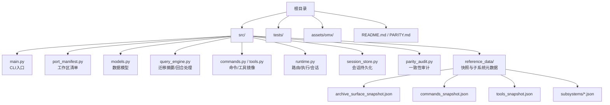
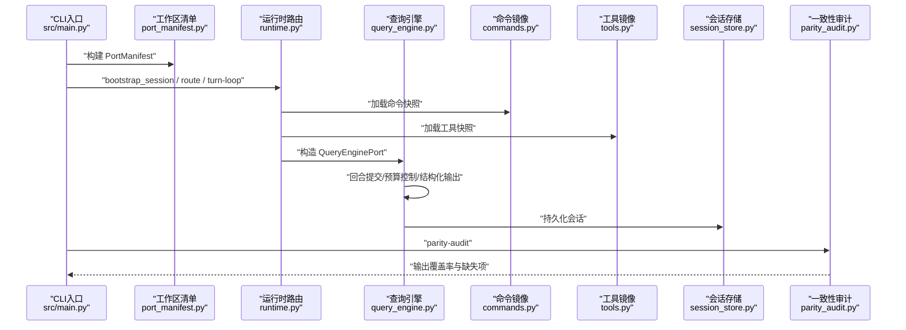
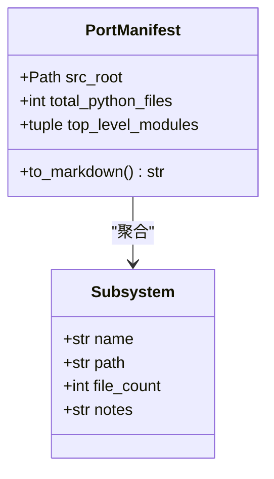
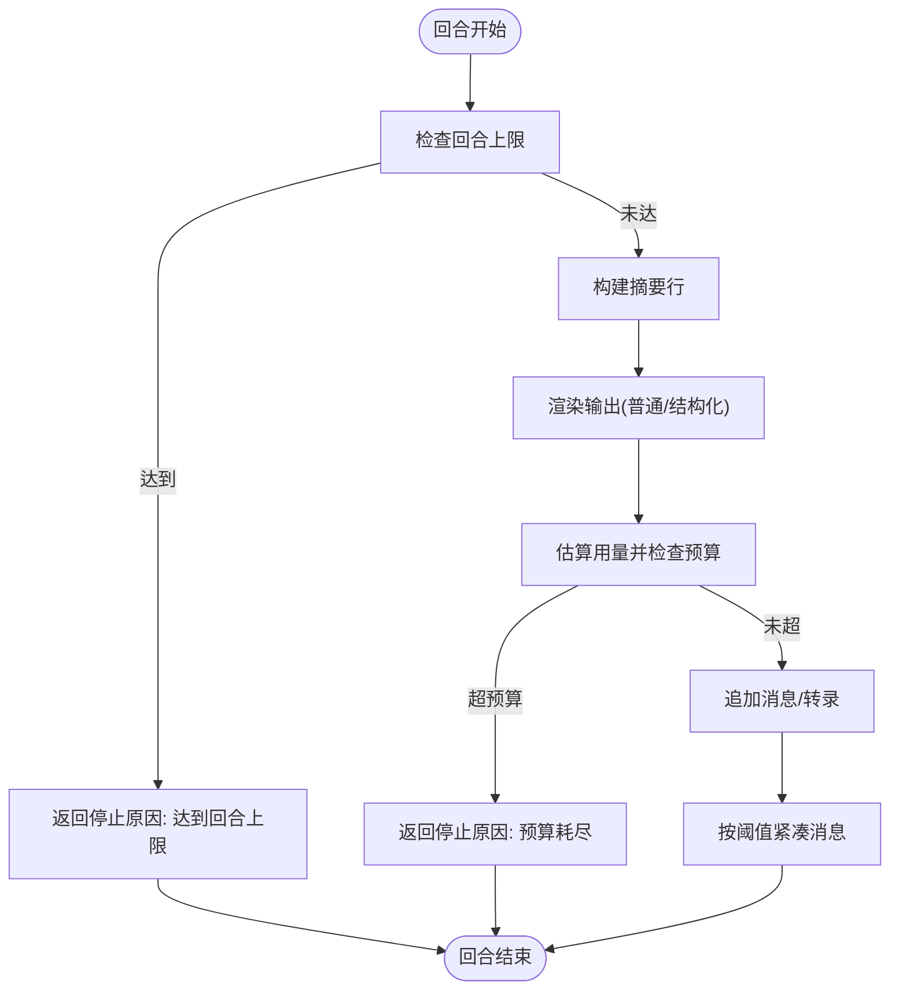
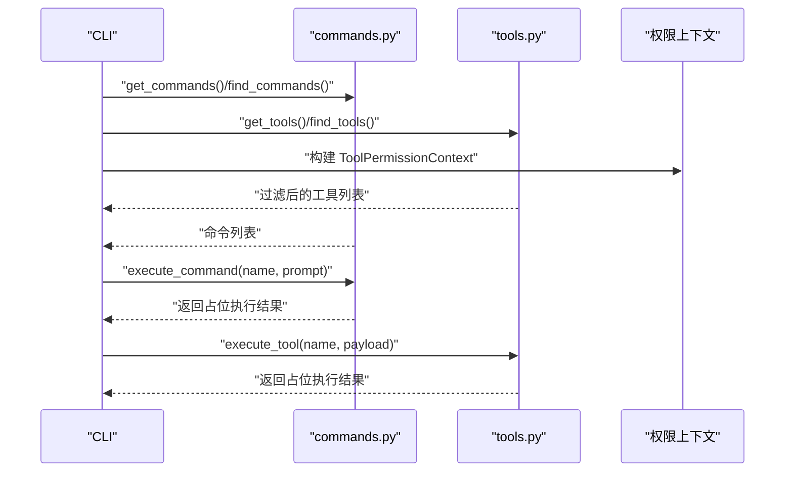
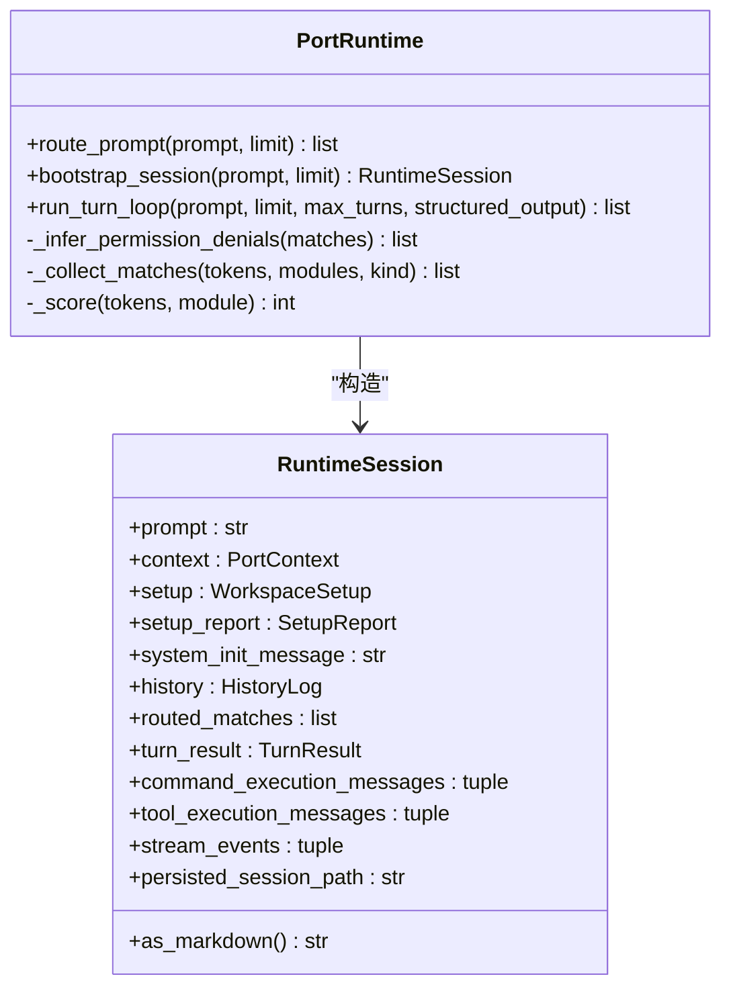
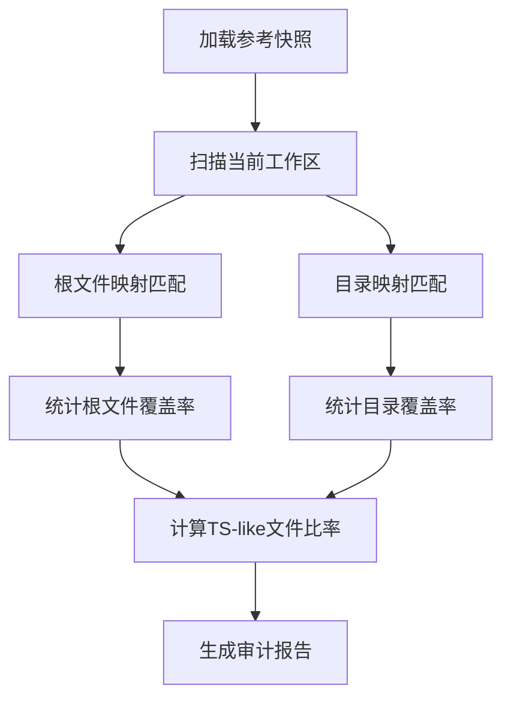
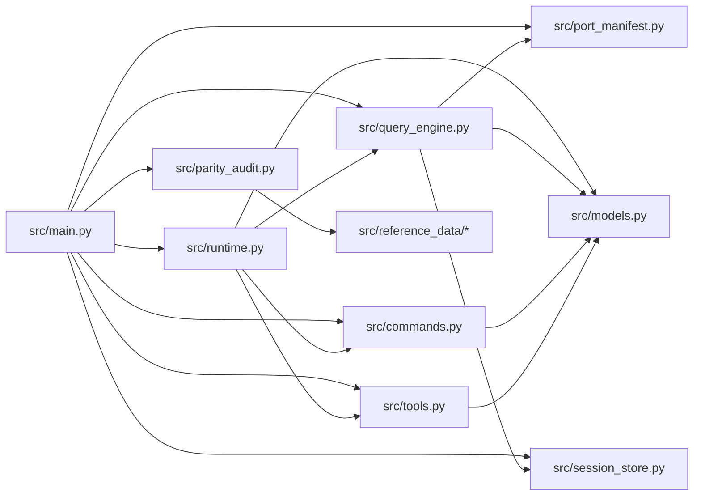

# 代码迁移原理

<cite>
**本文引用的文件**
- [README.md](file://README.md)
- [PARITY.md](file://PARITY.md)
- [src/main.py](file://src/main.py)
- [src/port_manifest.py](file://src/port_manifest.py)
- [src/models.py](file://src/models.py)
- [src/query_engine.py](file://src/query_engine.py)
- [src/parity_audit.py](file://src/parity_audit.py)
- [src/reference_data/archive_surface_snapshot.json](file://src/reference_data/archive_surface_snapshot.json)
- [src/commands.py](file://src/commands.py)
- [src/tools.py](file://src/tools.py)
- [src/runtime.py](file://src/runtime.py)
- [src/session_store.py](file://src/session_store.py)
- [src/migrations/__init__.py](file://src/migrations/__init__.py)
- [src/native_ts/__init__.py](file://src/native_ts/__init__.py)
</cite>

## 目录
1. [引言](#引言)
2. [项目结构](#项目结构)
3. [核心组件](#核心组件)
4. [架构总览](#架构总览)
5. [详细组件分析](#详细组件分析)
6. [依赖关系分析](#依赖关系分析)
7. [性能考量](#性能考量)
8. [故障排查指南](#故障排查指南)
9. [结论](#结论)
10. [附录](#附录)

## 引言
本文件系统性阐述 CLAW 项目中从 TypeScript 到 Python 的代码迁移与重构原理。CLAW 的目标是“在不复制原始专有源码的前提下，保留其架构模式与运行时行为”，通过 Python 清洗重写的方式，构建一个可验证、可审计、可扩展的代理工作台原型。本文聚焦于迁移过程中的转换算法、语法与语义映射、质量保证策略、一致性检查与回归测试体系，并结合实际代码路径给出迁移工具的工作原理与配置选项，帮助开发者高效完成迁移并规避常见陷阱。

## 项目结构
仓库采用“Python 首位”的组织方式，核心迁移工作集中在 src/ 目录，配套参考数据与快照用于比对与审计；tests/ 提供验证用例；README.md 与 PARITY.md 描述迁移背景、现状与差距。

- 核心目录与职责
  - src/：Python 迁移工作区，包含迁移清单、查询引擎、命令/工具镜像、运行时路由、会话持久化等模块
  - src/reference_data/：来自 TypeScript 源的快照与子系统元数据，用于一致性审计
  - tests/：迁移后 Python 工作区的验证用例
  - assets/omx/：迁移过程中的工作流截图（非代码）
  - README.md / PARITY.md：迁移背景、现状与差距说明

图表来源
- [src/main.py:1-214](file://src/main.py#L1-L214)
- [src/port_manifest.py:1-53](file://src/port_manifest.py#L1-L53)
- [src/models.py:1-50](file://src/models.py#L1-L50)
- [src/query_engine.py:1-194](file://src/query_engine.py#L1-L194)
- [src/commands.py:1-91](file://src/commands.py#L1-L91)
- [src/tools.py:1-97](file://src/tools.py#L1-L97)
- [src/runtime.py:1-193](file://src/runtime.py#L1-L193)
- [src/session_store.py:1-36](file://src/session_store.py#L1-L36)
- [src/reference_data/archive_surface_snapshot.json:1-63](file://src/reference_data/archive_surface_snapshot.json#L1-L63)

章节来源
- [README.md:82-131](file://README.md#L82-L131)
- [src/main.py:21-91](file://src/main.py#L21-L91)

## 核心组件
- 迁移清单与工作区概览
  - port_manifest.py：扫描 src/ 下顶层模块，统计文件数量，生成 PortManifest，作为 Python 工作区的“清单”
  - models.py：定义 Subsystem、PortingModule、UsageSummary 等数据结构，支撑迁移建模与统计
- 查询引擎与回合处理
  - query_engine.py：封装 QueryEnginePort，负责回合提交、令牌预算控制、结构化输出渲染、会话转录与持久化
- 命令与工具镜像
  - commands.py / tools.py：加载参考快照，提供命令/工具索引、过滤、执行占位与权限上下文
- 运行时路由与会话
  - runtime.py：基于提示词分词匹配命令/工具，组装 RuntimeSession，驱动查询引擎并持久化会话
- 一致性审计
  - parity_audit.py：读取参考快照，计算根文件覆盖、目录覆盖、命令/工具条目覆盖率，输出审计报告
- 会话存储
  - session_store.py：以 JSON 形式保存会话消息与用量统计，支持加载/保存

章节来源
- [src/port_manifest.py:30-53](file://src/port_manifest.py#L30-L53)
- [src/models.py:6-50](file://src/models.py#L6-L50)
- [src/query_engine.py:15-194](file://src/query_engine.py#L15-L194)
- [src/commands.py:22-91](file://src/commands.py#L22-L91)
- [src/tools.py:23-97](file://src/tools.py#L23-L97)
- [src/runtime.py:89-193](file://src/runtime.py#L89-L193)
- [src/parity_audit.py:121-139](file://src/parity_audit.py#L121-L139)
- [src/session_store.py:19-36](file://src/session_store.py#L19-L36)

## 架构总览
下图展示了从 CLI 入口到查询引擎、命令/工具镜像、运行时路由与会话持久化的整体流程，以及与参考快照的对比关系。

图表来源
- [src/main.py:94-214](file://src/main.py#L94-L214)
- [src/port_manifest.py:30-53](file://src/port_manifest.py#L30-L53)
- [src/runtime.py:109-152](file://src/runtime.py#L109-L152)
- [src/query_engine.py:45-151](file://src/query_engine.py#L45-L151)
- [src/commands.py:22-46](file://src/commands.py#L22-L46)
- [src/tools.py:23-42](file://src/tools.py#L23-L42)
- [src/session_store.py:19-36](file://src/session_store.py#L19-L36)
- [src/parity_audit.py:121-139](file://src/parity_audit.py#L121-L139)

## 详细组件分析

### 组件一：迁移清单与工作区概览（port_manifest.py）
- 职责
  - 扫描 src/ 顶层模块，统计文件数，生成 Subsystem 列表与 PortManifest
  - 提供 to_markdown() 输出人类可读的清单
- 关键点
  - 使用 Counter 对第一层目录/文件进行计数
  - 通过 notes 字典为特定文件赋予注释（如 CLI 入口、清单生成器等）

图表来源
- [src/port_manifest.py:12-53](file://src/port_manifest.py#L12-L53)
- [src/models.py:6-12](file://src/models.py#L6-L12)

章节来源
- [src/port_manifest.py:30-53](file://src/port_manifest.py#L30-L53)
- [src/models.py:6-12](file://src/models.py#L6-L12)

### 组件二：查询引擎与回合处理（query_engine.py）
- 职责
  - QueryEnginePort：封装回合提交、预算控制、结构化输出渲染、会话转录与持久化
  - 支持流式事件（message_start/message_delta/message_stop）与非流式摘要
- 关键点
  - 配置项：最大回合数、预算令牌、紧凑阈值、结构化输出开关与重试次数
  - 用量统计：UsageSummary 基于词数估算输入/输出令牌
  - 结构化输出：失败重试并抛出异常，确保输出可解析

图表来源
- [src/query_engine.py:61-104](file://src/query_engine.py#L61-L104)
- [src/query_engine.py:129-139](file://src/query_engine.py#L129-L139)
- [src/query_engine.py:152-170](file://src/query_engine.py#L152-L170)

章节来源
- [src/query_engine.py:15-194](file://src/query_engine.py#L15-L194)
- [src/models.py:28-38](file://src/models.py#L28-L38)

### 组件三：命令与工具镜像（commands.py / tools.py）
- 职责
  - 加载参考快照（commands_snapshot.json / tools_snapshot.json），构建 PortingModule 列表
  - 提供查询、过滤、执行占位与权限上下文
- 关键点
  - 命令/工具名称大小写不敏感匹配
  - 权限上下文可屏蔽特定工具或前缀
  - 执行为“镜像占位”：打印将要执行的动作描述，便于后续替换为真实实现

图表来源
- [src/commands.py:52-81](file://src/commands.py#L52-L81)
- [src/tools.py:81-87](file://src/tools.py#L81-L87)
- [src/tools.py:56-60](file://src/tools.py#L56-L60)

章节来源
- [src/commands.py:22-91](file://src/commands.py#L22-L91)
- [src/tools.py:23-97](file://src/tools.py#L23-L97)

### 组件四：运行时路由与会话（runtime.py）
- 职责
  - 将用户提示词分词，匹配命令与工具，生成 RoutedMatch 列表
  - 组装 RuntimeSession，记录上下文、设置、历史、执行消息与流事件
  - 驱动查询引擎并持久化会话
- 关键点
  - 匹配评分：基于名称、来源提示与职责文本的关键词命中计数
  - 权限推断：对高危工具（如 Bash）进行默认拒绝
  - 会话持久化：调用 session_store 保存消息与用量

图表来源
- [src/runtime.py:89-193](file://src/runtime.py#L89-L193)

章节来源
- [src/runtime.py:89-193](file://src/runtime.py#L89-L193)

### 组件五：一致性审计（parity_audit.py）
- 职责
  - 读取参考快照（archive_surface_snapshot.json、commands_snapshot.json、tools_snapshot.json）
  - 计算根文件覆盖、目录覆盖、命令/工具条目覆盖率
  - 生成 Markdown 审计报告，列出缺失项
- 关键点
  - ARCHIVE_ROOT_FILES 与 ARCHIVE_DIR_MAPPINGS 映射 TS 文件/目录到 Python 名称
  - 缺失项检测：当前工作区是否存在对应文件/目录

图表来源
- [src/parity_audit.py:121-139](file://src/parity_audit.py#L121-L139)
- [src/reference_data/archive_surface_snapshot.json:1-63](file://src/reference_data/archive_surface_snapshot.json#L1-63)

章节来源
- [src/parity_audit.py:121-139](file://src/parity_audit.py#L121-L139)
- [src/reference_data/archive_surface_snapshot.json:1-63](file://src/reference_data/archive_surface_snapshot.json#L1-63)

### 组件六：会话存储（session_store.py）
- 职责
  - 以 JSON 序列化保存 StoredSession（包含 session_id、messages、input_tokens、output_tokens）
  - 提供 save_session 与 load_session
- 关键点
  - 默认会话目录 .port_sessions
  - 数据类序列化使用 asdict

章节来源
- [src/session_store.py:19-36](file://src/session_store.py#L19-L36)

### 组件七：占位包（migrations / native_ts）
- 职责
  - 读取 reference_data/subsystems 下的 JSON 快照，导出 ARCHIVE_NAME、MODULE_COUNT、SAMPLE_FILES、PORTING_NOTE
  - 作为已归档子系统的占位包，便于统一处理与审计
- 关键点
  - 通过 Path.resolve() 定位快照文件
  - 导出 __all__ 以明确公共接口

章节来源
- [src/migrations/__init__.py:1-17](file://src/migrations/__init__.py#L1-L17)
- [src/native_ts/__init__.py:1-17](file://src/native_ts/__init__.py#L1-L17)

## 依赖关系分析
- 模块耦合
  - main.py 作为 CLI 入口，依赖 port_manifest、runtime、query_engine、commands、tools、parity_audit、session_store 等
  - runtime.py 依赖 commands、tools、query_engine、models、setup、system_init、execution_registry
  - query_engine.py 依赖 models、port_manifest、session_store、transcript
  - commands.py / tools.py 依赖 models、reference_data 快照
  - parity_audit.py 依赖 reference_data 快照与当前工作区
- 外部依赖
  - Python 标准库（json、pathlib、argparse、functools.lru_cache 等）
  - 无第三方运行时依赖，便于移植与审计

图表来源
- [src/main.py:5-18](file://src/main.py#L5-L18)
- [src/runtime.py:5-14](file://src/runtime.py#L5-L14)
- [src/query_engine.py:7-13](file://src/query_engine.py#L7-L13)
- [src/commands.py:8](file://src/commands.py#L8)
- [src/tools.py:8-9](file://src/tools.py#L8-L9)
- [src/parity_audit.py:7-11](file://src/parity_audit.py#L7-L11)

章节来源
- [src/main.py:5-18](file://src/main.py#L5-L18)
- [src/runtime.py:5-14](file://src/runtime.py#L5-L14)
- [src/query_engine.py:7-13](file://src/query_engine.py#L7-L13)
- [src/commands.py:8](file://src/commands.py#L8)
- [src/tools.py:8-9](file://src/tools.py#L8-L9)
- [src/parity_audit.py:7-11](file://src/parity_audit.py#L7-L11)

## 性能考量
- 时间复杂度
  - 清单构建：扫描所有 Python 文件，时间复杂度 O(N)，N 为文件总数
  - 命令/工具查询：线性遍历快照，时间复杂度 O(M)，M 为条目数
  - 路由匹配：对每个模块进行分词评分，最坏 O(K×M)，K 为提示词分词数
  - 会话持久化：序列化/反序列化 JSON，时间复杂度 O(L)，L 为消息长度
- 空间复杂度
  - 快照缓存：LRU 缓存，避免重复读取
  - 用量统计：常量级空间
- 优化建议
  - 对命令/工具快照启用更高效的索引（如倒排索引）以降低查询成本
  - 在路由阶段引入阈值剪枝，减少无效匹配
  - 结构化输出渲染失败重试仅在必要时触发，避免频繁重试

## 故障排查指南
- CLI 子命令错误
  - 现象：未知命令或参数错误
  - 排查：确认子命令是否在 build_parser 中注册，参数范围是否正确
  - 参考路径：[src/main.py:21-91](file://src/main.py#L21-L91)
- 会话持久化失败
  - 现象：保存/加载 JSON 抛出异常
  - 排查：检查 .port_sessions 目录权限与磁盘空间；确认 StoredSession 字段完整
  - 参考路径：[src/session_store.py:19-36](file://src/session_store.py#L19-L36)
- 结构化输出渲染失败
  - 现象：渲染 JSON 失败并抛出异常
  - 排查：检查 payload 是否包含不可序列化对象；查看重试逻辑是否生效
  - 参考路径：[src/query_engine.py:161-170](file://src/query_engine.py#L161-L170)
- 权限拒绝与路由偏差
  - 现象：某些工具被默认拒绝或未匹配预期命令/工具
  - 排查：检查 ToolPermissionContext 的 deny_tool/deny_prefix；调整路由评分阈值
  - 参考路径：[src/runtime.py:169-174](file://src/runtime.py#L169-L174)

章节来源
- [src/main.py:21-91](file://src/main.py#L21-L91)
- [src/session_store.py:19-36](file://src/session_store.py#L19-L36)
- [src/query_engine.py:161-170](file://src/query_engine.py#L161-L170)
- [src/runtime.py:169-174](file://src/runtime.py#L169-L174)

## 结论
CLAW 的迁移以“镜像占位 + 清洗重写”为核心策略：通过参考快照建立一致性的命令/工具表面，利用查询引擎与运行时路由模拟原系统的行为，辅以清单、审计与会话持久化保障可追溯性与可验证性。尽管当前 Python 工作区尚未达到 TypeScript 的功能完备性，但其核心运行时与迁移工具已形成闭环，具备良好的扩展性与可维护性。后续可在真实执行层逐步替换占位实现，同时完善服务生态与插件/钩子系统，以达成更高等级的功能对齐。

## 附录

### 迁移工具与配置选项（CLI）
- 常用命令
  - summary：渲染 Python 迁移工作区摘要
  - manifest：打印当前工作区清单
  - parity-audit：与本地 TypeScript 快照进行一致性审计
  - setup-report：渲染启动/预取设置报告
  - command-graph / tool-pool / bootstrap-graph：展示命令图谱、工具池与引导图谱
  - subsystems：列出当前 Python 模块（支持 --limit）
  - commands / tools：列出镜像命令/工具（支持 --limit、--query、过滤选项）
  - route / bootstrap / turn-loop：路由提示词、引导会话与回合循环
  - flush-transcript / load-session：持久化与加载会话
  - remote-mode / ssh-mode / teleport-mode / direct-connect-mode / deep-link-mode：远程分支模拟
  - show-command / show-tool / exec-command / exec-tool：查看与执行镜像条目

章节来源
- [README.md:112-149](file://README.md#L112-L149)
- [src/main.py:21-214](file://src/main.py#L21-L214)

### 迁移质量保证与一致性检查
- 参考快照
  - archive_surface_snapshot.json：TS 文件/目录表面与条目计数
  - commands_snapshot.json / tools_snapshot.json：命令/工具镜像条目
- 审计维度
  - 根文件覆盖、目录覆盖、TS-like 文件比率、命令/工具条目覆盖率
  - 缺失项清单：根目标与目录目标
- 差距说明（Rust 端）
  - PARITY.md 展示了 Rust 实现与 TypeScript 的差距，包括插件、钩子、CLI 广度、技能系统、服务生态等方面

章节来源
- [src/reference_data/archive_surface_snapshot.json:1-63](file://src/reference_data/archive_surface_snapshot.json#L1-63)
- [src/parity_audit.py:121-139](file://src/parity_audit.py#L121-L139)
- [PARITY.md:1-215](file://PARITY.md#L1-L215)

### 类型系统差异、异步模型与模块系统映射
- 类型系统差异
  - TypeScript 的强类型在 Python 中通过数据类与注解表达，运行时不做严格校验；建议在迁移过程中补充类型注解与静态检查
- 异步模型
  - 当前 Python 实现为同步；若需异步，可引入 asyncio 与异步工具/命令适配器
- 模块系统映射
  - 通过 reference_data 下的快照与占位包（migrations、native_ts）统一管理归档子系统，便于后续替换实现

章节来源
- [src/models.py:6-50](file://src/models.py#L6-L50)
- [src/migrations/__init__.py:1-17](file://src/migrations/__init__.py#L1-L17)
- [src/native_ts/__init__.py:1-17](file://src/native_ts/__init__.py#L1-L17)