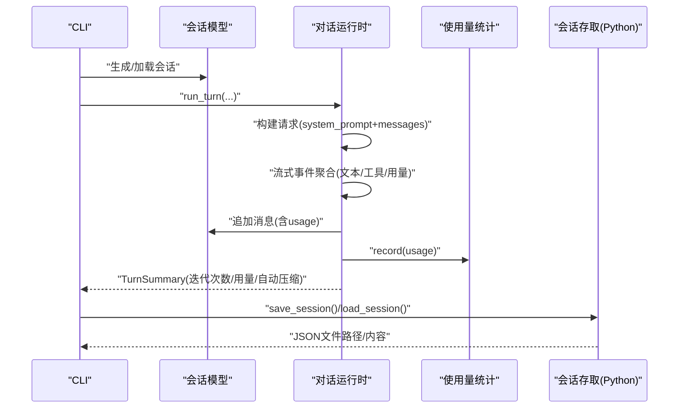
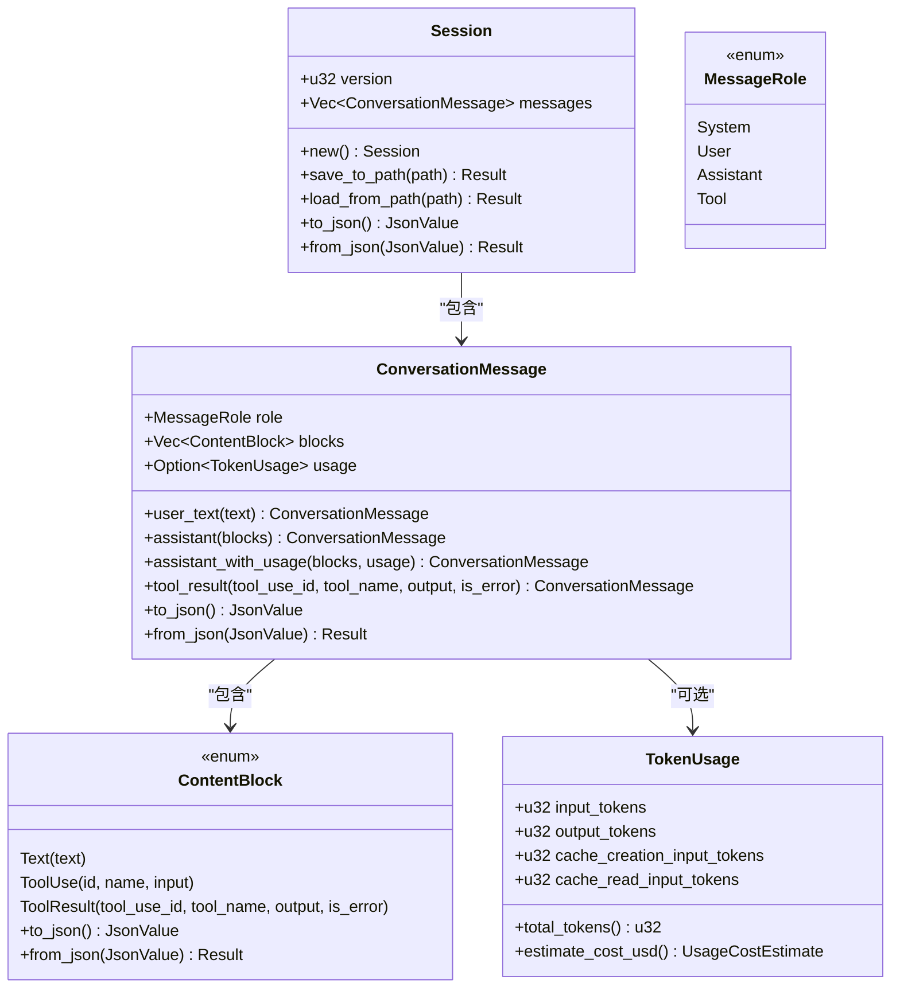
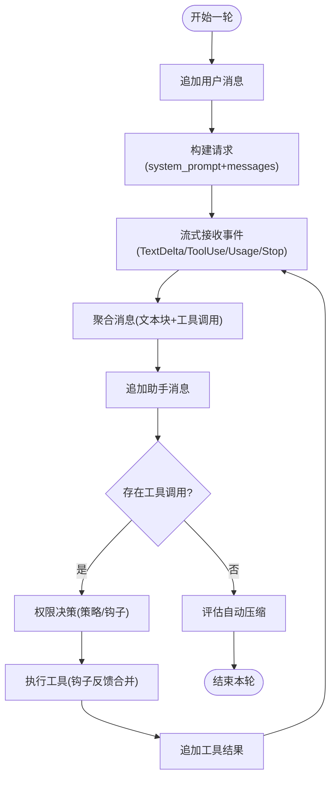
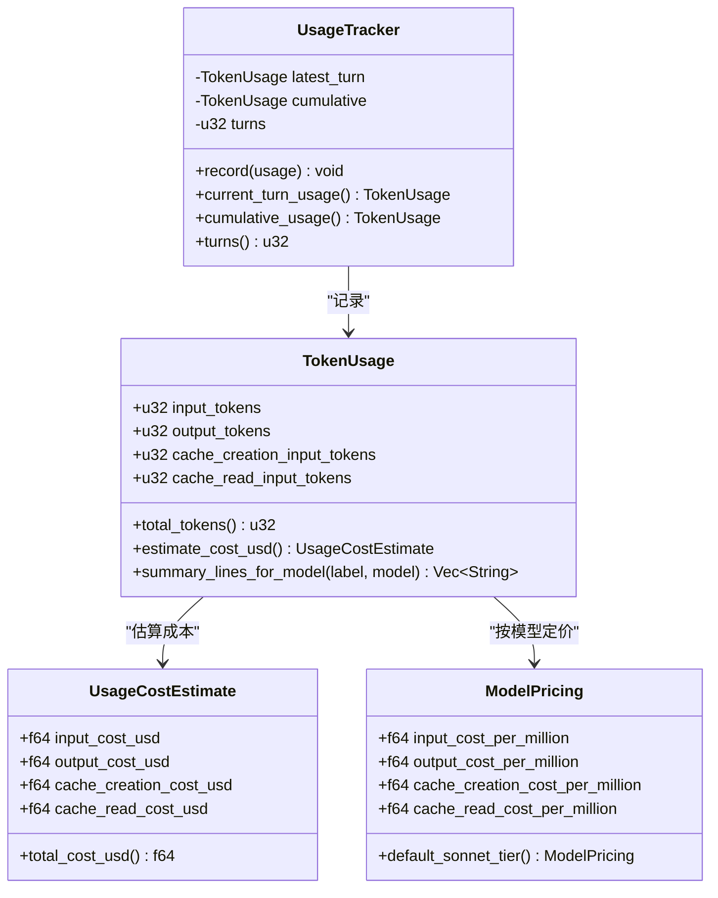
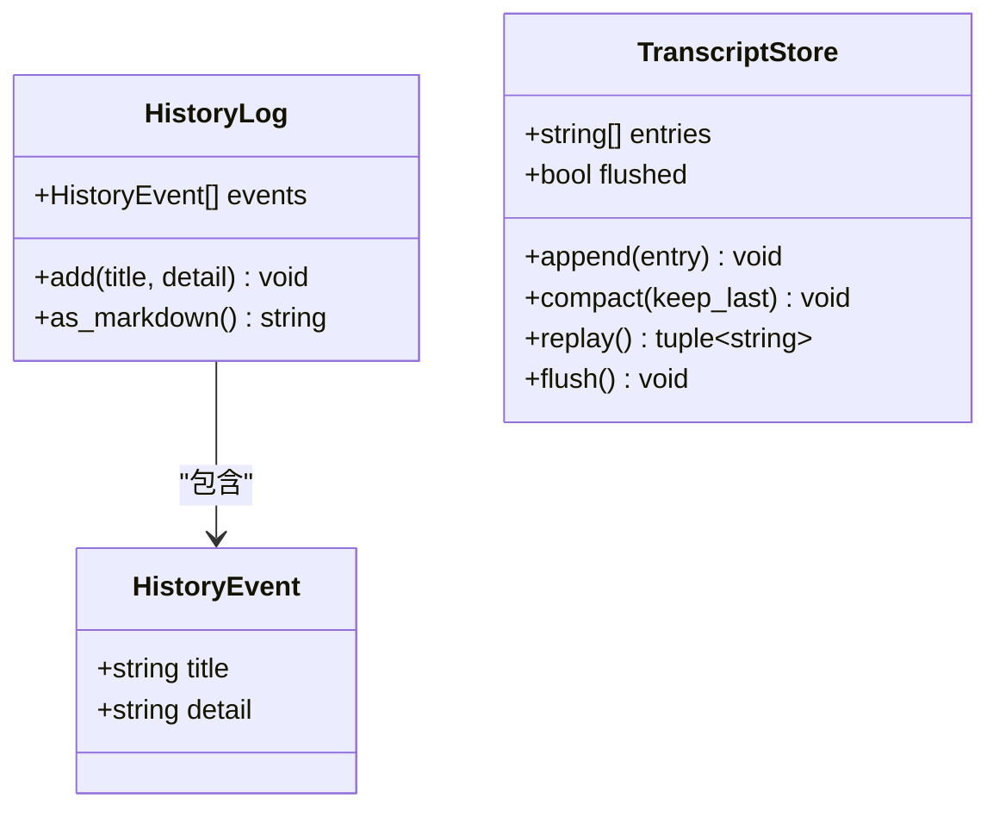
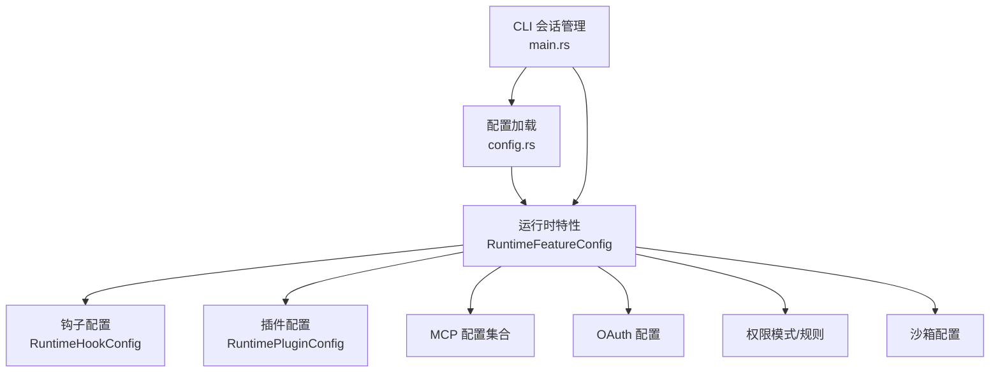
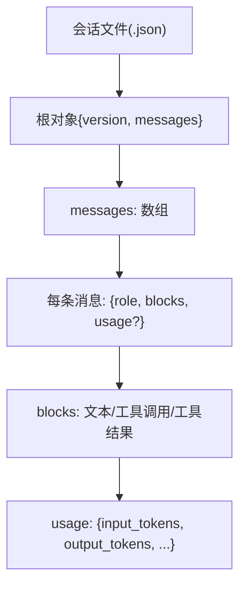
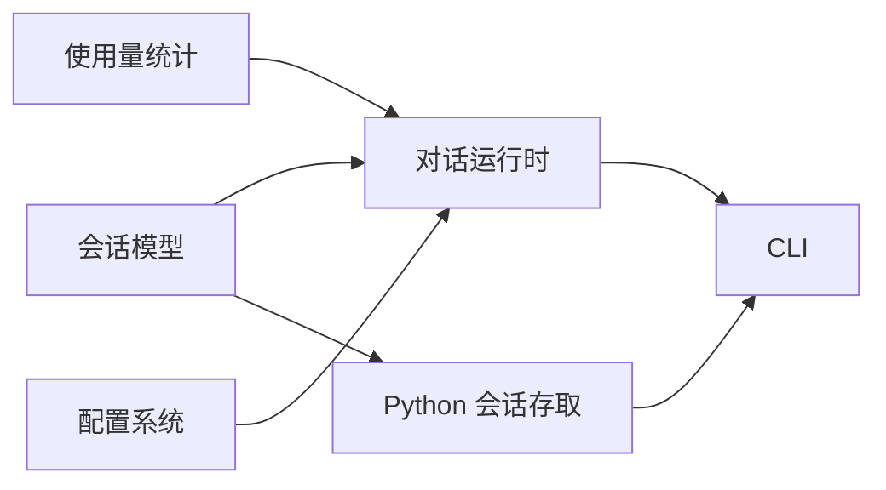

# 会话管理机制

<cite>
**本文引用的文件**
- [session.rs](file://rust/crates/runtime/src/session.rs)
- [conversation.rs](file://rust/crates/runtime/src/conversation.rs)
- [usage.rs](file://rust/crates/runtime/src/usage.rs)
- [config.rs](file://rust/crates/runtime/src/config.rs)
- [lib.rs](file://rust/crates/runtime/src/lib.rs)
- [main.rs](file://rust/crates/rusty-claude-cli/src/main.rs)
- [session_store.py](file://src/session_store.py)
- [transcript.py](file://src/transcript.py)
- [history.py](file://src/history.py)
- [cost_tracker.py](file://src/cost_tracker.py)
- [costHook.py](file://src/costHook.py)
- [bootstrap.rs](file://rust/crates/runtime/src/bootstrap.rs)
- [session-1775007453382.json](file://rust/.claude/sessions/session-1775007453382.json)
</cite>

## 目录
1. [简介](#简介)
2. [项目结构](#项目结构)
3. [核心组件](#核心组件)
4. [架构总览](#架构总览)
5. [详细组件分析](#详细组件分析)
6. [依赖分析](#依赖分析)
7. [性能考虑](#性能考虑)
8. [故障排查指南](#故障排查指南)
9. [结论](#结论)
10. [附录](#附录)

## 简介
本文件系统性阐述 CLAW 项目的会话管理机制，覆盖多轮对话的状态保持、历史记录与上下文维护、会话生命周期与持久化、令牌预算与成本追踪、数据结构与序列化、配置与扩展点、存储格式与版本兼容、以及调试与性能监控建议。内容面向开发者与高级用户，既提供高层概览也包含代码级细节与可视化图示。

## 项目结构
围绕会话管理的关键模块分布于 Rust 运行时与 Python 辅助工具之间：
- Rust 运行时：会话模型、对话运行时、使用量统计、配置加载、插件钩子等
- Python 工具：会话存取（JSON）、转录与历史记录、成本追踪钩子等
- CLI：会话 ID 生成、会话列表与引用解析

```mermaid
graph TB
subgraph "Rust 运行时"
S["会话模型<br/>session.rs"]
C["对话运行时<br/>conversation.rs"]
U["使用量与成本<br/>usage.rs"]
CFG["配置系统<br/>config.rs"]
L["库导出<br/>lib.rs"]
end
subgraph "Python 工具"
PY_S["会话存取<br/>session_store.py"]
PY_T["转录存储<br/>transcript.py"]
PY_H["历史记录<br/>history.py"]
PY_C["成本追踪<br/>cost_tracker.py"]
PY_CH["成本钩子<br/>costHook.py"]
end
subgraph "CLI"
CLI["会话管理 CLI<br/>main.rs"]
end
S --> C
C --> U
CFG --> C
L --> S
L --> C
L --> U
PY_S --> S
CLI --> S
PY_T --> C
PY_H --> C
PY_C --> U
PY_CH --> PY_C
```

**图表来源**
- [session.rs:43-136](file://rust/crates/runtime/src/session.rs#L43-L136)
- [conversation.rs:104-186](file://rust/crates/runtime/src/conversation.rs#L104-L186)
- [usage.rs:162-209](file://rust/crates/runtime/src/usage.rs#L162-L209)
- [config.rs:32-57](file://rust/crates/runtime/src/config.rs#L32-L57)
- [lib.rs:17-85](file://rust/crates/runtime/src/lib.rs#L17-L85)
- [session_store.py:8-36](file://src/session_store.py#L8-L36)
- [transcript.py:6-24](file://src/transcript.py#L6-L24)
- [history.py:6-23](file://src/history.py#L6-L23)
- [cost_tracker.py:6-14](file://src/cost_tracker.py#L6-L14)
- [costHook.py:6-8](file://src/costHook.py#L6-L8)
- [main.rs:1795-1853](file://rust/crates/rusty-claude-cli/src/main.rs#L1795-L1853)

**章节来源**
- [lib.rs:17-85](file://rust/crates/runtime/src/lib.rs#L17-L85)
- [config.rs:32-57](file://rust/crates/runtime/src/config.rs#L32-L57)
- [session.rs:43-136](file://rust/crates/runtime/src/session.rs#L43-L136)
- [conversation.rs:104-186](file://rust/crates/runtime/src/conversation.rs#L104-L186)
- [usage.rs:162-209](file://rust/crates/runtime/src/usage.rs#L162-L209)
- [session_store.py:8-36](file://src/session_store.py#L8-L36)
- [transcript.py:6-24](file://src/transcript.py#L6-L24)
- [history.py:6-23](file://src/history.py#L6-L23)
- [cost_tracker.py:6-14](file://src/cost_tracker.py#L6-L14)
- [costHook.py:6-8](file://src/costHook.py#L6-L8)
- [main.rs:1795-1853](file://rust/crates/rusty-claude-cli/src/main.rs#L1795-L1853)

## 核心组件
- 会话模型与序列化：定义消息角色、内容块、消息体与会话对象，并提供 JSON 序列化/反序列化与版本字段
- 对话运行时：封装一轮或多轮交互，处理工具调用、权限控制、钩子执行与自动压缩
- 使用量与成本：统计输入/输出/缓存读写令牌，估算美元成本并支持按模型定价
- 配置系统：合并用户/项目/本地配置，解析权限模式、插件、MCP、沙箱等特性
- Python 会话存取：以 JSON 文件形式保存/加载会话，支持目录与路径约定
- 转录与历史：记录对话片段与事件历史，支持紧凑化与重放
- 成本追踪钩子：在 Python 层面记录成本事件，便于外部集成

**章节来源**
- [session.rs:43-136](file://rust/crates/runtime/src/session.rs#L43-L136)
- [conversation.rs:104-186](file://rust/crates/runtime/src/conversation.rs#L104-L186)
- [usage.rs:162-209](file://rust/crates/runtime/src/usage.rs#L162-L209)
- [config.rs:32-57](file://rust/crates/runtime/src/config.rs#L32-L57)
- [session_store.py:8-36](file://src/session_store.py#L8-L36)
- [transcript.py:6-24](file://src/transcript.py#L6-L24)
- [history.py:6-23](file://src/history.py#L6-L23)
- [cost_tracker.py:6-14](file://src/cost_tracker.py#L6-L14)
- [costHook.py:6-8](file://src/costHook.py#L6-L8)

## 架构总览
下图展示从 CLI 到会话模型、运行时与成本统计的整体流程：



**图表来源**
- [main.rs:1795-1853](file://rust/crates/rusty-claude-cli/src/main.rs#L1795-L1853)
- [session.rs:79-136](file://rust/crates/runtime/src/session.rs#L79-L136)
- [conversation.rs:317-501](file://rust/crates/runtime/src/conversation.rs#L317-L501)
- [usage.rs:169-209](file://rust/crates/runtime/src/usage.rs#L169-L209)
- [session_store.py:19-36](file://src/session_store.py#L19-L36)

## 详细组件分析

### 会话模型与序列化
- 数据结构
  - 角色枚举：系统、用户、助手、工具
  - 内容块：文本、工具调用、工具结果
  - 消息体：角色 + 内容块列表 + 可选使用量
  - 会话：版本号 + 消息数组
- 版本与兼容
  - 通过版本字段区分格式演进
  - 反序列化严格校验必需字段与类型
- 序列化策略
  - 统一转换为有序键映射(JSON)，保留字段顺序
  - 支持嵌套对象与数组递归序列化
- 错误处理
  - 明确的错误类型，涵盖 IO、JSON 解析与格式不匹配



**图表来源**
- [session.rs:9-46](file://rust/crates/runtime/src/session.rs#L9-L46)
- [session.rs:144-249](file://rust/crates/runtime/src/session.rs#L144-L249)
- [session.rs:251-325](file://rust/crates/runtime/src/session.rs#L251-L325)
- [session.rs:327-358](file://rust/crates/runtime/src/session.rs#L327-L358)

**章节来源**
- [session.rs:9-46](file://rust/crates/runtime/src/session.rs#L9-L46)
- [session.rs:144-249](file://rust/crates/runtime/src/session.rs#L144-L249)
- [session.rs:251-325](file://rust/crates/runtime/src/session.rs#L251-L325)
- [session.rs:327-358](file://rust/crates/runtime/src/session.rs#L327-L358)

### 对话运行时与生命周期
- 生命周期阶段
  - 初始化：从会话、API 客户端、工具执行器、权限策略与系统提示构建
  - 多轮循环：用户输入 → 构建请求 → 流式事件聚合 → 追加消息 → 工具调用 → 权限决策 → 钩子执行 → 结果回写
  - 自动压缩：基于阈值估计令牌，触发会话压缩减少历史开销
  - 关闭：插件关闭与资源回收
- 关键配置
  - 最大迭代次数、自动压缩阈值、钩子与插件注册、进度上报与中止信号
- 输出摘要
  - 助手消息集合、工具结果集合、迭代次数、累计使用量、是否发生自动压缩



**图表来源**
- [conversation.rs:317-501](file://rust/crates/runtime/src/conversation.rs#L317-L501)
- [conversation.rs:553-576](file://rust/crates/runtime/src/conversation.rs#L553-L576)

**章节来源**
- [conversation.rs:104-186](file://rust/crates/runtime/src/conversation.rs#L104-L186)
- [conversation.rs:317-501](file://rust/crates/runtime/src/conversation.rs#L317-L501)
- [conversation.rs:553-576](file://rust/crates/runtime/src/conversation.rs#L553-L576)

### 令牌预算、成本追踪与资源限制
- 令牌统计
  - TokenUsage：输入/输出/缓存写/缓存读
  - UsageTracker：累计统计、当前轮次、轮次计数
- 成本估算
  - 默认与模型特定定价（Haiku/Opus/Sonnet）
  - USD 格式化与分项汇总
- 资源限制
  - 自动压缩阈值环境变量与默认值
  - 最大迭代次数限制防止无限循环
- Python 成本钩子
  - 在 Python 层记录成本事件，便于外部集成



**图表来源**
- [usage.rs:28-52](file://rust/crates/runtime/src/usage.rs#L28-L52)
- [usage.rs:162-209](file://rust/crates/runtime/src/usage.rs#L162-L209)
- [usage.rs:55-77](file://rust/crates/runtime/src/usage.rs#L55-L77)

**章节来源**
- [usage.rs:28-52](file://rust/crates/runtime/src/usage.rs#L28-L52)
- [usage.rs:162-209](file://rust/crates/runtime/src/usage.rs#L162-L209)
- [usage.rs:55-77](file://rust/crates/runtime/src/usage.rs#L55-L77)
- [cost_tracker.py:6-14](file://src/cost_tracker.py#L6-L14)
- [costHook.py:6-8](file://src/costHook.py#L6-L8)

### 历史记录与上下文维护
- 历史事件：标题与详情，支持 Markdown 导出
- 转录存储：可紧凑化保留最近 N 条，支持 flush/replay
- 上下文：在运行时通过系统提示与消息历史维持上下文



**图表来源**
- [history.py:6-23](file://src/history.py#L6-L23)
- [transcript.py:6-24](file://src/transcript.py#L6-L24)

**章节来源**
- [history.py:6-23](file://src/history.py#L6-L23)
- [transcript.py:6-24](file://src/transcript.py#L6-L24)

### 配置与扩展点
- 配置来源与合并：用户、项目、本地设置逐层合并
- 运行时特性：钩子、插件、MCP、OAuth、模型、权限模式、沙箱
- 插件与钩子：预/后工具使用钩子，失败后钩子；插件生命周期与工具注册
- CLI 扩展：会话 ID 生成、会话列表与引用解析



**图表来源**
- [config.rs:32-57](file://rust/crates/runtime/src/config.rs#L32-L57)
- [config.rs:59-76](file://rust/crates/runtime/src/config.rs#L59-L76)
- [config.rs:449-493](file://rust/crates/runtime/src/config.rs#L449-L493)
- [main.rs:1795-1853](file://rust/crates/rusty-claude-cli/src/main.rs#L1795-L1853)

**章节来源**
- [config.rs:32-57](file://rust/crates/runtime/src/config.rs#L32-L57)
- [config.rs:59-76](file://rust/crates/runtime/src/config.rs#L59-L76)
- [config.rs:449-493](file://rust/crates/runtime/src/config.rs#L449-L493)
- [main.rs:1795-1853](file://rust/crates/rusty-claude-cli/src/main.rs#L1795-L1853)

### 会话存储格式、备份与版本兼容
- 存储格式
  - JSON 文件，根字段包含版本与消息数组
  - 消息数组元素为 ConversationMessage 的 JSON 表示
- 目录与命名
  - CLI 生成以时间戳命名的会话文件
  - Python 会话存取默认目录可配置
- 版本兼容
  - 反序列化严格校验版本与必需字段
  - 通过版本字段支持未来格式演进



**图表来源**
- [session.rs:98-135](file://rust/crates/runtime/src/session.rs#L98-L135)
- [session-1775007453382.json:1-1](file://rust/.claude/sessions/session-1775007453382.json#L1-L1)

**章节来源**
- [session.rs:98-135](file://rust/crates/runtime/src/session.rs#L98-L135)
- [session_store.py:16-36](file://src/session_store.py#L16-L36)
- [main.rs:1795-1853](file://rust/crates/rusty-claude-cli/src/main.rs#L1795-L1853)
- [session-1775007453382.json:1-1](file://rust/.claude/sessions/session-1775007453382.json#L1-L1)

## 依赖分析
- 模块内聚与耦合
  - 会话模型独立，被运行时与 CLI 使用
  - 运行时依赖会话模型、使用量统计、配置与权限策略
  - Python 会话存取与运行时通过 JSON 文件解耦
- 外部依赖与集成
  - 配置系统支持多来源合并与环境变量
  - 插件系统提供钩子扩展点
  - CLI 提供会话管理命令行接口



**图表来源**
- [lib.rs:17-85](file://rust/crates/runtime/src/lib.rs#L17-L85)
- [config.rs:32-57](file://rust/crates/runtime/src/config.rs#L32-L57)
- [session.rs:43-136](file://rust/crates/runtime/src/session.rs#L43-L136)
- [conversation.rs:104-186](file://rust/crates/runtime/src/conversation.rs#L104-L186)
- [usage.rs:162-209](file://rust/crates/runtime/src/usage.rs#L162-L209)
- [session_store.py:8-36](file://src/session_store.py#L8-L36)
- [main.rs:1795-1853](file://rust/crates/rusty-claude-cli/src/main.rs#L1795-L1853)

**章节来源**
- [lib.rs:17-85](file://rust/crates/runtime/src/lib.rs#L17-L85)
- [config.rs:32-57](file://rust/crates/runtime/src/config.rs#L32-L57)
- [session.rs:43-136](file://rust/crates/runtime/src/session.rs#L43-L136)
- [conversation.rs:104-186](file://rust/crates/runtime/src/conversation.rs#L104-L186)
- [usage.rs:162-209](file://rust/crates/runtime/src/usage.rs#L162-L209)
- [session_store.py:8-36](file://src/session_store.py#L8-L36)
- [main.rs:1795-1853](file://rust/crates/rusty-claude-cli/src/main.rs#L1795-L1853)

## 性能考虑
- 自动压缩
  - 基于输入令牌阈值触发，减少历史消息长度，降低后续计算与序列化开销
  - 可通过环境变量调整阈值
- 令牌估算
  - 通过运行时估算会话令牌，辅助判断是否需要压缩
- 成本估算
  - 按模型定价估算，帮助控制成本
- 转录紧凑化
  - Python 转录存储支持保留最近若干条，避免内存膨胀

**章节来源**
- [conversation.rs:17-18](file://rust/crates/runtime/src/conversation.rs#L17-L18)
- [conversation.rs:553-576](file://rust/crates/runtime/src/conversation.rs#L553-L576)
- [conversation.rs:508-511](file://rust/crates/runtime/src/conversation.rs#L508-L511)
- [usage.rs:55-77](file://rust/crates/runtime/src/usage.rs#L55-L77)
- [transcript.py:15-17](file://src/transcript.py#L15-L17)

## 故障排查指南
- 会话加载失败
  - 检查 JSON 格式与必需字段（版本、消息数组）
  - 确认版本兼容性与字段类型
- 运行时异常
  - 流式事件未包含停止事件或无内容块
  - 工具调用返回错误或权限拒绝
- 成本统计异常
  - 检查 TokenUsage 字段完整性与模型定价匹配
- CLI 会话引用
  - 确认会话文件存在与命名规范
  - 使用会话列表确认最新修改时间与消息数量

**章节来源**
- [session.rs:117-135](file://rust/crates/runtime/src/session.rs#L117-L135)
- [conversation.rs:601-638](file://rust/crates/runtime/src/conversation.rs#L601-L638)
- [usage.rs:211-309](file://rust/crates/runtime/src/usage.rs#L211-L309)
- [main.rs:1803-1853](file://rust/crates/rusty-claude-cli/src/main.rs#L1803-L1853)

## 结论
CLAW 的会话管理以 Rust 会话模型为核心，结合运行时的多轮对话、工具调用与权限控制，配合 Python 的会话存取与成本追踪，形成完整的多轮对话生命周期管理方案。通过版本化的 JSON 存储、自动压缩与成本估算，系统在功能与性能之间取得平衡，并提供丰富的配置与扩展点以满足不同场景需求。

## 附录
- 术语
  - 令牌：输入/输出/缓存写/缓存读
  - 使用量：TokenUsage
  - 成本：UsageCostEstimate
  - 自动压缩：基于阈值的会话消息精简
- 建议
  - 定期备份会话 JSON 文件
  - 使用环境变量调整自动压缩阈值
  - 在生产环境中启用插件钩子进行审计与安全控制