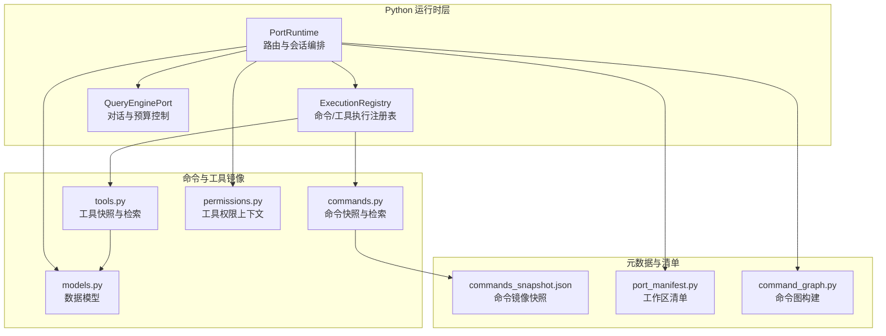
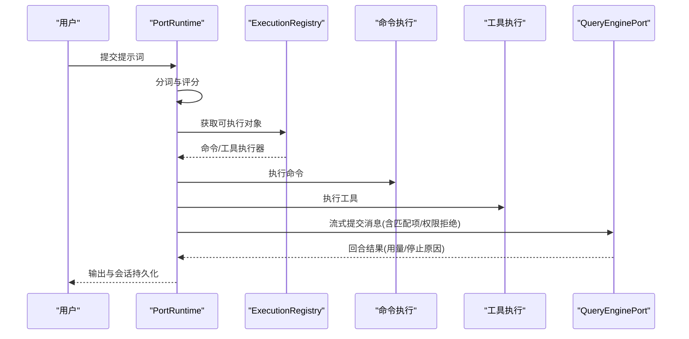
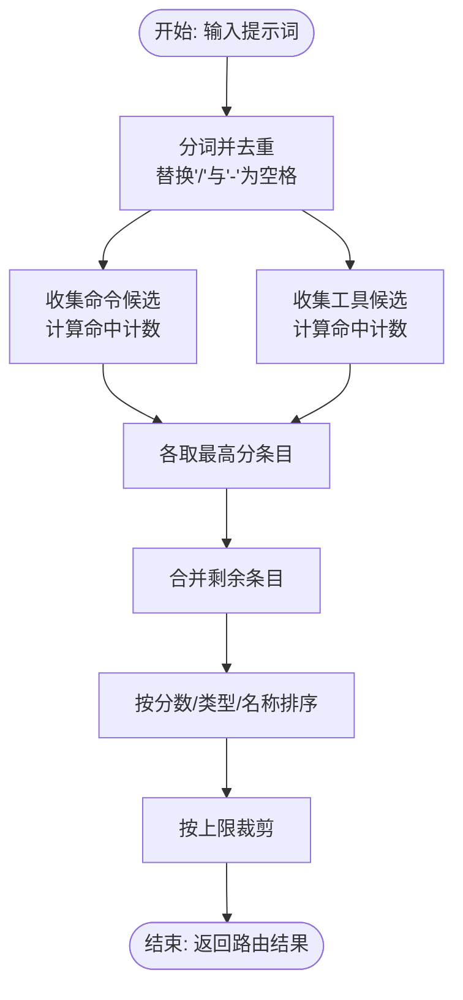
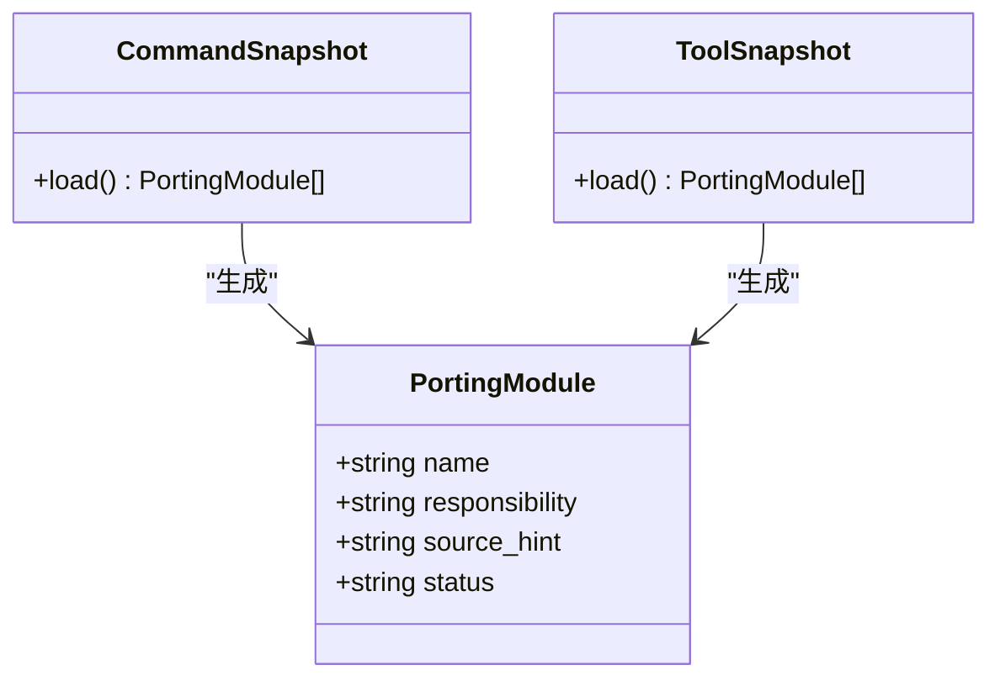
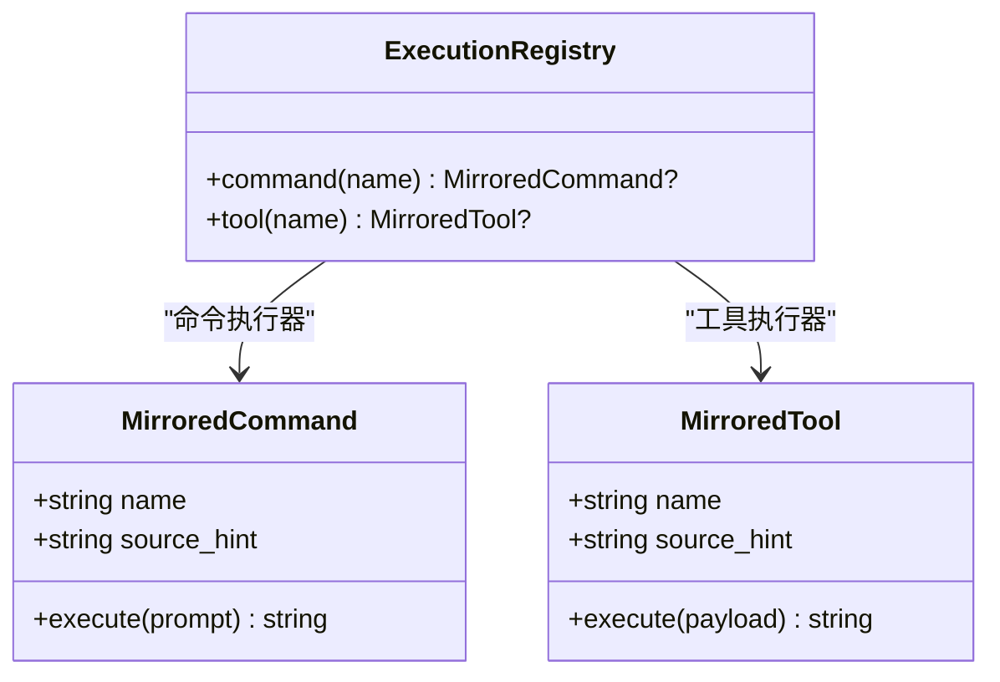
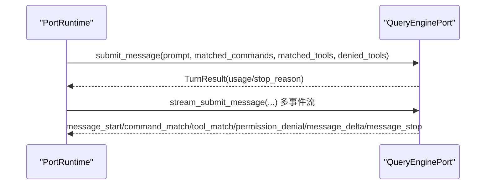
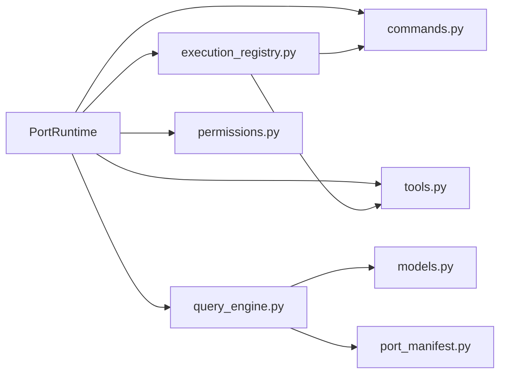

# 命令路由系统

<cite>
**本文档引用的文件**
- [runtime.py](file://src/runtime.py)
- [commands.py](file://src/commands.py)
- [tools.py](file://src/tools.py)
- [execution_registry.py](file://src/execution_registry.py)
- [query_engine.py](file://src/query_engine.py)
- [models.py](file://src/models.py)
- [permissions.py](file://src/permissions.py)
- [port_manifest.py](file://src/port_manifest.py)
- [command_graph.py](file://src/command_graph.py)
- [commands_snapshot.json](file://src/reference_data/commands_snapshot.json)
</cite>

## 目录
1. [简介](#简介)
2. [项目结构](#项目结构)
3. [核心组件](#核心组件)
4. [架构总览](#架构总览)
5. [详细组件分析](#详细组件分析)
6. [依赖关系分析](#依赖关系分析)
7. [性能考虑](#性能考虑)
8. [故障排查指南](#故障排查指南)
9. [结论](#结论)
10. [附录](#附录)

## 简介
本文件面向 CLAW 项目的命令路由系统，系统性阐述命令匹配算法、评分机制与路由决策流程；说明命令发现与加载机制（镜像快照与动态过滤）；解释优先级排序、冲突处理与回退策略；介绍与查询引擎的集成与实时路由更新；提供配置选项与扩展方法，并给出路由示例与性能优化建议，帮助开发者进行扩展与调试。

## 项目结构
命令路由系统围绕 Python 层的运行时、命令与工具镜像、执行注册表以及查询引擎展开，同时通过端到端会话与权限控制实现闭环。

**图表来源**
- [runtime.py:1-193](file://src/runtime.py#L1-L193)
- [commands.py:1-91](file://src/commands.py#L1-L91)
- [tools.py:1-97](file://src/tools.py#L1-L97)
- [execution_registry.py:1-52](file://src/execution_registry.py#L1-L52)
- [query_engine.py:1-194](file://src/query_engine.py#L1-L194)
- [models.py:1-50](file://src/models.py#L1-L50)
- [permissions.py:1-21](file://src/permissions.py#L1-L21)
- [port_manifest.py:1-53](file://src/port_manifest.py#L1-L53)
- [command_graph.py:1-35](file://src/command_graph.py#L1-L35)
- [commands_snapshot.json:1-1037](file://src/reference_data/commands_snapshot.json#L1-L1037)

**章节来源**
- [runtime.py:1-193](file://src/runtime.py#L1-L193)
- [commands.py:1-91](file://src/commands.py#L1-L91)
- [tools.py:1-97](file://src/tools.py#L1-L97)
- [execution_registry.py:1-52](file://src/execution_registry.py#L1-L52)
- [query_engine.py:1-194](file://src/query_engine.py#L1-L194)
- [models.py:1-50](file://src/models.py#L1-L50)
- [permissions.py:1-21](file://src/permissions.py#L1-L21)
- [port_manifest.py:1-53](file://src/port_manifest.py#L1-L53)
- [command_graph.py:1-35](file://src/command_graph.py#L1-L35)
- [commands_snapshot.json:1-1037](file://src/reference_data/commands_snapshot.json#L1-L1037)

## 核心组件
- 路由器 PortRuntime：负责将用户提示词分解为令牌集合，基于命令与工具镜像计算匹配度并排序，生成路由结果。
- 执行注册表 ExecutionRegistry：将路由结果映射为可执行对象，统一调用命令或工具的执行消息。
- 查询引擎 QueryEnginePort：承载会话、预算与回合控制，接收路由结果并输出结构化响应。
- 命令与工具模块：从 JSON 快照加载镜像元数据，提供检索、过滤与执行封装。
- 权限上下文 ToolPermissionContext：在路由后推断并过滤潜在高风险工具。
- 工作区清单与命令图：辅助理解命令来源与分类（内置/插件/技能）。

**章节来源**
- [runtime.py:89-193](file://src/runtime.py#L89-L193)
- [execution_registry.py:27-52](file://src/execution_registry.py#L27-L52)
- [query_engine.py:35-194](file://src/query_engine.py#L35-L194)
- [commands.py:22-91](file://src/commands.py#L22-L91)
- [tools.py:23-97](file://src/tools.py#L23-L97)
- [permissions.py:6-21](file://src/permissions.py#L6-L21)
- [port_manifest.py:30-53](file://src/port_manifest.py#L30-L53)
- [command_graph.py:29-35](file://src/command_graph.py#L29-L35)

## 架构总览
下图展示从提示词到最终会话输出的端到端流程，包括路由、执行与查询引擎交互。

**图表来源**
- [runtime.py:109-167](file://src/runtime.py#L109-L167)
- [execution_registry.py:27-52](file://src/execution_registry.py#L27-L52)
- [query_engine.py:61-128](file://src/query_engine.py#L61-L128)

**章节来源**
- [runtime.py:109-167](file://src/runtime.py#L109-L167)
- [execution_registry.py:27-52](file://src/execution_registry.py#L27-L52)
- [query_engine.py:61-128](file://src/query_engine.py#L61-L128)

## 详细组件分析

### 路由器与匹配算法
- 令牌预处理：将提示词中的斜杠与连字符替换为空格后分词，去除非空元素并转小写，形成集合以提升匹配效率。
- 双通道收集：分别对命令与工具镜像集合进行匹配收集，形成两类候选列表。
- 评分函数：对每个模块在 name、source_hint、responsibility 三个字段中统计“命中令牌数”，作为排序依据。
- 决策流程：
  - 先从两类候选中各取最高分条目；
  - 将剩余条目按“分数降序、类型次序、名称字典序”排序；
  - 按上限裁剪返回。

**图表来源**
- [runtime.py:89-107](file://src/runtime.py#L89-L107)
- [runtime.py:176-192](file://src/runtime.py#L176-L192)

**章节来源**
- [runtime.py:89-107](file://src/runtime.py#L89-L107)
- [runtime.py:176-192](file://src/runtime.py#L176-L192)

### 命令发现与加载机制
- 镜像快照：命令与工具均来自 JSON 快照文件，加载后缓存于模块级常量，避免重复 IO。
- 动态过滤：支持按来源提示（如 plugin/skills）与模式（如简单模式、是否包含 MCP）进行过滤。
- 元数据解析：每条记录包含 name、source_hint、responsibility、status 等字段，用于路由与展示。

**图表来源**
- [commands.py:22-36](file://src/commands.py#L22-L36)
- [tools.py:23-38](file://src/tools.py#L23-L38)
- [models.py:14-20](file://src/models.py#L14-L20)

**章节来源**
- [commands.py:22-66](file://src/commands.py#L22-L66)
- [tools.py:23-73](file://src/tools.py#L23-L73)
- [models.py:14-20](file://src/models.py#L14-L20)
- [commands_snapshot.json:1-1037](file://src/reference_data/commands_snapshot.json#L1-L1037)

### 执行注册表与回退策略
- 注册表将镜像模块包装为可执行对象，提供按名称查找与执行消息生成。
- 回退策略：当路由未命中或执行失败时，系统仍会通过查询引擎输出兜底信息（如未知命令提示），并记录权限拒绝与用量统计。

**图表来源**
- [execution_registry.py:27-52](file://src/execution_registry.py#L27-L52)
- [commands.py:75-81](file://src/commands.py#L75-L81)
- [tools.py:81-87](file://src/tools.py#L81-L87)

**章节来源**
- [execution_registry.py:27-52](file://src/execution_registry.py#L27-L52)
- [commands.py:75-81](file://src/commands.py#L75-L81)
- [tools.py:81-87](file://src/tools.py#L81-L87)

### 与查询引擎的集成与实时路由更新
- 集成点：路由器在会话启动与回合循环中，将匹配的命令/工具名称与权限拒绝传递给查询引擎。
- 实时更新：查询引擎维护会话状态、用量与回合限制，支持流式事件输出，便于前端或 CLI 实时反馈。
- 会话持久化：查询引擎负责将当前会话与用量持久化，供后续恢复使用。

**图表来源**
- [runtime.py:119-133](file://src/runtime.py#L119-L133)
- [query_engine.py:61-128](file://src/query_engine.py#L61-L128)

**章节来源**
- [runtime.py:119-133](file://src/runtime.py#L119-L133)
- [query_engine.py:61-128](file://src/query_engine.py#L61-L128)

### 命令优先级排序、冲突解决与回退策略
- 排序规则：先按分数降序，再按类型顺序（命令优先于工具），最后按名称字典序。
- 冲突解决：若同一模块在不同来源出现（例如同名命令的不同实现），由排序规则决定取舍；建议通过 source_hint 区分。
- 回退策略：当无匹配或执行失败时，查询引擎输出兜底文本并记录用量与停止原因。

**章节来源**
- [runtime.py:102-107](file://src/runtime.py#L102-L107)
- [runtime.py:169-174](file://src/runtime.py#L169-L174)

### 权限控制与安全回退
- 权限上下文：支持按名称白名单/黑名单与前缀匹配进行工具过滤。
- 安全回退：对高风险工具（如 Bash）进行显式拒绝并记录原因，避免误用。

**章节来源**
- [permissions.py:6-21](file://src/permissions.py#L6-L21)
- [runtime.py:169-174](file://src/runtime.py#L169-L174)

### 命令分类与命令图
- 分类依据：根据 source_hint 判断内置、插件类或技能类命令。
- 命令图：将命令划分为三类集合，便于统计与展示。

**章节来源**
- [command_graph.py:29-35](file://src/command_graph.py#L29-L35)

## 依赖关系分析
- 路由器依赖命令与工具镜像快照、权限上下文与查询引擎配置。
- 执行注册表依赖命令/工具模块的执行封装。
- 查询引擎依赖会话存储、清单与用量统计。

**图表来源**
- [runtime.py:1-14](file://src/runtime.py#L1-L14)
- [execution_registry.py:1-7](file://src/execution_registry.py#L1-L7)
- [query_engine.py:1-13](file://src/query_engine.py#L1-L13)

**章节来源**
- [runtime.py:1-14](file://src/runtime.py#L1-L14)
- [execution_registry.py:1-7](file://src/execution_registry.py#L1-L7)
- [query_engine.py:1-13](file://src/query_engine.py#L1-L13)

## 性能考虑
- 缓存策略：命令与工具快照采用 LRU 缓存，避免重复读取 JSON。
- 数据结构：使用 frozenset/frozenset 与元组减少运行时分配与拷贝。
- 排序复杂度：候选数量有限（通常小于阈值），排序开销可控；建议限制路由上限以降低复杂度。
- I/O 优化：快照文件一次性加载，后续仅做内存过滤与检索。
- 并发与流式：查询引擎支持流式事件输出，适合 CLI 或前端增量渲染。

**章节来源**
- [commands.py:22-41](file://src/commands.py#L22-L41)
- [tools.py:23-41](file://src/tools.py#L23-L41)
- [runtime.py:102-107](file://src/runtime.py#L102-L107)

## 故障排查指南
- 未知命令：当路由名称无法在镜像中找到时，执行消息会提示“未知镜像命令”，检查命令名称大小写与拼写。
- 无匹配结果：确认提示词包含足够关键词，或放宽路由上限；检查 source_hint 是否正确区分插件/技能类命令。
- 权限拒绝：对高风险工具（如 Bash）会被显式拒绝，检查 ToolPermissionContext 的 deny 名称与前缀设置。
- 会话异常：查询引擎会记录 stop_reason（如达到最大回合或预算），检查 max_turns 与 max_budget_tokens 配置。

**章节来源**
- [commands.py:75-81](file://src/commands.py#L75-L81)
- [runtime.py:169-174](file://src/runtime.py#L169-L174)
- [query_engine.py:67-104](file://src/query_engine.py#L67-L104)

## 结论
CLAW 的命令路由系统以轻量快照与令牌匹配为核心，结合执行注册表与查询引擎，实现了可扩展、可观测且具备安全回退的路由能力。通过合理的配置与扩展点，开发者可在不破坏现有流程的前提下引入新命令与工具，并获得一致的用户体验。

## 附录

### 配置选项与自定义扩展方法
- 路由参数
  - limit：路由返回的最大条目数，默认 5
  - 简单模式：仅保留少数核心工具（如 Bash、文件读写）
  - 是否包含 MCP：按名称过滤 MCP 相关工具
- 查询引擎配置
  - max_turns：最大回合数
  - max_budget_tokens：最大预算（令牌）
  - structured_output：结构化输出开关
  - structured_retry_limit：结构化渲染重试次数
- 自定义扩展
  - 新增命令/工具：在对应快照中添加条目，确保 name/source_hint/responsibility 完整
  - 权限控制：通过 ToolPermissionContext 设置 deny_names 与 deny_prefixes
  - 插件与技能：利用命令图分类，按需过滤显示

**章节来源**
- [runtime.py:109-167](file://src/runtime.py#L109-L167)
- [query_engine.py:15-22](file://src/query_engine.py#L15-L22)
- [tools.py:62-73](file://src/tools.py#L62-L73)
- [permissions.py:11-21](file://src/permissions.py#L11-L21)
- [command_graph.py:29-35](file://src/command_graph.py#L29-L35)

### 实际路由示例
- 示例场景：用户输入包含“清理会话”关键词
  - 路由器将提示词分词后与命令镜像逐条比较，计算命中计数
  - 选择分数最高的命令与工具候选，按规则排序并裁剪
  - 执行注册表生成执行消息，查询引擎输出回合结果与用量统计
- 注意事项：若无匹配，查询引擎会输出兜底文本并记录停止原因

**章节来源**
- [runtime.py:89-107](file://src/runtime.py#L89-L107)
- [execution_registry.py:27-52](file://src/execution_registry.py#L27-L52)
- [query_engine.py:61-104](file://src/query_engine.py#L61-L104)