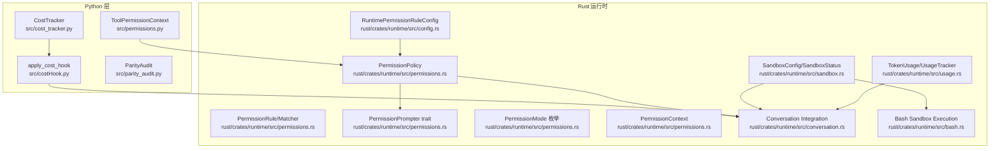
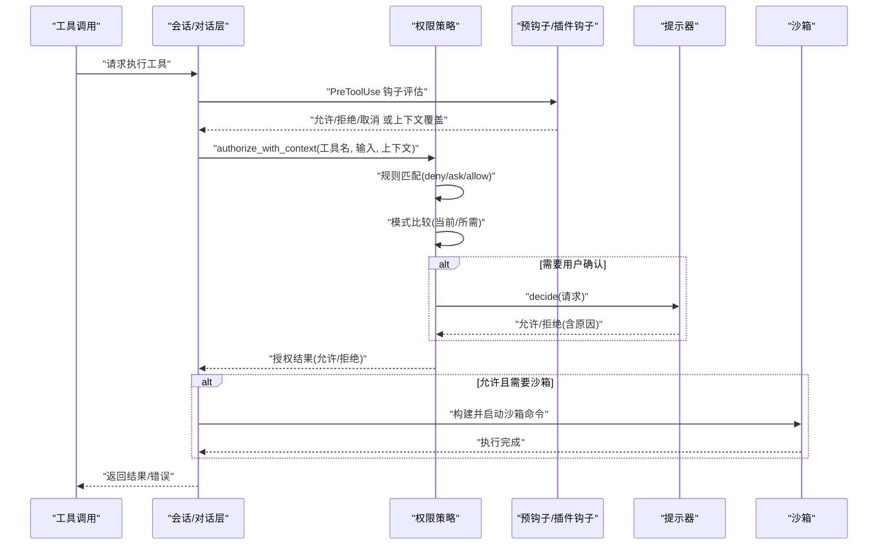
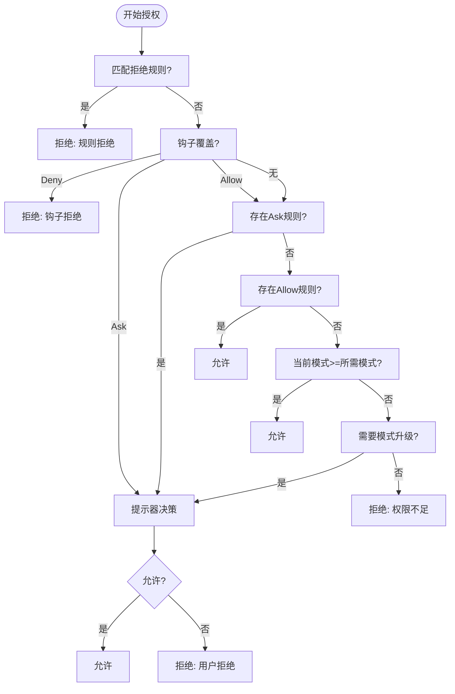
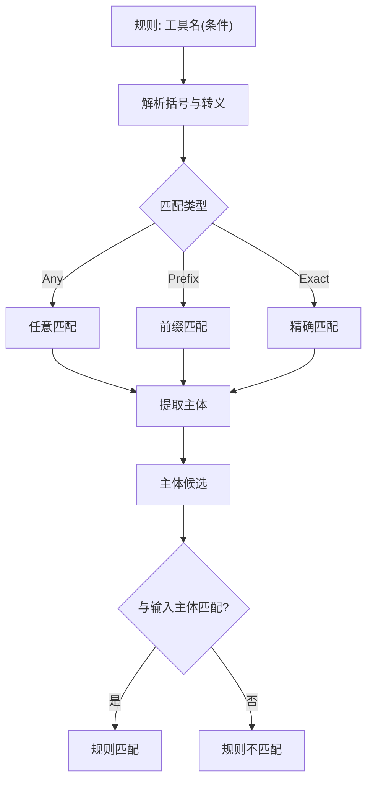
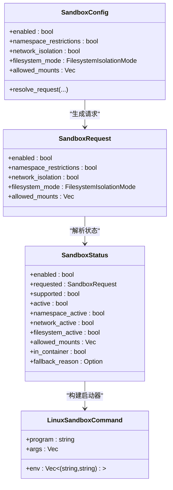
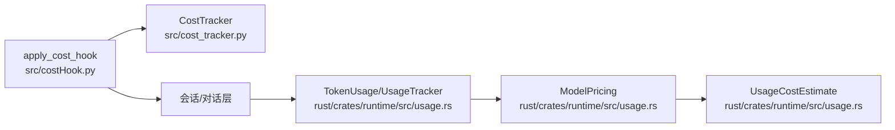
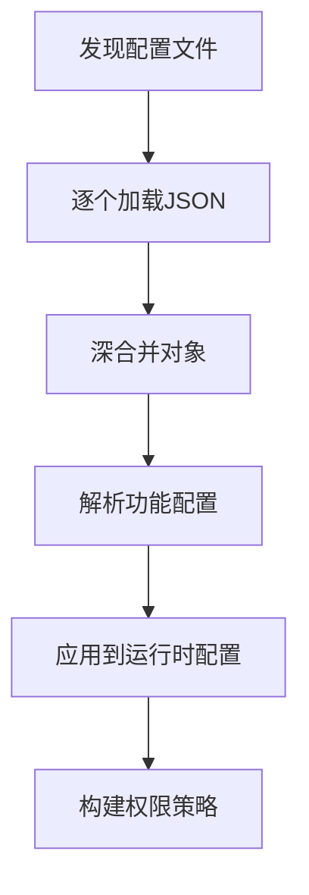
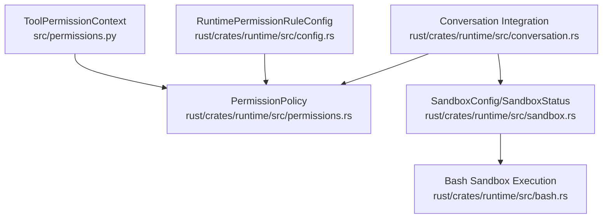

# 权限控制模型

<cite>
**本文档引用的文件**
- [permissions.py](file://src/permissions.py)
- [permissions.rs](file://rust/crates/runtime/src/permissions.rs)
- [config.rs](file://rust/crates/runtime/src/config.rs)
- [sandbox.rs](file://rust/crates/runtime/src/sandbox.rs)
- [usage.rs](file://rust/crates/runtime/src/usage.rs)
- [cost_tracker.py](file://src/cost_tracker.py)
- [costHook.py](file://src/costHook.py)
- [conversation.rs](file://rust/crates/runtime/src/conversation.rs)
- [bash.rs](file://rust/crates/runtime/src/bash.rs)
- [parity_audit.py](file://src/parity_audit.py)
- [README.md](file://README.md)
</cite>

## 目录
1. [简介](#简介)
2. [项目结构](#项目结构)
3. [核心组件](#核心组件)
4. [架构总览](#架构总览)
5. [详细组件分析](#详细组件分析)
6. [依赖关系分析](#依赖关系分析)
7. [性能考量](#性能考量)
8. [故障排查指南](#故障排查指南)
9. [结论](#结论)
10. [附录](#附录)

## 简介
本文件系统性阐述 CLAW 项目的权限控制模型，涵盖细粒度权限验证机制、安全沙箱设计、运行时权限决策流程、成本跟踪与资源监控、滥用防护、权限配置的动态更新与一致性保障、策略配置语法与表达式语言、调试工具、安全最佳实践与合规性考虑，以及面向开发者的扩展接口与审计日志分析指南。

## 项目结构
CLAW 的权限与安全能力由 Python 与 Rust 双栈实现协同完成：
- Python 层：提供工具权限上下文（名称与前缀拒绝列表）、成本追踪器与钩子、以及镜像审计等辅助能力。
- Rust 层：提供完整的运行时权限策略、规则解析与匹配、提示器接口、沙箱隔离配置与执行、会话与对话中的权限决策集成、以及令牌用量与成本估算。

**图表来源**
- [permissions.py:6-21](file://src/permissions.py#L6-L21)
- [permissions.rs:7-14](file://rust/crates/runtime/src/permissions.rs#L7-L14)
- [permissions.rs:91-97](file://rust/crates/runtime/src/permissions.rs#L91-L97)
- [permissions.rs:327-340](file://rust/crates/runtime/src/permissions.rs#L327-L340)
- [config.rs:67-71](file://rust/crates/runtime/src/config.rs#L67-L71)
- [sandbox.rs:27-43](file://rust/crates/runtime/src/sandbox.rs#L27-L43)
- [usage.rs:28-34](file://rust/crates/runtime/src/usage.rs#L28-L34)
- [conversation.rs:377-432](file://rust/crates/runtime/src/conversation.rs#L377-L432)
- [bash.rs:167-207](file://rust/crates/runtime/src/bash.rs#L167-L207)

**章节来源**
- [README.md:82-99](file://README.md#L82-L99)

## 核心组件
- 工具权限上下文（Python）：基于名称集合与前缀集合进行快速拒绝判定，支持大小写不敏感匹配。
- 运行时权限策略（Rust）：以模式（只读/工作区写入/危险全权/提示/允许）与规则（allow/deny/ask）为核心，结合工具需求模式与当前活动模式进行授权决策，并可被钩子覆盖或要求用户确认。
- 规则解析与匹配（Rust）：支持任意匹配、精确匹配与前缀匹配，输入主体提取自 JSON 字段（如命令、路径、URL 等），并支持转义括号与反斜杠。
- 沙箱隔离（Rust）：支持命名空间隔离、网络隔离、文件系统隔离（关闭/仅工作区/白名单），并提供 Linux unshare 启动器与环境变量注入。
- 成本与用量（Rust/Python）：Token 使用统计、成本估算、会话级累计用量；Python 提供成本钩子记录事件。
- 会话集成（Rust）：在对话执行前通过 PreToolUse 钩子与权限策略共同决定是否放行，必要时触发用户提示器。

**章节来源**
- [permissions.py:6-21](file://src/permissions.py#L6-L21)
- [permissions.rs:7-14](file://rust/crates/runtime/src/permissions.rs#L7-L14)
- [permissions.rs:91-140](file://rust/crates/runtime/src/permissions.rs#L91-L140)
- [permissions.rs:327-462](file://rust/crates/runtime/src/permissions.rs#L327-L462)
- [config.rs:67-71](file://rust/crates/runtime/src/config.rs#L67-L71)
- [sandbox.rs:7-25](file://rust/crates/runtime/src/sandbox.rs#L7-L25)
- [sandbox.rs:85-106](file://rust/crates/runtime/src/sandbox.rs#L85-L106)
- [sandbox.rs:161-208](file://rust/crates/runtime/src/sandbox.rs#L161-L208)
- [sandbox.rs:210-262](file://rust/crates/runtime/src/sandbox.rs#L210-L262)
- [usage.rs:28-52](file://rust/crates/runtime/src/usage.rs#L28-L52)
- [usage.rs:162-209](file://rust/crates/runtime/src/usage.rs#L162-L209)
- [cost_tracker.py:6-14](file://src/cost_tracker.py#L6-L14)
- [costHook.py:6-9](file://src/costHook.py#L6-L9)
- [conversation.rs:377-432](file://rust/crates/runtime/src/conversation.rs#L377-L432)

## 架构总览
下图展示从工具调用到权限决策与沙箱执行的关键路径，包括规则匹配、钩子覆盖、用户提示与沙箱启动。

**图表来源**
- [conversation.rs:377-432](file://rust/crates/runtime/src/conversation.rs#L377-L432)
- [permissions.rs:167-284](file://rust/crates/runtime/src/permissions.rs#L167-L284)
- [permissions.rs:286-316](file://rust/crates/runtime/src/permissions.rs#L286-L316)
- [bash.rs:167-207](file://rust/crates/runtime/src/bash.rs#L167-L207)
- [sandbox.rs:210-262](file://rust/crates/runtime/src/sandbox.rs#L210-L262)

## 详细组件分析

### 权限模式与策略
- 权限模式（PermissionMode）：只读、工作区写入、危险全权、提示、允许。用于描述当前运行态与工具所需的最小权限。
- 权限策略（PermissionPolicy）：维护活动模式、工具需求映射、三类规则集（allow/deny/ask），并提供带上下文的授权方法。
- 授权决策流程：
  - 若存在显式拒绝规则，直接拒绝；
  - 优先处理钩子覆盖（Deny/Ask/Allow）；
  - 匹配 ask 规则强制提示；
  - 匹配 allow 规则或满足模式等级，允许；
  - 当从较低模式向高风险模式升级时触发提示；
  - 否则拒绝并给出原因。

**图表来源**
- [permissions.rs:167-284](file://rust/crates/runtime/src/permissions.rs#L167-L284)
- [permissions.rs:286-316](file://rust/crates/runtime/src/permissions.rs#L286-L316)

**章节来源**
- [permissions.rs:7-14](file://rust/crates/runtime/src/permissions.rs#L7-L14)
- [permissions.rs:91-140](file://rust/crates/runtime/src/permissions.rs#L91-L140)
- [permissions.rs:167-284](file://rust/crates/runtime/src/permissions.rs#L167-L284)

### 规则语法与表达式语言
- 规则格式：`工具名(条件)`，其中条件支持：
  - `*`：任意值
  - `前缀:*`：前缀匹配
  - 其他字符串：精确匹配
- 转义规则：括号与反斜杠需转义；解析器会跳过未转义的括号对。
- 主体提取：从 JSON 输入中提取常见字段作为主体（如命令、路径、URL 等），若无法解析则使用原始输入。

**图表来源**
- [permissions.rs:341-383](file://rust/crates/runtime/src/permissions.rs#L341-L383)
- [permissions.rs:385-401](file://rust/crates/runtime/src/permissions.rs#L385-L401)
- [permissions.rs:439-461](file://rust/crates/runtime/src/permissions.rs#L439-L461)

**章节来源**
- [permissions.rs:341-383](file://rust/crates/runtime/src/permissions.rs#L341-L383)
- [permissions.rs:385-401](file://rust/crates/runtime/src/permissions.rs#L385-L401)
- [permissions.rs:439-461](file://rust/crates/runtime/src/permissions.rs#L439-L461)

### 钩子与上下文覆盖
- 钩子可在授权前介入，提供覆盖决策（Allow/Deny/Ask）与原因，短路后续流程。
- 上下文（PermissionContext）携带覆盖决策与原因，影响授权结果。
- 测试覆盖了钩子 Allow 仍受 Ask 规则约束、钩子 Deny 直接拒绝、钩子 Ask 强制提示等场景。

**章节来源**
- [permissions.rs:36-63](file://rust/crates/runtime/src/permissions.rs#L36-L63)
- [permissions.rs:188-234](file://rust/crates/runtime/src/permissions.rs#L188-L234)
- [permissions.rs:606-675](file://rust/crates/runtime/src/permissions.rs#L606-L675)

### 会话与对话中的集成
- 在对话执行前，先评估 PreToolUse 钩子结果，再调用权限策略进行授权，最后执行工具并合并钩子反馈。
- 支持取消、拒绝与错误消息的统一处理。

**章节来源**
- [conversation.rs:377-432](file://rust/crates/runtime/src/conversation.rs#L377-L432)

### 沙箱设计与执行
- 沙箱配置（SandboxConfig）支持启用、命名空间限制、网络隔离、文件系统模式（关闭/仅工作区/白名单）与挂载白名单。
- 状态解析（resolve_sandbox_status_for_request）根据请求与环境检测结果计算激活状态与回退原因。
- Linux 启动器（build_linux_sandbox_command）使用 unshare 构建带参数的命令，注入 HOME/TMPDIR 与沙箱模式/挂载信息。
- Bash 工具在准备命令时根据配置与输入决定是否启用沙箱。

**图表来源**
- [sandbox.rs:27-43](file://rust/crates/runtime/src/sandbox.rs#L27-L43)
- [sandbox.rs:85-106](file://rust/crates/runtime/src/sandbox.rs#L85-L106)
- [sandbox.rs:161-208](file://rust/crates/runtime/src/sandbox.rs#L161-L208)
- [sandbox.rs:210-262](file://rust/crates/runtime/src/sandbox.rs#L210-L262)

**章节来源**
- [sandbox.rs:27-43](file://rust/crates/runtime/src/sandbox.rs#L27-L43)
- [sandbox.rs:85-106](file://rust/crates/runtime/src/sandbox.rs#L85-L106)
- [sandbox.rs:161-208](file://rust/crates/runtime/src/sandbox.rs#L161-L208)
- [sandbox.rs:210-262](file://rust/crates/runtime/src/sandbox.rs#L210-L262)
- [bash.rs:167-207](file://rust/crates/runtime/src/bash.rs#L167-L207)

### 成本跟踪与资源监控
- Python 成本追踪器（CostTracker）记录事件与累计单位数。
- Python 成本钩子（apply_cost_hook）将事件写入追踪器。
- Rust 用量与成本（TokenUsage/UsageTracker/UsageCostEstimate）支持按模型定价估算、会话重建用量、汇总行输出。

**图表来源**
- [costHook.py:6-9](file://src/costHook.py#L6-L9)
- [cost_tracker.py:6-14](file://src/cost_tracker.py#L6-L14)
- [usage.rs:8-26](file://rust/crates/runtime/src/usage.rs#L8-L26)
- [usage.rs:162-209](file://rust/crates/runtime/src/usage.rs#L162-L209)
- [usage.rs:211-310](file://rust/crates/runtime/src/usage.rs#L211-L310)

**章节来源**
- [costHook.py:6-9](file://src/costHook.py#L6-L9)
- [cost_tracker.py:6-14](file://src/cost_tracker.py#L6-L14)
- [usage.rs:8-26](file://rust/crates/runtime/src/usage.rs#L8-L26)
- [usage.rs:162-209](file://rust/crates/runtime/src/usage.rs#L162-L209)
- [usage.rs:211-310](file://rust/crates/runtime/src/usage.rs#L211-L310)

### 配置与动态更新
- 运行时配置（RuntimeConfig/RuntimeFeatureConfig）支持多源合并（用户/项目/本地），解析权限模式与规则、沙箱配置等。
- 权限规则（RuntimePermissionRuleConfig）来自配置对象的 permissions.allow/deny/ask 数组。
- 配置加载器（ConfigLoader）发现并加载多个配置文件，深合并对象，解析各功能模块配置。

**图表来源**
- [config.rs:206-233](file://rust/crates/runtime/src/config.rs#L206-L233)
- [config.rs:235-269](file://rust/crates/runtime/src/config.rs#L235-L269)
- [config.rs:637-655](file://rust/crates/runtime/src/config.rs#L637-L655)
- [config.rs:687-705](file://rust/crates/runtime/src/config.rs#L687-L705)
- [config.rs:721-744](file://rust/crates/runtime/src/config.rs#L721-L744)

**章节来源**
- [config.rs:206-233](file://rust/crates/runtime/src/config.rs#L206-L233)
- [config.rs:235-269](file://rust/crates/runtime/src/config.rs#L235-L269)
- [config.rs:637-655](file://rust/crates/runtime/src/config.rs#L637-L655)
- [config.rs:687-705](file://rust/crates/runtime/src/config.rs#L687-L705)
- [config.rs:721-744](file://rust/crates/runtime/src/config.rs#L721-L744)

### 审计与合规
- Python 镜像审计（ParityAudit）对比当前 Python 工作区与历史快照，统计覆盖率与缺失项，辅助合规性检查。
- README 指明仓库定位与法律声明，强调非原始代码所有者与非关联方。

**章节来源**
- [parity_audit.py:73-139](file://src/parity_audit.py#L73-L139)
- [README.md:188-192](file://README.md#L188-L192)

## 依赖关系分析
- Python 工具权限上下文与 Rust 权限策略通过工具名与输入进行解耦，策略侧负责规则解析与模式比较。
- Rust 权限策略依赖配置模块提供的规则与模式，同时与会话层集成，最终驱动沙箱执行。
- 沙箱状态与启动器独立于策略，但受配置与输入影响；Bash 工具在准备阶段根据沙箱状态选择执行方式。

**图表来源**
- [permissions.py:6-21](file://src/permissions.py#L6-L21)
- [permissions.rs:91-140](file://rust/crates/runtime/src/permissions.rs#L91-L140)
- [config.rs:67-71](file://rust/crates/runtime/src/config.rs#L67-L71)
- [conversation.rs:377-432](file://rust/crates/runtime/src/conversation.rs#L377-L432)
- [sandbox.rs:85-106](file://rust/crates/runtime/src/sandbox.rs#L85-L106)
- [bash.rs:167-207](file://rust/crates/runtime/src/bash.rs#L167-L207)

**章节来源**
- [permissions.py:6-21](file://src/permissions.py#L6-L21)
- [permissions.rs:91-140](file://rust/crates/runtime/src/permissions.rs#L91-L140)
- [config.rs:67-71](file://rust/crates/runtime/src/config.rs#L67-L71)
- [conversation.rs:377-432](file://rust/crates/runtime/src/conversation.rs#L377-L432)
- [sandbox.rs:85-106](file://rust/crates/runtime/src/sandbox.rs#L85-L106)
- [bash.rs:167-207](file://rust/crates/runtime/src/bash.rs#L167-L207)

## 性能考量
- 权限规则匹配采用线性扫描，建议合理组织规则顺序与数量，避免过多 ask/deny 规则导致决策开销增加。
- 规则解析与主体提取为轻量操作，复杂 JSON 解析与键遍历在输入较大时可能成为瓶颈，建议在工具层尽量精简输入。
- 沙箱启动器在 Linux 下使用 unshare，参数较多时启动开销上升，建议按需启用网络隔离与命名空间限制。
- 成本估算与用量统计为常数时间操作，建议在高频工具调用中批量记录以减少系统调用次数。

## 故障排查指南
- 规则不生效：
  - 检查规则语法与转义是否正确，确认括号与反斜杠是否被正确转义。
  - 确认工具名大小写与输入主体提取逻辑（JSON 键是否存在）。
- 模式升级失败：
  - 确认当前模式与所需模式的等级关系，必要时通过 ask 规则或用户提示器提升权限。
- 沙箱未启用：
  - 检查沙箱配置与环境支持（Linux/unshare），查看回退原因（命名空间/网络不可用、白名单挂载为空等）。
- 成本异常：
  - 核对 TokenUsage 记录与模型定价映射，确认未知模型是否使用默认估算。
- 钩子覆盖冲突：
  - 检查钩子返回的覆盖决策与原因，确保与 ask 规则配合预期一致。

**章节来源**
- [permissions.rs:341-401](file://rust/crates/runtime/src/permissions.rs#L341-L401)
- [permissions.rs:439-461](file://rust/crates/runtime/src/permissions.rs#L439-L461)
- [sandbox.rs:161-208](file://rust/crates/runtime/src/sandbox.rs#L161-L208)
- [usage.rs:54-77](file://rust/crates/runtime/src/usage.rs#L54-L77)

## 结论
CLAW 的权限控制模型通过“模式+规则+钩子”的分层设计实现了细粒度的运行时权限决策，并结合沙箱隔离与成本监控形成完整的安全与资源管理闭环。配置的动态加载与规则表达式提供了灵活的策略编排能力，适合在不同场景下平衡安全性与可用性。

## 附录

### 权限配置语法速查
- 规则格式：`工具名(条件)`
- 条件类型：
  - `*`：任意
  - `前缀:*`：前缀匹配
  - 其他：精确匹配
- 转义：括号与反斜杠需转义
- 主体提取：从 JSON 中提取命令、路径、URL 等字段

**章节来源**
- [permissions.rs:341-401](file://rust/crates/runtime/src/permissions.rs#L341-L401)
- [permissions.rs:439-461](file://rust/crates/runtime/src/permissions.rs#L439-L461)

### 开发者扩展接口
- 实现提示器（PermissionPrompter）：在需要用户交互时提供决策回调。
- 自定义钩子：在 PreToolUse/PostToolUse 等钩子中设置 PermissionContext 的覆盖决策与原因。
- 扩展规则：通过配置 permissions.allow/deny/ask 数组添加新规则。

**章节来源**
- [permissions.rs:80-82](file://rust/crates/runtime/src/permissions.rs#L80-L82)
- [permissions.rs:36-63](file://rust/crates/runtime/src/permissions.rs#L36-L63)
- [config.rs:637-655](file://rust/crates/runtime/src/config.rs#L637-L655)

### 审计日志分析指南
- 使用 ParityAudit 对比当前 Python 工作区与历史快照，关注缺失根目标与目录目标，确保关键入口与工具覆盖完整。
- 结合会话消息中的用量统计与成本估算，定位高成本工具调用与潜在滥用行为。

**章节来源**
- [parity_audit.py:73-139](file://src/parity_audit.py#L73-L139)
- [usage.rs:109-151](file://rust/crates/runtime/src/usage.rs#L109-L151)