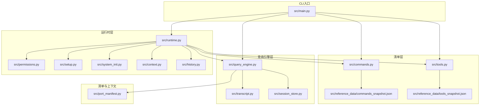
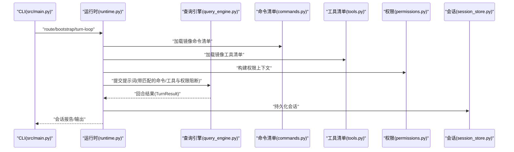
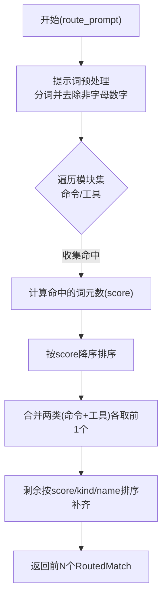
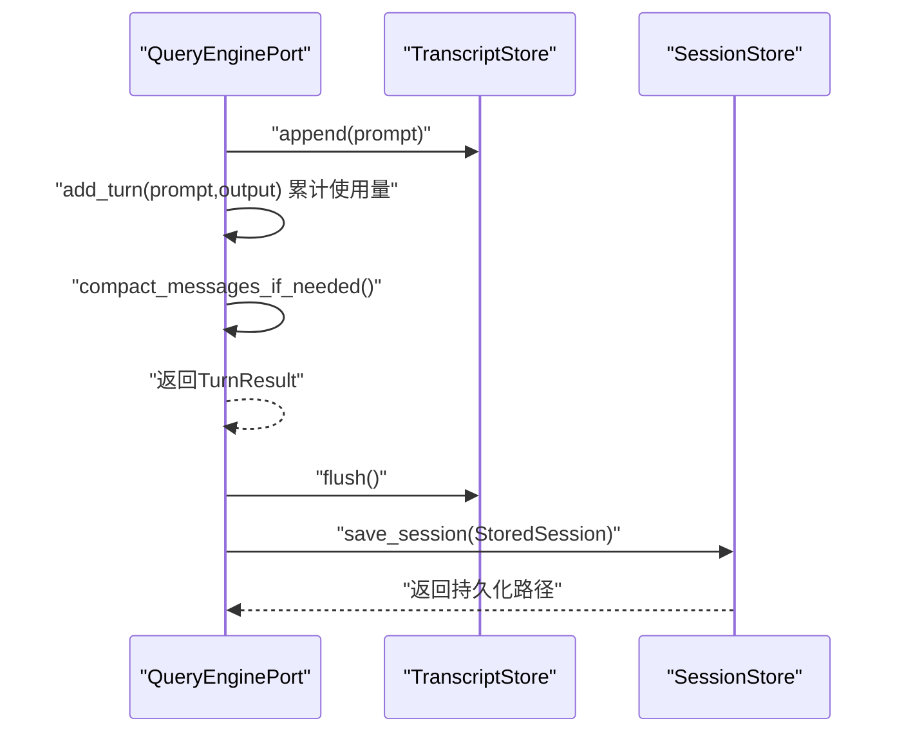
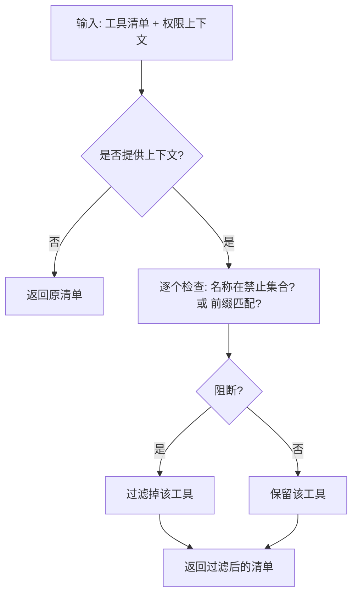
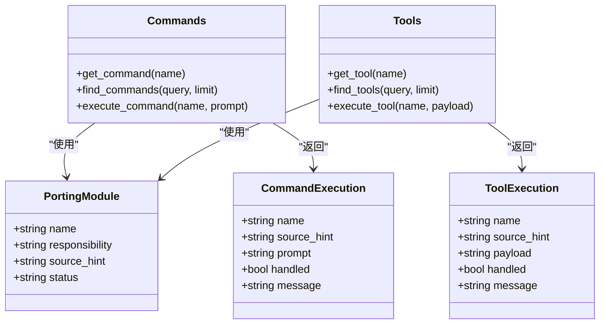
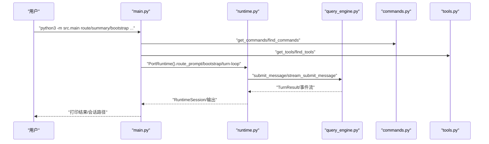
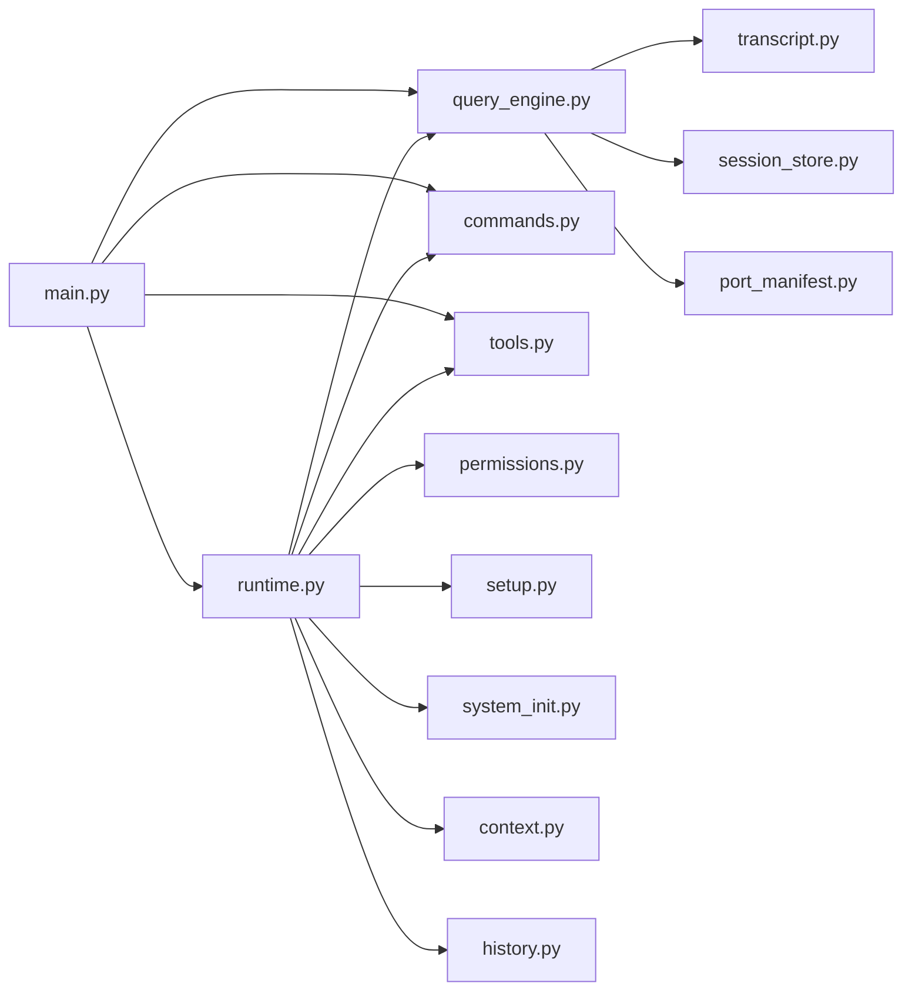

# 核心概念

<cite>
**本文引用的文件**
- [README.md](file://README.md)
- [src/main.py](file://src/main.py)
- [src/commands.py](file://src/commands.py)
- [src/tools.py](file://src/tools.py)
- [src/permissions.py](file://src/permissions.py)
- [src/session_store.py](file://src/session_store.py)
- [src/runtime.py](file://src/runtime.py)
- [src/query_engine.py](file://src/query_engine.py)
- [src/port_manifest.py](file://src/port_manifest.py)
- [src/context.py](file://src/context.py)
- [src/history.py](file://src/history.py)
- [src/transcript.py](file://src/transcript.py)
- [src/setup.py](file://src/setup.py)
- [src/system_init.py](file://src/system_init.py)
- [src/reference_data/commands_snapshot.json](file://src/reference_data/commands_snapshot.json)
- [src/reference_data/tools_snapshot.json](file://src/reference_data/tools_snapshot.json)
</cite>

## 目录
1. [引言](#引言)
2. [项目结构](#项目结构)
3. [核心组件](#核心组件)
4. [架构总览](#架构总览)
5. [详细组件分析](#详细组件分析)
6. [依赖分析](#依赖分析)
7. [性能考虑](#性能考虑)
8. [故障排查指南](#故障排查指南)
9. [结论](#结论)
10. [附录](#附录)

## 引言
本文件面向 CLAW 项目的“核心概念”，系统性阐述以下主题：
- 代码迁移原理：如何以“镜像快照”方式从 TypeScript 原版移植命令与工具清单，并在 Python 端以只读元数据驱动运行时行为。
- 命令路由系统：基于提示词分词与模块属性的启发式匹配，形成“命令/工具”的候选列表与排序。
- 会话管理机制：对话转录、持久化与使用量统计，支持回放与重启。
- 权限控制模型：通过工具权限上下文进行白/黑名单过滤，以及对高风险工具的显式阻断。

文档同时提供数据流分析、架构模式与设计决策的技术细节，并给出与传统软件架构的差异与优势，帮助初学者建立概念理解，同时为高级开发者提供实现层面的洞察。

## 项目结构
CLAW 的 Python 迁移工作区位于 src/，围绕“清单镜像 + 查询引擎 + 运行时”三层组织：
- 清单层：commands.py、tools.py 加载参考快照（JSON），生成只读的 PortingModule 列表，作为路由与执行的输入源。
- 查询引擎层：query_engine.py 负责回合式处理、令牌预算、结构化输出与会话持久化。
- 运行时层：runtime.py 将路由、执行注册、权限推断与历史记录整合，形成可报告的会话。
- 支撑模块：permissions.py、session_store.py、transcript.py、history.py、setup.py、system_init.py、port_manifest.py、context.py 提供权限、会话、历史、初始化与清单生成等能力。

图表来源
- [src/main.py:1-214](file://src/main.py#L1-L214)
- [src/commands.py:1-91](file://src/commands.py#L1-L91)
- [src/tools.py:1-97](file://src/tools.py#L1-L97)
- [src/query_engine.py:1-194](file://src/query_engine.py#L1-L194)
- [src/runtime.py:1-193](file://src/runtime.py#L1-L193)
- [src/permissions.py:1-21](file://src/permissions.py#L1-L21)
- [src/setup.py:1-78](file://src/setup.py#L1-L78)
- [src/system_init.py:1-24](file://src/system_init.py#L1-L24)
- [src/context.py:1-48](file://src/context.py#L1-L48)
- [src/history.py:1-23](file://src/history.py#L1-L23)
- [src/transcript.py:1-24](file://src/transcript.py#L1-L24)
- [src/session_store.py:1-36](file://src/session_store.py#L1-L36)
- [src/port_manifest.py:1-53](file://src/port_manifest.py#L1-L53)
- [src/reference_data/commands_snapshot.json:1-200](file://src/reference_data/commands_snapshot.json#L1-L200)
- [src/reference_data/tools_snapshot.json:1-200](file://src/reference_data/tools_snapshot.json#L1-L200)

章节来源
- [README.md:82-131](file://README.md#L82-L131)
- [src/main.py:21-91](file://src/main.py#L21-L91)

## 核心组件
- 清单与镜像快照
  - commands.py、tools.py 从 JSON 快照加载 PortingModule 列表，提供查询、过滤与执行占位。
  - 参考快照路径：commands_snapshot.json、tools_snapshot.json。
- 权限控制
  - permissions.py 定义 ToolPermissionContext，支持按名称与前缀阻断工具。
- 会话与转录
  - transcript.py 维护回合条目、紧凑策略与刷新标记；session_store.py 提供会话持久化与加载。
- 查询引擎
  - query_engine.py 提供回合提交、流式事件、结构化输出渲染、会话持久化与预算控制。
- 运行时
  - runtime.py 实现提示词路由、执行注册、权限推断、历史记录与会话报告。
- 上下文与清单
  - context.py 构建工作区上下文；port_manifest.py 生成顶层模块清单；setup.py/system_init.py 提供启动步骤与初始化消息。

章节来源
- [src/commands.py:13-91](file://src/commands.py#L13-L91)
- [src/tools.py:14-97](file://src/tools.py#L14-L97)
- [src/permissions.py:6-21](file://src/permissions.py#L6-L21)
- [src/transcript.py:6-24](file://src/transcript.py#L6-L24)
- [src/session_store.py:8-36](file://src/session_store.py#L8-L36)
- [src/query_engine.py:15-194](file://src/query_engine.py#L15-L194)
- [src/runtime.py:16-193](file://src/runtime.py#L16-L193)
- [src/context.py:7-48](file://src/context.py#L7-L48)
- [src/port_manifest.py:12-53](file://src/port_manifest.py#L12-L53)
- [src/setup.py:12-78](file://src/setup.py#L12-L78)
- [src/system_init.py:8-24](file://src/system_init.py#L8-L24)

## 架构总览
CLAW 的核心是“清单驱动的路由与执行”。CLI 解析子命令后，调用运行时或查询引擎完成路由、执行与会话持久化。权限控制贯穿工具选择与执行阶段，确保安全边界。

图表来源
- [src/main.py:94-214](file://src/main.py#L94-L214)
- [src/runtime.py:89-193](file://src/runtime.py#L89-L193)
- [src/query_engine.py:35-194](file://src/query_engine.py#L35-L194)
- [src/commands.py:22-41](file://src/commands.py#L22-L41)
- [src/tools.py:23-37](file://src/tools.py#L23-L37)
- [src/permissions.py:6-21](file://src/permissions.py#L6-L21)
- [src/session_store.py:19-36](file://src/session_store.py#L19-L36)

## 详细组件分析

### 命令路由系统
- 设计思想
  - 将提示词按分隔符拆分为词元集合，分别在命令/工具的 name/source_hint/responsibility 中检索命中，计算命中计数作为分数，优先返回“命令+工具”各一个，再按分数与名称排序补足。
- 关键流程
  - 输入：提示词字符串
  - 处理：分词 → 对每个模块计算命中的词元数量 → 排序 → 限制数量
  - 输出：RoutedMatch 列表（kind/name/score/source_hint）
- 与传统路由的差异
  - 不依赖外部 LLM 或复杂检索向量，而是基于“关键词命中计数”的轻量启发式，适合在本地快速评估与演示。

图表来源
- [src/runtime.py:89-107](file://src/runtime.py#L89-L107)
- [src/runtime.py:176-193](file://src/runtime.py#L176-L193)

章节来源
- [src/runtime.py:89-107](file://src/runtime.py#L89-L107)
- [src/runtime.py:176-193](file://src/runtime.py#L176-L193)

### 会话管理机制
- 设计思想
  - 使用 TranscriptStore 记录回合条目，支持紧凑策略与刷新标记；QueryEnginePort 在每回合更新使用量、记录权限阻断与匹配项，并在需要时持久化为 StoredSession。
- 关键流程
  - 提交回合：记录 prompt、累计使用量、应用紧凑策略、返回 TurnResult
  - 持久化：flush 转录、保存会话到 .port_sessions 目录
- 与传统会话的差异
  - 采用“紧凑窗口”与“转录刷新”策略，避免无限增长；会话以 JSON 文件形式持久化，便于审计与重放。

图表来源
- [src/query_engine.py:61-104](file://src/query_engine.py#L61-L104)
- [src/query_engine.py:129-150](file://src/query_engine.py#L129-L150)
- [src/transcript.py:11-24](file://src/transcript.py#L11-L24)
- [src/session_store.py:19-36](file://src/session_store.py#L19-L36)

章节来源
- [src/query_engine.py:61-104](file://src/query_engine.py#L61-L104)
- [src/query_engine.py:129-150](file://src/query_engine.py#L129-L150)
- [src/transcript.py:11-24](file://src/transcript.py#L11-L24)
- [src/session_store.py:19-36](file://src/session_store.py#L19-L36)

### 权限控制模型
- 设计思想
  - 通过 ToolPermissionContext 维护“禁止名称集合”和“禁止前缀元组”，在工具筛选阶段统一阻断；运行时对高风险工具（如破坏性 Bash）进行显式阻断并生成 PermissionDenial。
- 关键流程
  - 构造权限上下文：from_iterables
  - 工具过滤：filter_tools_by_permission_context
  - 运行时推断：_infer_permission_denials
- 与传统权限的差异
  - 以“白/黑名单 + 显式阻断”组合实现最小可用权限；不引入外部授权服务，适合本地开发与演示场景。

图表来源
- [src/tools.py:56-72](file://src/tools.py#L56-L72)
- [src/permissions.py:11-21](file://src/permissions.py#L11-L21)
- [src/runtime.py:169-174](file://src/runtime.py#L169-L174)

章节来源
- [src/tools.py:56-72](file://src/tools.py#L56-L72)
- [src/permissions.py:11-21](file://src/permissions.py#L11-L21)
- [src/runtime.py:169-174](file://src/runtime.py#L169-L174)

### 代码迁移原理
- 设计思想
  - 以“镜像快照”方式保留原始命令/工具的职责描述与来源提示，不直接复制实现，仅在 Python 端提供只读元数据与执行占位，保证合规性与可审计性。
- 关键点
  - 快照来源：commands_snapshot.json、tools_snapshot.json
  - 元数据结构：PortingModule(name, responsibility, source_hint, status)
  - 执行占位：execute_command/execute_tool 返回“镜像命令/工具将处理”的消息，便于演示与测试
- 与传统迁移的差异
  - 不追求运行时等价替换，而强调“表面一致 + 行为占位”，降低法律与技术风险，同时保持可观测性与可扩展性。

图表来源
- [src/models.py:14-26](file://src/models.py#L14-L26)
- [src/commands.py:13-20](file://src/commands.py#L13-L20)
- [src/tools.py:14-21](file://src/tools.py#L14-L21)
- [src/commands.py:52-80](file://src/commands.py#L52-L80)
- [src/tools.py:81-86](file://src/tools.py#L81-L86)

章节来源
- [src/models.py:14-26](file://src/models.py#L14-L26)
- [src/commands.py:13-20](file://src/commands.py#L13-L20)
- [src/tools.py:14-21](file://src/tools.py#L14-L21)
- [src/commands.py:52-80](file://src/commands.py#L52-L80)
- [src/tools.py:81-86](file://src/tools.py#L81-L86)
- [src/reference_data/commands_snapshot.json:1-200](file://src/reference_data/commands_snapshot.json#L1-L200)
- [src/reference_data/tools_snapshot.json:1-200](file://src/reference_data/tools_snapshot.json#L1-L200)

### CLI 与运行时交互
- 设计思想
  - CLI 作为单一入口，根据子命令调用相应功能：渲染摘要、列出清单、路由提示词、引导会话、执行命令/工具、加载会话等。
- 关键流程
  - 解析参数 → 构建 PortManifest → 调用对应模块 → 输出结果或会话报告

图表来源
- [src/main.py:94-214](file://src/main.py#L94-L214)
- [src/runtime.py:89-193](file://src/runtime.py#L89-L193)
- [src/query_engine.py:61-128](file://src/query_engine.py#L61-L128)
- [src/commands.py:52-90](file://src/commands.py#L52-L90)
- [src/tools.py:48-96](file://src/tools.py#L48-L96)

章节来源
- [src/main.py:94-214](file://src/main.py#L94-L214)
- [src/runtime.py:89-193](file://src/runtime.py#L89-L193)
- [src/query_engine.py:61-128](file://src/query_engine.py#L61-L128)
- [src/commands.py:52-90](file://src/commands.py#L52-L90)
- [src/tools.py:48-96](file://src/tools.py#L48-L96)

## 依赖分析
- 组件耦合
  - runtime.py 依赖 commands.py、tools.py、permissions.py、query_engine.py、setup.py、system_init.py、context.py、history.py，体现“路由/执行/权限/上下文/历史”的集成。
  - query_engine.py 依赖 transcript.py、session_store.py、models.py、port_manifest.py，体现“回合处理/会话持久化/清单生成”的协作。
  - CLI 通过 main.py 聚合所有功能，形成清晰的入口与出口。
- 外部依赖
  - JSON 快照文件用于只读元数据；标准库（dataclasses、argparse、json、pathlib、functools.lru_cache）为主。
- 循环依赖
  - 当前模块间无循环导入迹象，职责边界清晰。

图表来源
- [src/main.py:1-214](file://src/main.py#L1-L214)
- [src/runtime.py:1-193](file://src/runtime.py#L1-L193)
- [src/query_engine.py:1-194](file://src/query_engine.py#L1-L194)
- [src/commands.py:1-91](file://src/commands.py#L1-L91)
- [src/tools.py:1-97](file://src/tools.py#L1-L97)
- [src/permissions.py:1-21](file://src/permissions.py#L1-L21)
- [src/setup.py:1-78](file://src/setup.py#L1-L78)
- [src/system_init.py:1-24](file://src/system_init.py#L1-L24)
- [src/context.py:1-48](file://src/context.py#L1-L48)
- [src/history.py:1-23](file://src/history.py#L1-L23)
- [src/transcript.py:1-24](file://src/transcript.py#L1-L24)
- [src/session_store.py:1-36](file://src/session_store.py#L1-L36)
- [src/port_manifest.py:1-53](file://src/port_manifest.py#L1-L53)

章节来源
- [src/main.py:1-214](file://src/main.py#L1-L214)
- [src/runtime.py:1-193](file://src/runtime.py#L1-L193)
- [src/query_engine.py:1-194](file://src/query_engine.py#L1-L194)

## 性能考虑
- 路由评分
  - 分词与集合查找为线性成本；模块规模较大时可考虑预构建索引或缓存词元映射，但当前实现以 LRU 缓存加载快照，已具备基本性能保障。
- 会话紧凑
  - 超过阈值时仅保留最近 N 条消息，避免内存膨胀；建议根据任务长度调整 compact_after_turns。
- 结构化输出
  - JSON 序列化失败时自动重试并降级，保证稳定性；建议在生产环境监控序列化异常频率。
- 权限过滤
  - 过滤逻辑为线性扫描，配合 frozenset/frozenset 前缀集合，开销可控；大规模工具集时可考虑前缀树优化。

## 故障排查指南
- 未知命令/工具
  - 现象：执行命令/工具返回未找到
  - 排查：确认名称大小写、是否被权限上下文阻断、是否在快照中存在
  - 参考路径：[src/commands.py:75-80](file://src/commands.py#L75-L80)、[src/tools.py:81-86](file://src/tools.py#L81-L86)
- 会话无法加载
  - 现象：加载会话时报错
  - 排查：确认 .port_sessions 目录存在且包含目标 session_id.json；检查 JSON 格式
  - 参考路径：[src/session_store.py:27-36](file://src/session_store.py#L27-L36)
- 超出令牌预算
  - 现象：回合停止原因显示 max_budget_reached
  - 排查：提高 max_budget_tokens 或减少回合数；检查 UsageSummary 累计值
  - 参考路径：[src/query_engine.py:67-90](file://src/query_engine.py#L67-L90)
- 高风险工具被阻断
  - 现象：工具被显式阻断
  - 排查：检查 _infer_permission_denials 逻辑与 deny 列表
  - 参考路径：[src/runtime.py:169-174](file://src/runtime.py#L169-L174)

章节来源
- [src/commands.py:75-80](file://src/commands.py#L75-L80)
- [src/tools.py:81-86](file://src/tools.py#L81-L86)
- [src/session_store.py:27-36](file://src/session_store.py#L27-L36)
- [src/query_engine.py:67-90](file://src/query_engine.py#L67-L90)
- [src/runtime.py:169-174](file://src/runtime.py#L169-L174)

## 结论
CLAW 的核心在于“以镜像快照驱动的路由与执行”，结合轻量权限控制与会话持久化，形成可审计、可扩展且合规的本地代理工作台。其优势体现在：
- 合规性：不复制实现，仅使用元数据与执行占位
- 可观测性：路由、执行、权限、历史与会话均可见可导出
- 可维护性：模块职责清晰，CLI 单一入口，易于扩展新命令/工具与运行模式

## 附录
- 快照文件位置
  - 命令快照：[src/reference_data/commands_snapshot.json](file://src/reference_data/commands_snapshot.json)
  - 工具快照：[src/reference_data/tools_snapshot.json](file://src/reference_data/tools_snapshot.json)
- CLI 子命令速览
  - summary、manifest、parity-audit、setup-report、command-graph、tool-pool、bootstrap-graph、subsystems、commands、tools、route、bootstrap、turn-loop、flush-transcript、load-session、remote-mode、ssh-mode、teleport-mode、direct-connect-mode、deep-link-mode、show-command、show-tool、exec-command、exec-tool

章节来源
- [src/main.py:21-91](file://src/main.py#L21-L91)
- [src/reference_data/commands_snapshot.json:1-200](file://src/reference_data/commands_snapshot.json#L1-L200)
- [src/reference_data/tools_snapshot.json:1-200](file://src/reference_data/tools_snapshot.json#L1-L200)