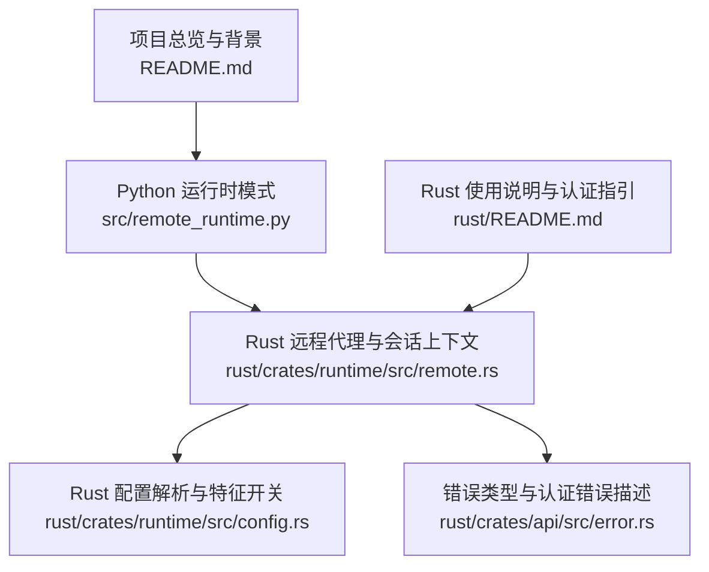
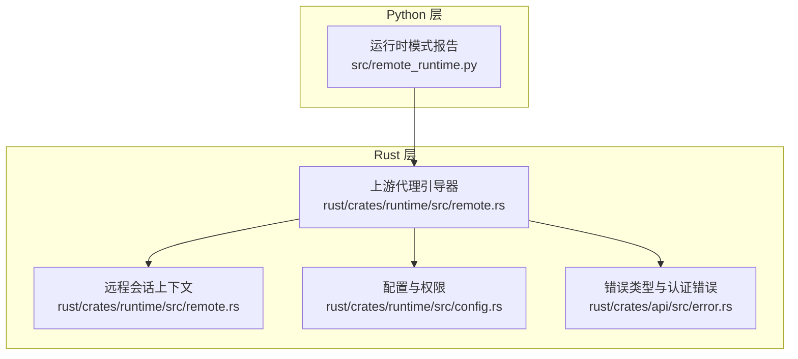
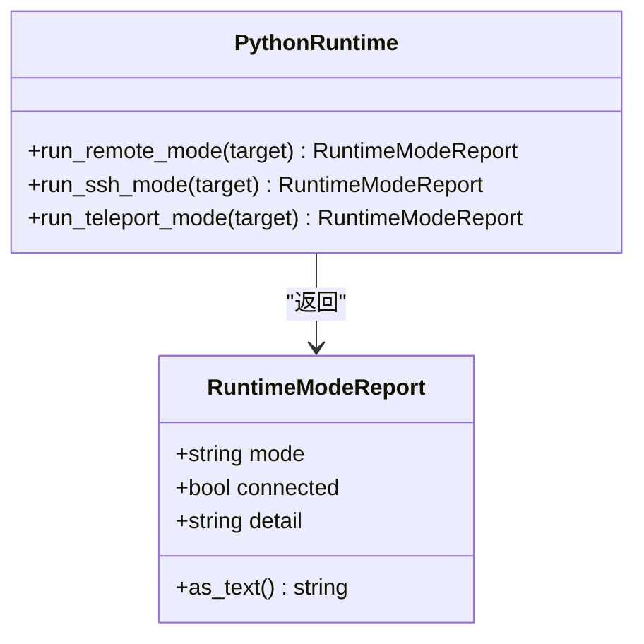
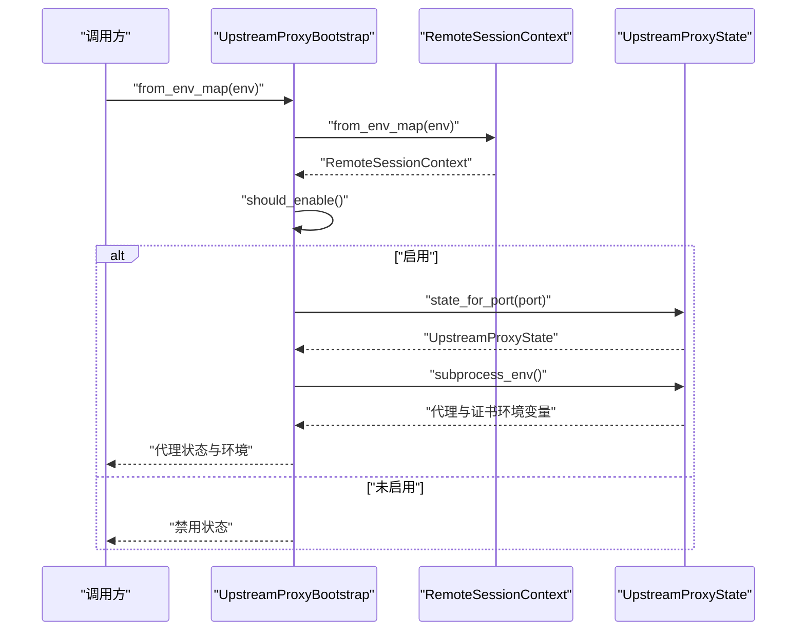
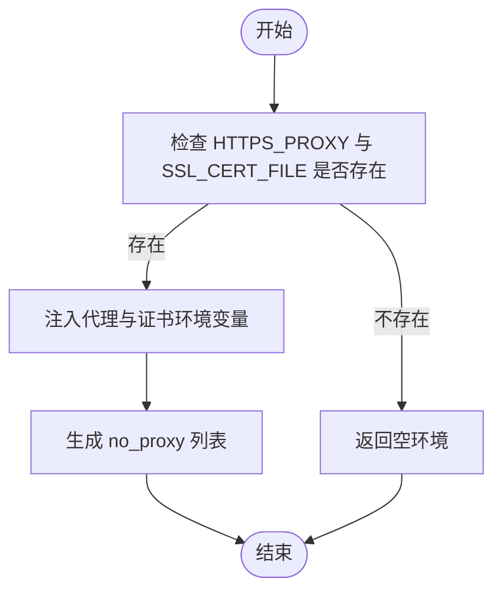

# SSH 模式

<cite>
**本文引用的文件**
- [src/remote_runtime.py](file://src/remote_runtime.py)
- [rust/crates/runtime/src/remote.rs](file://rust/crates/runtime/src/remote.rs)
- [rust/crates/runtime/src/config.rs](file://rust/crates/runtime/src/config.rs)
- [rust/crates/api/src/error.rs](file://rust/crates/api/src/error.rs)
- [rust/README.md](file://rust/README.md)
- [README.md](file://README.md)
</cite>

## 目录
1. [简介](#简介)
2. [项目结构](#项目结构)
3. [核心组件](#核心组件)
4. [架构总览](#架构总览)
5. [详细组件分析](#详细组件分析)
6. [依赖分析](#依赖分析)
7. [性能考虑](#性能考虑)
8. [故障排查指南](#故障排查指南)
9. [结论](#结论)
10. [附录](#附录)

## 简介
本文件面向 CLAW 的 SSH 运行模式，系统化阐述其在当前代码库中的定位、可扩展边界以及与远程代理（Upstream Proxy）和安全上下文（证书、代理、令牌）的集成方式。需要特别说明的是：当前仓库中 SSH 模式为占位实现，核心的 SSH 通道、密钥认证与会话管理尚未落地；但围绕“远程模式”“上游代理”“证书链与代理环境注入”的基础设施已具备，可作为后续 SSH 模式的实现基础。

## 项目结构
- Python 层提供运行时模式报告的占位实现，其中 SSH 模式返回“占位准备就绪”的状态报告。
- Rust 层提供“远程会话上下文”“上游代理引导器”“代理状态与子进程环境注入”等能力，这些能力可直接复用到 SSH 模式中，用于建立安全连接、注入代理与证书、管理会话生命周期。
- 配置层支持 MCP 服务、OAuth、权限模式、沙箱隔离等，为 SSH 模式下的工具调用与权限控制提供基础。

**图示来源**
- [src/remote_runtime.py:16-25](file://src/remote_runtime.py#L16-L25)
- [rust/crates/runtime/src/remote.rs:41-146](file://rust/crates/runtime/src/remote.rs#L41-L146)
- [rust/crates/runtime/src/config.rs:31-57](file://rust/crates/runtime/src/config.rs#L31-L57)
- [rust/crates/api/src/error.rs:72-109](file://rust/crates/api/src/error.rs#L72-L109)
- [rust/README.md:22-36](file://rust/README.md#L22-L36)
- [README.md:66-74](file://README.md#L66-L74)

**章节来源**
- [src/remote_runtime.py:16-25](file://src/remote_runtime.py#L16-L25)
- [rust/crates/runtime/src/remote.rs:41-146](file://rust/crates/runtime/src/remote.rs#L41-L146)
- [rust/crates/runtime/src/config.rs:31-57](file://rust/crates/runtime/src/config.rs#L31-L57)
- [rust/README.md:22-36](file://rust/README.md#L22-L36)
- [README.md:66-74](file://README.md#L66-L74)

## 核心组件
- 运行时模式报告（Python 占位）
  - 提供统一的模式报告结构，包含模式名、连接状态与详情文本。
  - SSH 模式返回“占位准备就绪”的报告，表明后续将由 Rust 上下文接管实际连接与会话管理。
- 远程会话上下文与上游代理引导器（Rust）
  - 解析远程启用标志、会话 ID、基础 URL，并据此推导 WebSocket 地址。
  - 支持从环境变量继承上游代理配置，注入 HTTPS_PROXY、NO_PROXY、SSL_CERT_FILE 等关键变量。
  - 提供“是否启用”的判定逻辑，确保在缺少令牌或会话 ID 时不开启代理。
- 证书与代理环境注入
  - 统一的 no_proxy 列表，覆盖内网与常见域名。
  - 将 CA bundle 路径注入到多种常见环境变量，保证下游工具链（如 curl、requests、node）使用一致的信任链。
- 配置与权限
  - 配置加载器支持多级配置源合并，提供权限模式、插件、MCP 服务器等能力，为 SSH 模式下的工具调用与权限控制提供基础。

**章节来源**
- [src/remote_runtime.py:6-25](file://src/remote_runtime.py#L6-L25)
- [rust/crates/runtime/src/remote.rs:41-146](file://rust/crates/runtime/src/remote.rs#L41-L146)
- [rust/crates/runtime/src/remote.rs:160-182](file://rust/crates/runtime/src/remote.rs#L160-L182)
- [rust/crates/runtime/src/remote.rs:213-218](file://rust/crates/runtime/src/remote.rs#L213-L218)
- [rust/crates/runtime/src/config.rs:31-57](file://rust/crates/runtime/src/config.rs#L31-L57)

## 架构总览
SSH 模式的整体架构建议如下：Python 层负责模式入口与报告输出；Rust 层负责安全连接建立（含主机密钥校验、密钥认证、会话管理）、代理与证书注入、以及与上游代理的握手；配置层提供权限与工具链能力，确保在受限环境中安全执行。

**图示来源**
- [src/remote_runtime.py:16-25](file://src/remote_runtime.py#L16-L25)
- [rust/crates/runtime/src/remote.rs:41-146](file://rust/crates/runtime/src/remote.rs#L41-L146)
- [rust/crates/runtime/src/config.rs:31-57](file://rust/crates/runtime/src/config.rs#L31-L57)
- [rust/crates/api/src/error.rs:72-109](file://rust/crates/api/src/error.rs#L72-L109)

## 详细组件分析

### 组件 A：运行时模式报告（Python 占位）
- 角色与职责
  - 定义统一的模式报告数据结构，包含模式名、连接状态与详情。
  - 提供 SSH 模式占位实现，返回“占位准备就绪”的报告，便于上层路由与后续 Rust 实现对接。
- 关键点
  - 报告文本包含目标信息，便于调试与日志追踪。
  - 该组件不涉及具体网络连接，仅作为桥接层存在。

**图示来源**
- [src/remote_runtime.py:6-25](file://src/remote_runtime.py#L6-L25)

**章节来源**
- [src/remote_runtime.py:6-25](file://src/remote_runtime.py#L6-L25)

### 组件 B：远程会话上下文与上游代理引导器（Rust）
- 角色与职责
  - RemoteSessionContext：从环境变量读取远程启用标志、会话 ID、基础 URL。
  - UpstreamProxyBootstrap：根据上下文与令牌路径生成代理状态，决定是否启用上游代理，并计算 WebSocket URL。
  - UpstreamProxyState：生成子进程可用的代理与证书环境变量，确保下游工具链使用一致的信任链。
- 关键流程
  - 环境变量解析与默认值处理。
  - 令牌读取与有效性判断。
  - 代理 URL 推导与 no_proxy 列表生成。
  - 子进程环境变量注入。

**图示来源**
- [rust/crates/runtime/src/remote.rs:66-146](file://rust/crates/runtime/src/remote.rs#L66-L146)
- [rust/crates/runtime/src/remote.rs:160-182](file://rust/crates/runtime/src/remote.rs#L160-L182)

**章节来源**
- [rust/crates/runtime/src/remote.rs:66-146](file://rust/crates/runtime/src/remote.rs#L66-L146)
- [rust/crates/runtime/src/remote.rs:160-182](file://rust/crates/runtime/src/remote.rs#L160-L182)

### 组件 C：证书与代理环境注入
- 角色与职责
  - no_proxy 列表集中维护，覆盖本地回环、私有网段与常见域名。
  - 将 CA bundle 路径注入到 HTTPS_PROXY、SSL_CERT_FILE、NODE_EXTRA_CA_CERTS、REQUESTS_CA_BUNDLE、CURL_CA_BUNDLE 等变量，确保跨语言工具链一致性。
- 关键点
  - 代理与证书变量成对注入，避免只设置代理而信任链缺失。
  - 支持从父进程环境继承代理与证书，减少重复配置。

**图示来源**
- [rust/crates/runtime/src/remote.rs:221-235](file://rust/crates/runtime/src/remote.rs#L221-L235)
- [rust/crates/runtime/src/remote.rs:213-218](file://rust/crates/runtime/src/remote.rs#L213-L218)

**章节来源**
- [rust/crates/runtime/src/remote.rs:213-235](file://rust/crates/runtime/src/remote.rs#L213-L235)

### 组件 D：配置与权限（为 SSH 模式提供基础）
- 角色与职责
  - 配置加载器支持用户、项目、本地多级配置源合并，提供权限模式、插件、MCP 服务器等能力。
  - 权限模式包括只读、工作区写入、危险全权限，为 SSH 模式下的工具调用提供安全边界。
- 关键点
  - 配置项通过 JSON 合并，支持按作用域（用户/项目/本地）覆盖。
  - 权限规则允许白名单、黑名单与询问策略，便于在受限环境中精细控制。

**章节来源**
- [rust/crates/runtime/src/config.rs:31-57](file://rust/crates/runtime/src/config.rs#L31-L57)
- [rust/crates/runtime/src/config.rs:637-705](file://rust/crates/runtime/src/config.rs#L637-L705)

## 依赖分析
- Python 运行时模式报告依赖于 Rust 的远程代理与会话上下文，以实现“占位到真实”的平滑过渡。
- Rust 远程代理引导器依赖于配置层提供的权限与工具链能力，确保在受限环境中安全执行。
- 错误类型与认证错误描述为上游代理与 SSH 模式提供一致的错误语义，便于统一处理与上报。

**图示来源**
- [src/remote_runtime.py:16-25](file://src/remote_runtime.py#L16-L25)
- [rust/crates/runtime/src/remote.rs:89-146](file://rust/crates/runtime/src/remote.rs#L89-L146)
- [rust/crates/runtime/src/config.rs:31-57](file://rust/crates/runtime/src/config.rs#L31-L57)
- [rust/crates/api/src/error.rs:72-109](file://rust/crates/api/src/error.rs#L72-L109)

**章节来源**
- [src/remote_runtime.py:16-25](file://src/remote_runtime.py#L16-L25)
- [rust/crates/runtime/src/remote.rs:89-146](file://rust/crates/runtime/src/remote.rs#L89-L146)
- [rust/crates/runtime/src/config.rs:31-57](file://rust/crates/runtime/src/config.rs#L31-L57)
- [rust/crates/api/src/error.rs:72-109](file://rust/crates/api/src/error.rs#L72-L109)

## 性能考虑
- 代理与证书环境注入采用一次性构建映射的方式，避免在热路径重复计算。
- no_proxy 列表预先拼接为逗号分隔字符串，减少运行时拼接开销。
- 令牌读取与文件系统访问仅在初始化阶段进行，后续复用结果。

## 故障排查指南
- 认证失败与过期
  - 当保存的 OAuth 令牌过期且无刷新令牌时，会返回明确的认证错误提示，需重新登录或检查令牌来源。
- 环境变量缺失
  - 若缺少 HTTPS_PROXY 或 SSL_CERT_FILE，上游代理环境会被拒绝注入，导致下游工具链无法正确使用代理与证书。
- 会话与令牌问题
  - 当 CLAUDE_CODE_REMOTE 启用但缺少会话 ID 或令牌时，上游代理不会启用，应检查令牌路径与会话 ID 设置。
- 基础 URL 与 WebSocket
  - 基础 URL 的协议前缀会影响 WebSocket URL 的推导（https/http），若连接失败，请核对基础 URL 与代理端点。

**章节来源**
- [rust/crates/api/src/error.rs:72-109](file://rust/crates/api/src/error.rs#L72-L109)
- [rust/crates/runtime/src/remote.rs:221-235](file://rust/crates/runtime/src/remote.rs#L221-L235)
- [rust/crates/runtime/src/remote.rs:122-128](file://rust/crates/runtime/src/remote.rs#L122-L128)
- [rust/crates/runtime/src/remote.rs:200-211](file://rust/crates/runtime/src/remote.rs#L200-L211)

## 结论
- 当前 SSH 模式为占位实现，核心的 SSH 通道、密钥认证与会话管理尚未落地。
- Rust 层的远程会话上下文、上游代理引导器、证书与代理环境注入能力，为 SSH 模式的实现提供了坚实基础。
- 建议在现有基础设施之上，补充 SSH 客户端握手、主机密钥校验、密钥认证与会话生命周期管理，同时沿用现有的权限与配置体系，确保安全与可运维性。

## 附录
- 部署与认证指引
  - 可参考 Rust 使用说明中的认证与代理配置，结合上游代理能力完成部署。
- 参考文件
  - [README.md:66-74](file://README.md#L66-L74)
  - [rust/README.md:22-36](file://rust/README.md#L22-L36)