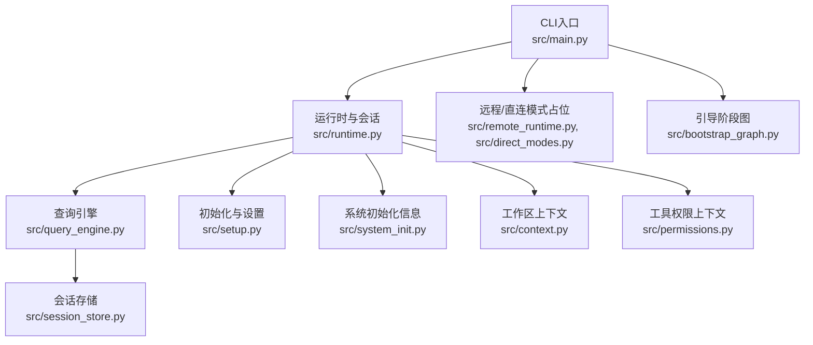
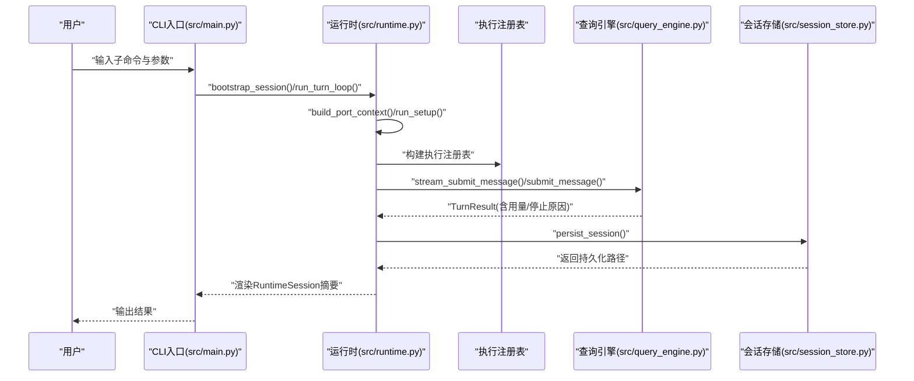
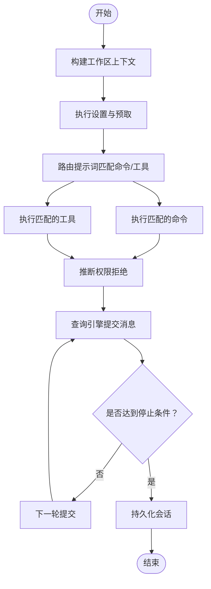
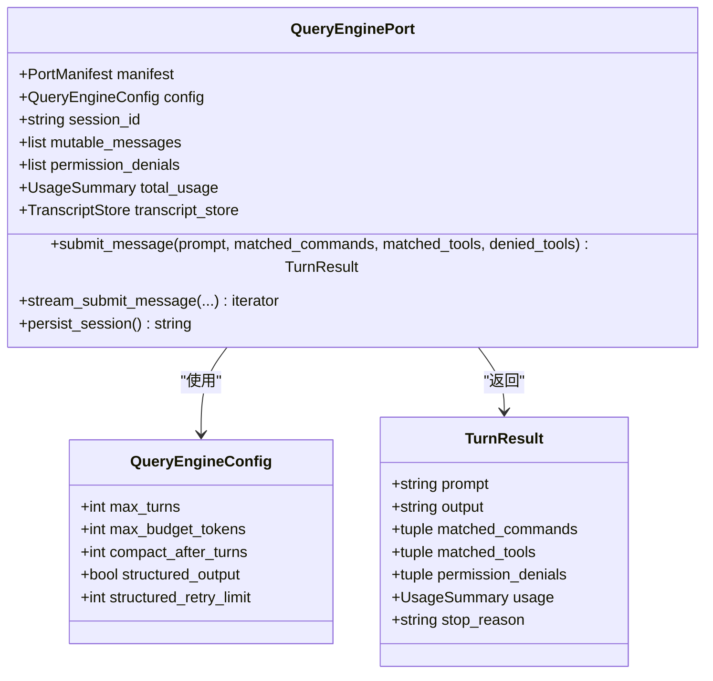
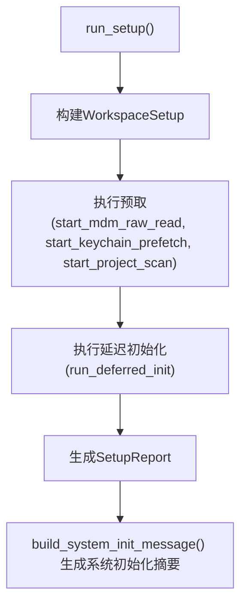
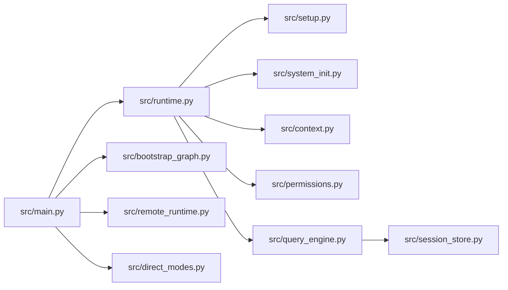

# 本地模式

<cite>
**本文引用的文件**
- [src/main.py](file://src/main.py)
- [src/runtime.py](file://src/runtime.py)
- [src/query_engine.py](file://src/query_engine.py)
- [src/setup.py](file://src/setup.py)
- [src/system_init.py](file://src/system_init.py)
- [src/context.py](file://src/context.py)
- [src/session_store.py](file://src/session_store.py)
- [src/permissions.py](file://src/permissions.py)
- [src/bootstrap_graph.py](file://src/bootstrap_graph.py)
- [src/remote_runtime.py](file://src/remote_runtime.py)
- [src/direct_modes.py](file://src/direct_modes.py)
- [README.md](file://README.md)
</cite>

## 目录
1. [简介](#简介)
2. [项目结构](#项目结构)
3. [核心组件](#核心组件)
4. [架构总览](#架构总览)
5. [详细组件分析](#详细组件分析)
6. [依赖关系分析](#依赖关系分析)
7. [性能考量](#性能考量)
8. [故障排查指南](#故障排查指南)
9. [结论](#结论)
10. [附录](#附录)

## 简介
本文件面向“本地运行模式”的技术文档，聚焦于 CLAW 的 Python 端本地模式实现。本地模式以“镜像命令/工具清单 + 查询引擎”为核心，通过路由提示词选择匹配的命令或工具，并在受限信任环境下执行，同时记录会话与用量统计。文档将从实现原理、核心组件、运行机制、内存与资源管理、启动与初始化流程、状态管理、配置参数、性能调优、与系统资源交互及安全隔离等方面进行系统化阐述。

## 项目结构
本地模式相关的关键模块分布如下：
- CLI 入口与子命令解析：负责解析用户输入、路由到具体功能（如路由、引导会话、回合循环等）
- 运行时与会话：封装上下文、设置、历史、路由结果、工具/命令执行消息、流事件与持久化路径
- 查询引擎：承载对话回合、用量统计、令牌预算控制、消息压缩与会话持久化
- 初始化与上下文：构建工作区上下文、系统初始化信息、启动步骤报告
- 权限与安全：工具权限上下文，用于拒绝特定工具或前缀
- 会话存储：保存/加载会话，支持本地持久化目录
- 模式分支：远程/SSH/Teleport/直连/深链等模式占位，本地模式为默认主流程

图表来源
- [src/main.py:94-214](file://src/main.py#L94-L214)
- [src/runtime.py:89-193](file://src/runtime.py#L89-L193)
- [src/query_engine.py:35-194](file://src/query_engine.py#L35-L194)
- [src/setup.py:64-78](file://src/setup.py#L64-L78)
- [src/system_init.py:8-24](file://src/system_init.py#L8-L24)
- [src/context.py:19-48](file://src/context.py#L19-L48)
- [src/permissions.py:6-21](file://src/permissions.py#L6-L21)
- [src/session_store.py:19-36](file://src/session_store.py#L19-L36)
- [src/remote_runtime.py:16-25](file://src/remote_runtime.py#L16-L25)
- [src/direct_modes.py:16-21](file://src/direct_modes.py#L16-L21)
- [src/bootstrap_graph.py:16-27](file://src/bootstrap_graph.py#L16-L27)

章节来源
- [src/main.py:94-214](file://src/main.py#L94-L214)
- [README.md:82-111](file://README.md#L82-L111)

## 核心组件
- 运行时与会话（PortRuntime/RuntimeSession）
  - 负责提示词路由、构建会话、执行命令/工具、收集权限拒绝、驱动查询引擎提交与流式输出、持久化会话
- 查询引擎（QueryEnginePort/TurnResult/QueryEngineConfig）
  - 提交单轮对话、流式事件、令牌预算控制、消息压缩、用量统计、会话持久化
- 初始化与设置（WorkspaceSetup/SetupReport/run_setup）
  - 收集 Python 版本/实现/平台信息，执行预取与延迟初始化，生成启动步骤报告
- 系统初始化信息（build_system_init_message）
  - 输出受信任模式下的系统初始化摘要
- 工作区上下文（PortContext/build_port_context）
  - 统计源码/测试/资源文件数量，判断归档可用性
- 权限上下文（ToolPermissionContext）
  - 基于名称/前缀拒绝工具使用
- 会话存储（StoredSession/save_session/load_session）
  - 本地 JSON 文件持久化，支持加载与复用
- CLI 子命令（src/main.py）
  - 提供路由、引导会话、回合循环、会话加载/持久化、模式占位等命令入口

章节来源
- [src/runtime.py:24-193](file://src/runtime.py#L24-L193)
- [src/query_engine.py:15-194](file://src/query_engine.py#L15-L194)
- [src/setup.py:12-78](file://src/setup.py#L12-L78)
- [src/system_init.py:8-24](file://src/system_init.py#L8-L24)
- [src/context.py:7-48](file://src/context.py#L7-L48)
- [src/permissions.py:6-21](file://src/permissions.py#L6-L21)
- [src/session_store.py:8-36](file://src/session_store.py#L8-L36)
- [src/main.py:21-214](file://src/main.py#L21-L214)

## 架构总览
本地模式的运行路径遵循“引导阶段 → 信任门控 → 初始化 → 路由 → 执行 → 查询引擎 → 会话持久化”的主线流程。CLI 解析后进入 PortRuntime，构建上下文与设置，路由提示词匹配命令/工具，执行器返回消息，查询引擎汇总用量与停止原因，最终持久化会话并输出摘要。

图表来源
- [src/main.py:150-159](file://src/main.py#L150-L159)
- [src/runtime.py:109-152](file://src/runtime.py#L109-L152)
- [src/query_engine.py:61-128](file://src/query_engine.py#L61-L128)
- [src/session_store.py:19-24](file://src/session_store.py#L19-L24)

## 详细组件分析

### 运行时与会话（PortRuntime/RuntimeSession）
- 路由逻辑
  - 将提示词分词，按命令与工具两类匹配，计算匹配分数，限制返回数量
- 引导会话
  - 构建上下文、执行设置、历史记录、查询引擎实例、执行命令/工具、收集权限拒绝、流式事件与最终 TurnResult
- 回合循环
  - 在最大回合数内迭代提交，根据停止原因提前终止
- 权限推断
  - 对某些高危工具（如包含“bash”的工具）进行权限拒绝推断

图表来源
- [src/runtime.py:89-174](file://src/runtime.py#L89-L174)
- [src/query_engine.py:61-104](file://src/query_engine.py#L61-L104)

章节来源
- [src/runtime.py:89-193](file://src/runtime.py#L89-L193)

### 查询引擎（QueryEnginePort/TurnResult/QueryEngineConfig）
- 配置项
  - 最大回合数、令牌预算、消息压缩阈值、结构化输出开关与重试次数
- 单轮处理
  - 格式化输出、估算用量、检查预算、追加消息与权限拒绝、压缩消息、返回 TurnResult
- 流式接口
  - 产出 message_start/command_match/tool_match/permission_denial/message_delta/message_stop 等事件
- 会话持久化
  - 刷新转录、保存会话至 JSON 文件，返回路径

图表来源
- [src/query_engine.py:15-44](file://src/query_engine.py#L15-L44)
- [src/query_engine.py:61-151](file://src/query_engine.py#L61-L151)

章节来源
- [src/query_engine.py:15-194](file://src/query_engine.py#L15-L194)

### 初始化与系统信息（WorkspaceSetup/SetupReport/build_system_init_message）
- WorkspaceSetup
  - 记录 Python 版本/实现/平台名，定义启动步骤序列
- SetupReport
  - 汇总设置、预取结果、延迟初始化结果、可信标记与当前工作目录
- build_system_init_message
  - 基于设置与已加载命令/工具生成系统初始化摘要

图表来源
- [src/setup.py:64-78](file://src/setup.py#L64-L78)
- [src/system_init.py:8-24](file://src/system_init.py#L8-L24)

章节来源
- [src/setup.py:12-78](file://src/setup.py#L12-L78)
- [src/system_init.py:8-24](file://src/system_init.py#L8-L24)

### 工作区上下文（PortContext/build_port_context）
- 统计源码、测试、资源文件数量，判断归档可用性，用于路由与初始化阶段的上下文感知

章节来源
- [src/context.py:7-48](file://src/context.py#L7-L48)

### 权限上下文（ToolPermissionContext）
- 基于工具名或前缀集合进行拒绝判定，支持 CLI 参数注入

章节来源
- [src/permissions.py:6-21](file://src/permissions.py#L6-L21)

### 会话存储（StoredSession/save_session/load_session）
- 默认会话目录为 .port_sessions，保存/加载 JSON 文件，包含会话 ID、消息列表与用量统计

章节来源
- [src/session_store.py:8-36](file://src/session_store.py#L8-L36)

### CLI 子命令与模式分支
- 子命令
  - route、bootstrap、turn-loop、flush-transcript、load-session、commands、tools、manifest、parity-audit 等
- 模式分支
  - remote-mode、ssh-mode、teleport-mode、direct-connect-mode、deep-link-mode 为占位输出，本地模式为主流程

章节来源
- [src/main.py:21-214](file://src/main.py#L21-L214)
- [src/remote_runtime.py:16-25](file://src/remote_runtime.py#L16-L25)
- [src/direct_modes.py:16-21](file://src/direct_modes.py#L16-L21)

## 依赖关系分析
- CLI 依赖运行时与查询引擎，运行时依赖设置、上下文、权限与查询引擎；查询引擎依赖会话存储与端口清单
- 引导阶段图明确“本地/远程/SSH/Teleport/直连/深链”模式分支，本地模式为默认主流程

图表来源
- [src/main.py:94-214](file://src/main.py#L94-L214)
- [src/runtime.py:89-193](file://src/runtime.py#L89-L193)
- [src/query_engine.py:35-194](file://src/query_engine.py#L35-L194)
- [src/setup.py:64-78](file://src/setup.py#L64-L78)
- [src/system_init.py:8-24](file://src/system_init.py#L8-L24)
- [src/context.py:19-48](file://src/context.py#L19-L48)
- [src/permissions.py:6-21](file://src/permissions.py#L6-L21)
- [src/session_store.py:19-36](file://src/session_store.py#L19-L36)
- [src/bootstrap_graph.py:16-27](file://src/bootstrap_graph.py#L16-L27)
- [src/remote_runtime.py:16-25](file://src/remote_runtime.py#L16-L25)
- [src/direct_modes.py:16-21](file://src/direct_modes.py#L16-L21)

章节来源
- [src/bootstrap_graph.py:16-27](file://src/bootstrap_graph.py#L16-L27)

## 性能考量
- 令牌预算与回合数
  - 通过 QueryEngineConfig 控制 max_budget_tokens 与 max_turns，避免超长对话导致内存膨胀
- 消息压缩
  - compact_after_turns 控制消息窗口大小，减少内存占用
- 结构化输出重试
  - structured_retry_limit 限制结构化输出失败时的重试次数，降低异常开销
- 预取与延迟初始化
  - run_setup 中的预取与延迟初始化有助于缩短首次交互等待时间
- 会话刷新与持久化
  - persist_session 前 flush_transcript，避免重复写入与磁盘压力

章节来源
- [src/query_engine.py:15-22](file://src/query_engine.py#L15-L22)
- [src/query_engine.py:129-132](file://src/query_engine.py#L129-L132)
- [src/setup.py:64-78](file://src/setup.py#L64-L78)

## 故障排查指南
- 无匹配命令/工具
  - 使用 route 子命令查看匹配结果；确认提示词关键词与镜像清单一致
- 会话无法加载
  - 检查 .port_sessions 目录是否存在对应 JSON 文件；确认 session_id 正确
- 令牌预算耗尽
  - 调整 QueryEngineConfig.max_budget_tokens 或减少回合数
- 权限拒绝
  - 使用 tools 子命令配合 --deny-tool/--deny-prefix 指定拒绝名单
- 启动步骤异常
  - 查看 setup-report 输出，定位预取或延迟初始化阶段的问题

章节来源
- [src/main.py:142-149](file://src/main.py#L142-L149)
- [src/session_store.py:27-36](file://src/session_store.py#L27-L36)
- [src/query_engine.py:89-90](file://src/query_engine.py#L89-L90)
- [src/permissions.py:18-21](file://src/permissions.py#L18-L21)
- [src/setup.py:38-53](file://src/setup.py#L38-L53)

## 结论
本地模式以“镜像命令/工具 + 查询引擎”为核心，结合受限信任环境与权限控制，在不依赖外部远程服务的前提下完成提示词路由、执行与会话持久化。通过合理的令牌预算、消息压缩与预取/延迟初始化策略，可在保证安全性的同时提升交互效率。后续可进一步完善工具沙箱与 MCP 集成，以增强本地模式的安全隔离与扩展能力。

## 附录

### 本地模式启动与初始化流程
- CLI 解析 → 构建端口清单 → 初始化设置与预取 → 延迟初始化 → 构建系统初始化信息 → 路由提示词 → 执行命令/工具 → 查询引擎提交 → 会话持久化

章节来源
- [src/main.py:94-214](file://src/main.py#L94-L214)
- [src/bootstrap_graph.py:16-27](file://src/bootstrap_graph.py#L16-L27)

### 本地模式配置参数
- 查询引擎配置（QueryEngineConfig）
  - max_turns：最大回合数
  - max_budget_tokens：令牌预算上限
  - compact_after_turns：消息压缩阈值
  - structured_output：是否启用结构化输出
  - structured_retry_limit：结构化输出重试次数
- 工具权限上下文（ToolPermissionContext）
  - deny_names：拒绝的工具名集合
  - deny_prefixes：拒绝的工具名前缀集合

章节来源
- [src/query_engine.py:15-22](file://src/query_engine.py#L15-L22)
- [src/permissions.py:11-16](file://src/permissions.py#L11-L16)

### 与系统资源的交互与安全隔离
- 本地模式通过受信任标记与权限上下文控制工具使用范围
- 查询引擎在提交消息时进行用量估算与预算检查，避免过度消耗
- 会话存储采用本地 JSON 文件，便于审计与迁移

章节来源
- [src/runtime.py:169-174](file://src/runtime.py#L169-L174)
- [src/query_engine.py:89-90](file://src/query_engine.py#L89-L90)
- [src/session_store.py:19-24](file://src/session_store.py#L19-L24)