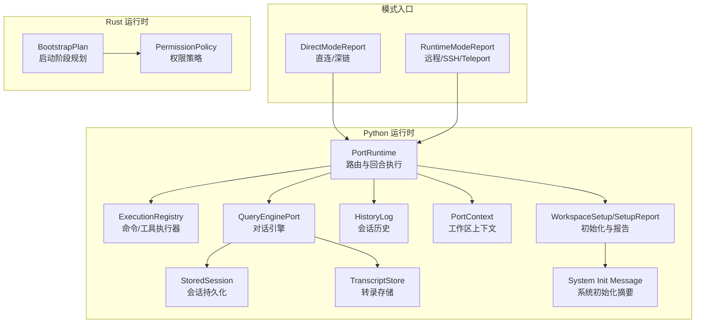
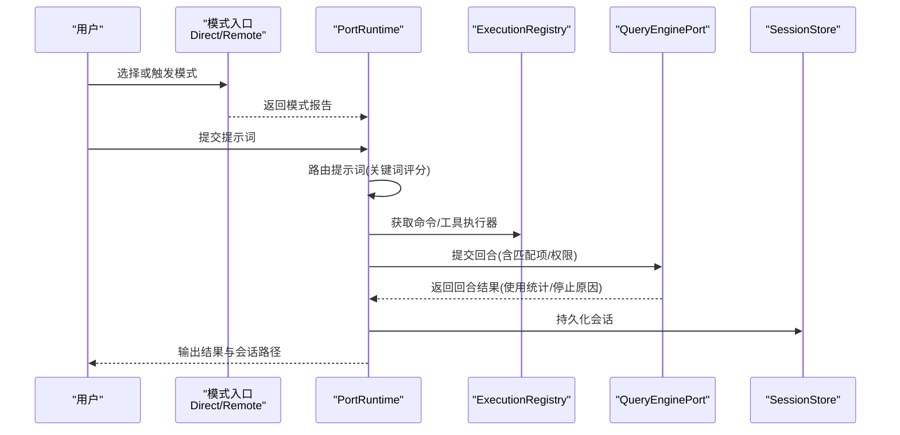
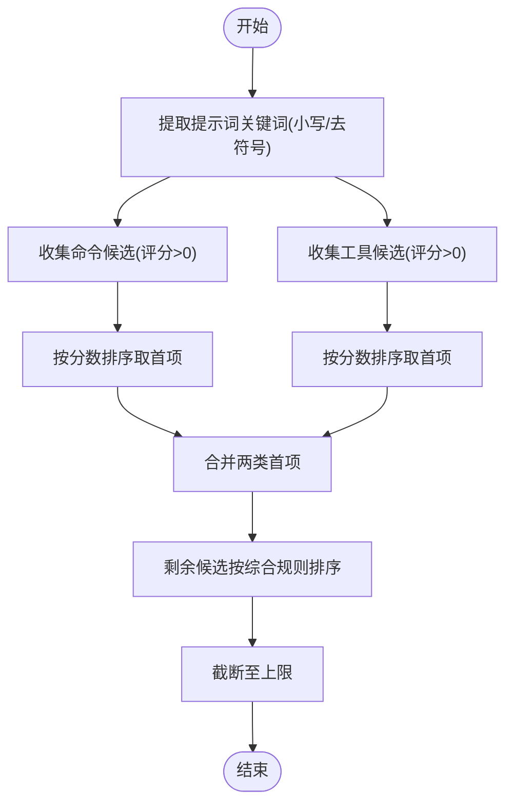
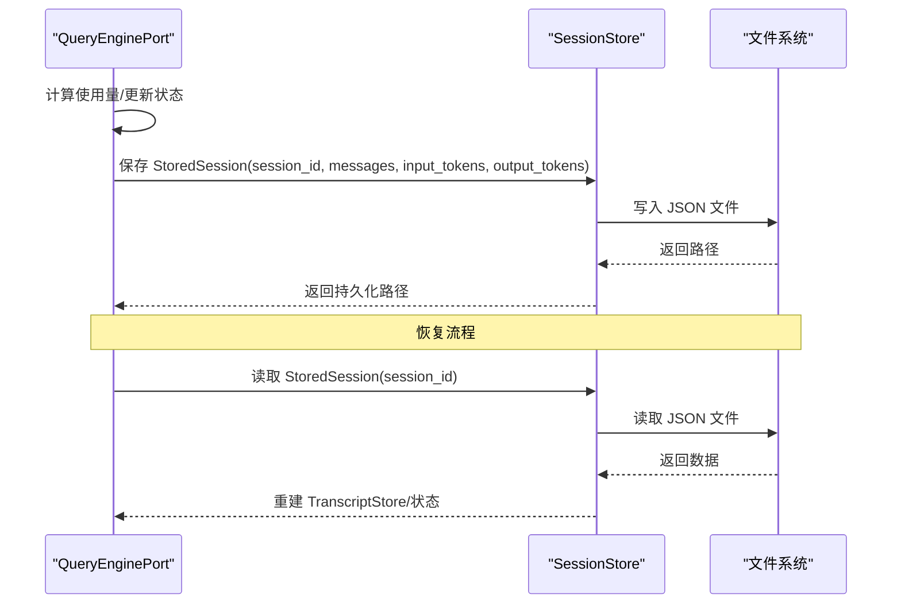
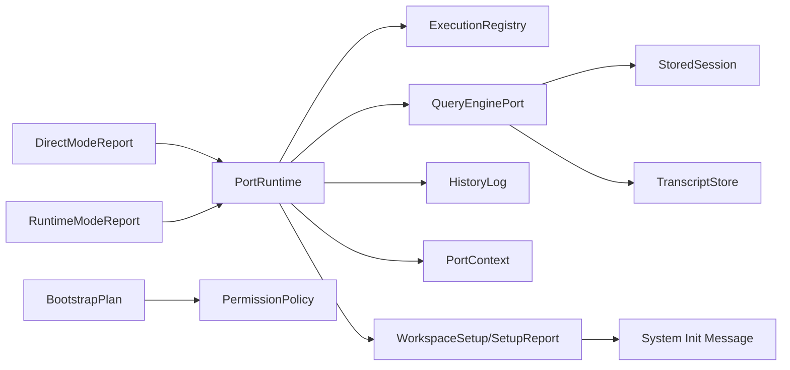

# 模式选择与切换

<cite>
**本文引用的文件**
- [runtime.py](file://src/runtime.py)
- [direct_modes.py](file://src/direct_modes.py)
- [remote_runtime.py](file://src/remote_runtime.py)
- [session_store.py](file://src/session_store.py)
- [query_engine.py](file://src/query_engine.py)
- [execution_registry.py](file://src/execution_registry.py)
- [context.py](file://src/context.py)
- [setup.py](file://src/setup.py)
- [system_init.py](file://src/system_init.py)
- [history.py](file://src/history.py)
- [transcript.py](file://src/transcript.py)
- [models.py](file://src/models.py)
- [port_manifest.py](file://src/port_manifest.py)
- [bootstrap.rs](file://rust/crates/runtime/src/bootstrap.rs)
- [permissions.rs](file://rust/crates/runtime/src/permissions.rs)
- [client_integration.rs](file://rust/crates/api/tests/client_integration.rs)
</cite>

## 目录
1. [引言](#引言)
2. [项目结构](#项目结构)
3. [核心组件](#核心组件)
4. [架构总览](#架构总览)
5. [详细组件分析](#详细组件分析)
6. [依赖分析](#依赖分析)
7. [性能考虑](#性能考虑)
8. [故障排查指南](#故障排查指南)
9. [结论](#结论)
10. [附录](#附录)

## 引言
本文件聚焦于 CLAW 的“运行模式选择与切换”机制，系统阐述模式自动选择算法、切换触发条件、优先级排序、状态保存与恢复、兼容性与环境适配、依赖验证策略，并给出最佳实践与性能影响分析。文档同时覆盖模式间资源共享与冲突处理、监控指标与故障恢复策略，帮助读者在不同运行模式（本地直连、远程控制、SSH 代理、Teleport 会话等）之间实现平滑切换与稳定运行。

## 项目结构
围绕模式选择与切换的关键模块分布如下：
- Python 端
  - 运行时与路由：runtime.py、execution_registry.py、query_engine.py、session_store.py、transcript.py、history.py、models.py、port_manifest.py、context.py、setup.py、system_init.py
  - 模式入口：direct_modes.py、remote_runtime.py
- Rust 端
  - 启动阶段与权限策略：bootstrap.rs、permissions.rs
  - 客户端重试与稳定性测试：client_integration.rs

**图表来源**
- [runtime.py:89-193](file://src/runtime.py#L89-L193)
- [execution_registry.py:28-52](file://src/execution_registry.py#L28-L52)
- [query_engine.py:35-194](file://src/query_engine.py#L35-L194)
- [session_store.py:8-36](file://src/session_store.py#L8-L36)
- [transcript.py:6-24](file://src/transcript.py#L6-L24)
- [history.py:12-23](file://src/history.py#L12-L23)
- [context.py:7-48](file://src/context.py#L7-L48)
- [setup.py:12-78](file://src/setup.py#L12-L78)
- [system_init.py:8-24](file://src/system_init.py#L8-L24)
- [direct_modes.py:6-22](file://src/direct_modes.py#L6-L22)
- [remote_runtime.py:6-25](file://src/remote_runtime.py#L6-L25)
- [bootstrap.rs:17-56](file://rust/crates/runtime/src/bootstrap.rs#L17-L56)
- [permissions.rs:219-316](file://rust/crates/runtime/src/permissions.rs#L219-L316)

**章节来源**
- [runtime.py:89-193](file://src/runtime.py#L89-L193)
- [direct_modes.py:6-22](file://src/direct_modes.py#L6-L22)
- [remote_runtime.py:6-25](file://src/remote_runtime.py#L6-L25)
- [session_store.py:8-36](file://src/session_store.py#L8-L36)
- [query_engine.py:35-194](file://src/query_engine.py#L35-L194)
- [execution_registry.py:28-52](file://src/execution_registry.py#L28-L52)
- [context.py:7-48](file://src/context.py#L7-L48)
- [setup.py:12-78](file://src/setup.py#L12-L78)
- [system_init.py:8-24](file://src/system_init.py#L8-L24)
- [history.py:12-23](file://src/history.py#L12-L23)
- [transcript.py:6-24](file://src/transcript.py#L6-L24)
- [models.py:6-50](file://src/models.py#L6-L50)
- [port_manifest.py:12-53](file://src/port_manifest.py#L12-L53)
- [bootstrap.rs:17-56](file://rust/crates/runtime/src/bootstrap.rs#L17-L56)
- [permissions.rs:219-316](file://rust/crates/runtime/src/permissions.rs#L219-L316)

## 核心组件
- PortRuntime：负责提示词路由、回合执行、权限推断、会话构建与持久化。其路由算法基于关键词匹配与评分，结合命令与工具的镜像清单进行优先级排序。
- ExecutionRegistry：封装命令与工具的可执行体，提供按名称检索与执行能力。
- QueryEnginePort：承载对话回合、令牌预算、消息压缩、会话持久化与结构化输出渲染。
- SessionStore/StoredSession：提供会话的序列化/反序列化与默认目录管理。
- TranscriptStore：维护消息转录列表，支持紧凑与刷新。
- HistoryLog：记录关键事件，便于审计与回溯。
- PortContext/WorkspaceSetup/System Init：提供工作区上下文、初始化步骤与系统摘要信息。
- DirectModeReport/RuntimeModeReport：定义直连/深链、远程/SSH/Teleport 等模式的报告结构与入口。

**章节来源**
- [runtime.py:89-193](file://src/runtime.py#L89-L193)
- [execution_registry.py:28-52](file://src/execution_registry.py#L28-L52)
- [query_engine.py:35-194](file://src/query_engine.py#L35-L194)
- [session_store.py:8-36](file://src/session_store.py#L8-L36)
- [transcript.py:6-24](file://src/transcript.py#L6-L24)
- [history.py:12-23](file://src/history.py#L12-L23)
- [context.py:7-48](file://src/context.py#L7-L48)
- [setup.py:12-78](file://src/setup.py#L12-L78)
- [system_init.py:8-24](file://src/system_init.py#L8-L24)
- [direct_modes.py:6-22](file://src/direct_modes.py#L6-L22)
- [remote_runtime.py:6-25](file://src/remote_runtime.py#L6-L25)

## 架构总览
下图展示从模式入口到运行时的核心交互路径，包括会话构建、路由决策、权限推断、回合执行与状态持久化。

**图表来源**
- [runtime.py:89-193](file://src/runtime.py#L89-L193)
- [execution_registry.py:28-52](file://src/execution_registry.py#L28-L52)
- [query_engine.py:61-151](file://src/query_engine.py#L61-L151)
- [session_store.py:19-36](file://src/session_store.py#L19-L36)
- [direct_modes.py:16-22](file://src/direct_modes.py#L16-L22)
- [remote_runtime.py:16-25](file://src/remote_runtime.py#L16-L25)

## 详细组件分析

### 模式自动选择算法与优先级排序
- 关键词提取与评分
  - 将提示词标准化为小写词集合，忽略斜杠与连字符分隔符，用于后续匹配。
  - 对每个候选模块（命令/工具），计算其 name/source_hint/responsibility 与词集合的交叠得分，得分大于零即纳入候选。
- 优先级排序
  - 先按种类（命令/工具）分别取最高分条目，确保两类均有代表。
  - 剩余候选按“分数降序、种类升序、名称升序”综合排序，限制返回数量。
- 结果应用
  - 将匹配的命令/工具名称传入执行注册表与对话引擎，作为本轮执行依据。

**图表来源**
- [runtime.py:89-107](file://src/runtime.py#L89-L107)
- [runtime.py:176-192](file://src/runtime.py#L176-L192)

**章节来源**
- [runtime.py:89-107](file://src/runtime.py#L89-L107)
- [runtime.py:176-192](file://src/runtime.py#L176-L192)

### 切换条件判断与触发机制
- 触发条件
  - 用户显式调用模式入口函数（直连/深链/远程/SSH/Teleport）。
  - 运行时内部根据会话状态与资源可用性触发自动切换（例如模型变更、权限模式变化、会话恢复）。
- 条件判定
  - 直连/深链：直接返回模式报告，标记为激活。
  - 远程/SSH/Teleport：返回连接状态与占位准备信息，供上层进一步建立连接。
- 内部切换
  - 在 Python 端，PortRuntime 通过路由与执行注册表决定当前回合的执行路径；在 Rust 端，可通过启动阶段规划与权限策略动态调整行为。

**章节来源**
- [direct_modes.py:16-22](file://src/direct_modes.py#L16-L22)
- [remote_runtime.py:16-25](file://src/remote_runtime.py#L16-L25)
- [bootstrap.rs:17-56](file://rust/crates/runtime/src/bootstrap.rs#L17-L56)
- [permissions.rs:219-316](file://rust/crates/runtime/src/permissions.rs#L219-L316)

### 状态保存与恢复流程
- 保存
  - QueryEnginePort 在回合结束后将当前会话（消息、令牌用量）持久化为 StoredSession，并写入默认目录。
- 加载
  - 通过 session_id 读取 StoredSession，重建 TranscriptStore 并恢复运行时状态。
- 会话摘要
  - QueryEnginePort 提供渲染摘要方法，汇总会话 ID、回合数、权限拒绝数、使用总量、最大回合与预算等。

**图表来源**
- [query_engine.py:140-150](file://src/query_engine.py#L140-L150)
- [session_store.py:19-36](file://src/session_store.py#L19-L36)

**章节来源**
- [query_engine.py:140-150](file://src/query_engine.py#L140-L150)
- [session_store.py:19-36](file://src/session_store.py#L19-L36)

### 模式兼容性检查、环境适配与依赖验证
- 兼容性检查
  - WorkspaceSetup 记录 Python 版本、实现与平台名，作为兼容性基线。
  - SetupReport 汇总预取结果与延迟初始化结果，辅助判断环境是否满足运行要求。
- 环境适配
  - build_system_init_message 汇总已加载命令与工具数量、启动步骤，形成系统初始化摘要。
- 依赖验证
  - 执行前对命令/工具进行存在性与可执行性校验（通过 ExecutionRegistry 的 command/tool 查找）。
  - 权限策略（Rust 端）对高危工具（如破坏性 Shell）进行拒绝或请求批准。

**章节来源**
- [setup.py:12-78](file://src/setup.py#L12-L78)
- [system_init.py:8-24](file://src/system_init.py#L8-L24)
- [execution_registry.py:28-52](file://src/execution_registry.py#L28-L52)
- [permissions.rs:219-316](file://rust/crates/runtime/src/permissions.rs#L219-L316)

### 模式间资源共享与冲突解决
- 共享资源
  - 会话消息与令牌用量在 QueryEnginePort 中统一维护，TranscriptStore 支持紧凑与刷新，避免内存膨胀。
  - PortManifest 提供工作区顶层模块清单，便于跨模式共享元数据。
- 冲突解决
  - 权限策略在当前模式不足以满足工具需求时，触发提示或拒绝，必要时升级模式以满足要求。
  - 启动阶段规划（BootstrapPlan）对重复阶段去重，保证资源分配有序。

**章节来源**
- [query_engine.py:129-139](file://src/query_engine.py#L129-L139)
- [transcript.py:15-24](file://src/transcript.py#L15-L24)
- [port_manifest.py:12-53](file://src/port_manifest.py#L12-L53)
- [permissions.rs:219-316](file://rust/crates/runtime/src/permissions.rs#L219-L316)
- [bootstrap.rs:42-56](file://rust/crates/runtime/src/bootstrap.rs#L42-L56)

### 监控指标与故障恢复策略
- 监控指标
  - 使用统计：输入/输出令牌计数、回合数、会话 ID、转录大小。
  - 停止原因：完成/达到最大回合/达到令牌预算。
  - 历史事件：路由匹配数、执行器数量、权限拒绝数、会话存储路径。
- 故障恢复
  - 会话持久化失败时，可从 SavedSession 重建运行时状态。
  - 客户端侧具备重试策略（示例：速率限制错误后重试），提升鲁棒性。

**章节来源**
- [query_engine.py:171-194](file://src/query_engine.py#L171-L194)
- [history.py:12-23](file://src/history.py#L12-L23)
- [session_store.py:19-36](file://src/session_store.py#L19-L36)
- [client_integration.rs:286-317](file://rust/crates/api/tests/client_integration.rs#L286-L317)

## 依赖分析
- 组件耦合
  - PortRuntime 依赖 ExecutionRegistry、QueryEnginePort、SessionStore、TranscriptStore、HistoryLog、PortContext、WorkspaceSetup、System Init。
  - QueryEnginePort 依赖 PortManifest、StoredSession、TranscriptStore。
  - 模式入口（Direct/Remote）仅返回报告，不直接耦合运行时核心逻辑。
- 外部依赖
  - Rust 端的权限策略与启动阶段规划为运行时提供安全与有序的资源分配基础。

**图表来源**
- [runtime.py:89-193](file://src/runtime.py#L89-L193)
- [execution_registry.py:28-52](file://src/execution_registry.py#L28-L52)
- [query_engine.py:35-194](file://src/query_engine.py#L35-L194)
- [session_store.py:8-36](file://src/session_store.py#L8-L36)
- [transcript.py:6-24](file://src/transcript.py#L6-L24)
- [history.py:12-23](file://src/history.py#L12-L23)
- [context.py:7-48](file://src/context.py#L7-L48)
- [setup.py:12-78](file://src/setup.py#L12-L78)
- [system_init.py:8-24](file://src/system_init.py#L8-L24)
- [direct_modes.py:6-22](file://src/direct_modes.py#L6-L22)
- [remote_runtime.py:6-25](file://src/remote_runtime.py#L6-L25)
- [bootstrap.rs:17-56](file://rust/crates/runtime/src/bootstrap.rs#L17-L56)
- [permissions.rs:219-316](file://rust/crates/runtime/src/permissions.rs#L219-L316)

**章节来源**
- [runtime.py:89-193](file://src/runtime.py#L89-L193)
- [execution_registry.py:28-52](file://src/execution_registry.py#L28-L52)
- [query_engine.py:35-194](file://src/query_engine.py#L35-L194)
- [session_store.py:8-36](file://src/session_store.py#L8-L36)
- [transcript.py:6-24](file://src/transcript.py#L6-L24)
- [history.py:12-23](file://src/history.py#L12-L23)
- [context.py:7-48](file://src/context.py#L7-L48)
- [setup.py:12-78](file://src/setup.py#L12-L78)
- [system_init.py:8-24](file://src/system_init.py#L8-L24)
- [direct_modes.py:6-22](file://src/direct_modes.py#L6-L22)
- [remote_runtime.py:6-25](file://src/remote_runtime.py#L6-L25)
- [bootstrap.rs:17-56](file://rust/crates/runtime/src/bootstrap.rs#L17-L56)
- [permissions.rs:219-316](file://rust/crates/runtime/src/permissions.rs#L219-L316)

## 性能考虑
- 路由评分复杂度
  - 对每个模块进行一次词集合扫描，整体复杂度与提示词词数与模块数量成正比；通过限制返回数量与先取首项策略降低开销。
- 令牌预算与紧凑
  - QueryEnginePort 在达到紧凑阈值时仅保留最近 N 条消息，减少内存占用与传输成本。
- 会话持久化
  - 仅在回合结束或显式调用时写盘，避免频繁 IO；恢复时一次性重建状态，降低启动成本。
- 权限策略
  - Rust 端的权限策略在拒绝高危操作前进行规则匹配与提示，减少无效执行带来的资源浪费。

**章节来源**
- [runtime.py:89-107](file://src/runtime.py#L89-L107)
- [query_engine.py:129-139](file://src/query_engine.py#L129-L139)
- [query_engine.py:140-150](file://src/query_engine.py#L140-L150)
- [permissions.rs:219-316](file://rust/crates/runtime/src/permissions.rs#L219-L316)

## 故障排查指南
- 无法切换到目标模式
  - 检查模式入口返回的报告字段（mode/target/active/connected/detail），确认是否处于激活或连接状态。
- 回合未完成或提前终止
  - 查看停止原因（完成/达到最大回合/达到令牌预算），调整 max_turns 或 max_budget_tokens 配置。
- 会话恢复失败
  - 确认会话 ID 正确且持久化文件存在；若损坏则重新发起会话。
- 权限被拒绝
  - 检查工具所需权限等级与当前模式，必要时升级权限或通过提示器批准。

**章节来源**
- [direct_modes.py:6-22](file://src/direct_modes.py#L6-L22)
- [remote_runtime.py:6-25](file://src/remote_runtime.py#L6-L25)
- [query_engine.py:61-104](file://src/query_engine.py#L61-L104)
- [session_store.py:19-36](file://src/session_store.py#L19-L36)
- [permissions.rs:219-316](file://rust/crates/runtime/src/permissions.rs#L219-L316)

## 结论
CLAW 的模式选择与切换机制以“关键词评分+优先级排序”的路由算法为核心，结合执行注册表与对话引擎实现稳定的回合执行；通过会话持久化与紧凑策略保障资源可控；借助权限策略与启动阶段规划实现安全与有序的运行。该体系在不同模式间实现了清晰的职责分离与状态一致性，适合在多样化环境中进行灵活切换与可靠运维。

## 附录
- 最佳实践
  - 明确各模式的适用场景（直连/深链用于本地快速交互；远程/SSH/Teleport 用于远端协作与会话恢复）。
  - 在高风险工具使用前预留权限审批流程，避免阻塞主线程。
  - 合理设置 max_turns 与 max_budget_tokens，平衡质量与成本。
  - 定期清理与紧凑转录，保持会话体积在合理范围。
- 参考实现位置
  - 路由与回合执行：[runtime.py:89-193](file://src/runtime.py#L89-L193)
  - 会话持久化与恢复：[query_engine.py:140-150](file://src/query_engine.py#L140-L150)、[session_store.py:19-36](file://src/session_store.py#L19-L36)
  - 权限策略与启动阶段：[permissions.rs:219-316](file://rust/crates/runtime/src/permissions.rs#L219-L316)、[bootstrap.rs:17-56](file://rust/crates/runtime/src/bootstrap.rs#L17-L56)