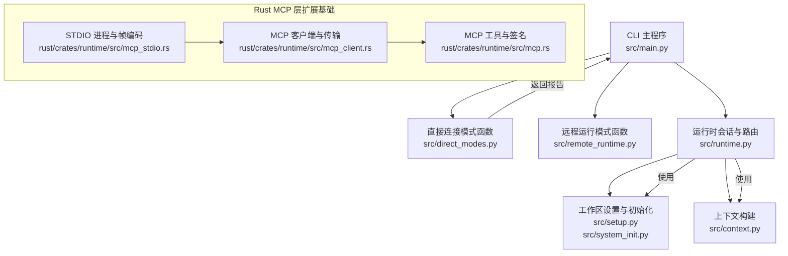
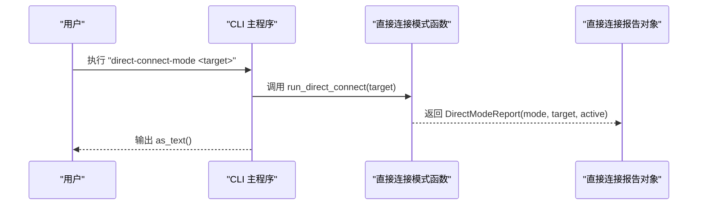
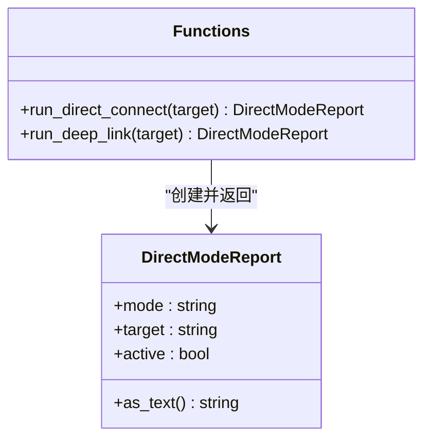
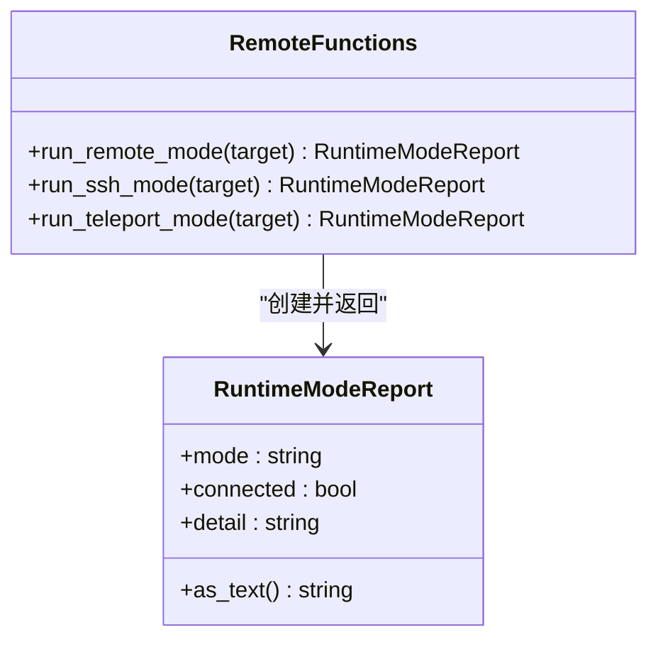
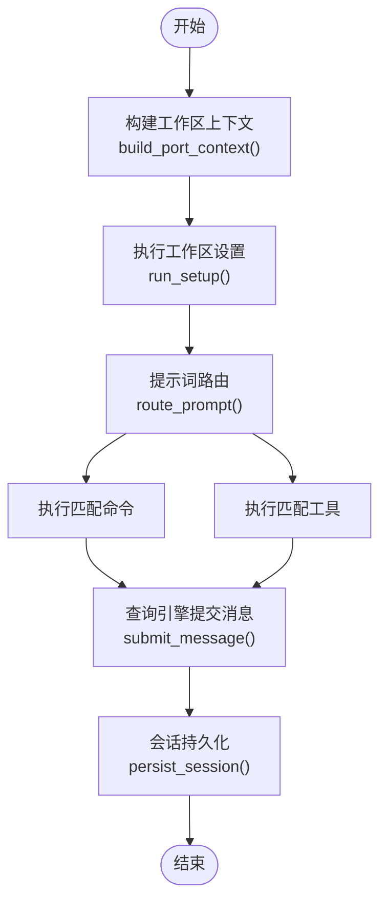
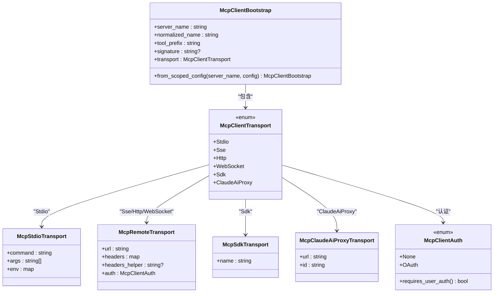
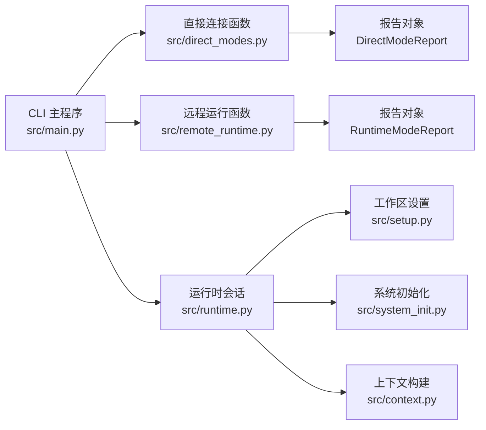

# 直接连接模式

<cite>
**本文引用的文件**
- [src/direct_modes.py](file://src/direct_modes.py)
- [src/remote_runtime.py](file://src/remote_runtime.py)
- [src/main.py](file://src/main.py)
- [src/runtime.py](file://src/runtime.py)
- [src/context.py](file://src/context.py)
- [src/system_init.py](file://src/system_init.py)
- [src/setup.py](file://src/setup.py)
- [rust/crates/runtime/src/mcp.rs](file://rust/crates/runtime/src/mcp.rs)
- [rust/crates/runtime/src/mcp_client.rs](file://rust/crates/runtime/src/mcp_client.rs)
- [rust/crates/runtime/src/mcp_stdio.rs](file://rust/crates/runtime/src/mcp_stdio.rs)
</cite>

## 目录
1. [引言](#引言)
2. [项目结构](#项目结构)
3. [核心组件](#核心组件)
4. [架构总览](#架构总览)
5. [详细组件分析](#详细组件分析)
6. [依赖分析](#依赖分析)
7. [性能考虑](#性能考虑)
8. [故障排查指南](#故障排查指南)
9. [结论](#结论)
10. [附录](#附录)

## 引言
本文件面向“直接连接运行模式”的技术文档，聚焦于该模式下的连接建立、数据交换与状态同步机制，以及协议选择、连接参数与传输优化策略。同时给出配置选项、网络适配与带宽管理建议，并提供部署指南与性能调优要点，解释与目标系统的接口规范与兼容性要求，最后提供连接质量监控与实时性能分析方法。

在当前仓库中，“直接连接模式”以占位实现呈现：命令入口会输出“直接连接”模式报告，但未包含实际的网络栈或传输层实现细节。因此本文在“直接连接模式”的定义上采用“占位语义”，即通过 CLI 子命令触发模式切换并返回状态信息；而“真实连接”（如 MCP 协议、STDIO 管道、WebSocket 等）由 Rust 运行时模块负责，可作为未来扩展到“直接连接模式”的实现基础。

## 项目结构
围绕直接连接模式的关键文件与职责如下：
- CLI 入口与子命令解析：负责解析用户输入并分发到具体模式执行函数
- 模式报告对象：封装模式名称、目标与激活状态等信息
- 运行时会话与路由：提供提示词路由、工具/命令执行、会话持久化等能力
- 系统初始化与工作区设置：提供平台信息、启动步骤与信任态
- Rust MCP 客户端与传输层：提供 STDIO、HTTP/SSE、WebSocket、SDK 等多种传输方式的抽象与实现，为“直接连接模式”的扩展提供协议与传输基础

**图表来源**
- [src/main.py:74-77](file://src/main.py#L74-L77)
- [src/direct_modes.py:16-21](file://src/direct_modes.py#L16-L21)
- [src/remote_runtime.py:16-25](file://src/remote_runtime.py#L16-L25)
- [src/runtime.py:89-193](file://src/runtime.py#L89-L193)
- [src/setup.py:64-78](file://src/setup.py#L64-L78)
- [src/system_init.py:8-23](file://src/system_init.py#L8-L23)
- [src/context.py:19-34](file://src/context.py#L19-L34)
- [rust/crates/runtime/src/mcp.rs:65-81](file://rust/crates/runtime/src/mcp.rs#L65-L81)
- [rust/crates/runtime/src/mcp_client.rs:70-108](file://rust/crates/runtime/src/mcp_client.rs#L70-L108)
- [rust/crates/runtime/src/mcp_stdio.rs:580-613](file://rust/crates/runtime/src/mcp_stdio.rs#L580-L613)

**章节来源**
- [src/main.py:74-77](file://src/main.py#L74-L77)
- [src/direct_modes.py:16-21](file://src/direct_modes.py#L16-L21)
- [src/remote_runtime.py:16-25](file://src/remote_runtime.py#L16-L25)
- [src/runtime.py:89-193](file://src/runtime.py#L89-L193)
- [src/setup.py:64-78](file://src/setup.py#L64-L78)
- [src/system_init.py:8-23](file://src/system_init.py#L8-L23)
- [src/context.py:19-34](file://src/context.py#L19-L34)
- [rust/crates/runtime/src/mcp.rs:65-81](file://rust/crates/runtime/src/mcp.rs#L65-L81)
- [rust/crates/runtime/src/mcp_client.rs:70-108](file://rust/crates/runtime/src/mcp_client.rs#L70-L108)
- [rust/crates/runtime/src/mcp_stdio.rs:580-613](file://rust/crates/runtime/src/mcp_stdio.rs#L580-L613)

## 核心组件
- 直接连接模式报告对象
  - 字段：模式名、目标、是否激活
  - 输出：文本格式的键值对
  - 作用：统一输出“直接连接模式”的状态摘要
- 远程运行模式报告对象
  - 字段：模式名、是否已连接、详情
  - 作用：统一输出“远程/SSH/Teleport”等模式的状态摘要
- CLI 子命令
  - direct-connect-mode：触发直接连接模式
  - deep-link-mode：触发深度链接模式
  - remote-mode/ssh-mode/teleport-mode：触发其他运行模式
- 运行时会话与路由
  - 提供提示词路由、命令/工具匹配、权限拒绝推断、会话持久化等
- 工作区设置与系统初始化
  - 提供平台信息、启动步骤、信任态与初始化消息
- 上下文构建
  - 提供源码根、测试根、资源根、归档根及文件计数等信息

**章节来源**
- [src/direct_modes.py:6-13](file://src/direct_modes.py#L6-L13)
- [src/remote_runtime.py:6-13](file://src/remote_runtime.py#L6-L13)
- [src/main.py:74-77](file://src/main.py#L74-L77)
- [src/runtime.py:89-193](file://src/runtime.py#L89-L193)
- [src/setup.py:12-27](file://src/setup.py#L12-L27)
- [src/system_init.py:8-23](file://src/system_init.py#L8-L23)
- [src/context.py:7-17](file://src/context.py#L7-L17)

## 架构总览
直接连接模式在当前仓库中的行为是“占位实现”。CLI 解析后调用直接连接模式函数，返回一个包含模式名、目标与激活状态的报告对象；该报告以文本形式输出。与之对比，远程运行模式返回“已连接”状态与描述信息。

**图表来源**
- [src/main.py:180-182](file://src/main.py#L180-L182)
- [src/direct_modes.py:16-17](file://src/direct_modes.py#L16-L17)
- [src/direct_modes.py:12](file://src/direct_modes.py#L12)

**章节来源**
- [src/main.py:180-182](file://src/main.py#L180-L182)
- [src/direct_modes.py:16-17](file://src/direct_modes.py#L16-L17)
- [src/direct_modes.py:12](file://src/direct_modes.py#L12)

## 详细组件分析

### 组件一：直接连接模式与报告对象
- DirectModeReport
  - 用途：封装直接连接模式的模式名、目标与激活状态
  - 输出：文本键值对，便于 CLI 与日志展示
- run_direct_connect
  - 用途：根据目标生成 DirectModeReport
  - 行为：固定返回“direct-connect”模式与激活状态
- run_deep_link
  - 用途：与直接连接模式类似，返回“deep-link”模式与激活状态

**图表来源**
- [src/direct_modes.py:6-13](file://src/direct_modes.py#L6-L13)
- [src/direct_modes.py:16-21](file://src/direct_modes.py#L16-L21)

**章节来源**
- [src/direct_modes.py:6-13](file://src/direct_modes.py#L6-L13)
- [src/direct_modes.py:16-21](file://src/direct_modes.py#L16-L21)

### 组件二：远程运行模式与报告对象
- RuntimeModeReport
  - 用途：封装远程/SSH/Teleport 等模式的模式名、连接状态与详情
- run_remote_mode/run_ssh_mode/run_teleport_mode
  - 用途：生成占位报告，用于模拟不同运行模式的准备状态

**图表来源**
- [src/remote_runtime.py:6-13](file://src/remote_runtime.py#L6-L13)
- [src/remote_runtime.py:16-25](file://src/remote_runtime.py#L16-L25)

**章节来源**
- [src/remote_runtime.py:6-13](file://src/remote_runtime.py#L6-L13)
- [src/remote_runtime.py:16-25](file://src/remote_runtime.py#L16-L25)

### 组件三：运行时会话与路由
- PortRuntime
  - 提供提示词路由、命令/工具匹配、权限拒绝推断、会话持久化
  - 支持多轮对话循环与结构化输出
- RuntimeSession
  - 封装一次运行时会话的完整上下文与结果
- 工作区设置与系统初始化
  - 提供平台信息、启动步骤与初始化消息
- 上下文构建
  - 提供源码/测试/资源/归档根路径与文件计数

**图表来源**
- [src/runtime.py:89-193](file://src/runtime.py#L89-L193)
- [src/setup.py:64-78](file://src/setup.py#L64-L78)
- [src/system_init.py:8-23](file://src/system_init.py#L8-L23)
- [src/context.py:19-34](file://src/context.py#L19-L34)

**章节来源**
- [src/runtime.py:89-193](file://src/runtime.py#L89-L193)
- [src/setup.py:64-78](file://src/setup.py#L64-L78)
- [src/system_init.py:8-23](file://src/system_init.py#L8-L23)
- [src/context.py:19-34](file://src/context.py#L19-L34)

### 组件四：Rust MCP 协议与传输层（扩展基础）
- MCP 工具与签名
  - 规范化服务器名、工具前缀、URL 解包与签名计算
- MCP 客户端与传输
  - 支持 STDIO、SSE、HTTP、WebSocket、SDK、Claude AI Proxy 等传输
  - 认证支持（OAuth/无需用户认证）
- STDIO 进程与帧编码
  - 启动子进程、读写管道、帧编码（Content-Length）

**图表来源**
- [rust/crates/runtime/src/mcp_client.rs:6-108](file://rust/crates/runtime/src/mcp_client.rs#L6-L108)
- [rust/crates/runtime/src/mcp.rs:65-81](file://rust/crates/runtime/src/mcp.rs#L65-L81)
- [rust/crates/runtime/src/mcp_stdio.rs:580-613](file://rust/crates/runtime/src/mcp_stdio.rs#L580-L613)

**章节来源**
- [rust/crates/runtime/src/mcp_client.rs:6-108](file://rust/crates/runtime/src/mcp_client.rs#L6-L108)
- [rust/crates/runtime/src/mcp.rs:65-81](file://rust/crates/runtime/src/mcp.rs#L65-L81)
- [rust/crates/runtime/src/mcp_stdio.rs:580-613](file://rust/crates/runtime/src/mcp_stdio.rs#L580-L613)

## 依赖分析
- CLI 与模式函数
  - CLI 子命令解析后直接调用模式函数，返回报告对象并输出文本
- 运行时与设置
  - 运行时会话依赖工作区设置与系统初始化，提供上下文与平台信息
- Rust MCP 层
  - 为未来扩展“直接连接模式”提供协议与传输抽象，包括 STDIO、HTTP/SSE、WebSocket、SDK 等

**图表来源**
- [src/main.py:74-77](file://src/main.py#L74-L77)
- [src/direct_modes.py:16-21](file://src/direct_modes.py#L16-L21)
- [src/remote_runtime.py:16-25](file://src/remote_runtime.py#L16-L25)
- [src/runtime.py:89-193](file://src/runtime.py#L89-L193)
- [src/setup.py:64-78](file://src/setup.py#L64-L78)
- [src/system_init.py:8-23](file://src/system_init.py#L8-L23)
- [src/context.py:19-34](file://src/context.py#L19-L34)

**章节来源**
- [src/main.py:74-77](file://src/main.py#L74-L77)
- [src/direct_modes.py:16-21](file://src/direct_modes.py#L16-L21)
- [src/remote_runtime.py:16-25](file://src/remote_runtime.py#L16-L25)
- [src/runtime.py:89-193](file://src/runtime.py#L89-L193)
- [src/setup.py:64-78](file://src/setup.py#L64-L78)
- [src/system_init.py:8-23](file://src/system_init.py#L8-L23)
- [src/context.py:19-34](file://src/context.py#L19-L34)

## 性能考虑
- 直接连接模式（占位阶段）
  - 当前仅返回文本报告，无网络开销，性能开销极低
  - 若扩展为真实连接，应优先选择低延迟、高吞吐的传输方式
- 传输层优化建议（基于现有 Rust MCP 实现）
  - STDIO：适合本地进程直连，注意缓冲与帧编码效率
  - HTTP/SSE：适合跨网络场景，需关注连接复用与头部压缩
  - WebSocket：适合双向流式通信，注意心跳与重连策略
  - SDK：适合受控环境，需关注版本兼容与签名校验
- 带宽管理
  - 控制消息大小与频率，避免突发流量
  - 对长文本内容进行分块传输与增量处理
- 并发与资源
  - 复用连接与线程池，减少上下文切换
  - 对阻塞操作进行异步化改造

[本节为通用性能指导，不直接分析具体文件，故无“章节来源”]

## 故障排查指南
- CLI 参数错误
  - 确认子命令拼写正确，目标参数有效
- 直接连接模式输出异常
  - 检查模式函数返回值与 as_text 输出格式
- 远程/SSH/Teleport 模式
  - 关注返回的连接状态与详情字段，定位配置问题
- 运行时会话问题
  - 查看路由匹配数量、命令/工具执行消息与会话持久化路径
- Rust MCP 层问题
  - 检查传输类型与认证配置，确认 STDIO 进程启动成功与管道可用

**章节来源**
- [src/main.py:180-182](file://src/main.py#L180-L182)
- [src/direct_modes.py:12](file://src/direct_modes.py#L12)
- [src/remote_runtime.py:12](file://src/remote_runtime.py#L12)
- [src/runtime.py:109-152](file://src/runtime.py#L109-L152)
- [rust/crates/runtime/src/mcp_client.rs:70-108](file://rust/crates/runtime/src/mcp_client.rs#L70-L108)
- [rust/crates/runtime/src/mcp_stdio.rs:580-613](file://rust/crates/runtime/src/mcp_stdio.rs#L580-L613)

## 结论
- 当前“直接连接模式”为占位实现，通过 CLI 子命令触发并输出模式报告
- 未来可基于 Rust MCP 的 STDIO/HTTP/SSE/WebSocket/SDK 等传输层实现真实连接
- 配置与网络适配应结合目标系统接口规范与兼容性要求进行设计
- 性能与稳定性可通过传输层优化、并发控制与带宽管理持续提升

[本节为总结性内容，不直接分析具体文件，故无“章节来源”]

## 附录

### 配置选项与网络适配
- STDIO
  - 命令、参数、环境变量
  - 适用于本地进程直连，注意权限与路径
- HTTP/SSE
  - URL、请求头、辅助脚本、OAuth 配置
  - 适用于跨网络场景，需关注鉴权与代理
- WebSocket
  - URL、请求头、辅助脚本
  - 适用于双向流式通信，需关注握手与心跳
- SDK
  - SDK 名称
  - 适用于受控环境，需关注版本与签名
- Claude AI Proxy
  - URL、ID
  - 适用于代理场景，需关注 URL 解包与签名

**章节来源**
- [rust/crates/runtime/src/mcp_client.rs:70-108](file://rust/crates/runtime/src/mcp_client.rs#L70-L108)
- [rust/crates/runtime/src/mcp.rs:65-81](file://rust/crates/runtime/src/mcp.rs#L65-L81)

### 部署指南与性能调优
- 部署
  - 选择合适的传输方式（STDIO/HTTP/SSE/WebSocket/SDK）
  - 明确认证方式（无、OAuth 等），配置相应参数
  - 在受限环境中优先使用 SDK 或 STDIO
- 调优
  - 降低消息体积与频率，启用增量处理
  - 使用连接复用与异步 I/O
  - 针对不同网络环境调整超时与重试策略

[本节为通用部署与调优建议，不直接分析具体文件，故无“章节来源”]

### 接口规范与兼容性要求
- 协议版本
  - 初始化参数包含协议版本号，确保客户端与服务端兼容
- 工具命名与前缀
  - 工具名规范化与前缀生成，避免冲突
- URL 解包与签名
  - 代理 URL 的解包与签名计算，保证一致性与可追踪性

**章节来源**
- [rust/crates/runtime/src/mcp.rs:794-803](file://rust/crates/runtime/src/mcp.rs#L794-L803)
- [rust/crates/runtime/src/mcp.rs:25-37](file://rust/crates/runtime/src/mcp.rs#L25-L37)
- [rust/crates/runtime/src/mcp.rs:40-62](file://rust/crates/runtime/src/mcp.rs#L40-L62)

### 连接质量监控与实时性能分析
- 监控点
  - 连接建立耗时、消息往返时间、吞吐量、错误率
- 分析方法
  - 基于会话持久化与历史记录，统计命令/工具执行耗时与成功率
  - 结合传输层日志，定位延迟瓶颈（握手、认证、I/O）

**章节来源**
- [src/runtime.py:109-152](file://src/runtime.py#L109-L152)
- [rust/crates/runtime/src/mcp_stdio.rs:787-792](file://rust/crates/runtime/src/mcp_stdio.rs#L787-L792)