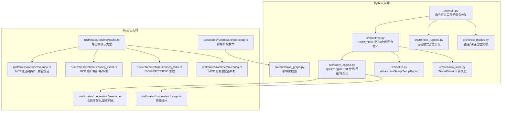
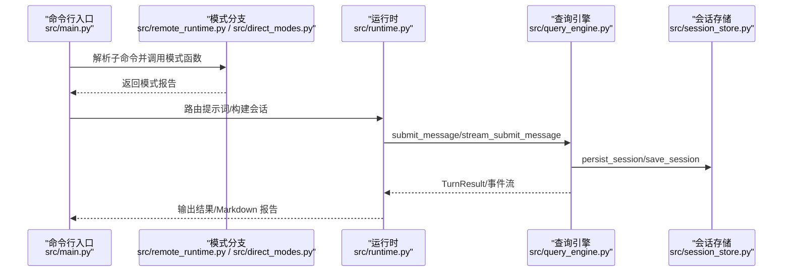
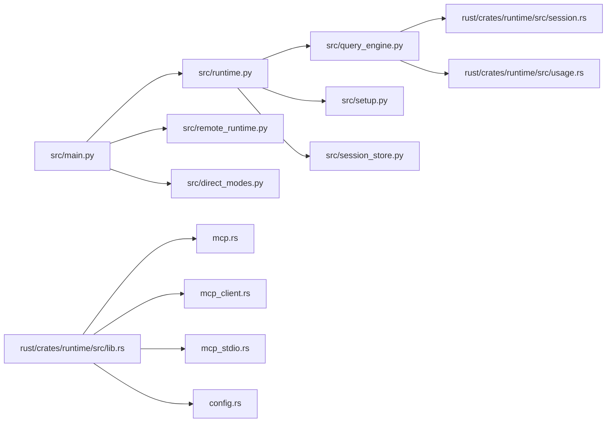

# 运行时模式

<cite>
**本文引用的文件**
- [src/main.py](file://src/main.py)
- [src/runtime.py](file://src/runtime.py)
- [src/direct_modes.py](file://src/direct_modes.py)
- [src/remote_runtime.py](file://src/remote_runtime.py)
- [src/query_engine.py](file://src/query_engine.py)
- [src/setup.py](file://src/setup.py)
- [src/session_store.py](file://src/session_store.py)
- [src/models.py](file://src/models.py)
- [src/bootstrap_graph.py](file://src/bootstrap_graph.py)
- [rust/crates/runtime/src/lib.rs](file://rust/crates/runtime/src/lib.rs)
- [rust/crates/runtime/src/mcp.rs](file://rust/crates/runtime/src/mcp.rs)
- [rust/crates/runtime/src/mcp_client.rs](file://rust/crates/runtime/src/mcp_client.rs)
- [rust/crates/runtime/src/mcp_stdio.rs](file://rust/crates/runtime/src/mcp_stdio.rs)
- [rust/crates/runtime/src/config.rs](file://rust/crates/runtime/src/config.rs)
- [rust/crates/runtime/src/bootstrap.rs](file://rust/crates/runtime/src/bootstrap.rs)
- [rust/crates/runtime/src/usage.rs](file://rust/crates/runtime/src/usage.rs)
- [rust/crates/runtime/src/session.rs](file://rust/crates/runtime/src/session.rs)
</cite>

## 目录
1. [引言](#引言)
2. [项目结构](#项目结构)
3. [核心组件](#核心组件)
4. [架构总览](#架构总览)
5. [详细组件分析](#详细组件分析)
6. [依赖关系分析](#依赖关系分析)
7. [性能考量](#性能考量)
8. [故障排查指南](#故障排查指南)
9. [结论](#结论)
10. [附录](#附录)

## 引言
本文件系统性梳理 CLAW 项目的“运行时模式”，聚焦以下模式的实现差异与适用场景：本地模式（Local）、远程模式（Remote）、SSH 模式（SSH）、直接连接模式（Direct Connect）与深链模式（Deep Link）。文档从架构、组件、数据流、配置项、连接建立与数据传输机制、模式切换与自动降级策略、安全认证与错误处理、故障转移与容错等方面进行深入解析，并提供使用示例与性能对比建议。

## 项目结构
CLAW 的运行时模式由 Python 前端与 Rust 后端协同实现。Python 层负责命令行入口、路由与会话持久化；Rust 层提供 MCP 协议、OAuth、会话与用量统计等能力。模式分支通过 CLI 子命令触发，底层通过查询引擎与执行注册表驱动命令/工具执行。

图表来源
- [src/main.py:1-214](file://src/main.py#L1-L214)
- [src/runtime.py:89-193](file://src/runtime.py#L89-L193)
- [src/query_engine.py:35-194](file://src/query_engine.py#L35-L194)
- [src/setup.py:12-78](file://src/setup.py#L12-L78)
- [src/session_store.py:8-36](file://src/session_store.py#L8-L36)
- [src/remote_runtime.py:6-26](file://src/remote_runtime.py#L6-L26)
- [src/direct_modes.py:6-22](file://src/direct_modes.py#L6-L22)
- [src/bootstrap_graph.py:16-27](file://src/bootstrap_graph.py#L16-L27)
- [rust/crates/runtime/src/lib.rs:1-94](file://rust/crates/runtime/src/lib.rs#L1-L94)
- [rust/crates/runtime/src/mcp.rs:83-118](file://rust/crates/runtime/src/mcp.rs#L83-L118)
- [rust/crates/runtime/src/mcp_client.rs:57-236](file://rust/crates/runtime/src/mcp_client.rs#L57-L236)
- [rust/crates/runtime/src/mcp_stdio.rs:220-1453](file://rust/crates/runtime/src/mcp_stdio.rs#L220-L1453)
- [rust/crates/runtime/src/config.rs:560-857](file://rust/crates/runtime/src/config.rs#L560-L857)
- [rust/crates/runtime/src/bootstrap.rs:1-56](file://rust/crates/runtime/src/bootstrap.rs#L1-L56)
- [rust/crates/runtime/src/usage.rs:153-247](file://rust/crates/runtime/src/usage.rs#L153-L247)
- [rust/crates/runtime/src/session.rs:327-369](file://rust/crates/runtime/src/session.rs#L327-L369)

章节来源
- [src/main.py:21-91](file://src/main.py#L21-L91)
- [src/bootstrap_graph.py:16-27](file://src/bootstrap_graph.py#L16-L27)

## 核心组件
- 运行时入口与模式分支
  - Python 入口在命令行中注册多个子命令，分别对应不同运行时模式与功能。例如 remote-mode、ssh-mode、teleport-mode、direct-connect-mode、deep-link-mode 等。
  - 每个模式子命令调用对应的占位函数，返回模式报告对象，当前为占位实现，用于演示模式分支与输出格式。
- 查询引擎与会话管理
  - QueryEnginePort 负责提交消息、回合循环、结构化输出、用量统计、会话持久化与压缩。
  - 提供 from_workspace/from_saved_session 构造器，支持从工作区或已保存会话恢复。
- 执行与路由
  - PortRuntime 负责提示词路由到命令/工具，构建执行注册表，执行命令/工具，收集权限拒绝信息，并通过查询引擎提交消息。
- 设置与引导
  - WorkspaceSetup/SetupReport 描述环境与预取步骤，构建启动报告。
- 会话持久化
  - StoredSession 以 JSON 形式保存会话 ID、消息列表与用量，统一目录存放。

章节来源
- [src/main.py:68-91](file://src/main.py#L68-L91)
- [src/remote_runtime.py:16-26](file://src/remote_runtime.py#L16-L26)
- [src/direct_modes.py:16-22](file://src/direct_modes.py#L16-L22)
- [src/query_engine.py:35-194](file://src/query_engine.py#L35-L194)
- [src/runtime.py:89-193](file://src/runtime.py#L89-L193)
- [src/setup.py:12-78](file://src/setup.py#L12-L78)
- [src/session_store.py:8-36](file://src/session_store.py#L8-L36)

## 架构总览
下图展示模式分支与核心组件交互关系。Python 前端根据子命令选择模式，随后进入查询引擎与会话管理流程；Rust 运行时模块提供 MCP、OAuth、用量与会话序列化等支撑能力。

图表来源
- [src/main.py:171-185](file://src/main.py#L171-L185)
- [src/remote_runtime.py:16-26](file://src/remote_runtime.py#L16-L26)
- [src/direct_modes.py:16-22](file://src/direct_modes.py#L16-L22)
- [src/runtime.py:109-152](file://src/runtime.py#L109-L152)
- [src/query_engine.py:61-128](file://src/query_engine.py#L61-L128)
- [src/session_store.py:19-36](file://src/session_store.py#L19-L36)

## 详细组件分析

### 本地模式（Local）
- 实现要点
  - 本地模式由 Python 前端通过命令行入口直接驱动，无需外部代理或远端服务。
  - PortRuntime 在本地完成上下文构建、设置报告生成、路由匹配、命令/工具执行与查询引擎提交。
- 数据流
  - 输入提示词经路由后，匹配到的命令/工具被执行，查询引擎记录用量与会话状态，最终持久化会话。
- 适用场景
  - 本地开发调试、离线工作、对安全性要求高且不希望暴露网络连接的场景。
- 性能特征
  - 无网络往返开销，延迟低；受限于本地资源与模型推理能力。

章节来源
- [src/runtime.py:109-152](file://src/runtime.py#L109-L152)
- [src/query_engine.py:61-128](file://src/query_engine.py#L61-L128)

### 远程模式（Remote）
- 实现要点
  - 当前为占位实现：返回“远程控制占位”报告，表明目标占位字符串与连接状态。
  - Rust 层提供 MCP 客户端引导、传输抽象与 JSON-RPC 管理，为后续真实远程连接奠定基础。
- 数据流
  - CLI 子命令触发远程模式函数，返回报告；实际远程连接逻辑可扩展至 WebSocket/HTTP/OAuth 等传输。
- 适用场景
  - 远端协作、集中式计算资源、跨主机控制等场景。
- 安全与认证
  - 支持 OAuth 配置解析与回调参数处理，便于后续接入认证流程。
- 错误处理
  - MCP 服务器管理错误类型覆盖 IO、JSON-RPC、未知工具/服务器等，便于定位问题。

章节来源
- [src/remote_runtime.py:16-26](file://src/remote_runtime.py#L16-L26)
- [rust/crates/runtime/src/mcp_client.rs:57-236](file://rust/crates/runtime/src/mcp_client.rs#L57-L236)
- [rust/crates/runtime/src/mcp_stdio.rs:220-267](file://rust/crates/runtime/src/mcp_stdio.rs#L220-L267)
- [rust/crates/runtime/src/config.rs:821-848](file://rust/crates/runtime/src/config.rs#L821-L848)

### SSH 模式（SSH）
- 实现要点
  - 占位实现返回“SSH 代理占位”报告，目标占位字符串与连接状态。
  - Rust 层提供 MCP 传输抽象，可映射到 SSH 通道或代理链路。
- 适用场景
  - 通过 SSH 隧道访问远端 MCP 服务，适用于受限网络环境。
- 自动降级策略
  - 若 SSH 通道不可用，可回退至本地模式或远程模式（占位层预留）。

章节来源
- [src/remote_runtime.py:20-22](file://src/remote_runtime.py#L20-L22)
- [rust/crates/runtime/src/mcp.rs:83-118](file://rust/crates/runtime/src/mcp.rs#L83-L118)

### 直接连接模式（Direct Connect）
- 实现要点
  - 占位实现返回“直接连接占位”报告，目标占位字符串与激活状态。
  - 适合快速接入已知地址的服务，便于测试与集成。
- 适用场景
  - 已部署的本地或内网服务，无需额外代理或隧道。
- 故障转移
  - 失败时可切换至本地模式或远程模式。

章节来源
- [src/direct_modes.py:16-18](file://src/direct_modes.py#L16-L18)

### 深链模式（Deep Link）
- 实现要点
  - 占位实现返回“深链占位”报告，目标占位字符串与激活状态。
  - 适合通过协议链接直接唤起特定运行时行为。
- 适用场景
  - 与其他应用或 IDE 集成，通过深链触发运行时模式。

章节来源
- [src/direct_modes.py:20-22](file://src/direct_modes.py#L20-L22)

### 模式切换与自动降级策略
- 切换条件
  - CLI 子命令作为显式入口：remote-mode、ssh-mode、teleport-mode、direct-connect-mode、deep-link-mode。
  - 引导阶段图包含“模式路由：local / remote / ssh / teleport / direct-connect / deep-link”，体现整体流程中的模式选择点。
- 自动降级
  - 当前为占位实现，未见自动降级逻辑；建议在真实实现中增加：
    - 连接超时/失败时回退至本地模式；
    - 认证失败时回退至本地模式或提示用户干预；
    - 资源不足时回退至本地模式或降低并发度。

章节来源
- [src/main.py:68-91](file://src/main.py#L68-L91)
- [src/bootstrap_graph.py:24](file://src/bootstrap_graph.py#L24)

### 配置选项与连接建立
- 查询引擎配置
  - 最大回合数、最大预算令牌、紧凑阈值、结构化输出开关与重试次数等。
- MCP 服务器配置
  - 支持 Stdio、SSE、HTTP、WebSocket、SDK、Claude AI Proxy 等传输类型。
  - OAuth 配置项包括 clientId、callbackPort、authServerMetadataUrl、xaa 等。
- 连接建立
  - 通过 McpClientBootstrap 将配置转换为具体传输对象，再由 McpServerManager 管理生命周期与 JSON-RPC 交互。
  - Stdio 传输通过 spawn_mcp_stdio_process 启动子进程并编码帧头。

章节来源
- [src/query_engine.py:15-22](file://src/query_engine.py#L15-L22)
- [rust/crates/runtime/src/config.rs:581-606](file://rust/crates/runtime/src/config.rs#L581-L606)
- [rust/crates/runtime/src/config.rs:821-848](file://rust/crates/runtime/src/config.rs#L821-L848)
- [rust/crates/runtime/src/mcp_client.rs:57-67](file://rust/crates/runtime/src/mcp_client.rs#L57-L67)
- [rust/crates/runtime/src/mcp_stdio.rs:768-779](file://rust/crates/runtime/src/mcp_stdio.rs#L768-L779)
- [rust/crates/runtime/src/mcp_stdio.rs:787-792](file://rust/crates/runtime/src/mcp_stdio.rs#L787-L792)

### 数据传输机制
- 事件流
  - stream_submit_message 产出 message_start、command_match、tool_match、permission_denial、message_delta、message_stop 等事件。
- 会话持久化
  - persist_session 将当前会话写入 .port_sessions 目录下的 JSON 文件，包含 session_id、messages、input_tokens、output_tokens。
- 用量统计
  - UsageSummary/UsageTracker 记录输入/输出令牌与缓存相关用量，支持格式化与成本估算。

章节来源
- [src/query_engine.py:106-128](file://src/query_engine.py#L106-L128)
- [src/session_store.py:19-36](file://src/session_store.py#L19-L36)
- [src/models.py:28-38](file://src/models.py#L28-L38)
- [rust/crates/runtime/src/usage.rs:153-247](file://rust/crates/runtime/src/usage.rs#L153-L247)

### 使用示例
- 远程模式
  - 命令：python -m claw remote-mode TARGET
  - 输出：包含模式、连接状态与详情的文本报告。
- SSH 模式
  - 命令：python -m claw ssh-mode TARGET
  - 输出：包含模式、连接状态与详情的文本报告。
- 直接连接模式
  - 命令：python -m claw direct-connect-mode TARGET
  - 输出：包含模式、目标与激活状态的文本报告。
- 深链模式
  - 命令：python -m claw deep-link-mode TARGET
  - 输出：包含模式、目标与激活状态的文本报告。

章节来源
- [src/main.py:171-185](file://src/main.py#L171-L185)
- [src/remote_runtime.py:16-26](file://src/remote_runtime.py#L16-L26)
- [src/direct_modes.py:16-22](file://src/direct_modes.py#L16-L22)

## 依赖关系分析
- 组件耦合
  - main.py 依赖 runtime.py、remote_runtime.py、direct_modes.py、query_engine.py、session_store.py。
  - runtime.py 依赖 commands/tools、context、history、models、query_engine、setup、execution_registry。
  - query_engine.py 依赖 commands/tools、models、session_store、transcript。
- 外部依赖
  - Rust 运行时模块提供 MCP、OAuth、用量与会话序列化等能力，Python 层通过模块导入使用。

图表来源
- [src/main.py:13-18](file://src/main.py#L13-L18)
- [src/runtime.py:5-13](file://src/runtime.py#L5-L13)
- [src/query_engine.py:7-12](file://src/query_engine.py#L7-L12)
- [rust/crates/runtime/src/lib.rs:20-85](file://rust/crates/runtime/src/lib.rs#L20-L85)

章节来源
- [src/main.py:13-18](file://src/main.py#L13-L18)
- [src/runtime.py:5-13](file://src/runtime.py#L5-L13)
- [src/query_engine.py:7-12](file://src/query_engine.py#L7-L12)
- [rust/crates/runtime/src/lib.rs:20-85](file://rust/crates/runtime/src/lib.rs#L20-L85)

## 性能考量
- 回合限制与预算
  - max_turns 与 max_budget_tokens 控制会话长度与成本，避免过度消耗。
- 会话压缩
  - compact_after_turns 阈值触发消息压缩，减少内存占用与传输开销。
- 结构化输出重试
  - structured_retry_limit 提升结构化输出稳定性，避免一次性失败导致流程中断。
- 用量统计与成本估算
  - UsageTracker/UsageSummary 提供令牌统计，format_usd 与 pricing_for_model 支持成本估算。

章节来源
- [src/query_engine.py:15-22](file://src/query_engine.py#L15-L22)
- [src/query_engine.py:129-132](file://src/query_engine.py#L129-L132)
- [src/query_engine.py:161-169](file://src/query_engine.py#L161-L169)
- [rust/crates/runtime/src/usage.rs:153-247](file://rust/crates/runtime/src/usage.rs#L153-L247)

## 故障排查指南
- 远程/SSH 模式连接失败
  - 检查目标地址与网络可达性；查看模式报告中的详情字段。
  - 若为 MCP 服务器错误，参考 McpServerManagerError 的错误类型定位问题。
- JSON-RPC 错误
  - 关注 JSON-RPC 错误码与消息，确认方法名与参数是否正确。
- 权限拒绝
  - 对工具执行进行权限控制，必要时调整 deny_tool 或 deny_prefix 参数。
- 会话持久化异常
  - 确认 .port_sessions 目录存在且具备写权限；检查保存路径与文件名。

章节来源
- [src/remote_runtime.py:16-26](file://src/remote_runtime.py#L16-L26)
- [rust/crates/runtime/src/mcp_stdio.rs:220-267](file://rust/crates/runtime/src/mcp_stdio.rs#L220-L267)
- [src/models.py:22-26](file://src/models.py#L22-L26)
- [src/session_store.py:19-36](file://src/session_store.py#L19-L36)

## 结论
- 占位实现清晰划分了本地、远程、SSH、直接连接与深链五类模式，便于后续扩展真实连接与认证。
- 查询引擎与会话管理提供了完整的回合循环、用量统计与持久化能力。
- Rust 运行时模块为 MCP、OAuth、用量与会话序列化提供了坚实基础。
- 建议在真实实现中完善自动降级、故障转移与安全认证策略，以提升鲁棒性与可用性。

## 附录
- 引导阶段概览
  - CLI 解析 → 环境设置 → 模式路由 → 查询引擎提交循环 → 会话持久化。
- 关键数据模型
  - RuntimeModeReport/DirectModeReport：模式报告对象。
  - QueryEngineConfig/TurnResult：查询引擎配置与回合结果。
  - StoredSession：会话持久化载体。
  - PermissionDenial/UsageSummary：权限与用量模型。

章节来源
- [src/bootstrap_graph.py:16-27](file://src/bootstrap_graph.py#L16-L27)
- [src/remote_runtime.py:6-14](file://src/remote_runtime.py#L6-L14)
- [src/direct_modes.py:6-14](file://src/direct_modes.py#L6-L14)
- [src/query_engine.py:15-33](file://src/query_engine.py#L15-L33)
- [src/session_store.py:8-14](file://src/session_store.py#L8-L14)
- [src/models.py:22-38](file://src/models.py#L22-L38)