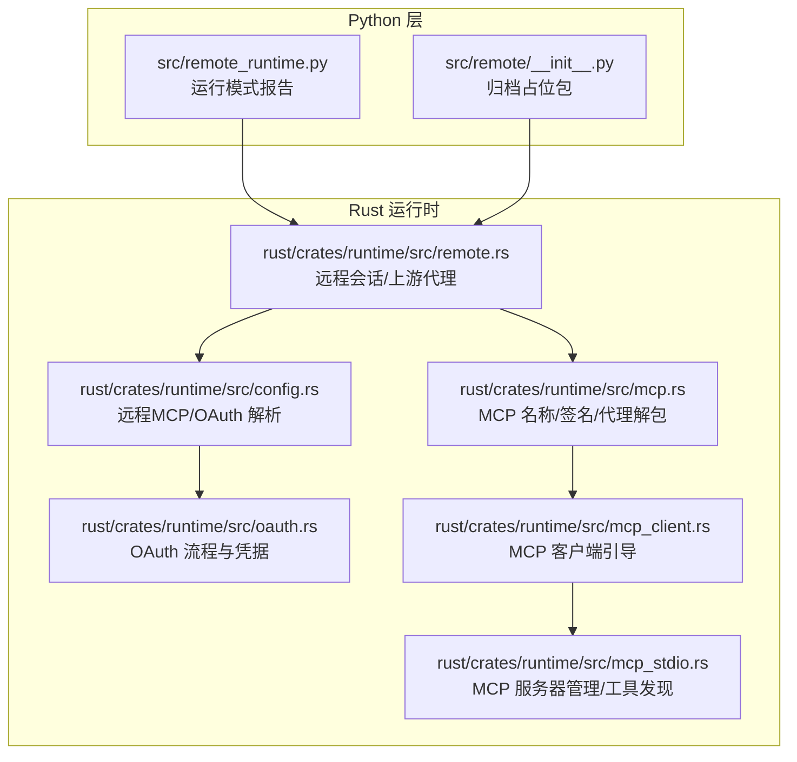
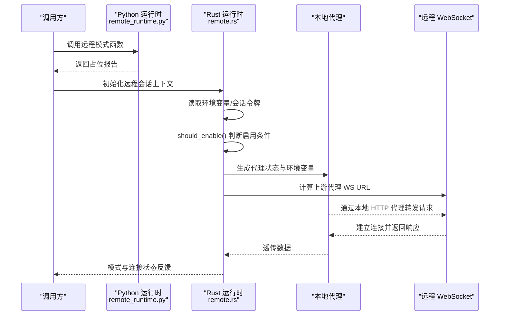
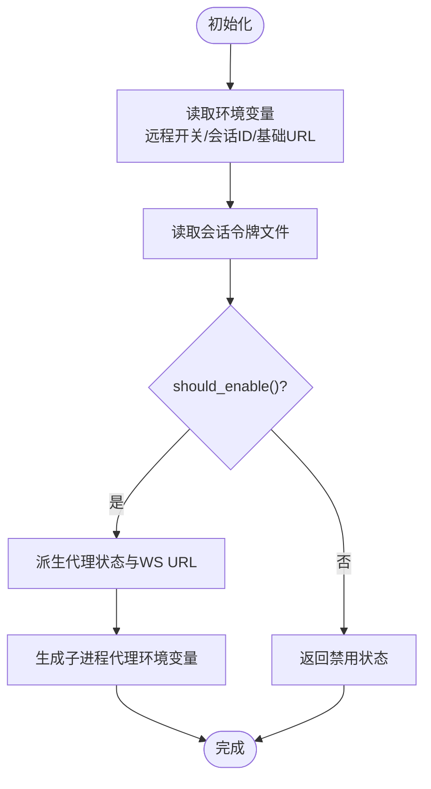
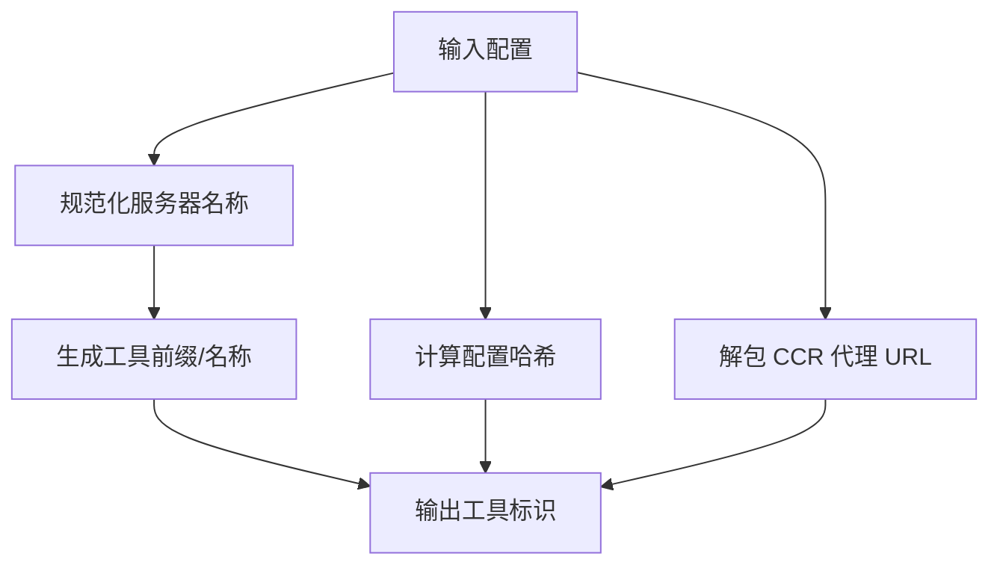
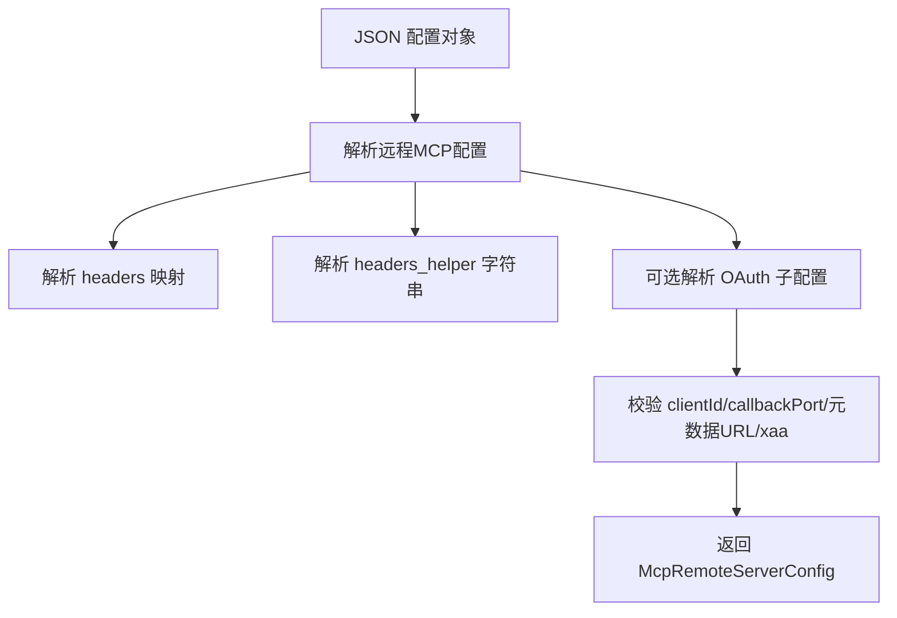
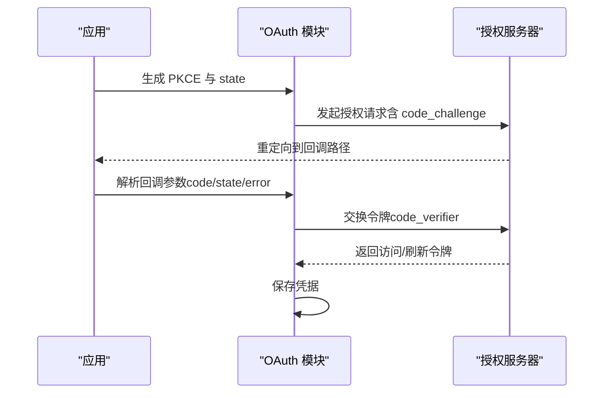
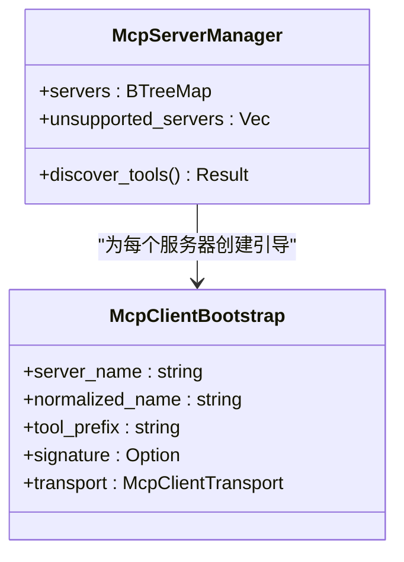
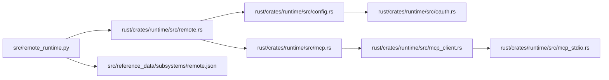

# 远程模式

<cite>
**本文引用的文件**
- [src/remote/__init__.py](file://src/remote/__init__.py)
- [src/remote_runtime.py](file://src/remote_runtime.py)
- [src/reference_data/subsystems/remote.json](file://src/reference_data/subsystems/remote.json)
- [rust/crates/runtime/src/remote.rs](file://rust/crates/runtime/src/remote.rs)
- [rust/crates/runtime/src/mcp.rs](file://rust/crates/runtime/src/mcp.rs)
- [rust/crates/runtime/src/config.rs](file://rust/crates/runtime/src/config.rs)
- [rust/crates/runtime/src/oauth.rs](file://rust/crates/runtime/src/oauth.rs)
- [rust/crates/runtime/src/mcp_client.rs](file://rust/crates/runtime/src/mcp_client.rs)
- [rust/crates/runtime/src/mcp_stdio.rs](file://rust/crates/runtime/src/mcp_stdio.rs)
</cite>

## 目录
1. [引言](#引言)
2. [项目结构](#项目结构)
3. [核心组件](#核心组件)
4. [架构总览](#架构总览)
5. [详细组件分析](#详细组件分析)
6. [依赖分析](#依赖分析)
7. [性能考虑](#性能考虑)
8. [故障排查指南](#故障排查指南)
9. [结论](#结论)
10. [附录](#附录)

## 引言
本文件面向 CLAW 的“远程运行模式”，系统性阐述其网络通信机制、连接建立流程、数据传输协议、服务发现与工具管理、认证与安全、配置项与环境变量、部署与运维建议、与远程服务器的同步与一致性保障，以及网络延迟优化与连接稳定性提升方案。需要特别说明的是：当前仓库中 Python 层的远程子系统为归档占位包，实际远程能力主要由 Rust 运行时模块提供；Python 层的远程运行入口目前仅返回占位报告。

## 项目结构
围绕远程模式的相关代码分布在以下位置：
- Python 占位层：src/remote 与 src/remote_runtime.py 提供远程模式占位接口与报告对象
- Rust 运行时：rust/crates/runtime/src 下的 remote.rs、mcp.rs、config.rs、oauth.rs 等模块，负责远程会话上下文、上游代理、MCP 服务器配置与签名、OAuth 认证等
- 配置解析：config.rs 中对远程 MCP 服务器配置与 OAuth 参数的解析
- MCP 客户端：mcp_client.rs、mcp_stdio.rs 提供客户端引导、传输类型与工具发现

图表来源
- [src/remote_runtime.py:1-26](file://src/remote_runtime.py#L1-L26)
- [src/remote/__init__.py:1-17](file://src/remote/__init__.py#L1-L17)
- [rust/crates/runtime/src/remote.rs:1-402](file://rust/crates/runtime/src/remote.rs#L1-L402)
- [rust/crates/runtime/src/mcp.rs:1-301](file://rust/crates/runtime/src/mcp.rs#L1-L301)
- [rust/crates/runtime/src/config.rs:800-999](file://rust/crates/runtime/src/config.rs#L800-L999)
- [rust/crates/runtime/src/oauth.rs:1-590](file://rust/crates/runtime/src/oauth.rs#L1-L590)
- [rust/crates/runtime/src/mcp_client.rs:57-68](file://rust/crates/runtime/src/mcp_client.rs#L57-L68)
- [rust/crates/runtime/src/mcp_stdio.rs:325-361](file://rust/crates/runtime/src/mcp_stdio.rs#L325-L361)

章节来源
- [src/remote/__init__.py:1-17](file://src/remote/__init__.py#L1-L17)
- [src/remote_runtime.py:1-26](file://src/remote_runtime.py#L1-L26)
- [src/reference_data/subsystems/remote.json:1-11](file://src/reference_data/subsystems/remote.json#L1-L11)

## 核心组件
- 运行模式报告（RuntimeModeReport）
  - 用于在 Python 层返回远程模式占位结果，包含模式名、连接状态与详情文本
- 远程会话上下文（RemoteSessionContext）与上游代理引导（UpstreamProxyBootstrap）
  - 从环境变量读取远程开关、会话 ID、基础 URL，并决定是否启用上游代理
  - 生成 WebSocket URL 与子进程代理环境变量集合
- MCP 服务器配置与签名
  - 规范化服务器名称、生成工具前缀与名称、计算配置哈希、解包 CCR 代理 URL
- OAuth 认证
  - PKCE 代码对生成、授权请求构建、回调参数解析、凭据存储与刷新
- 配置解析
  - 解析远程 MCP 服务器配置与可选 OAuth 子配置（客户端 ID、回调端口、元数据地址、扩展标志）

章节来源
- [src/remote_runtime.py:6-26](file://src/remote_runtime.py#L6-L26)
- [rust/crates/runtime/src/remote.rs:41-183](file://rust/crates/runtime/src/remote.rs#L41-L183)
- [rust/crates/runtime/src/mcp.rs:64-173](file://rust/crates/runtime/src/mcp.rs#L64-L173)
- [rust/crates/runtime/src/oauth.rs:12-320](file://rust/crates/runtime/src/oauth.rs#L12-L320)
- [rust/crates/runtime/src/config.rs:821-848](file://rust/crates/runtime/src/config.rs#L821-L848)

## 架构总览
远程模式通过“本地代理 + 远程服务器”的方式工作：本地运行时根据环境变量判断是否启用远程模式，若启用则通过本地 HTTP 代理将流量转发至远程 WebSocket 端点；同时，MCP 工具链通过标准化的签名与代理 URL 解包机制对接远端 MCP 服务器；OAuth 作为可选认证手段参与授权与令牌交换。

图表来源
- [src/remote_runtime.py:16-26](file://src/remote_runtime.py#L16-L26)
- [rust/crates/runtime/src/remote.rs:66-147](file://rust/crates/runtime/src/remote.rs#L66-L147)

## 详细组件分析

### 组件 A：远程会话与上游代理（remote.rs）
- 关键职责
  - 从环境变量读取远程开关、会话 ID、基础 URL
  - 读取会话令牌文件，推导 CA 证书路径
  - 计算上游代理 WS URL，生成代理状态与子进程代理环境
  - 维护 no_proxy 列表，支持继承上游代理环境变量
- 启用条件
  - 远程开关开启、上游代理开关开启、存在会话 ID、存在有效令牌
- 代理环境变量
  - HTTPS_PROXY/https_proxy、NO_PROXY/no_proxy、SSL_CERT_FILE、NODE_EXTRA_CA_CERTS、REQUESTS_CA_BUNDLE、CURL_CA_BUNDLE

图表来源
- [rust/crates/runtime/src/remote.rs:66-147](file://rust/crates/runtime/src/remote.rs#L66-L147)

章节来源
- [rust/crates/runtime/src/remote.rs:41-183](file://rust/crates/runtime/src/remote.rs#L41-L183)
- [rust/crates/runtime/src/remote.rs:185-198](file://rust/crates/runtime/src/remote.rs#L185-L198)

### 组件 B：MCP 服务器配置与签名（mcp.rs）
- 关键职责
  - 规范化服务器名称，生成工具前缀与工具名称
  - 计算配置哈希以支持变更检测
  - 解包 CCR 代理 URL，提取真实 MCP 地址
- 传输类型与签名
  - 支持 Stdio、HTTP、WebSocket、SDK、Claude AI 代理
  - 对 URL 类型进行解包处理，确保签名一致性

图表来源
- [rust/crates/runtime/src/mcp.rs:64-118](file://rust/crates/runtime/src/mcp.rs#L64-L118)

章节来源
- [rust/crates/runtime/src/mcp.rs:1-301](file://rust/crates/runtime/src/mcp.rs#L1-L301)

### 组件 C：远程 MCP 配置与 OAuth 解析（config.rs）
- 关键职责
  - 解析远程 MCP 服务器配置（URL、Headers、Headers Helper）
  - 可选解析 OAuth 子配置（clientId、callbackPort、authServerMetadataUrl、xaa）
- 错误处理
  - 对缺失字段、类型不匹配、越界值进行明确报错

图表来源
- [rust/crates/runtime/src/config.rs:821-848](file://rust/crates/runtime/src/config.rs#L821-L848)
- [rust/crates/runtime/src/config.rs:859-999](file://rust/crates/runtime/src/config.rs#L859-L999)

章节来源
- [rust/crates/runtime/src/config.rs:821-848](file://rust/crates/runtime/src/config.rs#L821-L848)

### 组件 D：OAuth 认证流程（oauth.rs）
- 关键职责
  - 生成 PKCE 代码对与 state
  - 构建授权 URL 与表单参数
  - 回调参数解析与凭据持久化
  - 凭据加载/保存/清理，支持刷新
- 环境与文件
  - 凭据文件位于 CLAUDE_CONFIG_HOME 或 HOME/.claude 下的 credentials.json

图表来源
- [rust/crates/runtime/src/oauth.rs:113-232](file://rust/crates/runtime/src/oauth.rs#L113-L232)
- [rust/crates/runtime/src/oauth.rs:262-292](file://rust/crates/runtime/src/oauth.rs#L262-L292)

章节来源
- [rust/crates/runtime/src/oauth.rs:12-590](file://rust/crates/runtime/src/oauth.rs#L12-L590)

### 组件 E：MCP 客户端引导与工具发现（mcp_client.rs、mcp_stdio.rs）
- 关键职责
  - 从配置构建 MCP 客户端引导信息（名称、前缀、签名、传输）
  - 管理支持的传输类型（如 Stdio），对不支持的传输给出明确提示
  - 扫描已知服务器并发起工具发现流程

图表来源
- [rust/crates/runtime/src/mcp_client.rs:57-68](file://rust/crates/runtime/src/mcp_client.rs#L57-L68)
- [rust/crates/runtime/src/mcp_stdio.rs:325-361](file://rust/crates/runtime/src/mcp_stdio.rs#L325-L361)

章节来源
- [rust/crates/runtime/src/mcp_client.rs:183-216](file://rust/crates/runtime/src/mcp_client.rs#L183-L216)
- [rust/crates/runtime/src/mcp_stdio.rs:325-361](file://rust/crates/runtime/src/mcp_stdio.rs#L325-L361)

### 组件 F：Python 占位与归档信息（remote_runtime.py、remote/__init__.py、remote.json）
- 占位行为
  - Python 层的远程模式函数返回固定格式的占位报告
- 归档信息
  - remote.json 描述了远程子系统的归档名称、模块数量与示例文件列表
  - Python 占位包读取该快照并导出常量与说明

章节来源
- [src/remote_runtime.py:16-26](file://src/remote_runtime.py#L16-L26)
- [src/remote/__init__.py:1-17](file://src/remote/__init__.py#L1-L17)
- [src/reference_data/subsystems/remote.json:1-11](file://src/reference_data/subsystems/remote.json#L1-L11)

## 依赖分析
- Python 运行时依赖 Rust 运行时提供的远程会话与代理能力
- Rust 运行时内部依赖关系
  - remote.rs 依赖环境变量与文件系统（令牌与 CA Bundle）
  - mcp.rs 依赖 config.rs 的配置解析结果
  - oauth.rs 依赖配置模块提供的 OAuth 配置
  - mcp_client.rs 与 mcp_stdio.rs 依赖上述模块以完成客户端引导与工具发现

图表来源
- [src/remote_runtime.py:1-26](file://src/remote_runtime.py#L1-L26)
- [rust/crates/runtime/src/remote.rs:1-402](file://rust/crates/runtime/src/remote.rs#L1-L402)
- [rust/crates/runtime/src/config.rs:821-848](file://rust/crates/runtime/src/config.rs#L821-L848)
- [rust/crates/runtime/src/oauth.rs:1-590](file://rust/crates/runtime/src/oauth.rs#L1-L590)
- [rust/crates/runtime/src/mcp.rs:1-301](file://rust/crates/runtime/src/mcp.rs#L1-L301)
- [rust/crates/runtime/src/mcp_client.rs:57-68](file://rust/crates/runtime/src/mcp_client.rs#L57-L68)
- [rust/crates/runtime/src/mcp_stdio.rs:325-361](file://rust/crates/runtime/src/mcp_stdio.rs#L325-L361)

## 性能考虑
- 代理与证书
  - 使用本地 HTTP 代理减少外部直连开销，统一设置 SSL_CERT_FILE 等变量确保 TLS 校验一致
- no_proxy 策略
  - 将内网域名与常用站点加入 no_proxy，避免不必要的代理绕行
- 连接复用
  - WebSocket 连接应保持长连接，避免频繁重建
- 工具发现与签名
  - 通过稳定的配置哈希与签名机制，减少重复初始化成本

## 故障排查指南
- 远程模式未生效
  - 检查远程开关、会话 ID、令牌文件是否存在且非空
  - 确认上游代理开关已启用
- 代理环境变量缺失
  - 确保 HTTPS_PROXY 与 SSL_CERT_FILE 同时存在，否则不会继承上游代理环境
- WebSocket 连接失败
  - 校验基础 URL 与 WS URL 推导逻辑（自动补全 wss/ws 前缀）
- OAuth 回调异常
  - 检查回调路径与查询参数解析，确认 state 与 code 是否正确传递
- 配置解析错误
  - 关注缺失字段或类型不匹配的报错，修正 JSON 配置

章节来源
- [rust/crates/runtime/src/remote.rs:221-235](file://rust/crates/runtime/src/remote.rs#L221-L235)
- [rust/crates/runtime/src/remote.rs:200-211](file://rust/crates/runtime/src/remote.rs#L200-L211)
- [rust/crates/runtime/src/oauth.rs:294-318](file://rust/crates/runtime/src/oauth.rs#L294-L318)
- [rust/crates/runtime/src/config.rs:859-999](file://rust/crates/runtime/src/config.rs#L859-L999)

## 结论
CLAW 的远程模式以 Rust 运行时为核心，结合本地代理、MCP 工具链与可选 OAuth 认证，形成一套可扩展、可配置且具备安全性的远程执行框架。Python 层提供占位接口，便于上层集成与展示。通过合理的配置与环境变量管理，可实现稳定高效的远程连接与工具发现。

## 附录

### 配置与环境变量清单
- 远程会话相关
  - CLAUDE_CODE_REMOTE：启用远程模式
  - CLAUDE_CODE_REMOTE_SESSION_ID：远程会话 ID
  - ANTHROPIC_BASE_URL：远程基础 URL，默认 https://api.anthropic.com
- 上游代理相关
  - CCR_UPSTREAM_PROXY_ENABLED：启用上游代理
  - CCR_SESSION_TOKEN_PATH：会话令牌文件路径，默认 /run/ccr/session_token
  - CCR_CA_BUNDLE_PATH：自定义 CA Bundle 路径
  - CCR_SYSTEM_CA_BUNDLE：系统默认 CA Bundle 路径
- 代理环境变量（子进程继承）
  - HTTPS_PROXY/https_proxy、NO_PROXY/no_proxy、SSL_CERT_FILE、NODE_EXTRA_CA_CERTS、REQUESTS_CA_BUNDLE、CURL_CA_BUNDLE
- OAuth 相关（来自配置解析）
  - clientId、callbackPort、authServerMetadataUrl、xaa

章节来源
- [rust/crates/runtime/src/remote.rs:66-128](file://rust/crates/runtime/src/remote.rs#L66-L128)
- [rust/crates/runtime/src/remote.rs:160-182](file://rust/crates/runtime/src/remote.rs#L160-L182)
- [rust/crates/runtime/src/config.rs:821-848](file://rust/crates/runtime/src/config.rs#L821-L848)