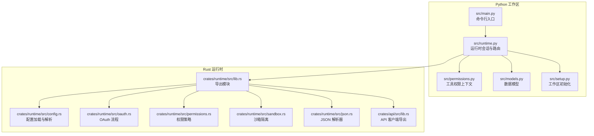
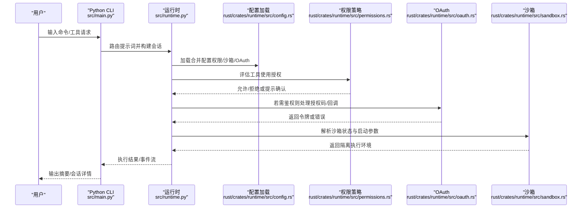
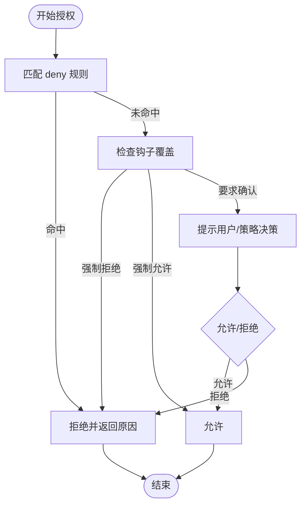
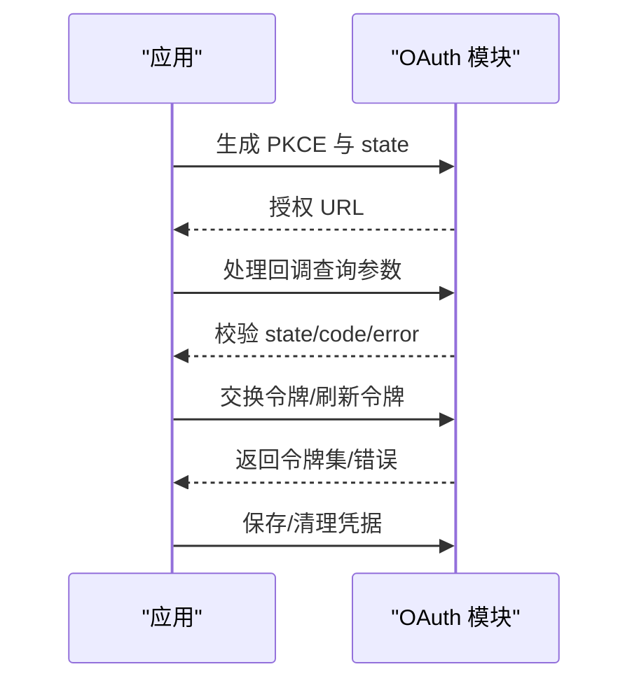
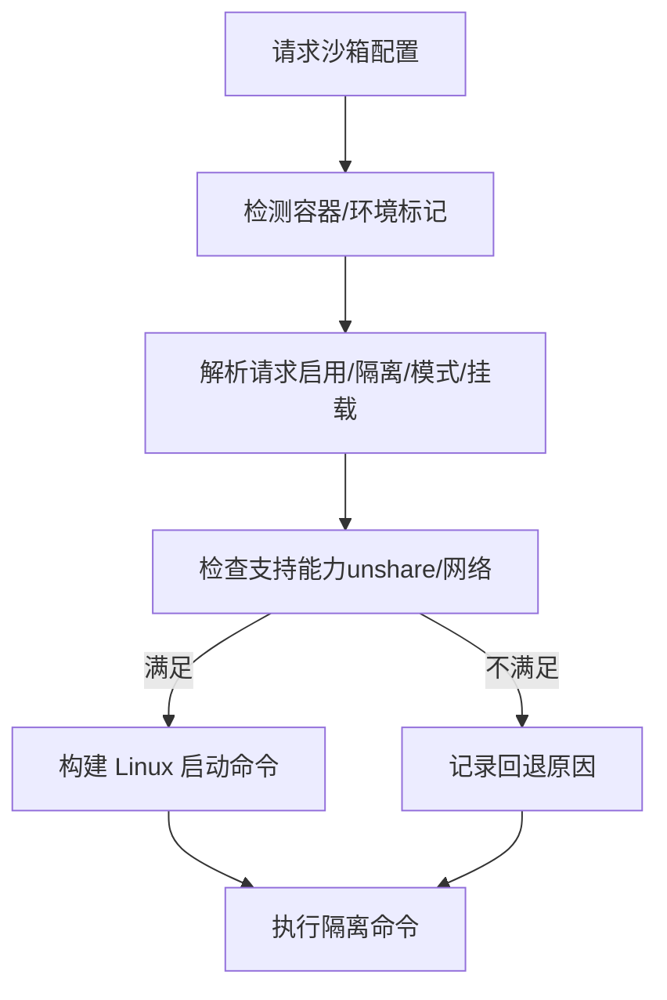
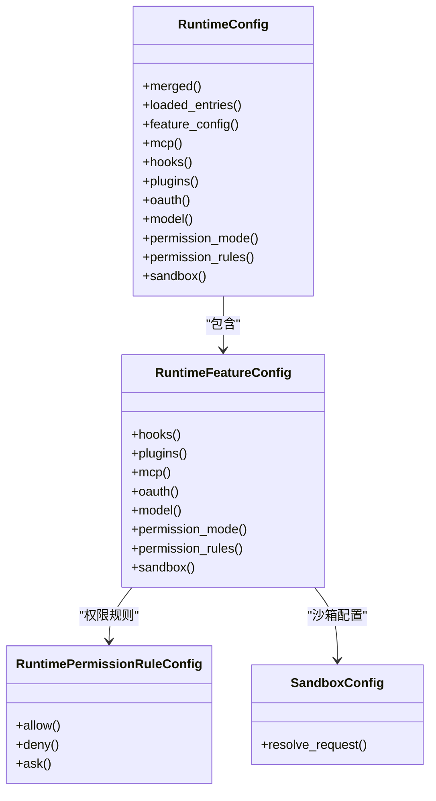
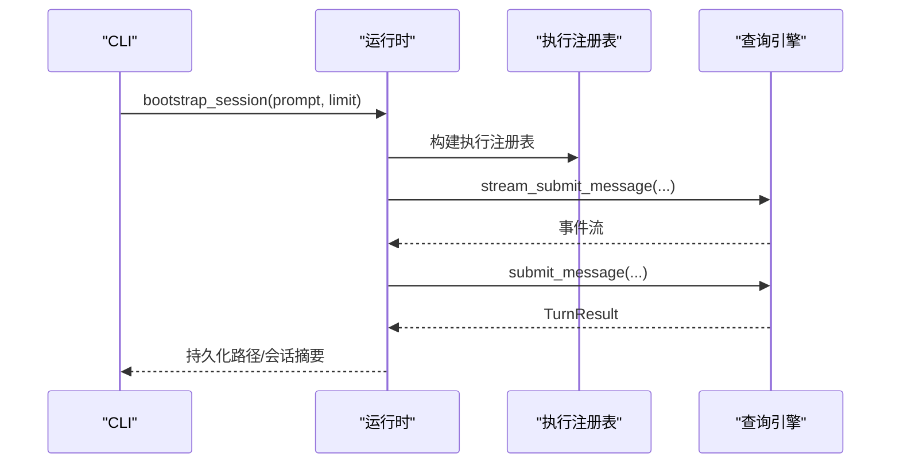
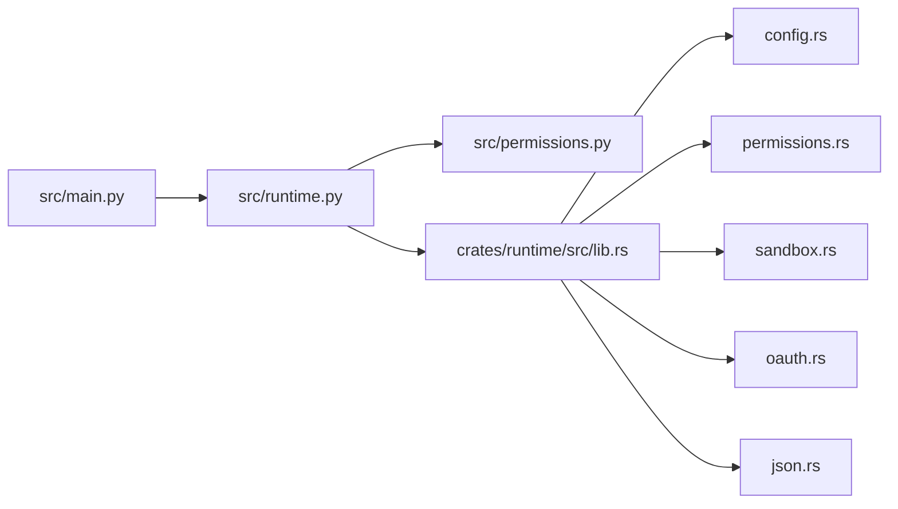

# 安全加固

<cite>
**本文引用的文件**
- [README.md](file://README.md)
- [Cargo.toml](file://rust/Cargo.toml)
- [src/main.py](file://src/main.py)
- [src/permissions.py](file://src/permissions.py)
- [src/runtime.py](file://src/runtime.py)
- [src/models.py](file://src/models.py)
- [src/setup.py](file://src/setup.py)
- [rust/crates/runtime/src/lib.rs](file://rust/crates/runtime/src/lib.rs)
- [rust/crates/runtime/src/config.rs](file://rust/crates/runtime/src/config.rs)
- [rust/crates/runtime/src/oauth.rs](file://rust/crates/runtime/src/oauth.rs)
- [rust/crates/runtime/src/permissions.rs](file://rust/crates/runtime/src/permissions.rs)
- [rust/crates/runtime/src/sandbox.rs](file://rust/crates/runtime/src/sandbox.rs)
- [rust/crates/runtime/src/json.rs](file://rust/crates/runtime/src/json.rs)
- [rust/crates/api/src/lib.rs](file://rust/crates/api/src/lib.rs)
</cite>

## 目录
1. [简介](#简介)
2. [项目结构](#项目结构)
3. [核心组件](#核心组件)
4. [架构总览](#架构总览)
5. [详细组件分析](#详细组件分析)
6. [依赖关系分析](#依赖关系分析)
7. [性能与安全权衡](#性能与安全权衡)
8. [故障排查指南](#故障排查指南)
9. [结论](#结论)
10. [附录：安全基线与评估清单](#附录安全基线与评估清单)

## 简介
本指南面向 CLAW 项目（Python/Rust 双栈）在安全加固与合规方面的系统化落地，聚焦以下目标：
- 访问控制、身份认证与授权机制的配置与最佳实践
- 网络安全、数据加密与传输安全
- 漏洞扫描、渗透测试与安全审计
- 防火墙、入侵检测与异常行为监控
- 数据隐私保护、合规性要求与安全策略
- 安全事件响应流程、应急处置与恢复计划
- 安全基线检查清单与定期安全评估执行标准

本指南以仓库现有实现为依据，结合 Rust 运行时与 Python 工作区的安全能力，给出可操作的加固建议与流程。

## 项目结构
CLAW 采用双栈设计：
- Python 工作区：命令路由、工具执行、会话持久化、运行时引导等
- Rust 运行时：权限策略、沙箱隔离、OAuth、配置加载、JSON 解析等

图示来源
- [src/main.py:94-214](file://src/main.py#L94-L214)
- [src/runtime.py:89-193](file://src/runtime.py#L89-L193)
- [src/permissions.py:6-21](file://src/permissions.py#L6-L21)
- [src/models.py:6-50](file://src/models.py#L6-L50)
- [src/setup.py:12-78](file://src/setup.py#L12-L78)
- [rust/crates/runtime/src/lib.rs:1-94](file://rust/crates/runtime/src/lib.rs#L1-L94)
- [rust/crates/runtime/src/config.rs:1-1389](file://rust/crates/runtime/src/config.rs#L1-L1389)
- [rust/crates/runtime/src/oauth.rs:1-590](file://rust/crates/runtime/src/oauth.rs#L1-L590)
- [rust/crates/runtime/src/permissions.rs:1-676](file://rust/crates/runtime/src/permissions.rs#L1-L676)
- [rust/crates/runtime/src/sandbox.rs:1-365](file://rust/crates/runtime/src/sandbox.rs#L1-L365)
- [rust/crates/runtime/src/json.rs:1-359](file://rust/crates/runtime/src/json.rs#L1-L359)
- [rust/crates/api/src/lib.rs:1-18](file://rust/crates/api/src/lib.rs#L1-L18)

章节来源
- [README.md:82-192](file://README.md#L82-L192)
- [src/main.py:21-91](file://src/main.py#L21-L91)
- [rust/crates/runtime/src/lib.rs:1-94](file://rust/crates/runtime/src/lib.rs#L1-L94)

## 核心组件
- 运行时会话与路由：负责提示词匹配命令/工具、执行、记录历史与持久化
- 权限策略：基于模式与规则的工具使用授权，支持提示确认与钩子覆盖
- 沙箱隔离：文件系统隔离、网络隔离、命名空间限制
- OAuth：PKCE 授权、回调参数解析、令牌存储与刷新
- 配置系统：多源合并、OAuth/MCP/插件/权限/沙箱等特性配置
- JSON 解析：安全的 JSON 值类型与解析器，避免常见注入风险

章节来源
- [src/runtime.py:89-193](file://src/runtime.py#L89-L193)
- [src/permissions.py:6-21](file://src/permissions.py#L6-L21)
- [rust/crates/runtime/src/permissions.rs:99-325](file://rust/crates/runtime/src/permissions.rs#L99-L325)
- [rust/crates/runtime/src/sandbox.rs:27-106](file://rust/crates/runtime/src/sandbox.rs#L27-L106)
- [rust/crates/runtime/src/oauth.rs:113-324](file://rust/crates/runtime/src/oauth.rs#L113-L324)
- [rust/crates/runtime/src/config.rs:178-346](file://rust/crates/runtime/src/config.rs#L178-L346)
- [rust/crates/runtime/src/json.rs:36-113](file://rust/crates/runtime/src/json.rs#L36-L113)

## 架构总览
下图展示从用户输入到工具执行的关键路径，以及安全控制点：

图示来源
- [src/main.py:94-214](file://src/main.py#L94-L214)
- [src/runtime.py:109-152](file://src/runtime.py#L109-L152)
- [rust/crates/runtime/src/config.rs:235-269](file://rust/crates/runtime/src/config.rs#L235-L269)
- [rust/crates/runtime/src/permissions.rs:156-284](file://rust/crates/runtime/src/permissions.rs#L156-L284)
- [rust/crates/runtime/src/oauth.rs:262-292](file://rust/crates/runtime/src/oauth.rs#L262-L292)
- [rust/crates/runtime/src/sandbox.rs:156-208](file://rust/crates/runtime/src/sandbox.rs#L156-L208)

## 详细组件分析

### 访问控制与授权机制
- 角色与模式
  - Python 端提供工具权限上下文，用于快速阻断特定工具名或前缀
  - Rust 端定义更细粒度的权限模式与规则，支持 allow/deny/ask 三类规则与钩子覆盖
- 授权决策流程
  - 优先匹配 deny 规则；其次评估 ask 规则触发提示；最后根据当前模式与所需模式决定允许或拒绝
  - 支持钩子强制允许/拒绝/询问，覆盖默认策略
- 实践要点
  - 将高危工具（如破坏性 Shell）纳入 deny 规则或默认危险模式
  - 对需要提升权限的场景（如从工作区写入到危险全权限）启用提示确认
  - 使用钩子对 CI/受信环境进行白名单放行

图示来源
- [src/permissions.py:18-21](file://src/permissions.py#L18-L21)
- [rust/crates/runtime/src/permissions.rs:156-284](file://rust/crates/runtime/src/permissions.rs#L156-L284)

章节来源
- [src/permissions.py:6-21](file://src/permissions.py#L6-L21)
- [rust/crates/runtime/src/permissions.rs:99-325](file://rust/crates/runtime/src/permissions.rs#L99-L325)
- [rust/crates/runtime/src/config.rs:637-720](file://rust/crates/runtime/src/config.rs#L637-L720)

### 身份认证与授权（OAuth）
- PKCE 授权流程
  - 生成随机 verifier/challenge，构建授权 URL 并处理回调参数
  - 保存/读取令牌，支持刷新与清理
- 安全要点
  - 回调端口与手动重定向 URL 可配置，避免明文暴露
  - 凭据文件按用户目录组织，避免全局可见
  - 查询参数解码严格校验，防止注入

图示来源
- [rust/crates/runtime/src/oauth.rs:113-174](file://rust/crates/runtime/src/oauth.rs#L113-L174)
- [rust/crates/runtime/src/oauth.rs:294-318](file://rust/crates/runtime/src/oauth.rs#L294-L318)
- [rust/crates/runtime/src/oauth.rs:276-292](file://rust/crates/runtime/src/oauth.rs#L276-L292)

章节来源
- [rust/crates/runtime/src/oauth.rs:1-590](file://rust/crates/runtime/src/oauth.rs#L1-L590)
- [rust/crates/api/src/lib.rs:6-17](file://rust/crates/api/src/lib.rs#L6-L17)

### 沙箱与隔离
- 功能范围
  - 文件系统隔离模式：关闭/仅工作区/白名单
  - 网络隔离与命名空间限制
  - Linux 下通过 unshare 启动隔离进程，设置 HOME/TMP 等环境变量
- 配置与回退
  - 当不满足条件（如缺少 unshare）时记录回退原因
  - 支持覆盖请求，便于调试与测试

图示来源
- [rust/crates/runtime/src/sandbox.rs:156-208](file://rust/crates/runtime/src/sandbox.rs#L156-L208)
- [rust/crates/runtime/src/sandbox.rs:211-262](file://rust/crates/runtime/src/sandbox.rs#L211-L262)

章节来源
- [rust/crates/runtime/src/sandbox.rs:1-365](file://rust/crates/runtime/src/sandbox.rs#L1-L365)

### 配置与安全策略
- 配置发现与合并
  - 用户级、项目级、本地级配置文件按优先级合并
  - 支持 hooks、plugins、MCP、OAuth、权限模式、权限规则、沙箱等
- 权限模式与规则
  - 支持只读、工作区写入、危险全权限等模式
  - 规则语法支持任意/精确/前缀匹配，可作用于输入内容提取的 subject 字段

图示来源
- [rust/crates/runtime/src/config.rs:32-57](file://rust/crates/runtime/src/config.rs#L32-L57)
- [rust/crates/runtime/src/config.rs:348-400](file://rust/crates/runtime/src/config.rs#L348-L400)
- [rust/crates/runtime/src/config.rs:495-515](file://rust/crates/runtime/src/config.rs#L495-L515)
- [rust/crates/runtime/src/sandbox.rs:85-106](file://rust/crates/runtime/src/sandbox.rs#L85-L106)

章节来源
- [rust/crates/runtime/src/config.rs:178-346](file://rust/crates/runtime/src/config.rs#L178-L346)
- [rust/crates/runtime/src/config.rs:637-720](file://rust/crates/runtime/src/config.rs#L637-L720)

### 运行时会话与工具执行
- 会话生命周期
  - 构建上下文、运行设置报告、历史记录、路由匹配、执行命令/工具、权限推断、事件流与持久化
- 工具执行与权限推断
  - 对高危工具（如破坏性 Shell）进行显式拒绝提示
- 命令行入口
  - 提供路由、引导、转循环、远程模式等子命令

图示来源
- [src/runtime.py:109-152](file://src/runtime.py#L109-L152)
- [src/main.py:142-159](file://src/main.py#L142-L159)

章节来源
- [src/runtime.py:89-193](file://src/runtime.py#L89-L193)
- [src/main.py:94-214](file://src/main.py#L94-L214)

## 依赖关系分析
- Python 侧依赖
  - 运行时会话依赖命令/工具清单、执行注册表、查询引擎与历史记录
  - 权限上下文用于快速阻断
- Rust 侧依赖
  - 运行时库统一导出配置、权限、沙箱、OAuth、JSON、会话等模块
  - 配置解析依赖 JSON 值类型与解析器

图示来源
- [src/main.py:5-18](file://src/main.py#L5-L18)
- [src/runtime.py:5-13](file://src/runtime.py#L5-L13)
- [rust/crates/runtime/src/lib.rs:1-94](file://rust/crates/runtime/src/lib.rs#L1-L94)

章节来源
- [src/main.py:1-214](file://src/main.py#L1-L214)
- [src/runtime.py:1-193](file://src/runtime.py#L1-L193)
- [rust/crates/runtime/src/lib.rs:1-94](file://rust/crates/runtime/src/lib.rs#L1-L94)

## 性能与安全权衡
- 沙箱隔离
  - 在 Linux 上启用命名空间/网络隔离会引入额外开销，建议仅在高风险场景开启
  - 文件系统白名单模式需明确挂载点，避免过度放宽
- 权限规则
  - deny 优先、ask 强制提示可降低误用风险，但可能影响自动化效率
  - 钩子覆盖应最小化并记录原因，便于审计
- OAuth
  - 回调端口与本地文件存储需限制访问权限，避免凭据泄露

[本节为通用指导，无需列出具体文件来源]

## 故障排查指南
- 配置加载失败
  - 检查配置文件是否为 JSON 对象，是否存在语法错误
  - 确认配置发现顺序与覆盖关系
- 权限拒绝
  - 查看 deny/ask 规则与输入 subject 匹配情况
  - 检查钩子覆盖是否导致拒绝或强制提示
- 沙箱不可用
  - 检查系统是否满足 unshare/网络隔离要求
  - 关注回退原因并调整模式或挂载
- OAuth 回调问题
  - 校验 state 一致性与回调参数格式
  - 确认凭据文件存在且权限正确

章节来源
- [rust/crates/runtime/src/config.rs:550-579](file://rust/crates/runtime/src/config.rs#L550-L579)
- [rust/crates/runtime/src/permissions.rs:318-325](file://rust/crates/runtime/src/permissions.rs#L318-L325)
- [rust/crates/runtime/src/sandbox.rs:168-208](file://rust/crates/runtime/src/sandbox.rs#L168-L208)
- [rust/crates/runtime/src/oauth.rs:294-318](file://rust/crates/runtime/src/oauth.rs#L294-L318)

## 结论
通过在 Python 工作区与 Rust 运行时之间建立清晰的安全边界与控制点，CLAW 项目可在保证功能完整性的同时，显著提升访问控制、身份认证与授权、隔离与配置管理等方面的安全性。建议将上述机制纳入 CI/CD 与运维流程，持续进行安全评估与基线检查。

[本节为总结性内容，无需列出具体文件来源]

## 附录：安全基线与评估清单

- 访问控制与授权
  - 是否对高危工具（如破坏性 Shell）默认 deny 或要求提升权限确认
  - 是否启用 ask 规则对敏感操作进行强制提示
  - 是否通过钩子对受信环境进行最小化放行并记录原因
- 身份认证与授权（OAuth）
  - 是否使用 PKCE 授权流程并严格校验回调参数
  - 凭据文件是否位于受限目录并设置最小权限
  - 是否支持令牌刷新与清理
- 沙箱与隔离
  - 是否在 Linux 环境启用命名空间/网络隔离
  - 文件系统白名单是否明确挂载点
  - 不满足条件时是否记录回退原因
- 配置与策略
  - 配置文件是否为 JSON 对象，合并逻辑是否可审计
  - 权限模式与规则是否与最小权限原则一致
- 网络与传输安全
  - 是否使用 HTTPS 与受信 CA
  - 是否对敏感参数进行脱敏输出
- 日志与审计
  - 是否记录权限决策、沙箱状态变更、OAuth 回调与错误
  - 是否保留会话持久化路径与执行摘要
- 漏洞扫描与渗透测试
  - 定期扫描依赖与配置文件中的敏感信息
  - 在受控环境进行模拟攻击与权限绕过测试
- 合规与隐私
  - 是否遵循最小数据收集原则
  - 是否提供数据删除与导出接口
- 应急响应
  - 是否具备凭据清理、沙箱禁用、权限收紧等快速处置手段
  - 是否有事件分级与上报流程

[本节为通用指导，无需列出具体文件来源]