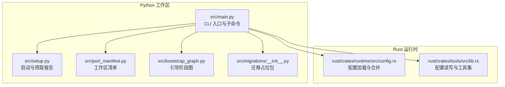
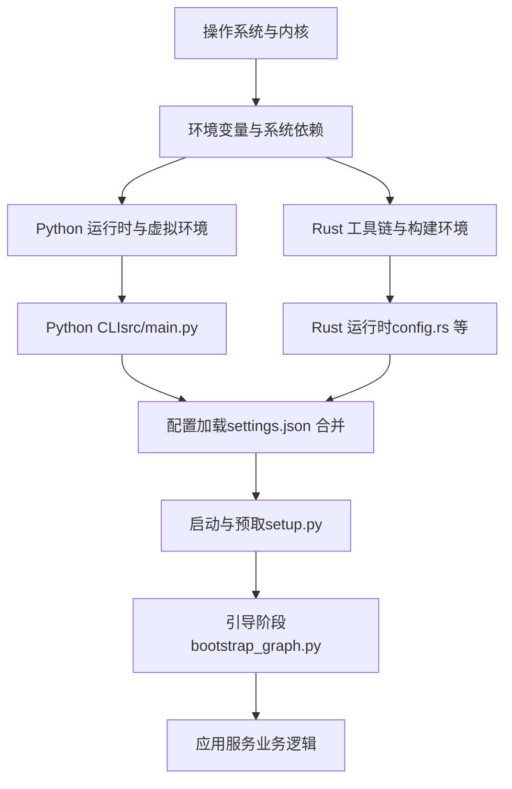
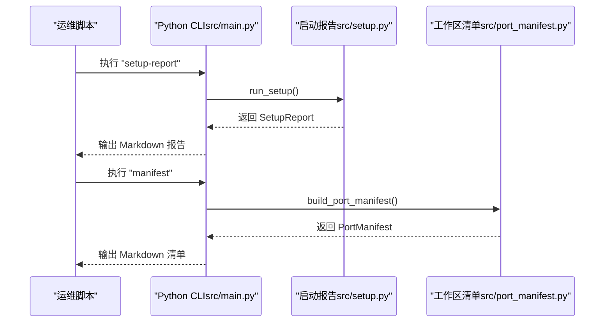
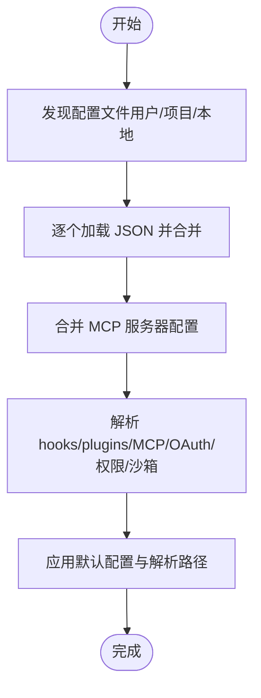
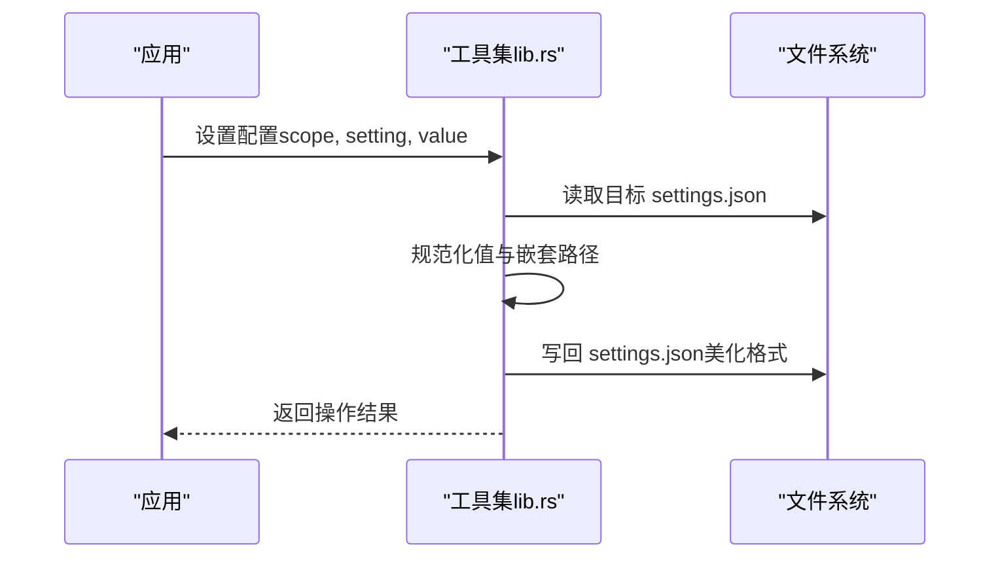
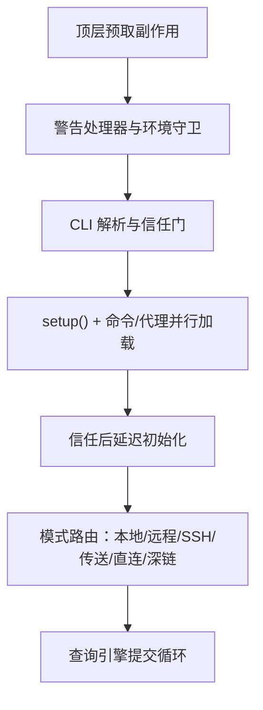
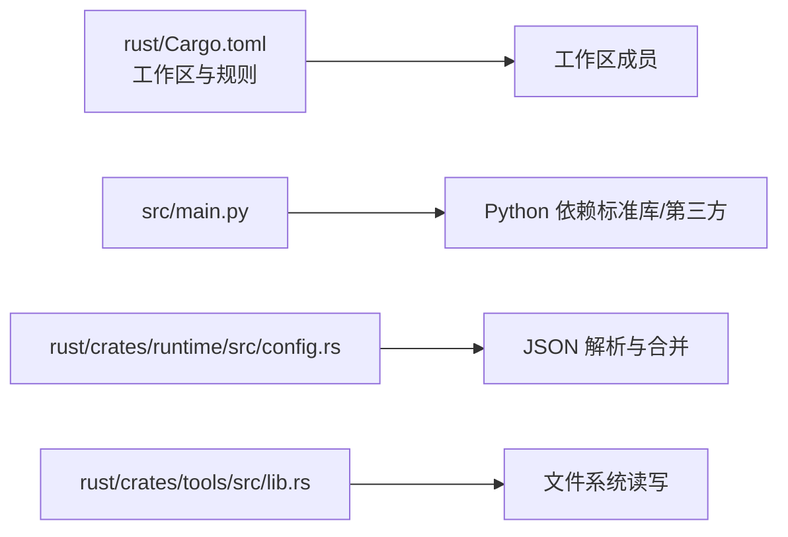

# 生产环境部署

<cite>
**本文引用的文件**
- [README.md](file://README.md)
- [Cargo.toml](file://rust/Cargo.toml)
- [main.py](file://src/main.py)
- [setup.py](file://src/setup.py)
- [port_manifest.py](file://src/port_manifest.py)
- [config.rs](file://rust/crates/runtime/src/config.rs)
- [lib.rs（工具集）](file://rust/crates/tools/src/lib.rs)
- [migrations/__init__.py](file://src/migrations/__init__.py)
- [migrations.json](file://src/reference_data/subsystems/migrations.json)
- [bootstrap_graph.py](file://src/bootstrap_graph.py)
</cite>

## 目录
1. [简介](#简介)
2. [项目结构](#项目结构)
3. [核心组件](#核心组件)
4. [架构总览](#架构总览)
5. [详细组件分析](#详细组件分析)
6. [依赖分析](#依赖分析)
7. [性能考虑](#性能考虑)
8. [故障排查指南](#故障排查指南)
9. [结论](#结论)
10. [附录：部署检查清单与验证步骤](#附录部署检查清单与验证步骤)

## 简介
本指南面向在生产环境中部署 CLAW 项目的工程团队，覆盖服务器环境准备、依赖安装与配置、容器化与编排部署、云平台落地、数据库初始化、环境变量与密钥管理、负载均衡与 SSL 证书、域名绑定，以及部署后的功能与性能验证流程。仓库同时包含 Python 工作区与 Rust 运行时实现，部署策略可基于 Python CLI 或 Rust 运行时进行。

## 项目结构
仓库采用“Python 工作区 + Rust 运行时”的双轨结构：
- Python 工作区位于 src/，提供 CLI 入口、端口清单、命令/工具索引、运行时装配与引导等能力。
- Rust 运行时位于 rust/，提供配置加载、权限与沙箱、MCP 服务集成、远程代理与证书注入等运行时特性。
- 参考数据位于 src/reference_data/，用于映射归档子系统信息（如 migrations）。

图表来源
- [main.py:1-214](file://src/main.py#L1-L214)
- [setup.py:1-78](file://src/setup.py#L1-L78)
- [port_manifest.py:1-53](file://src/port_manifest.py#L1-L53)
- [bootstrap_graph.py:1-27](file://src/bootstrap_graph.py#L1-L27)
- [config.rs:1-800](file://rust/crates/runtime/src/config.rs#L1-L800)
- [lib.rs（工具集）:2612-2947](file://rust/crates/tools/src/lib.rs#L2612-L2947)

章节来源
- [README.md:82-99](file://README.md#L82-L99)
- [Cargo.toml:1-20](file://rust/Cargo.toml#L1-L20)

## 核心组件
- CLI 入口与子命令：提供工作区摘要、清单、命令/工具索引、引导图、远程模式模拟、会话加载与持久化等功能，支撑部署前的自检与验证。
- 启动与预取报告：汇总 Python 版本、平台、可信度、预取结果与延迟初始化状态，便于生产部署前的环境一致性核验。
- 工作区清单：统计顶层模块数量与文件分布，辅助评估部署范围与变更影响。
- Rust 配置加载：支持用户/项目/本地多级 settings.json 合并，解析 hooks、插件、MCP、OAuth、权限模式、沙箱等配置项，并提供默认配置路径解析。
- 工具集配置读写：支持按作用域读取/写入 settings.json，提供嵌套键值设置与规范化处理。

章节来源
- [main.py:21-91](file://src/main.py#L21-L91)
- [setup.py:12-77](file://src/setup.py#L12-L77)
- [port_manifest.py:12-52](file://src/port_manifest.py#L12-L52)
- [config.rs:178-346](file://rust/crates/runtime/src/config.rs#L178-L346)
- [lib.rs（工具集）:2612-2947](file://rust/crates/tools/src/lib.rs#L2612-L2947)

## 架构总览
下图展示生产部署的关键路径：从服务器环境准备到容器化/编排部署，再到配置加载与运行时初始化。

图表来源
- [main.py:94-214](file://src/main.py#L94-L214)
- [setup.py:64-77](file://src/setup.py#L64-L77)
- [bootstrap_graph.py:16-27](file://src/bootstrap_graph.py#L16-L27)
- [config.rs:235-269](file://rust/crates/runtime/src/config.rs#L235-L269)

## 详细组件分析

### 组件一：Python CLI 与部署入口
- 功能要点
  - 提供 summary、manifest、parity-audit、setup-report、command-graph、tool-pool、bootstrap-graph、subsystems、commands、tools、route、bootstrap、turn-loop、flush-transcript、load-session、remote-mode、ssh-mode、teleport-mode、direct-connect-mode、deep-link-mode、show-command、show-tool、exec-command、exec-tool 等子命令。
  - 支持查询过滤、限制输出条数、禁用插件命令/技能命令、禁用 MCP 等参数，便于生产环境精细化控制。
- 部署建议
  - 在生产机上以非交互方式执行 setup-report 与 parity-audit，确保工作区与归档一致。
  - 使用 tool-pool 与 command-graph 输出当前可用工具与命令集合，作为部署清单的一部分。

图表来源
- [main.py:94-118](file://src/main.py#L94-L118)
- [setup.py:64-77](file://src/setup.py#L64-L77)
- [port_manifest.py:30-52](file://src/port_manifest.py#L30-L52)

章节来源
- [main.py:21-91](file://src/main.py#L21-L91)
- [setup.py:64-77](file://src/setup.py#L64-L77)
- [port_manifest.py:18-27](file://src/port_manifest.py#L18-L27)

### 组件二：Rust 配置加载与运行时
- 功能要点
  - 多级配置发现与合并：用户级 settings.json、项目级 .claude/settings.json、本地 .claude/settings.local.json。
  - 解析 hooks、插件、MCP、OAuth、权限模式、沙箱等配置项。
  - 默认配置目录解析：优先 CLAUDE_CONFIG_HOME，其次 HOME 下 .claude，否则使用当前目录 .claude。
- 部署建议
  - 将敏感配置（如 OAuth、MCP 认证）放入本地配置文件，避免纳入版本控制。
  - 在容器中通过挂载卷或环境变量注入必要的配置文件路径与内容。

图表来源
- [config.rs:206-269](file://rust/crates/runtime/src/config.rs#L206-L269)
- [config.rs:442-447](file://rust/crates/runtime/src/config.rs#L442-L447)

章节来源
- [config.rs:178-346](file://rust/crates/runtime/src/config.rs#L178-L346)
- [config.rs:442-447](file://rust/crates/runtime/src/config.rs#L442-L447)

### 组件三：工具集配置读写与密钥管理
- 功能要点
  - 按作用域读取/写入 settings.json，支持嵌套键值设置与规范化处理。
  - 适用于生产环境中的动态配置更新与密钥注入。
- 部署建议
  - 将密钥与令牌写入受控的本地配置文件，避免硬编码在镜像中。
  - 通过只读挂载与受限权限保障配置文件安全。

图表来源
- [lib.rs（工具集）:2612-2657](file://rust/crates/tools/src/lib.rs#L2612-L2657)
- [lib.rs（工具集）:2909-2918](file://rust/crates/tools/src/lib.rs#L2909-L2918)

章节来源
- [lib.rs（工具集）:2612-2947](file://rust/crates/tools/src/lib.rs#L2612-L2947)

### 组件四：引导阶段与运行时装配
- 功能要点
  - 引导阶段图定义了从顶层预取、警告处理器、环境守卫、CLI 解析、并行加载、信任门、模式路由到查询引擎提交循环的完整序列。
- 部署建议
  - 在容器启动脚本中严格遵循引导顺序，确保前置条件满足后再进入主服务。

图表来源
- [bootstrap_graph.py:16-27](file://src/bootstrap_graph.py#L16-L27)

章节来源
- [bootstrap_graph.py:6-27](file://src/bootstrap_graph.py#L6-L27)

## 依赖分析
- Python 工作区依赖
  - Python 版本与实现、平台信息由 setup.py 汇总；测试命令固定为单元测试发现。
  - CLI 子命令依赖各模块（命令、工具、会话存储、远程模式等），形成清晰的分层。
- Rust 运行时依赖
  - Cargo.toml 定义工作区成员与统一 lint 规则，确保跨 crate 的一致性。
  - 运行时配置依赖 JSON 解析与深度合并，支持多源配置合并与 MCP/OAuth 等高级特性。

图表来源
- [Cargo.toml:1-20](file://rust/Cargo.toml#L1-L20)
- [main.py:1-19](file://src/main.py#L1-L19)
- [config.rs:550-579](file://rust/crates/runtime/src/config.rs#L550-L579)
- [lib.rs（工具集）:2909-2918](file://rust/crates/tools/src/lib.rs#L2909-L2918)

章节来源
- [Cargo.toml:1-20](file://rust/Cargo.toml#L1-L20)
- [setup.py:12-27](file://src/setup.py#L12-L27)

## 性能考虑
- 启动阶段优化
  - 并行加载命令与代理，减少冷启动时间。
  - 预取副作用与项目扫描应尽量异步化，避免阻塞主线程。
- 配置合并
  - 多级配置合并应避免重复 IO，必要时引入缓存策略。
- 远程与代理
  - 在代理场景下，合理设置超时与重试，避免阻塞请求。
- 资源隔离
  - 沙箱与文件系统隔离策略应在保证安全的前提下最小化性能损耗。

## 故障排查指南
- 启动失败
  - 使用 setup-report 核对 Python 版本、平台与可信度；检查预取与延迟初始化结果。
- 配置错误
  - 检查 settings.json 是否存在语法错误；确认配置文件发现顺序与路径是否正确。
- 权限与沙箱
  - 若出现权限不足或文件访问异常，检查权限模式与沙箱配置是否符合预期。
- MCP 与 OAuth
  - 确认 MCP 服务器配置与认证参数正确；OAuth 回调端口与 scopes 是否匹配。
- 迁移与归档
  - migrations 占位包用于映射归档子系统，若出现相关报错，检查归档快照与迁移逻辑。

章节来源
- [setup.py:38-53](file://src/setup.py#L38-L53)
- [config.rs:550-579](file://rust/crates/runtime/src/config.rs#L550-L579)
- [config.rs:687-720](file://rust/crates/runtime/src/config.rs#L687-L720)
- [migrations/__init__.py:1-16](file://src/migrations/__init__.py#L1-L16)
- [migrations.json:1-18](file://src/reference_data/subsystems/migrations.json#L1-L18)

## 结论
本指南提供了基于仓库现有能力的生产环境部署蓝图：以 Python CLI 进行工作区自检与清单生成，结合 Rust 运行时的配置加载与运行时特性，配合容器化与编排策略，即可在生产环境中稳定交付 CLAW 服务。建议在部署前完成环境一致性核验、配置文件安全注入与密钥管理，并在上线后进行功能与性能验证。

## 附录：部署检查清单与验证步骤

- 服务器环境准备
  - 安装 Python 与虚拟环境，安装 Rust 工具链与构建依赖。
  - 准备系统依赖（网络、代理、证书链等）。
- 依赖安装与配置
  - 使用 Python CLI 执行 setup-report 与 parity-audit，确保工作区与归档一致。
  - 生成并审阅 manifest 与 command-graph、tool-pool 输出。
- 容器化与编排
  - 编写 Dockerfile 与 docker-compose.yaml，挂载配置目录与日志目录。
  - Kubernetes 部署：准备 Deployment、Service、ConfigMap、Secret 与 Ingress。
- 数据库初始化
  - 如涉及数据库，请在首次部署时执行初始化脚本与迁移任务。
- 环境变量与密钥管理
  - 将敏感信息注入到受控的本地配置文件或 Secret 中，避免硬编码。
- 负载均衡与 SSL
  - 配置反向代理与负载均衡，启用 HTTPS 并上传证书链。
- 域名绑定
  - 将域名解析指向负载均衡器 IP，确保 DNS 生效。
- 部署后验证
  - 功能测试：调用 CLI 的关键子命令，验证输出与行为。
  - 性能验证：压测接口，观察响应时间与资源占用。
  - 日志与监控：检查运行时日志与指标，确认无异常。

章节来源
- [README.md:112-149](file://README.md#L112-L149)
- [main.py:94-214](file://src/main.py#L94-L214)
- [setup.py:64-77](file://src/setup.py#L64-L77)
- [config.rs:235-269](file://rust/crates/runtime/src/config.rs#L235-L269)