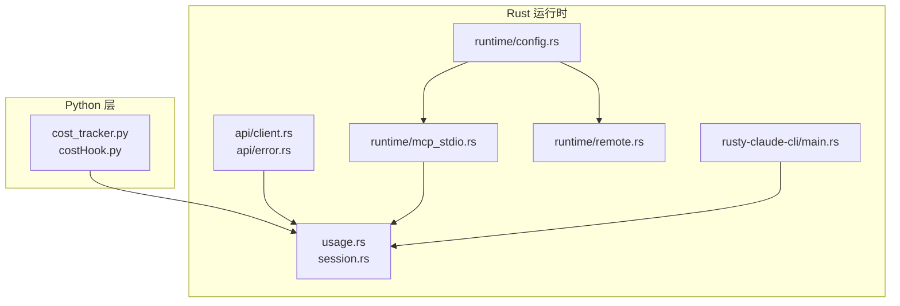
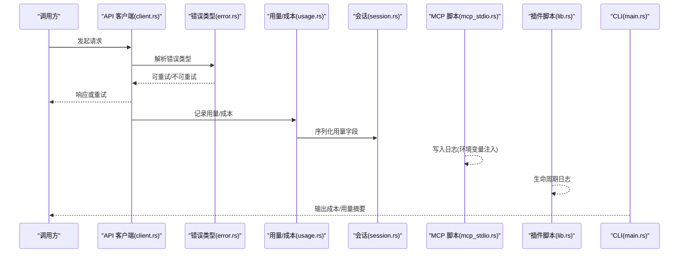
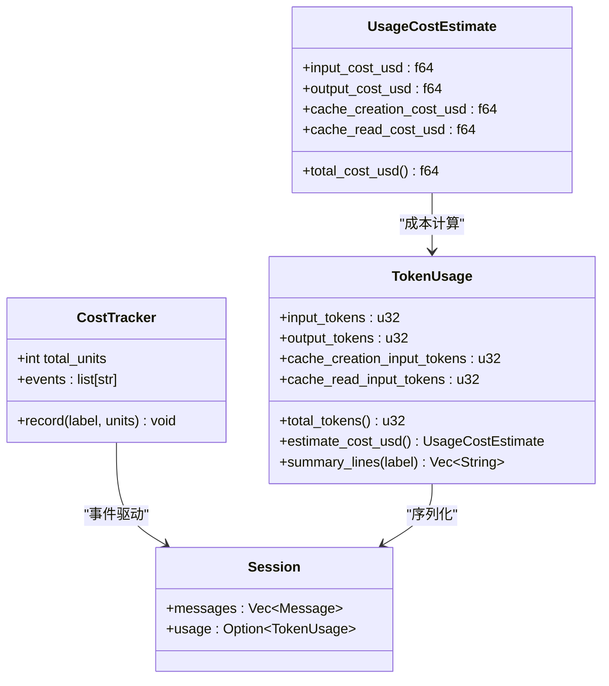
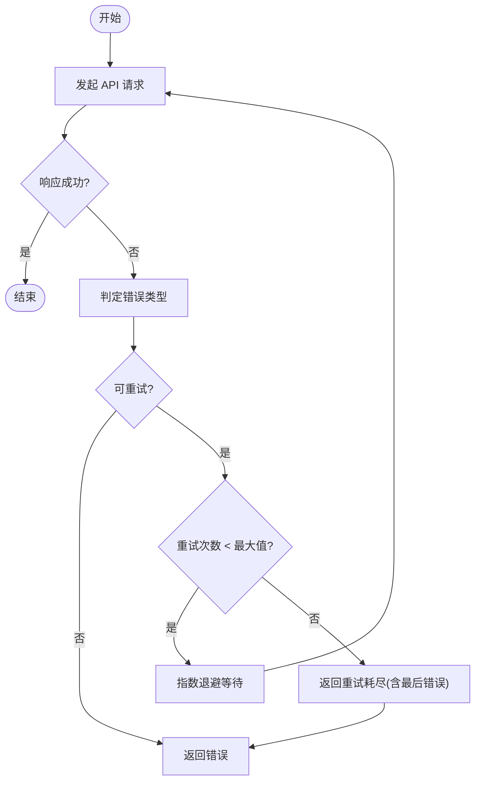
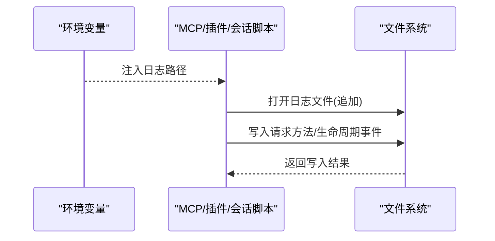
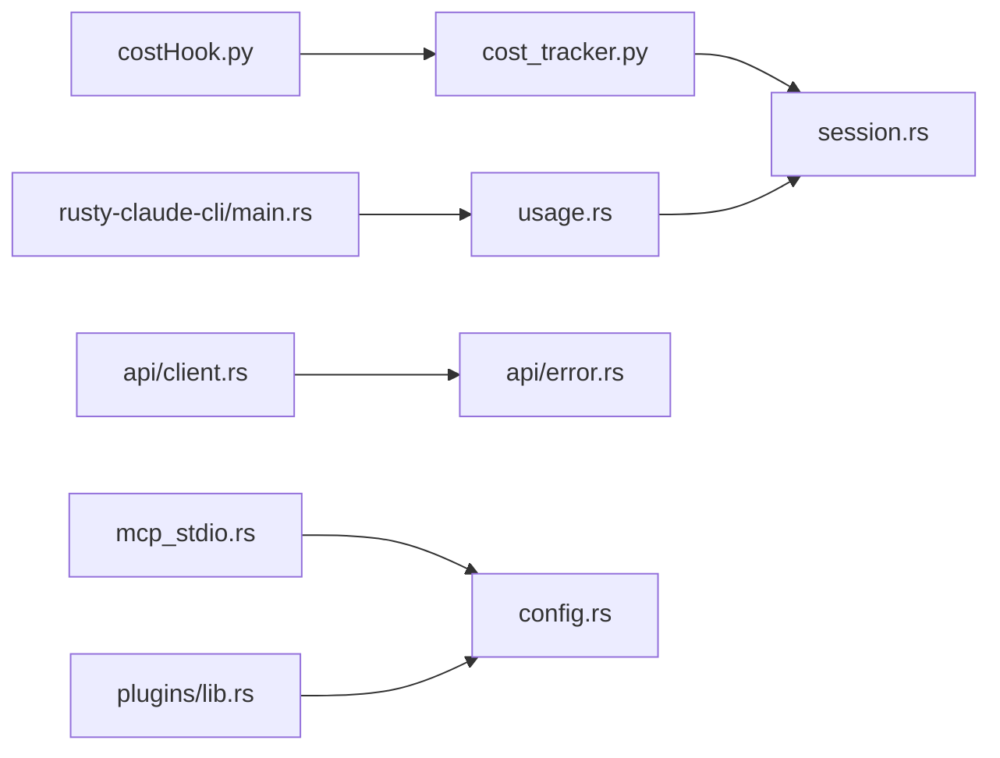

# 监控与日志

<cite>
**本文引用的文件**
- [src/cost_tracker.py](file://src/cost_tracker.py)
- [src/costHook.py](file://src/costHook.py)
- [rust/crates/api/src/client.rs](file://rust/crates/api/src/client.rs)
- [rust/crates/api/src/error.rs](file://rust/crates/api/src/error.rs)
- [rust/crates/runtime/src/usage.rs](file://rust/crates/runtime/src/usage.rs)
- [rust/crates/runtime/src/session.rs](file://rust/crates/runtime/src/session.rs)
- [rust/crates/runtime/src/config.rs](file://rust/crates/runtime/src/config.rs)
- [rust/crates/runtime/src/mcp_stdio.rs](file://rust/crates/runtime/src/mcp_stdio.rs)
- [rust/crates/runtime/src/remote.rs](file://rust/crates/runtime/src/remote.rs)
- [rust/crates/plugins/src/lib.rs](file://rust/crates/plugins/src/lib.rs)
- [rust/crates/runtime/src/conversation.rs](file://rust/crates/runtime/src/conversation.rs)
- [rust/crates/rusty-claude-cli/src/main.rs](file://rust/crates/rusty-claude-cli/src/main.rs)
- [PARITY.md](file://PARITY.md)
</cite>

## 目录
1. [简介](#简介)
2. [项目结构](#项目结构)
3. [核心组件](#核心组件)
4. [架构总览](#架构总览)
5. [组件详解](#组件详解)
6. [依赖关系分析](#依赖关系分析)
7. [性能考量](#性能考量)
8. [故障排查指南](#故障排查指南)
9. [结论](#结论)
10. [附录](#附录)

## 简介
本指南面向 CLAW 项目的监控与日志管理，目标是帮助运维与开发团队建立完善的可观测性体系，覆盖应用性能监控（APM）指标、系统健康检查与告警配置、日志采集与存储、错误追踪、性能分析以及用户体验监控。同时给出与 Prometheus、Grafana、ELK Stack 的集成建议，并明确关键指标（响应时间、吞吐量、错误率、资源使用率）的观测方法与日志轮转、归档与清理策略。

CLAW 由 Python 业务层与 Rust 运行时共同组成，其中 Rust 运行时承担会话、工具调用、MCP 交互、成本与用量统计等核心职责；Python 层负责部分工具与会话成本记录。现有代码中已具备成本追踪、用量统计、错误类型与重试机制、日志路径注入等基础能力，可作为构建监控与日志体系的起点。

## 项目结构
从监控与日志视角，以下模块与文件最为关键：
- 成本与用量：Python 成本追踪器与 Rust 用量估算、汇总与会话序列化
- 错误与重试：API 客户端错误类型与重试逻辑
- 日志与脚本：MCP 服务脚本的日志路径注入、插件生命周期日志、会话脚本日志
- 配置与沙箱：运行时配置、沙箱挂载点（含 logs）、远程代理启用开关
- CLI 报告：CLI 输出成本与用量摘要，便于本地观测

图表来源
- [src/cost_tracker.py:1-13](file://src/cost_tracker.py#L1-L13)
- [src/costHook.py:1-8](file://src/costHook.py#L1-L8)
- [rust/crates/api/src/client.rs:217-251](file://rust/crates/api/src/client.rs#L217-L251)
- [rust/crates/api/src/error.rs:1-49](file://rust/crates/api/src/error.rs#L1-L49)
- [rust/crates/runtime/src/usage.rs:1-200](file://rust/crates/runtime/src/usage.rs#L1-L200)
- [rust/crates/runtime/src/session.rs:327-369](file://rust/crates/runtime/src/session.rs#L327-L369)
- [rust/crates/runtime/src/config.rs:1162-1179](file://rust/crates/runtime/src/config.rs#L1162-L1179)
- [rust/crates/runtime/src/mcp_stdio.rs:1022-1124](file://rust/crates/runtime/src/mcp_stdio.rs#L1022-L1124)
- [rust/crates/runtime/src/remote.rs:89-128](file://rust/crates/runtime/src/remote.rs#L89-L128)
- [rust/crates/rusty-claude-cli/src/main.rs:689-750](file://rust/crates/rusty-claude-cli/src/main.rs#L689-L750)

章节来源
- [src/cost_tracker.py:1-13](file://src/cost_tracker.py#L1-L13)
- [rust/crates/runtime/src/usage.rs:1-200](file://rust/crates/runtime/src/usage.rs#L1-L200)
- [rust/crates/api/src/client.rs:217-251](file://rust/crates/api/src/client.rs#L217-L251)
- [rust/crates/runtime/src/config.rs:1162-1179](file://rust/crates/runtime/src/config.rs#L1162-L1179)
- [rust/crates/runtime/src/mcp_stdio.rs:1022-1124](file://rust/crates/runtime/src/mcp_stdio.rs#L1022-L1124)
- [rust/crates/runtime/src/remote.rs:89-128](file://rust/crates/runtime/src/remote.rs#L89-L128)
- [rust/crates/rusty-claude-cli/src/main.rs:689-750](file://rust/crates/rusty-claude-cli/src/main.rs#L689-L750)

## 核心组件
- 成本与用量追踪
  - Python 成本追踪器用于记录事件与单位，配合钩子函数在工具调用前后记录成本事件
  - Rust 用量估算模块提供模型定价、用量汇总、成本估算与摘要输出，支持按模型选择定价或默认定价
  - 会话序列化包含用量字段，便于持久化与回放
- 错误与重试
  - API 错误类型区分可重试与不可重试场景，客户端根据错误类型执行指数退避与最大重试次数控制
- 日志与脚本
  - MCP 服务脚本通过环境变量注入日志路径，实现请求方法级日志落盘
  - 插件与会话脚本生成生命周期日志文件，便于定位启动/关闭阶段问题
- 配置与沙箱
  - 运行时配置允许设置沙箱挂载点，包含 logs，便于将日志目录映射到容器/沙箱内
  - 远程代理启用开关与令牌路径影响上游代理行为，间接影响日志与网络可观测性
- CLI 报告
  - CLI 提供成本与用量摘要输出，便于本地快速核对

章节来源
- [src/cost_tracker.py:1-13](file://src/cost_tracker.py#L1-L13)
- [src/costHook.py:1-8](file://src/costHook.py#L1-L8)
- [rust/crates/runtime/src/usage.rs:1-200](file://rust/crates/runtime/src/usage.rs#L1-L200)
- [rust/crates/runtime/src/session.rs:327-369](file://rust/crates/runtime/src/session.rs#L327-L369)
- [rust/crates/api/src/error.rs:1-49](file://rust/crates/api/src/error.rs#L1-L49)
- [rust/crates/api/src/client.rs:275-321](file://rust/crates/api/src/client.rs#L275-L321)
- [rust/crates/runtime/src/mcp_stdio.rs:1022-1124](file://rust/crates/runtime/src/mcp_stdio.rs#L1022-L1124)
- [rust/crates/plugins/src/lib.rs:2089-2096](file://rust/crates/plugins/src/lib.rs#L2089-L2096)
- [rust/crates/runtime/src/conversation.rs:800-808](file://rust/crates/runtime/src/conversation.rs#L800-L808)
- [rust/crates/runtime/src/config.rs:1162-1179](file://rust/crates/runtime/src/config.rs#L1162-L1179)
- [rust/crates/runtime/src/remote.rs:89-128](file://rust/crates/runtime/src/remote.rs#L89-L128)
- [rust/crates/rusty-claude-cli/src/main.rs:689-750](file://rust/crates/rusty-claude-cli/src/main.rs#L689-L750)

## 架构总览
下图展示监控与日志在 CLAW 中的关键交互路径：API 调用产生错误与重试，用量与成本在运行时累积并序列化，MCP 与插件脚本写入日志文件，CLI 输出报告辅助观测。

图表来源
- [rust/crates/api/src/client.rs:275-321](file://rust/crates/api/src/client.rs#L275-L321)
- [rust/crates/api/src/error.rs:1-49](file://rust/crates/api/src/error.rs#L1-L49)
- [rust/crates/runtime/src/usage.rs:1-200](file://rust/crates/runtime/src/usage.rs#L1-L200)
- [rust/crates/runtime/src/session.rs:327-369](file://rust/crates/runtime/src/session.rs#L327-L369)
- [rust/crates/runtime/src/mcp_stdio.rs:1022-1124](file://rust/crates/runtime/src/mcp_stdio.rs#L1022-L1124)
- [rust/crates/plugins/src/lib.rs:2089-2096](file://rust/crates/plugins/src/lib.rs#L2089-L2096)
- [rust/crates/rusty-claude-cli/src/main.rs:689-750](file://rust/crates/rusty-claude-cli/src/main.rs#L689-L750)

## 组件详解

### 成本与用量追踪
- Python 成本追踪器
  - 通过记录标签与单位，形成事件列表，便于后续聚合与可视化
- Rust 用量估算
  - 支持按模型选择定价，否则使用默认定价
  - 提供累计用量与单轮用量，支持摘要行输出，便于 CLI 与外部系统消费
- 会话序列化
  - 将用量字段序列化为 JSON，便于持久化与审计

图表来源
- [src/cost_tracker.py:1-13](file://src/cost_tracker.py#L1-L13)
- [rust/crates/runtime/src/usage.rs:1-200](file://rust/crates/runtime/src/usage.rs#L1-L200)
- [rust/crates/runtime/src/session.rs:327-369](file://rust/crates/runtime/src/session.rs#L327-L369)

章节来源
- [src/cost_tracker.py:1-13](file://src/cost_tracker.py#L1-L13)
- [src/costHook.py:1-8](file://src/costHook.py#L1-L8)
- [rust/crates/runtime/src/usage.rs:1-200](file://rust/crates/runtime/src/usage.rs#L1-L200)
- [rust/crates/runtime/src/session.rs:327-369](file://rust/crates/runtime/src/session.rs#L327-L369)

### 错误与重试流程
- 错误类型
  - 区分认证、网络连接、超时、请求失败、JSON 解析、SSE 帧错误、退避溢出等
  - 提供 is_retryable 判定，决定是否进行重试
- 重试策略
  - 客户端在可重试错误且未超过最大重试次数时进行退避重试
  - 达到上限后返回“重试耗尽”错误，携带最后一次错误

图表来源
- [rust/crates/api/src/error.rs:1-49](file://rust/crates/api/src/error.rs#L1-L49)
- [rust/crates/api/src/client.rs:275-321](file://rust/crates/api/src/client.rs#L275-L321)

章节来源
- [rust/crates/api/src/error.rs:1-49](file://rust/crates/api/src/error.rs#L1-L49)
- [rust/crates/api/src/client.rs:275-321](file://rust/crates/api/src/client.rs#L275-L321)

### 日志采集与存储
- MCP 服务脚本日志
  - 通过环境变量注入日志路径，脚本在收到请求时追加方法名到日志文件
- 插件与会话脚本日志
  - 插件安装/卸载/初始化/关闭阶段生成生命周期日志文件
  - 会话脚本在初始化与关闭时写入生命周期日志
- 沙箱与日志挂载
  - 运行时配置允许将 logs 挂载到沙箱，便于容器内统一收集

图表来源
- [rust/crates/runtime/src/mcp_stdio.rs:1022-1124](file://rust/crates/runtime/src/mcp_stdio.rs#L1022-L1124)
- [rust/crates/plugins/src/lib.rs:2089-2096](file://rust/crates/plugins/src/lib.rs#L2089-L2096)
- [rust/crates/runtime/src/conversation.rs:800-808](file://rust/crates/runtime/src/conversation.rs#L800-L808)
- [rust/crates/runtime/src/config.rs:1162-1179](file://rust/crates/runtime/src/config.rs#L1162-L1179)

章节来源
- [rust/crates/runtime/src/mcp_stdio.rs:1022-1124](file://rust/crates/runtime/src/mcp_stdio.rs#L1022-L1124)
- [rust/crates/plugins/src/lib.rs:2089-2096](file://rust/crates/plugins/src/lib.rs#L2089-L2096)
- [rust/crates/runtime/src/conversation.rs:800-808](file://rust/crates/runtime/src/conversation.rs#L800-L808)
- [rust/crates/runtime/src/config.rs:1162-1179](file://rust/crates/runtime/src/config.rs#L1162-L1179)

### 远程代理与健康检查
- 远程代理启用条件
  - 启用标志、会话 ID、令牌均需存在才启用
- 健康检查建议
  - 通过远程代理状态与令牌有效性进行健康检查
  - 结合 API 客户端的错误类型判断网络与鉴权健康状况

章节来源
- [rust/crates/runtime/src/remote.rs:89-128](file://rust/crates/runtime/src/remote.rs#L89-L128)
- [rust/crates/api/src/error.rs:1-49](file://rust/crates/api/src/error.rs#L1-L49)

## 依赖关系分析
- Python 成本追踪器与 Rust 用量模块解耦，通过事件与会话序列化进行数据交换
- API 客户端依赖错误类型模块，错误类型决定重试策略
- MCP 与插件脚本依赖运行时配置中的日志路径注入
- CLI 依赖用量模块的摘要输出，用于本地观测

图表来源
- [src/costHook.py:1-8](file://src/costHook.py#L1-L8)
- [src/cost_tracker.py:1-13](file://src/cost_tracker.py#L1-L13)
- [rust/crates/runtime/src/session.rs:327-369](file://rust/crates/runtime/src/session.rs#L327-L369)
- [rust/crates/runtime/src/usage.rs:1-200](file://rust/crates/runtime/src/usage.rs#L1-L200)
- [rust/crates/api/src/client.rs:275-321](file://rust/crates/api/src/client.rs#L275-L321)
- [rust/crates/api/src/error.rs:1-49](file://rust/crates/api/src/error.rs#L1-L49)
- [rust/crates/runtime/src/mcp_stdio.rs:1022-1124](file://rust/crates/runtime/src/mcp_stdio.rs#L1022-L1124)
- [rust/crates/runtime/src/config.rs:1162-1179](file://rust/crates/runtime/src/config.rs#L1162-L1179)
- [rust/crates/plugins/src/lib.rs:2089-2096](file://rust/crates/plugins/src/lib.rs#L2089-L2096)
- [rust/crates/rusty-claude-cli/src/main.rs:689-750](file://rust/crates/rusty-claude-cli/src/main.rs#L689-L750)

章节来源
- [src/costHook.py:1-8](file://src/costHook.py#L1-L8)
- [src/cost_tracker.py:1-13](file://src/cost_tracker.py#L1-L13)
- [rust/crates/runtime/src/session.rs:327-369](file://rust/crates/runtime/src/session.rs#L327-L369)
- [rust/crates/runtime/src/usage.rs:1-200](file://rust/crates/runtime/src/usage.rs#L1-L200)
- [rust/crates/api/src/client.rs:275-321](file://rust/crates/api/src/client.rs#L275-L321)
- [rust/crates/api/src/error.rs:1-49](file://rust/crates/api/src/error.rs#L1-L49)
- [rust/crates/runtime/src/mcp_stdio.rs:1022-1124](file://rust/crates/runtime/src/mcp_stdio.rs#L1022-L1124)
- [rust/crates/runtime/src/config.rs:1162-1179](file://rust/crates/runtime/src/config.rs#L1162-L1179)
- [rust/crates/plugins/src/lib.rs:2089-2096](file://rust/crates/plugins/src/lib.rs#L2089-L2096)
- [rust/crates/rusty-claude-cli/src/main.rs:689-750](file://rust/crates/rusty-claude-cli/src/main.rs#L689-L750)

## 性能考量
- 响应时间
  - 通过 API 客户端的请求-响应链路观测，结合错误类型与重试次数评估稳定性
- 吞吐量
  - 基于会话消息数与工具调用频率估算；用量统计可用于衡量处理规模
- 错误率
  - 使用错误类型计数与重试耗尽次数作为错误率指标
- 资源使用率
  - 用量统计中的输入/输出/缓存读写令牌数反映资源消耗趋势
- 性能分析
  - CLI 成本/用量摘要输出可作为本地性能基线；结合日志定位热点路径

章节来源
- [rust/crates/api/src/client.rs:275-321](file://rust/crates/api/src/client.rs#L275-L321)
- [rust/crates/runtime/src/usage.rs:1-200](file://rust/crates/runtime/src/usage.rs#L1-L200)
- [rust/crates/rusty-claude-cli/src/main.rs:689-750](file://rust/crates/rusty-claude-cli/src/main.rs#L689-L750)

## 故障排查指南
- API 错误分类与重试
  - 若出现连接/超时/请求错误，优先检查网络与上游可用性
  - 若为认证或令牌过期，检查凭据与刷新流程
- 重试耗尽
  - 当达到最大重试次数仍失败时，查看最后一次错误以定位根因
- MCP/插件日志
  - 检查日志路径是否正确注入，确认脚本是否正常写入日志
- 远程代理
  - 确认启用标志、会话 ID、令牌路径均有效，避免代理不生效导致的观测盲区

章节来源
- [rust/crates/api/src/error.rs:1-49](file://rust/crates/api/src/error.rs#L1-L49)
- [rust/crates/api/src/client.rs:275-321](file://rust/crates/api/src/client.rs#L275-L321)
- [rust/crates/runtime/src/mcp_stdio.rs:1022-1124](file://rust/crates/runtime/src/mcp_stdio.rs#L1022-L1124)
- [rust/crates/runtime/src/remote.rs:89-128](file://rust/crates/runtime/src/remote.rs#L89-L128)

## 结论
CLAW 已具备成本与用量统计、错误分类与重试、日志路径注入与脚本化日志、运行时配置与沙箱挂载等可观测性基础能力。建议在此基础上完善：
- 指标导出与告警：将用量、错误、重试等指标接入 Prometheus，配置 Grafana 仪表盘
- 日志采集：统一采集 logs 挂载目录与脚本日志，结合 ELK 进行检索与分析
- 健康检查：基于远程代理状态与 API 错误类型设计自动化健康探测
- 清理策略：制定日志轮转、归档与保留策略，确保长期可维护性

## 附录

### 关键指标定义与观测方法
- 响应时间
  - 观测点：API 客户端请求-响应链路
  - 指标：平均/分位数响应时间
- 吞吐量
  - 观测点：会话消息数、工具调用次数
  - 指标：每秒消息数、每秒工具调用数
- 错误率
  - 观测点：错误类型计数、重试耗尽次数
  - 指标：错误请求数/总请求数
- 资源使用率
  - 观测点：TokenUsage 输入/输出/缓存读写
  - 指标：累计/单轮令牌数、成本估算

章节来源
- [rust/crates/api/src/client.rs:275-321](file://rust/crates/api/src/client.rs#L275-L321)
- [rust/crates/runtime/src/usage.rs:1-200](file://rust/crates/runtime/src/usage.rs#L1-L200)

### 日志轮转、归档与清理策略
- 轮转
  - 按大小或时间轮转，避免单文件过大
- 归档
  - 压缩历史日志，保留必要周期内的日志
- 清理
  - 设置保留期限，到期自动删除
- 存储
  - 将 logs 挂载到持久化卷，确保重启后日志不丢失

章节来源
- [rust/crates/runtime/src/config.rs:1162-1179](file://rust/crates/runtime/src/config.rs#L1162-L1179)

### Prometheus、Grafana 与 ELK 集成建议
- Prometheus
  - 导出指标：用量、错误、重试、响应时间
  - 告警规则：错误率阈值、重试耗尽速率、响应时间分位数
- Grafana
  - 仪表盘：吞吐量趋势、错误分布、成本曲线、资源消耗
- ELK
  - 采集：MCP/插件/会话脚本日志、API 错误堆栈
  - 分析：日志检索、异常模式识别、根因定位

章节来源
- [rust/crates/api/src/error.rs:1-49](file://rust/crates/api/src/error.rs#L1-L49)
- [rust/crates/runtime/src/usage.rs:1-200](file://rust/crates/runtime/src/usage.rs#L1-L200)
- [rust/crates/runtime/src/mcp_stdio.rs:1022-1124](file://rust/crates/runtime/src/mcp_stdio.rs#L1022-L1124)
- [rust/crates/plugins/src/lib.rs:2089-2096](file://rust/crates/plugins/src/lib.rs#L2089-L2096)
- [rust/crates/runtime/src/conversation.rs:800-808](file://rust/crates/runtime/src/conversation.rs#L800-L808)