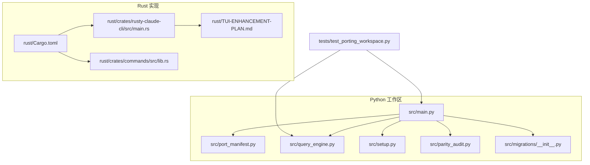
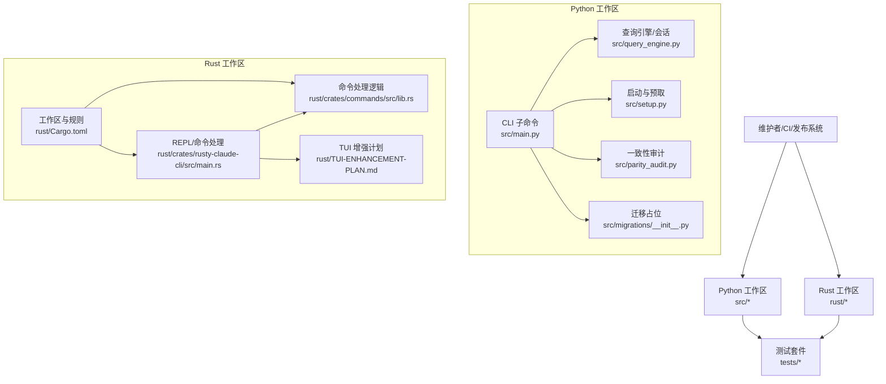
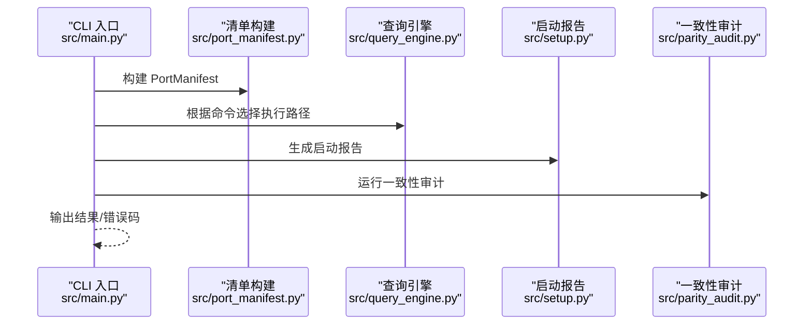
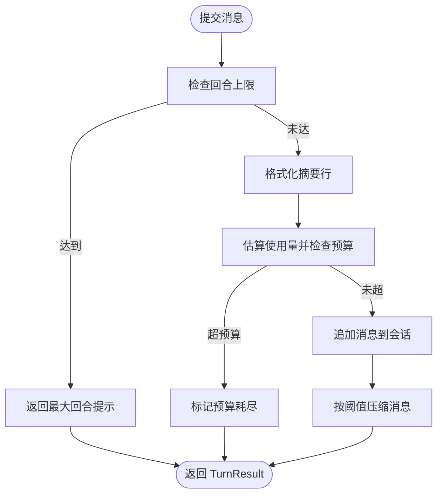
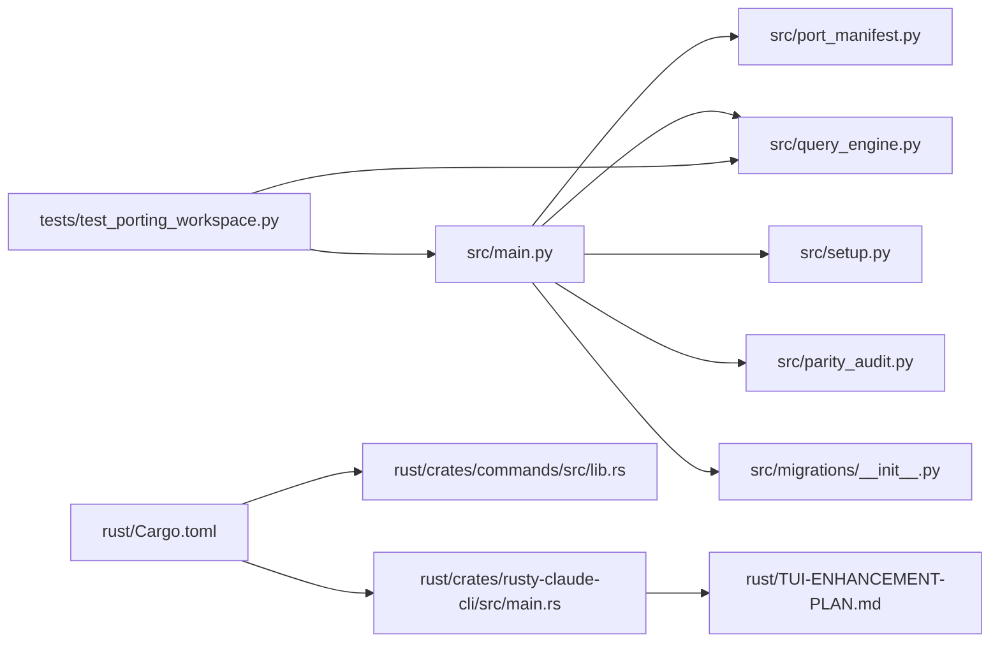

# 维护与升级

<cite>
**本文引用的文件**
- [README.md](file://README.md)
- [CLAUDE.md](file://CLAUDE.md)
- [PARITY.md](file://PARITY.md)
- [src/main.py](file://src/main.py)
- [src/port_manifest.py](file://src/port_manifest.py)
- [src/query_engine.py](file://src/query_engine.py)
- [src/setup.py](file://src/setup.py)
- [src/parity_audit.py](file://src/parity_audit.py)
- [src/migrations/__init__.py](file://src/migrations/__init__.py)
- [src/reference_data/subsystems/migrations.json](file://src/reference_data/subsystems/migrations.json)
- [rust/Cargo.toml](file://rust/Cargo.toml)
- [rust/TUI-ENHANCEMENT-PLAN.md](file://rust/TUI-ENHANCEMENT-PLAN.md)
- [rust/crates/rusty-claude-cli/src/main.rs](file://rust/crates/rusty-claude-cli/src/main.rs)
- [rust/crates/commands/src/lib.rs](file://rust/crates/commands/src/lib.rs)
- [tests/test_porting_workspace.py](file://tests/test_porting_workspace.py)
</cite>

## 目录
1. [引言](#引言)
2. [项目结构](#项目结构)
3. [核心组件](#核心组件)
4. [架构总览](#架构总览)
5. [详细组件分析](#详细组件分析)
6. [依赖关系分析](#依赖关系分析)
7. [性能考量](#性能考量)
8. [故障排查指南](#故障排查指南)
9. [结论](#结论)
10. [附录](#附录)

## 引言
本指南面向 CLAW 项目的维护者与升级工程师，系统化阐述版本升级流程、兼容性检查与回滚策略；覆盖数据库迁移（以“迁移”子系统占位实现为起点）、配置更新与依赖升级步骤；解释热更新、蓝绿部署与滚动升级的实施方案；提供备份策略、数据迁移与完整性验证方法；给出升级前准备清单与升级后验证测试清单；说明紧急修复与补丁发布流程；并规划长期支持版本的维护与废弃组件清理策略。

## 项目结构
CLAW 仓库包含两套主要实现与配套工具：
- Python 端：src/ 为当前活跃的 Python 清洗重写工作区，提供命令/工具镜像、会话与摘要生成、一致性审计等能力。
- Rust 端：rust/ 为正在开发中的高性能重实现，包含 CLI、运行时、工具集、API 客户端、插件与 TUI 增强计划等模块。
- 测试：tests/ 提供对 Python 工作区的验证。
- 文档与协作：README.md、CLAUDE.md、PARITY.md 等用于工作流与一致性说明。

图表来源
- [src/main.py:1-214](file://src/main.py#L1-L214)
- [src/port_manifest.py:1-53](file://src/port_manifest.py#L1-L53)
- [src/query_engine.py:1-194](file://src/query_engine.py#L1-L194)
- [src/setup.py:1-78](file://src/setup.py#L1-L78)
- [src/parity_audit.py:1-139](file://src/parity_audit.py#L1-L139)
- [src/migrations/__init__.py:1-17](file://src/migrations/__init__.py#L1-L17)
- [rust/Cargo.toml:1-20](file://rust/Cargo.toml#L1-L20)
- [rust/crates/rusty-claude-cli/src/main.rs:752-1238](file://rust/crates/rusty-claude-cli/src/main.rs#L752-L1238)
- [rust/crates/commands/src/lib.rs:956-1304](file://rust/crates/commands/src/lib.rs#L956-L1304)
- [rust/TUI-ENHANCEMENT-PLAN.md:1-222](file://rust/TUI-ENHANCEMENT-PLAN.md#L1-L222)
- [tests/test_porting_workspace.py](file://tests/test_porting_workspace.py)

章节来源
- [README.md:82-136](file://README.md#L82-L136)
- [src/main.py:21-91](file://src/main.py#L21-L91)
- [rust/Cargo.toml:1-20](file://rust/Cargo.toml#L1-L20)

## 核心组件
- CLI 入口与子命令：src/main.py 提供 summary、manifest、parity-audit、setup-report、command-graph、tool-pool、bootstrap-graph、subsystems、commands、tools、route、bootstrap、turn-loop、flush-transcript、load-session、remote-mode/ssh-mode/teleport-mode/direct-connect-mode/deep-link-mode、show-command/show-tool、exec-command/exec-tool 等子命令，用于工作区概览、一致性审计、运行时路由与执行。
- 工作区清单：src/port_manifest.py 通过扫描 src/ 计算顶层模块与文件数量，形成可读的清单输出。
- 查询引擎与会话：src/query_engine.py 提供会话存储、令牌预算控制、消息压缩、结构化输出渲染与摘要生成。
- 启动与预取：src/setup.py 汇总 Python 版本、平台信息，执行预取与延迟初始化，并输出启动报告。
- 一致性审计：src/parity_audit.py 对比本地 Python 工作区与归档快照，统计根文件、目录与命令/工具条目的覆盖率。
- 迁移占位：src/migrations/__init__.py 与 migrations.json 提供迁移子系统的归档快照占位，便于后续迁移脚本落地。
- Rust 工作区：rust/Cargo.toml 定义工作区与 lint 规则；rust/crates/rusty-claude-cli/src/main.rs 与 rust/crates/commands/src/lib.rs 提供 REPL、命令处理与会话压缩等能力；rust/TUI-ENHANCEMENT-PLAN.md 描述 TUI 改进路线图。

章节来源
- [src/main.py:94-214](file://src/main.py#L94-L214)
- [src/port_manifest.py:30-53](file://src/port_manifest.py#L30-L53)
- [src/query_engine.py:35-194](file://src/query_engine.py#L35-L194)
- [src/setup.py:30-78](file://src/setup.py#L30-L78)
- [src/parity_audit.py:73-139](file://src/parity_audit.py#L73-L139)
- [src/migrations/__init__.py:1-17](file://src/migrations/__init__.py#L1-L17)
- [src/reference_data/subsystems/migrations.json:1-18](file://src/reference_data/subsystems/migrations.json#L1-L18)
- [rust/Cargo.toml:1-20](file://rust/Cargo.toml#L1-L20)
- [rust/crates/rusty-claude-cli/src/main.rs:752-1238](file://rust/crates/rusty-claude-cli/src/main.rs#L752-L1238)
- [rust/crates/commands/src/lib.rs:956-1304](file://rust/crates/commands/src/lib.rs#L956-L1304)
- [rust/TUI-ENHANCEMENT-PLAN.md:1-222](file://rust/TUI-ENHANCEMENT-PLAN.md#L1-L222)

## 架构总览
下图展示 Python 与 Rust 两端在维护与升级中的角色分工与交互要点：

图表来源
- [src/main.py:21-91](file://src/main.py#L21-L91)
- [src/query_engine.py:35-194](file://src/query_engine.py#L35-L194)
- [src/setup.py:64-78](file://src/setup.py#L64-L78)
- [src/parity_audit.py:121-139](file://src/parity_audit.py#L121-L139)
- [src/migrations/__init__.py:1-17](file://src/migrations/__init__.py#L1-L17)
- [rust/crates/rusty-claude-cli/src/main.rs:752-1238](file://rust/crates/rusty-claude-cli/src/main.rs#L752-L1238)
- [rust/crates/commands/src/lib.rs:956-1304](file://rust/crates/commands/src/lib.rs#L956-L1304)
- [rust/TUI-ENHANCEMENT-PLAN.md:1-222](file://rust/TUI-ENHANCEMENT-PLAN.md#L1-L222)
- [rust/Cargo.toml:1-20](file://rust/Cargo.toml#L1-L20)
- [tests/test_porting_workspace.py](file://tests/test_porting_workspace.py)

## 详细组件分析

### CLI 与子命令体系（Python）
- 功能职责：提供工作区概览、清单输出、一致性审计、启动报告、命令/工具索引、运行时路由与执行、远程模式分支模拟、会话加载与持久化等。
- 关键流程：解析参数 → 构建清单 → 执行对应子命令 → 输出结果或错误码。
- 错误处理：未知命令返回错误码；部分子命令在找不到条目时返回提示与非零退出码。

图表来源
- [src/main.py:94-214](file://src/main.py#L94-L214)
- [src/port_manifest.py:30-53](file://src/port_manifest.py#L30-L53)
- [src/query_engine.py:35-194](file://src/query_engine.py#L35-L194)
- [src/setup.py:64-78](file://src/setup.py#L64-L78)
- [src/parity_audit.py:121-139](file://src/parity_audit.py#L121-L139)

章节来源
- [src/main.py:21-91](file://src/main.py#L21-L91)
- [src/main.py:94-214](file://src/main.py#L94-L214)

### 查询引擎与会话（Python）
- 能力：会话存储、消息压缩、令牌预算控制、结构化输出渲染、摘要生成。
- 复杂度：提交消息 O(n)（n 为消息数），压缩按阈值截断，结构化输出带重试保护。
- 性能：通过紧凑阈值限制内存占用；结构化输出失败时抛出异常，确保调用方感知。

图表来源
- [src/query_engine.py:61-104](file://src/query_engine.py#L61-L104)
- [src/query_engine.py:129-132](file://src/query_engine.py#L129-L132)

章节来源
- [src/query_engine.py:15-194](file://src/query_engine.py#L15-L194)

### 启动与预取（Python）
- 能力：汇总 Python 版本/实现/平台，执行预取与延迟初始化，输出启动报告。
- 集成点：与 CLI 子命令 setup-report 协同，便于诊断环境与信任状态。

章节来源
- [src/setup.py:12-78](file://src/setup.py#L12-L78)
- [src/main.py:107-109](file://src/main.py#L107-L109)

### 一致性审计（Python）
- 能力：对比本地 Python 工作区与归档快照，统计根文件、目录、命令/工具条目覆盖率，输出缺失项。
- 使用场景：升级前后对照、回归检测、缺口追踪。

章节来源
- [src/parity_audit.py:73-139](file://src/parity_audit.py#L73-L139)
- [src/main.py:104-106](file://src/main.py#L104-L106)

### 迁移占位（Python）
- 能力：加载 migrations.json 归档快照，提供占位包导出项，便于后续迁移脚本落地。
- 注意：当前为占位实现，不包含实际迁移逻辑。

章节来源
- [src/migrations/__init__.py:1-17](file://src/migrations/__init__.py#L1-L17)
- [src/reference_data/subsystems/migrations.json:1-18](file://src/reference_data/subsystems/migrations.json#L1-L18)

### Rust CLI 与命令处理（Rust）
- 能力：REPL 循环、命令解析与执行、会话压缩、状态栏与 TUI 增强规划。
- 集成点：与命令处理 crate 协同，提供压缩、帮助、状态等命令处理逻辑。

章节来源
- [rust/crates/rusty-claude-cli/src/main.rs:752-1238](file://rust/crates/rusty-claude-cli/src/main.rs#L752-L1238)
- [rust/crates/commands/src/lib.rs:956-1304](file://rust/crates/commands/src/lib.rs#L956-L1304)
- [rust/TUI-ENHANCEMENT-PLAN.md:1-222](file://rust/TUI-ENHANCEMENT-PLAN.md#L1-L222)

## 依赖关系分析
- Python 工作区：CLI 依赖清单、查询引擎、启动与审计模块；测试依赖 CLI 与查询引擎。
- Rust 工作区：Cargo.toml 统一管理工作区与 lint；CLI 与命令处理模块相互依赖；TUI 增强计划指导重构方向。

图表来源
- [src/main.py:94-214](file://src/main.py#L94-L214)
- [src/port_manifest.py:30-53](file://src/port_manifest.py#L30-L53)
- [src/query_engine.py:35-194](file://src/query_engine.py#L35-L194)
- [src/setup.py:64-78](file://src/setup.py#L64-L78)
- [src/parity_audit.py:121-139](file://src/parity_audit.py#L121-L139)
- [src/migrations/__init__.py:1-17](file://src/migrations/__init__.py#L1-L17)
- [rust/Cargo.toml:1-20](file://rust/Cargo.toml#L1-L20)
- [rust/crates/rusty-claude-cli/src/main.rs:752-1238](file://rust/crates/rusty-claude-cli/src/main.rs#L752-L1238)
- [rust/crates/commands/src/lib.rs:956-1304](file://rust/crates/commands/src/lib.rs#L956-L1304)
- [rust/TUI-ENHANCEMENT-PLAN.md:1-222](file://rust/TUI-ENHANCEMENT-PLAN.md#L1-L222)
- [tests/test_porting_workspace.py](file://tests/test_porting_workspace.py)

章节来源
- [rust/Cargo.toml:1-20](file://rust/Cargo.toml#L1-L20)

## 性能考量
- Python 查询引擎的消息压缩与预算控制：通过紧凑阈值与令牌预算限制内存与成本增长。
- Rust REPL 的单体结构与 TUI 改进：建议先进行模块化重构，再引入增量渲染与进度指示，避免渲染阻塞与终端兼容问题。
- CI 与测试：统一 lint 规则与测试发现机制，减少回归风险。

## 故障排查指南
- 启动与环境
  - 使用启动报告子命令输出 Python 版本、平台与信任状态，定位环境差异。
  - 参考 CLAUDE.md 中的 Rust 验证步骤，确保工作区一致性。
- 一致性审计
  - 使用 parity-audit 子命令输出覆盖率与缺失项，结合归档快照定位缺口。
- 结构化输出失败
  - 查询引擎在结构化输出渲染失败时抛出异常，需检查输入与序列化路径。
- Rust 命令处理
  - 使用命令处理模块提供的压缩、帮助、状态等命令，确认会话状态与阈值设置。

章节来源
- [src/setup.py:38-53](file://src/setup.py#L38-L53)
- [CLAUDE.md:9-11](file://CLAUDE.md#L9-L11)
- [src/parity_audit.py:84-110](file://src/parity_audit.py#L84-L110)
- [src/query_engine.py:161-169](file://src/query_engine.py#L161-L169)
- [rust/crates/commands/src/lib.rs:956-1304](file://rust/crates/commands/src/lib.rs#L956-L1304)

## 结论
本指南基于现有代码库梳理了 CLAW 在 Python 与 Rust 两端的维护与升级要点：以 CLI 子命令与查询引擎为核心，辅以启动报告与一致性审计；在 Rust 端以模块化重构与 TUI 增强为主线。迁移占位与测试套件为后续演进奠定基础。建议在升级流程中严格遵循兼容性检查、回滚策略与验证测试，确保平滑过渡与稳定性。

## 附录

### 版本升级流程
- 准备阶段
  - 备份当前工作区与会话数据（参考会话持久化与转录存储）。
  - 运行一致性审计，记录覆盖率与缺失项。
  - 执行启动报告，核对环境与信任状态。
- 升级实施
  - Python：更新依赖与 CLI 子命令，运行查询引擎与会话测试。
  - Rust：执行 lint 与测试，按 TUI 增强计划推进模块化与功能迭代。
- 回滚策略
  - 保留上一版本的会话与持久化数据；如遇严重问题，回退至稳定分支并恢复数据。
  - 使用 CLI 子命令加载历史会话，验证交互与权限设置。

章节来源
- [src/parity_audit.py:121-139](file://src/parity_audit.py#L121-L139)
- [src/setup.py:64-78](file://src/setup.py#L64-L78)
- [src/query_engine.py:140-150](file://src/query_engine.py#L140-L150)
- [src/main.py:167-170](file://src/main.py#L167-L170)

### 兼容性检查与回滚策略
- 兼容性检查
  - 使用 parity-audit 对比根文件、目录与命令/工具条目覆盖率。
  - 运行测试套件，确保关键路径通过。
- 回滚策略
  - 保持会话与持久化数据不变；回退代码后恢复数据。
  - 如涉及配置变更，保留旧版配置文件以便快速切换。

章节来源
- [src/parity_audit.py:84-110](file://src/parity_audit.py#L84-L110)
- [tests/test_porting_workspace.py](file://tests/test_porting_workspace.py)

### 数据库迁移（以迁移占位为起点）
- 当前状态
  - 迁移子系统为占位实现，提供归档快照与导出项。
- 迁移步骤
  - 基于归档快照定义迁移目标与版本边界。
  - 编写迁移脚本，按版本顺序执行，记录迁移日志。
  - 迁移完成后，更新清单与审计结果，确保覆盖率达标。
- 完整性验证
  - 对比迁移前后数据结构与条目数量，确保无遗漏。

章节来源
- [src/migrations/__init__.py:1-17](file://src/migrations/__init__.py#L1-L17)
- [src/reference_data/subsystems/migrations.json:1-18](file://src/reference_data/subsystems/migrations.json#L1-L18)

### 配置更新与依赖升级
- Python
  - 使用启动报告核对环境；更新依赖后重新运行测试。
- Rust
  - 遵循 Cargo 工作区与 lint 规则；分阶段引入新特性与 TUI 改进。

章节来源
- [src/setup.py:56-61](file://src/setup.py#L56-L61)
- [rust/Cargo.toml:1-20](file://rust/Cargo.toml#L1-L20)

### 部署方案：热更新、蓝绿部署与滚动升级
- 热更新
  - 通过 CLI 子命令与查询引擎的会话持久化能力，在不停机情况下切换配置或加载新会话。
- 蓝绿部署
  - 将 Python/Rust 两端分别部署到两套环境；切换流量后回滚至旧环境。
- 滚动升级
  - 分批重启节点，结合会话持久化与一致性审计，逐步验证升级效果。

章节来源
- [src/query_engine.py:140-150](file://src/query_engine.py#L140-L150)
- [src/parity_audit.py:121-139](file://src/parity_audit.py#L121-L139)

### 备份策略、数据迁移与完整性验证
- 备份策略
  - 会话持久化与转录存储作为数据备份基线；定期导出并校验完整性。
- 数据迁移
  - 基于迁移占位与归档快照，按版本顺序执行迁移脚本。
- 完整性验证
  - 使用一致性审计与覆盖率统计，确保迁移后无缺失。

章节来源
- [src/query_engine.py:140-150](file://src/query_engine.py#L140-L150)
- [src/parity_audit.py:121-139](file://src/parity_audit.py#L121-L139)
- [src/migrations/__init__.py:1-17](file://src/migrations/__init__.py#L1-L17)

### 升级前准备清单与升级后验证测试
- 升级前
  - 备份会话与持久化数据；运行一致性审计；输出启动报告；冻结变更。
- 升级后
  - 运行测试套件；再次执行一致性审计；验证 CLI 子命令与查询引擎功能；检查 Rust 模块化与 TUI 改进是否按计划落地。

章节来源
- [src/parity_audit.py:121-139](file://src/parity_audit.py#L121-L139)
- [tests/test_porting_workspace.py](file://tests/test_porting_workspace.py)
- [rust/TUI-ENHANCEMENT-PLAN.md:152-173](file://rust/TUI-ENHANCEMENT-PLAN.md#L152-L173)

### 紧急修复与补丁发布流程
- 快速评估：使用一致性审计与启动报告定位问题范围。
- 修复验证：在隔离环境中运行测试套件与 CLI 子命令。
- 发布策略：采用最小影响变更，优先回滚至稳定分支，再择机合并修复。

章节来源
- [src/parity_audit.py:121-139](file://src/parity_audit.py#L121-L139)
- [src/setup.py:64-78](file://src/setup.py#L64-L78)

### 长期支持版本维护与废弃组件清理
- 维护计划
  - 制定版本生命周期与升级窗口；按 TUI 增强计划推进 Rust 端功能完善。
- 废弃组件清理
  - 通过一致性审计识别不再使用的模块；在占位实现基础上逐步移除或替换。

章节来源
- [rust/TUI-ENHANCEMENT-PLAN.md:176-206](file://rust/TUI-ENHANCEMENT-PLAN.md#L176-L206)
- [src/parity_audit.py:121-139](file://src/parity_audit.py#L121-L139)