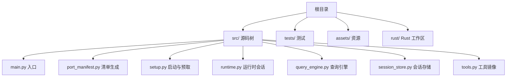
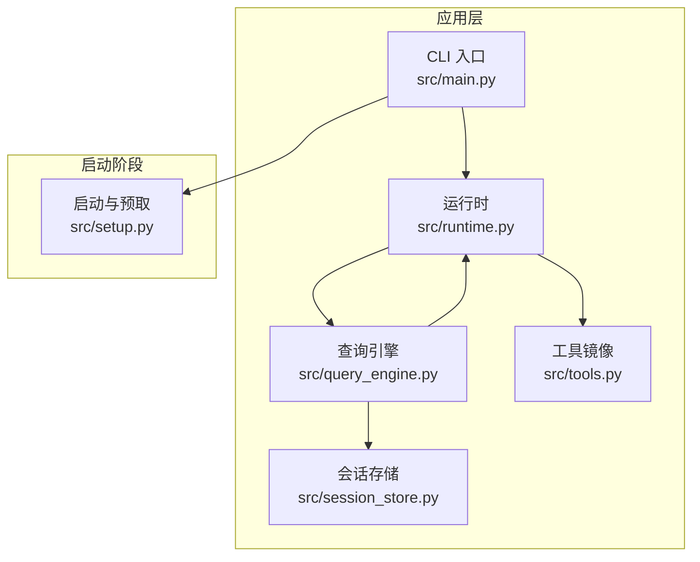
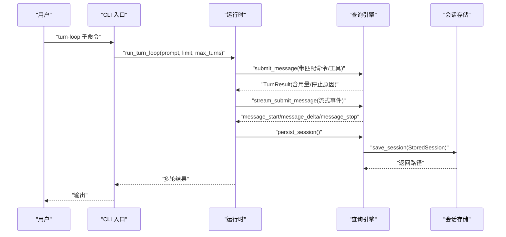
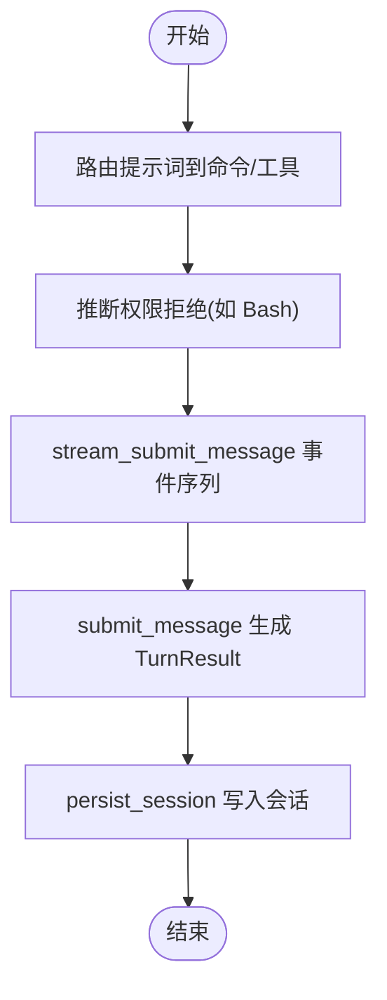
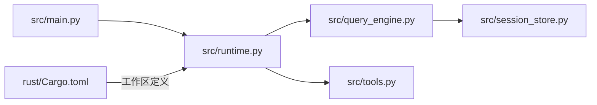

# 部署运维

<cite>
**本文引用的文件**
- [README.md](file://README.md)
- [Cargo.toml](file://rust/Cargo.toml)
- [src/main.py](file://src/main.py)
- [src/port_manifest.py](file://src/port_manifest.py)
- [src/setup.py](file://src/setup.py)
- [src/runtime.py](file://src/runtime.py)
- [src/query_engine.py](file://src/query_engine.py)
- [src/session_store.py](file://src/session_store.py)
- [src/tools.py](file://src/tools.py)
</cite>

## 目录
1. [简介](#简介)
2. [项目结构](#项目结构)
3. [核心组件](#核心组件)
4. [架构总览](#架构总览)
5. [详细组件分析](#详细组件分析)
6. [依赖分析](#依赖分析)
7. [性能考虑](#性能考虑)
8. [故障排除指南](#故障排除指南)
9. [结论](#结论)
10. [附录](#附录)

## 简介
本指南面向 CLAW（Python porting workspace）项目的生产部署与运维，覆盖从环境准备、安装与启动、运行时配置、监控与日志、性能优化到故障排查、应急响应与灾难恢复的全生命周期实践。仓库当前以 Python 源码为主，同时包含 Rust 工作区元信息，便于后续在 Rust 实现成熟后进行迁移与统一构建。

## 项目结构
仓库采用“Python 源码 + 参考数据 + 测试”的组织方式，核心入口位于 Python 模块，通过命令行子命令提供工作区清单、摘要、路由、远程模式模拟等能力；会话持久化与权限控制等能力由运行时与查询引擎协同实现。

图表来源
- [src/main.py:21-91](file://src/main.py#L21-L91)
- [src/port_manifest.py:30-52](file://src/port_manifest.py#L30-L52)
- [src/setup.py:64-77](file://src/setup.py#L64-L77)
- [src/runtime.py:89-152](file://src/runtime.py#L89-L152)
- [src/query_engine.py:36-59](file://src/query_engine.py#L36-L59)
- [src/session_store.py:19-35](file://src/session_store.py#L19-L35)
- [src/tools.py:23-37](file://src/tools.py#L23-L37)

章节来源
- [README.md:82-99](file://README.md#L82-L99)
- [src/main.py:21-91](file://src/main.py#L21-L91)

## 核心组件
- 命令行入口与子命令解析：负责解析用户输入并分发到具体功能模块，如渲染摘要、打印清单、执行路由、远程模式模拟、加载/持久化会话等。
- 工作区清单与模型：用于统计顶层模块、文件数量与注释，支撑可视化与审计。
- 启动与预取：在可信模式下执行预取与延迟初始化，输出启动报告。
- 运行时会话：封装上下文、系统初始化消息、历史记录、匹配结果、流事件与最终转录，支持多轮对话与权限拒绝推理。
- 查询引擎：承载会话状态、令牌预算、紧凑化策略、结构化输出与会话持久化。
- 会话存储：基于 JSON 的本地持久化，按会话 ID 存储消息与用量。
- 工具镜像：加载工具快照，支持权限过滤与简单模式筛选。

章节来源
- [src/main.py:94-214](file://src/main.py#L94-L214)
- [src/port_manifest.py:12-52](file://src/port_manifest.py#L12-L52)
- [src/setup.py:12-77](file://src/setup.py#L12-L77)
- [src/runtime.py:24-193](file://src/runtime.py#L24-L193)
- [src/query_engine.py:15-194](file://src/query_engine.py#L15-L194)
- [src/session_store.py:8-35](file://src/session_store.py#L8-L35)
- [src/tools.py:14-97](file://src/tools.py#L14-L97)

## 架构总览
下图展示生产环境部署与运维的关键交互：CLI 作为入口，调用运行时与查询引擎完成路由、执行、流式输出与会话持久化；启动阶段执行预取与延迟初始化；会话存储在本地目录中。

图表来源
- [src/main.py:94-214](file://src/main.py#L94-L214)
- [src/runtime.py:89-152](file://src/runtime.py#L89-L152)
- [src/query_engine.py:45-150](file://src/query_engine.py#L45-L150)
- [src/session_store.py:19-35](file://src/session_store.py#L19-L35)
- [src/tools.py:81-86](file://src/tools.py#L81-L86)
- [src/setup.py:64-77](file://src/setup.py#L64-L77)

## 详细组件分析

### CLI 入口与子命令
- 功能要点
  - 提供 summary、manifest、parity-audit、setup-report、command-graph、tool-pool、bootstrap-graph、subsystems、commands、tools、route、bootstrap、turn-loop、flush-transcript、load-session、remote-mode、ssh-mode、teleport-mode、direct-connect-mode、deep-link-mode、show-command、show-tool、exec-command、exec-tool 等子命令。
  - 支持参数过滤（如查询、限制条数、禁用插件/技能、禁用 MCP、拒绝工具/前缀等）。
- 生产建议
  - 将常用命令封装为运维脚本，统一入口与参数校验。
  - 对敏感操作（如直接执行命令/工具）增加二次确认与审计日志。

章节来源
- [src/main.py:21-91](file://src/main.py#L21-L91)
- [src/main.py:94-214](file://src/main.py#L94-L214)

### 工作区清单与模型
- 功能要点
  - 统计顶层模块与文件数量，生成 Markdown 清单。
  - 通过注释标注关键文件用途，辅助审计与巡检。
- 生产建议
  - 在 CI 中定期生成并归档清单，作为变更基线。
  - 结合 Git 提交信息与清单差异，追踪变更范围。

章节来源
- [src/port_manifest.py:12-52](file://src/port_manifest.py#L12-L52)

### 启动与预取
- 功能要点
  - 输出 Python 版本、实现、平台、可信模式与当前工作目录。
  - 执行 MDM 读取、钥匙串预取、项目扫描等预取步骤。
  - 延迟初始化在可信模式下执行。
- 生产建议
  - 将启动报告纳入健康检查输出，便于快速定位环境问题。
  - 在容器或无头环境中，确保预取步骤可配置与可跳过。

章节来源
- [src/setup.py:12-77](file://src/setup.py#L12-L77)

### 运行时会话
- 功能要点
  - 路由提示词到命令与工具，计算匹配分数，支持权限拒绝推理。
  - 构建系统初始化消息、历史记录与流事件，支持多轮对话循环。
  - 会话持久化路径与用量统计。
- 生产建议
  - 为每轮对话生成唯一会话 ID，并在日志中关联。
  - 对高风险工具（如破坏性 Shell）默认拒绝，允许白名单放行。

章节来源
- [src/runtime.py:89-193](file://src/runtime.py#L89-L193)

### 查询引擎
- 功能要点
  - 会话状态管理、令牌预算控制、紧凑化策略、结构化输出与重试。
  - 流式事件：开始、匹配、权限拒绝、增量文本、结束。
  - 会话持久化与转录刷新。
- 生产建议
  - 设置合理的 max_turns 与 max_budget_tokens，避免资源耗尽。
  - 使用结构化输出时，启用重试与降级策略。

章节来源
- [src/query_engine.py:15-194](file://src/query_engine.py#L15-L194)

### 会话存储
- 功能要点
  - 以 JSON 文件形式保存会话消息与用量，按会话 ID 命名。
  - 默认目录为 .port_sessions，支持自定义。
- 生产建议
  - 将会话目录挂载到持久化卷，设置定期备份与清理策略。
  - 对会话文件进行访问控制与加密存储（视合规要求）。

章节来源
- [src/session_store.py:8-35](file://src/session_store.py#L8-L35)

### 工具镜像
- 功能要点
  - 加载工具快照，支持简单模式与 MCP 过滤。
  - 权限上下文过滤，支持拒绝列表与前缀过滤。
  - 执行工具时返回执行结果与消息。
- 生产建议
  - 在生产中默认禁用 MCP 或严格白名单。
  - 对高风险工具（如 Bash）默认拒绝，仅在受控场景放行。

章节来源
- [src/tools.py:14-97](file://src/tools.py#L14-L97)

### 关键流程时序

#### 多轮对话与会话持久化

图表来源
- [src/main.py:153-167](file://src/main.py#L153-L167)
- [src/runtime.py:154-167](file://src/runtime.py#L154-L167)
- [src/query_engine.py:61-104](file://src/query_engine.py#L61-L104)
- [src/query_engine.py:106-127](file://src/query_engine.py#L106-L127)
- [src/query_engine.py:140-150](file://src/query_engine.py#L140-L150)
- [src/session_store.py:19-24](file://src/session_store.py#L19-L24)

#### 权限拒绝推理与流式输出

图表来源
- [src/runtime.py:169-174](file://src/runtime.py#L169-L174)
- [src/query_engine.py:106-127](file://src/query_engine.py#L106-L127)
- [src/query_engine.py:61-104](file://src/query_engine.py#L61-L104)
- [src/query_engine.py:140-150](file://src/query_engine.py#L140-L150)

## 依赖分析
- Python 源码依赖
  - CLI 解析依赖运行时与查询引擎；运行时依赖上下文、历史、执行注册表；查询引擎依赖会话存储与转录。
- Rust 工作区
  - 工作区定义与 lint 规则位于 Rust 根目录，便于未来迁移与统一构建。
- 外部依赖
  - 本仓库未包含显式的第三方依赖文件，生产环境需根据实际运行需求引入所需包（例如测试框架、日志库、Web 服务等，视部署形态而定）。

图表来源
- [src/main.py:5-18](file://src/main.py#L5-L18)
- [src/runtime.py:5-13](file://src/runtime.py#L5-L13)
- [src/query_engine.py:7-12](file://src/query_engine.py#L7-L12)
- [src/session_store.py:3-5](file://src/session_store.py#L3-L5)
- [src/tools.py:1-97](file://src/tools.py#L1-L97)
- [Cargo.toml:1-20](file://rust/Cargo.toml#L1-L20)

章节来源
- [src/main.py:5-18](file://src/main.py#L5-L18)
- [src/runtime.py:5-13](file://src/runtime.py#L5-L13)
- [src/query_engine.py:7-12](file://src/query_engine.py#L7-L12)
- [src/session_store.py:3-5](file://src/session_store.py#L3-L5)
- [src/tools.py:1-97](file://src/tools.py#L1-L97)
- [Cargo.toml:1-20](file://rust/Cargo.toml#L1-L20)

## 性能考虑
- 令牌预算与紧凑化
  - 通过 max_budget_tokens 控制总消耗，compact_after_turns 控制消息长度，减少内存与 IO 压力。
- 多轮对话节流
  - max_turns 限制对话轮次，stop_reason 记录终止原因，避免无限循环。
- 结构化输出重试
  - structured_retry_limit 降低渲染失败对稳定性的影响。
- 远程模式与流式事件
  - 流式事件有助于前端实时展示，但需注意网络抖动与背压处理。

章节来源
- [src/query_engine.py:15-22](file://src/query_engine.py#L15-L22)
- [src/query_engine.py:61-104](file://src/query_engine.py#L61-L104)
- [src/query_engine.py:129-132](file://src/query_engine.py#L129-L132)
- [src/query_engine.py:161-169](file://src/query_engine.py#L161-L169)

## 故障排除指南
- 启动失败
  - 检查启动报告中的 Python 版本、平台与可信模式，确认预取步骤是否成功。
  - 若缺失依赖导致初始化异常，参考测试命令在本地复现。
- 会话无法加载/持久化
  - 校验会话目录权限与磁盘空间，确认会话 ID 是否正确。
  - 查看持久化返回路径与转录刷新状态。
- 权限拒绝
  - 对高风险工具（如 Bash）默认拒绝属预期行为，必要时在受控场景放行。
- 超出预算/轮次限制
  - 调整 max_budget_tokens 与 max_turns，或优化提示词与工具选择。
- 远程模式异常
  - 使用对应模式子命令输出文本报告，核对目标分支与参数。

章节来源
- [src/setup.py:38-53](file://src/setup.py#L38-L53)
- [src/session_store.py:19-35](file://src/session_store.py#L19-L35)
- [src/runtime.py:169-174](file://src/runtime.py#L169-L174)
- [src/query_engine.py:68-91](file://src/query_engine.py#L68-L91)
- [src/main.py:171-185](file://src/main.py#L171-L185)

## 结论
本指南提供了 CLAW Python 工作区的部署与运维实践蓝图：以 CLI 为入口、运行时与查询引擎为核心、结合会话存储与权限控制，形成可审计、可扩展、可恢复的生产体系。建议在容器化与 CI/CD 流水线中固化上述流程，并结合监控与告警完善可观测性。

## 附录

### 生产环境部署清单
- 环境准备
  - 安装 Python 运行时与测试框架，确保可执行测试命令。
  - 准备会话存储目录并赋予写权限。
- 启动与验证
  - 执行启动报告子命令，确认环境信息与预取结果。
  - 运行单元测试，确保工作区完整性。
- 运行与观测
  - 使用 turn-loop 子命令进行端到端验证。
  - 持续关注令牌预算、轮次限制与权限拒绝日志。
- 回收与备份
  - 定期备份会话目录，清理过期会话。
  - 归档工作区清单与启动报告，建立变更基线。

章节来源
- [README.md:112-142](file://README.md#L112-L142)
- [src/setup.py:38-53](file://src/setup.py#L38-L53)
- [src/session_store.py:19-35](file://src/session_store.py#L19-L35)

### 自动化运维脚本与配置管理建议
- 脚本化
  - 将常用子命令封装为运维脚本，统一参数与日志格式。
  - 在 CI 中集成清单生成、启动报告与测试命令。
- 配置管理
  - 将 max_turns、max_budget_tokens、紧凑化阈值等参数集中管理。
  - 对工具快照与权限上下文进行版本化管理，支持灰度与回滚。

章节来源
- [src/main.py:21-91](file://src/main.py#L21-L91)
- [src/query_engine.py:15-22](file://src/query_engine.py#L15-L22)
- [src/tools.py:62-72](file://src/tools.py#L62-L72)

### 版本升级、回滚与数据迁移
- 升级策略
  - 采用蓝绿/金丝雀发布，先在非生产环境验证。
  - 对会话目录与权限配置进行兼容性评估。
- 回滚策略
  - 保留上一版本的会话目录与配置，快速切换。
  - 通过启动报告与清单对比，确认回滚一致性。
- 数据迁移
  - 会话文件为 JSON 结构，可在不同版本间迁移。
  - 迁移前后校验输入/输出用量与转录完整性。

章节来源
- [src/session_store.py:19-35](file://src/session_store.py#L19-L35)
- [src/query_engine.py:171-193](file://src/query_engine.py#L171-L193)

### 安全加固与合规
- 最小权限
  - 默认拒绝高风险工具，仅在白名单内放行。
  - 限制会话目录访问权限，必要时启用加密存储。
- 审计与日志
  - 记录启动报告、会话 ID、用量与权限拒绝事件。
  - 对敏感操作增加二次确认与操作留痕。
- 合规要求
  - 根据所在地区与行业要求，对日志与数据进行脱敏与保留策略配置。

章节来源
- [src/runtime.py:169-174](file://src/runtime.py#L169-L174)
- [src/session_store.py:19-35](file://src/session_store.py#L19-L35)