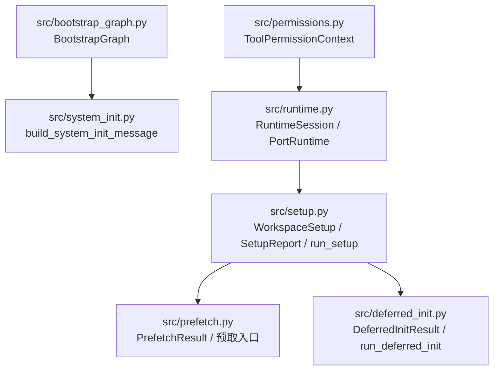
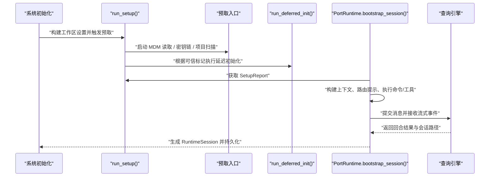
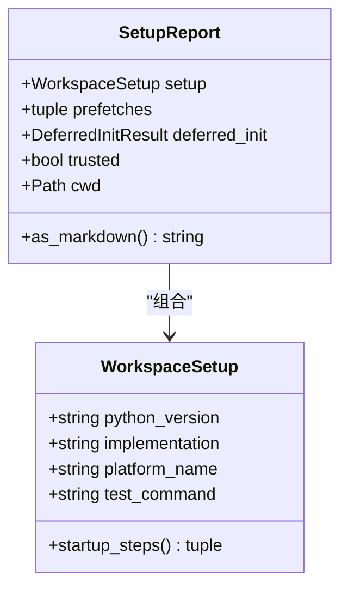
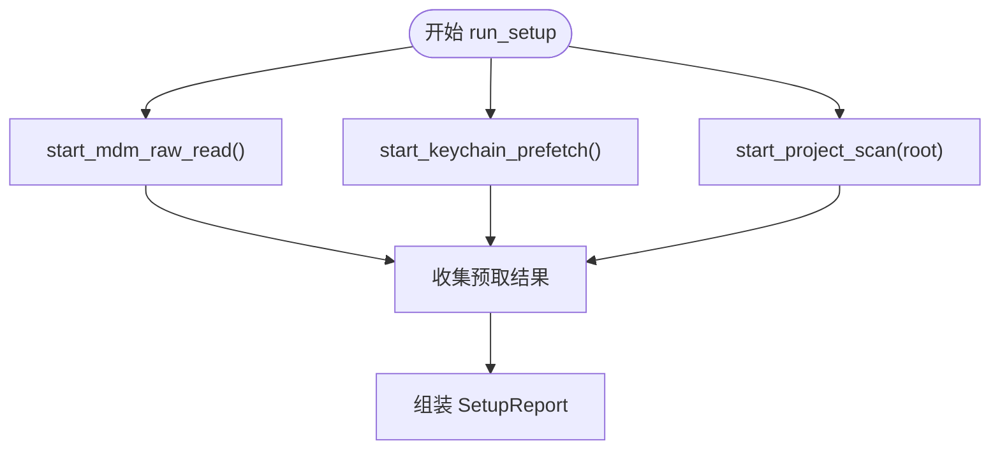
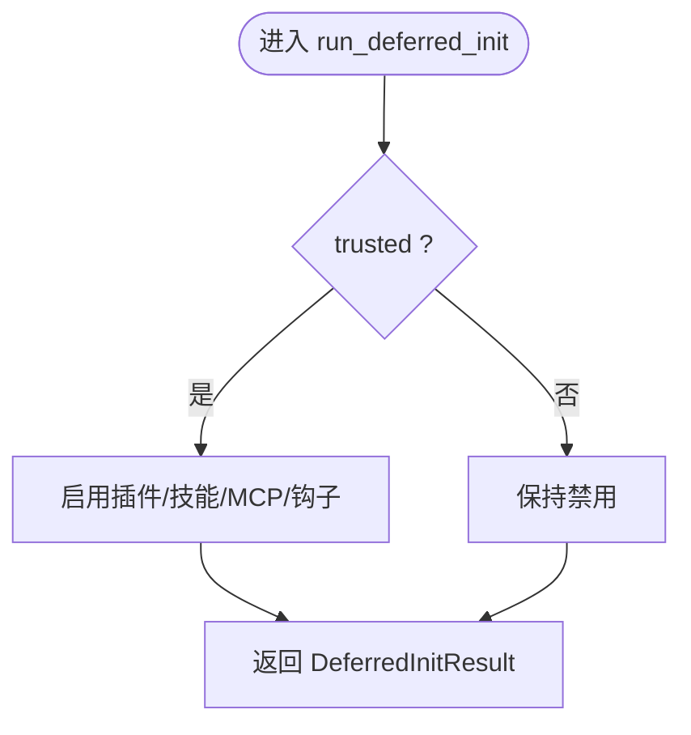
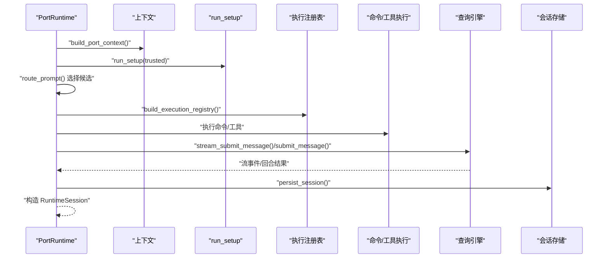
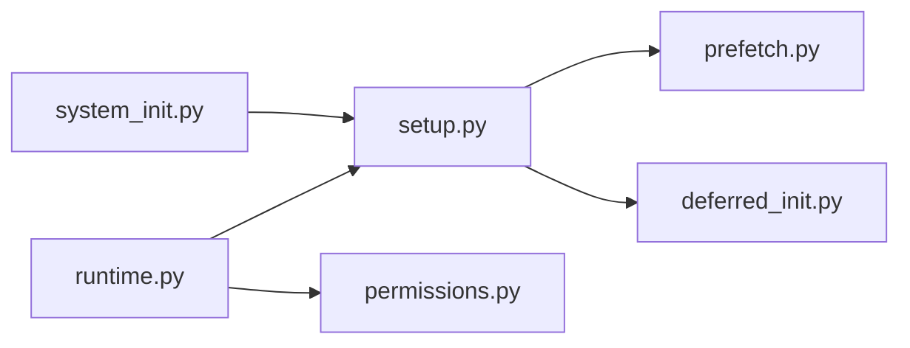

# 工作区配置

<cite>
**本文引用的文件**
- [src/setup.py](file://src/setup.py)
- [src/prefetch.py](file://src/prefetch.py)
- [src/deferred_init.py](file://src/deferred_init.py)
- [src/bootstrap_graph.py](file://src/bootstrap_graph.py)
- [src/system_init.py](file://src/system_init.py)
- [src/runtime.py](file://src/runtime.py)
- [src/permissions.py](file://src/permissions.py)
</cite>

## 目录
1. [简介](#简介)
2. [项目结构](#项目结构)
3. [核心组件](#核心组件)
4. [架构总览](#架构总览)
5. [详细组件分析](#详细组件分析)
6. [依赖分析](#依赖分析)
7. [性能考虑](#性能考虑)
8. [故障排除指南](#故障排除指南)
9. [结论](#结论)
10. [附录](#附录)

## 简介
本文件面向 CLAW 项目的工作区配置系统，聚焦以下目标：
- 解释工作区设置的构建过程、启动步骤与环境检测机制
- 深入说明 WorkspaceSetup 数据结构、平台信息收集与测试命令配置
- 覆盖工作区扫描、预取操作与延迟初始化的完整流程
- 提供工作区配置的最佳实践与故障排除建议
- 解释可信模式与安全检查机制（基于现有代码的可观察行为）

## 项目结构
围绕工作区配置的关键模块如下：
- 配置与报告：WorkspaceSetup、SetupReport
- 启动流程：run_setup、startup_steps
- 预取子系统：PrefetchResult 及三个预取入口
- 延迟初始化：DeferredInitResult 与 run_deferred_init
- 引导图：BootstrapGraph 展示启动阶段
- 系统初始化消息：build_system_init_message
- 运行时会话：RuntimeSession、PortRuntime 的引导与会话持久化
- 权限上下文：ToolPermissionContext 用于工具访问控制

图表来源
- [src/setup.py:12-77](file://src/setup.py#L12-L77)
- [src/prefetch.py:7-24](file://src/prefetch.py#L7-L24)
- [src/deferred_init.py:6-32](file://src/deferred_init.py#L6-L32)
- [src/bootstrap_graph.py:6-28](file://src/bootstrap_graph.py#L6-L28)
- [src/system_init.py:8-23](file://src/system_init.py#L8-L23)
- [src/runtime.py:24-152](file://src/runtime.py#L24-L152)
- [src/permissions.py:6-21](file://src/permissions.py#L6-L21)

章节来源
- [src/setup.py:12-77](file://src/setup.py#L12-L77)
- [src/bootstrap_graph.py:16-27](file://src/bootstrap_graph.py#L16-L27)

## 核心组件
- WorkspaceSetup：封装 Python 版本、实现类型、平台名称与默认测试命令；提供启动步骤描述元组
- SetupReport：汇总工作区设置、预取结果、延迟初始化结果、可信标记与当前工作目录，并支持 Markdown 报告生成
- PrefetchResult：记录一次预取任务的名称、是否已启动、详情
- DeferredInitResult：记录插件初始化、技能初始化、MCP 预取、会话钩子等在可信模式下的启用状态
- BootstrapGraph：以阶段化列表描述引导流程
- SystemInitMessage：在系统初始化时输出可信标记、内置命令数、加载命令与工具数量以及启动步骤
- RuntimeSession / PortRuntime：运行时会话构建器，负责路由提示、执行命令与工具、权限推断、事件流与持久化

章节来源
- [src/setup.py:12-77](file://src/setup.py#L12-L77)
- [src/prefetch.py:7-24](file://src/prefetch.py#L7-L24)
- [src/deferred_init.py:6-32](file://src/deferred_init.py#L6-L32)
- [src/bootstrap_graph.py:6-28](file://src/bootstrap_graph.py#L6-L28)
- [src/system_init.py:8-23](file://src/system_init.py#L8-L23)
- [src/runtime.py:24-152](file://src/runtime.py#L24-L152)

## 架构总览
下图展示从系统初始化到运行时会话构建的端到端流程，包括可信门控、预取与延迟初始化：

图表来源
- [src/system_init.py:8-23](file://src/system_init.py#L8-L23)
- [src/setup.py:64-77](file://src/setup.py#L64-L77)
- [src/prefetch.py:14-23](file://src/prefetch.py#L14-L23)
- [src/deferred_init.py:23-31](file://src/deferred_init.py#L23-L31)
- [src/runtime.py:109-152](file://src/runtime.py#L109-L152)

## 详细组件分析

### WorkspaceSetup 与 SetupReport
- WorkspaceSetup
  - 字段：python_version、implementation、platform_name、test_command
  - 方法：startup_steps 返回启动阶段描述元组
- SetupReport
  - 字段：setup、prefetches、deferred_init、trusted、cwd
  - 方法：as_markdown 生成报告文本

图表来源
- [src/setup.py:12-53](file://src/setup.py#L12-L53)

章节来源
- [src/setup.py:12-77](file://src/setup.py#L12-L77)

### 预取子系统（PrefetchResult 与入口）
- PrefetchResult：name、started、detail
- 入口函数
  - start_mdm_raw_read：模拟 MDM 原始读取
  - start_keychain_prefetch：模拟密钥链预取（可信启动路径）
  - start_project_scan：扫描项目根目录

图表来源
- [src/setup.py:64-77](file://src/setup.py#L64-L77)
- [src/prefetch.py:14-23](file://src/prefetch.py#L14-L23)

章节来源
- [src/prefetch.py:7-24](file://src/prefetch.py#L7-L24)
- [src/setup.py:64-77](file://src/setup.py#L64-L77)

### 延迟初始化（DeferredInitResult 与门控）
- run_deferred_init(trusted)：当 trusted 为真时启用插件初始化、技能初始化、MCP 预取、会话钩子
- 在系统初始化消息中体现可信标记与启动步骤

图表来源
- [src/deferred_init.py:23-31](file://src/deferred_init.py#L23-L31)

章节来源
- [src/deferred_init.py:6-32](file://src/deferred_init.py#L6-L32)
- [src/system_init.py:8-23](file://src/system_init.py#L8-L23)

### 引导图与启动步骤
- BootstrapGraph 描述了从顶层预取、警告处理器与环境守卫、CLI 解析器与信任门到并行加载命令/代理、可信后的延迟初始化、模式路由与查询引擎提交循环的阶段序列
- WorkspaceSetup.startup_steps 与之对应，用于系统初始化消息输出

章节来源
- [src/bootstrap_graph.py:16-27](file://src/bootstrap_graph.py#L16-L27)
- [src/setup.py:19-27](file://src/setup.py#L19-L27)
- [src/system_init.py:20-21](file://src/system_init.py#L20-L21)

### 运行时会话与安全检查
- RuntimeSession：承载提示、上下文、设置、系统初始化消息、历史、路由匹配、执行消息、流事件与回合结果，并支持 Markdown 输出
- PortRuntime.bootstrap_session：
  - 构建上下文、运行 run_setup 获取 SetupReport
  - 路由提示为命令与工具候选
  - 构建执行注册表并执行命令/工具
  - 推断权限拒绝（如 Bash 类工具的破坏性执行仍受门控）
  - 通过查询引擎提交消息，收集流事件与持久化会话
- ToolPermissionContext：提供按名称与前缀的工具屏蔽判定

图表来源
- [src/runtime.py:109-152](file://src/runtime.py#L109-L152)
- [src/permissions.py:11-21](file://src/permissions.py#L11-L21)

章节来源
- [src/runtime.py:24-152](file://src/runtime.py#L24-L152)
- [src/permissions.py:6-21](file://src/permissions.py#L6-L21)

## 依赖分析
- 组件耦合
  - system_init 依赖 setup 以生成系统初始化消息
  - runtime 依赖 setup 以获取 SetupReport，并在会话构建中使用
  - setup 依赖 prefetch 与 deferred_init
- 外部依赖
  - 平台信息来自标准库 platform/sys
  - 路由与执行依赖命令/工具注册表与查询引擎

图表来源
- [src/system_init.py:3-5](file://src/system_init.py#L3-L5)
- [src/runtime.py:5-13](file://src/runtime.py#L5-L13)
- [src/setup.py:8-9](file://src/setup.py#L8-L9)

章节来源
- [src/system_init.py:3-5](file://src/system_init.py#L3-L5)
- [src/runtime.py:5-13](file://src/runtime.py#L5-L13)
- [src/setup.py:8-9](file://src/setup.py#L8-L9)

## 性能考虑
- 预取并行化：run_setup 中的三个预取入口可并行触发，有助于缩短启动时间
- 延迟初始化门控：仅在可信模式下启用资源密集型初始化，避免非可信环境的开销
- 路由与执行：路由采用关键词评分，限制候选数量以减少执行成本
- 会话持久化：查询引擎提交后进行持久化，便于后续恢复与审计

## 故障排除指南
- 环境信息不正确
  - 症状：平台名或 Python 实现显示异常
  - 排查：确认 platform 与 sys 版本信息来源正常
  - 参考：[src/setup.py:56-61](file://src/setup.py#L56-L61)
- 预取未生效
  - 症状：SetupReport 中预取详情为空或未触发
  - 排查：检查 run_setup 的预取调用顺序与返回值
  - 参考：[src/setup.py:64-77](file://src/setup.py#L64-L77)，[src/prefetch.py:14-23](file://src/prefetch.py#L14-L23)
- 可信模式导致功能缺失
  - 症状：插件/技能/MCP/钩子未初始化
  - 排查：确认 run_deferred_init 的 trusted 参数
  - 参考：[src/deferred_init.py:23-31](file://src/deferred_init.py#L23-L31)
- 权限拒绝导致工具不可用
  - 症状：某些工具被拒绝执行
  - 排查：检查 ToolPermissionContext 的 deny 名称与前缀配置
  - 参考：[src/permissions.py:11-21](file://src/permissions.py#L11-L21)
- 会话无法持久化
  - 症状：持久化路径为空或失败
  - 排查：确认查询引擎的持久化接口与权限
  - 参考：[src/runtime.py:134-134](file://src/runtime.py#L134-L134)

## 结论
CLAW 的工作区配置系统通过清晰的数据结构与阶段化的启动流程，实现了对环境信息的快速采集、对可信模式的严格门控以及对资源密集型初始化的延迟策略。结合预取与路由机制，系统能够在保证安全的前提下，提供可观察、可报告、可恢复的运行时体验。

## 附录
- 最佳实践
  - 明确可信边界：在非可信环境中避免启用高风险初始化
  - 并行预取：充分利用多入口预取能力，缩短启动时间
  - 权限最小化：通过 ToolPermissionContext 精细控制工具访问
  - 可观测性：利用 SetupReport 与 RuntimeSession 的 Markdown 输出进行问题定位
- 安全检查要点
  - 可信模式开关：确保 run_deferred_init 的 trusted 参数与部署策略一致
  - 破坏性工具门控：对 Bash 类工具实施显式拒绝策略
  - 会话持久化：确保会话存储路径与权限配置正确