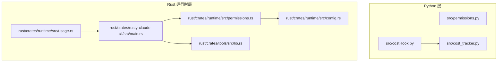
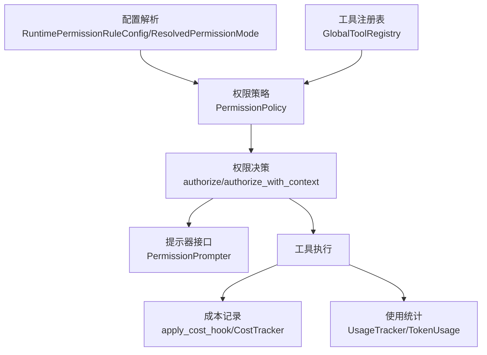
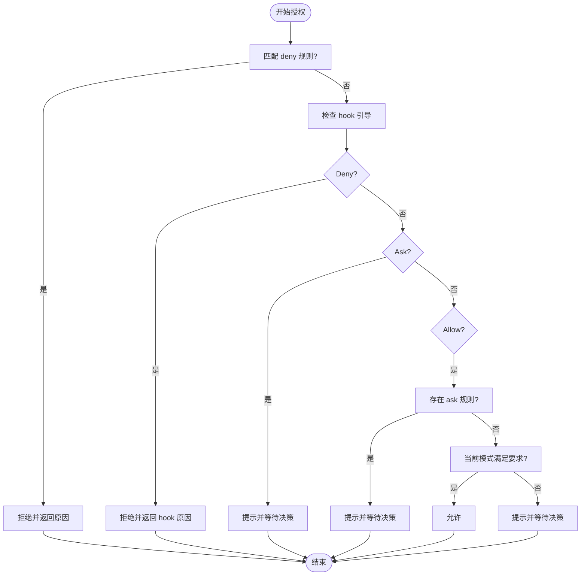
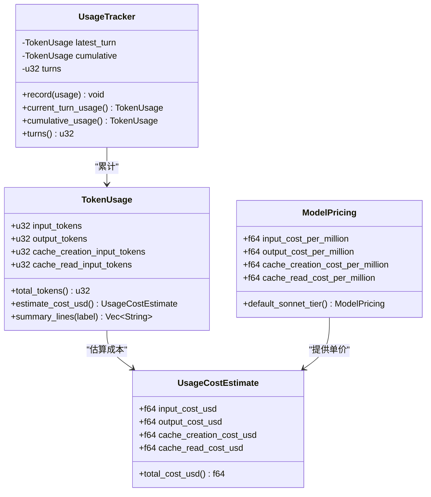
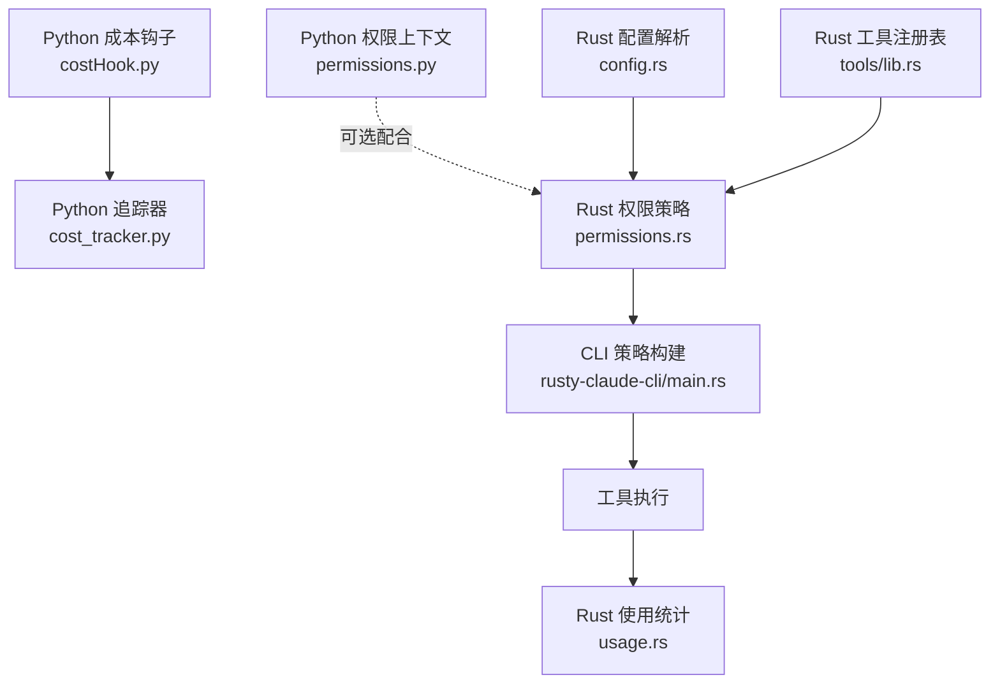
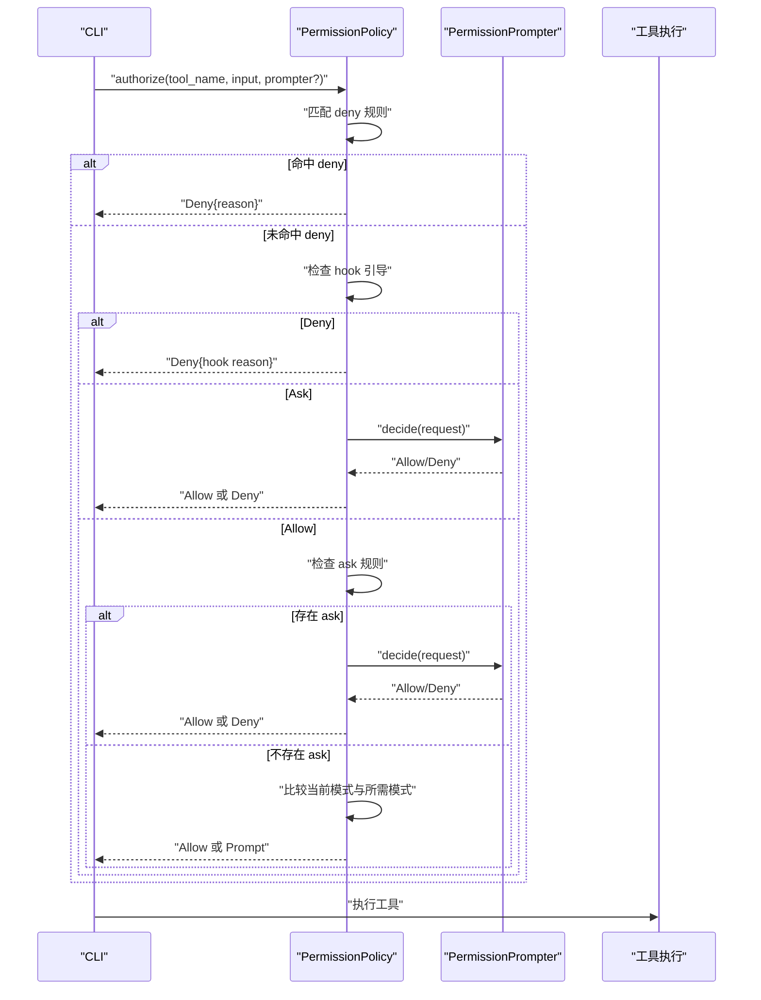

# 权限配置

<cite>
**本文档引用的文件**
- [src/permissions.py](file://src/permissions.py)
- [src/costHook.py](file://src/costHook.py)
- [src/cost_tracker.py](file://src/cost_tracker.py)
- [rust/crates/runtime/src/permissions.rs](file://rust/crates/runtime/src/permissions.rs)
- [rust/crates/runtime/src/usage.rs](file://rust/crates/runtime/src/usage.rs)
- [rust/crates/runtime/src/config.rs](file://rust/crates/runtime/src/config.rs)
- [rust/crates/tools/src/lib.rs](file://rust/crates/tools/src/lib.rs)
- [rust/crates/rusty-claude-cli/src/main.rs](file://rust/crates/rusty-claude-cli/src/main.rs)
</cite>

## 目录
1. [简介](#简介)
2. [项目结构](#项目结构)
3. [核心组件](#核心组件)
4. [架构总览](#架构总览)
5. [详细组件分析](#详细组件分析)
6. [依赖关系分析](#依赖关系分析)
7. [性能考虑](#性能考虑)
8. [故障排除指南](#故障排除指南)
9. [结论](#结论)
10. [附录](#附录)

## 简介
本文件面向 CLAW 项目的权限配置系统，系统性阐述权限模型设计、权限验证机制与成本跟踪体系。内容覆盖：
- 权限模型：权限等级、策略、规则匹配与决策流程
- 验证机制：基于工具名与输入内容的规则匹配、提示与拒绝流程
- 成本跟踪：令牌用量统计、成本估算与钩子记录
- 配置与集成：配置解析、工具注册表、CLI 构建策略
- 安全与最佳实践：权限决策树、缓存与失效策略建议

## 项目结构
权限与成本相关代码主要分布在 Python 层（src）与 Rust 层（rust/crates）。Python 层提供轻量的成本钩子与追踪器；Rust 层提供完整的权限策略、规则解析、权限决策与使用成本估算。

图表来源
- [src/permissions.py:1-21](file://src/permissions.py#L1-L21)
- [src/costHook.py:1-9](file://src/costHook.py#L1-L9)
- [src/cost_tracker.py:1-14](file://src/cost_tracker.py#L1-L14)
- [rust/crates/runtime/src/permissions.rs:1-676](file://rust/crates/runtime/src/permissions.rs#L1-L676)
- [rust/crates/runtime/src/usage.rs:1-310](file://rust/crates/runtime/src/usage.rs#L1-L310)
- [rust/crates/runtime/src/config.rs:1-800](file://rust/crates/runtime/src/config.rs#L1-L800)
- [rust/crates/tools/src/lib.rs:140-339](file://rust/crates/tools/src/lib.rs#L140-L339)
- [rust/crates/rusty-claude-cli/src/main.rs:3738-3749](file://rust/crates/rusty-claude-cli/src/main.rs#L3738-L3749)

章节来源
- [src/permissions.py:1-21](file://src/permissions.py#L1-L21)
- [src/costHook.py:1-9](file://src/costHook.py#L1-L9)
- [src/cost_tracker.py:1-14](file://src/cost_tracker.py#L1-L14)
- [rust/crates/runtime/src/permissions.rs:1-676](file://rust/crates/runtime/src/permissions.rs#L1-L676)
- [rust/crates/runtime/src/usage.rs:1-310](file://rust/crates/runtime/src/usage.rs#L1-L310)
- [rust/crates/runtime/src/config.rs:1-800](file://rust/crates/runtime/src/config.rs#L1-L800)
- [rust/crates/tools/src/lib.rs:140-339](file://rust/crates/tools/src/lib.rs#L140-L339)
- [rust/crates/rusty-claude-cli/src/main.rs:3738-3749](file://rust/crates/rusty-claude-cli/src/main.rs#L3738-L3749)

## 核心组件
- Python 权限上下文（ToolPermissionContext）
  - 提供基于名称集合与前缀的拒绝判定能力，支持大小写不敏感比较。
- Python 成本钩子与追踪器（apply_cost_hook, CostTracker）
  - 轻量的成本记录接口，便于在工具调用后追加记录。
- Rust 权限策略（PermissionPolicy, PermissionMode, PermissionRule）
  - 完整的权限等级、策略构建、规则解析与决策流程。
- Rust 使用成本与令牌追踪（TokenUsage, UsageTracker, ModelPricing）
  - 令牌用量统计、成本估算与会话级累计。
- Rust 配置解析（RuntimePermissionRuleConfig, ResolvedPermissionMode）
  - 解析权限模式与规则配置，支持合并与扩展。
- 工具注册表（GlobalToolRegistry）
  - 暴露工具权限规格，用于构建策略。
- CLI 权限策略构建（permission_policy）
  - 基于工具注册表与配置生成最终策略。

章节来源
- [src/permissions.py:6-21](file://src/permissions.py#L6-L21)
- [src/costHook.py:6-9](file://src/costHook.py#L6-L9)
- [src/cost_tracker.py:6-14](file://src/cost_tracker.py#L6-L14)
- [rust/crates/runtime/src/permissions.rs:7-325](file://rust/crates/runtime/src/permissions.rs#L7-L325)
- [rust/crates/runtime/src/usage.rs:8-209](file://rust/crates/runtime/src/usage.rs#L8-L209)
- [rust/crates/runtime/src/config.rs:67-715](file://rust/crates/runtime/src/config.rs#L67-L715)
- [rust/crates/tools/src/lib.rs:140-339](file://rust/crates/tools/src/lib.rs#L140-L339)
- [rust/crates/rusty-claude-cli/src/main.rs:3738-3749](file://rust/crates/rusty-claude-cli/src/main.rs#L3738-L3749)

## 架构总览
权限与成本系统由“配置—策略—决策—执行—记录”构成闭环。配置层负责解析权限模式与规则；策略层根据工具与输入进行匹配；决策层决定允许或提示；执行层完成工具调用；记录层统计成本与令牌用量。

图表来源
- [rust/crates/runtime/src/config.rs:67-715](file://rust/crates/runtime/src/config.rs#L67-L715)
- [rust/crates/tools/src/lib.rs:140-339](file://rust/crates/tools/src/lib.rs#L140-L339)
- [rust/crates/runtime/src/permissions.rs:91-325](file://rust/crates/runtime/src/permissions.rs#L91-L325)
- [rust/crates/runtime/src/permissions.rs:80-82](file://rust/crates/runtime/src/permissions.rs#L80-L82)
- [src/costHook.py:6-9](file://src/costHook.py#L6-L9)
- [src/cost_tracker.py:6-14](file://src/cost_tracker.py#L6-L14)
- [rust/crates/runtime/src/usage.rs:162-209](file://rust/crates/runtime/src/usage.rs#L162-L209)

## 详细组件分析

### Python 权限上下文（ToolPermissionContext）
- 数据结构
  - 冻结数据类，包含拒绝名称集合与前缀元组。
- 规则与匹配
  - 支持从可迭代集合构造，统一转为小写进行匹配。
  - 判定逻辑：若名称在拒绝集合中，或以任一前缀开头，则阻断。
- 复杂度
  - 匹配时间复杂度 O(n)，n 为前缀数量；空间复杂度 O(k)，k 为拒绝名称数量。

章节来源
- [src/permissions.py:6-21](file://src/permissions.py#L6-L21)

### Rust 权限策略与决策（PermissionPolicy, PermissionMode, PermissionRule）
- 权限等级（PermissionMode）
  - ReadOnly、WorkspaceWrite、DangerFullAccess、Prompt、Allow。
- 策略构建
  - 通过工具注册表与配置构建策略，设置每个工具所需的最低权限。
- 规则匹配
  - 支持 allow/deny/ask 三类规则，按工具名与输入内容匹配。
  - 规则语法：工具名(匹配器)，匹配器支持任意(*)、精确值、前缀(:*)。
  - 输入提取：从 JSON 输入中抽取常见字段作为匹配主体。
- 决策流程
  - 优先检查 deny 规则；随后处理 hook 引导的 Allow/Deny/Ask；再检查 ask 规则；最后依据当前模式与所需模式判断是否允许或提示。
  - 提示场景：模式升级（如从 WorkspaceWrite 升到 DangerFullAccess）或 Prompt 模式强制确认。
- 错误处理
  - 未满足权限时返回带原因的拒绝结果；提示器缺失时直接拒绝。

图表来源
- [rust/crates/runtime/src/permissions.rs:155-284](file://rust/crates/runtime/src/permissions.rs#L155-L284)
- [rust/crates/runtime/src/permissions.rs:318-383](file://rust/crates/runtime/src/permissions.rs#L318-L383)

章节来源
- [rust/crates/runtime/src/permissions.rs:7-325](file://rust/crates/runtime/src/permissions.rs#L7-L325)

### Rust 权限规则解析与输入提取
- 规则解析
  - 支持转义括号与反斜杠，解析出工具名与匹配器。
- 输入提取
  - 从 JSON 输入中提取命令、路径、URL、模式等关键字段作为匹配主体。
- 性能与健壮性
  - 使用单次遍历查找首尾未转义括号，避免错误解析。

章节来源
- [rust/crates/runtime/src/permissions.rs:341-461](file://rust/crates/runtime/src/permissions.rs#L341-L461)

### Rust 配置解析（RuntimePermissionRuleConfig, ResolvedPermissionMode）
- 权限模式解析
  - 支持多种标签映射到 ReadOnly、WorkspaceWrite、DangerFullAccess。
- 权限规则解析
  - 从配置对象读取 permissions.allow/deny/ask 数组，构建规则集。
- 合并与扩展
  - 支持多源配置合并，确保规则与模式的最终一致性。

章节来源
- [rust/crates/runtime/src/config.rs:67-715](file://rust/crates/runtime/src/config.rs#L67-L715)

### 工具注册表与权限规格（GlobalToolRegistry）
- 权限规格暴露
  - 提供工具名与其所需权限的映射，供策略构建使用。
- 名称规范化
  - 支持别名映射与大小写/分隔符规范化，提升匹配鲁棒性。

章节来源
- [rust/crates/tools/src/lib.rs:140-339](file://rust/crates/tools/src/lib.rs#L140-L339)

### CLI 权限策略构建（permission_policy）
- 策略装配
  - 从工具注册表与运行时配置构建策略，设置工具需求与规则。
- 集成点
  - 作为 CLI 的权限入口，贯穿后续授权与执行流程。

章节来源
- [rust/crates/rusty-claude-cli/src/main.rs:3738-3749](file://rust/crates/rusty-claude-cli/src/main.rs#L3738-L3749)

### Python 成本钩子与追踪器
- 成本钩子
  - 接受追踪器、标签与单位，记录事件并返回追踪器实例。
- 追踪器
  - 维护总单位数与事件列表，支持增量记录。

章节来源
- [src/costHook.py:6-9](file://src/costHook.py#L6-L9)
- [src/cost_tracker.py:6-14](file://src/cost_tracker.py#L6-L14)

### Rust 使用成本与令牌追踪（TokenUsage, UsageTracker, ModelPricing）
- 令牌结构
  - 输入、输出、缓存写入、缓存读取四类令牌计数。
- 成本估算
  - 基于模型定价（默认/Haiku/Opus/Sonnet）计算 USD 成本。
- 会话重建
  - 从会话消息中累计令牌用量，支持回合统计。
- 输出格式化
  - 提供人类可读的汇总行，包含模型与定价信息。

图表来源
- [rust/crates/runtime/src/usage.rs:28-209](file://rust/crates/runtime/src/usage.rs#L28-L209)

章节来源
- [rust/crates/runtime/src/usage.rs:8-209](file://rust/crates/runtime/src/usage.rs#L8-L209)

## 依赖关系分析
- Python 层
  - costHook 依赖 cost_tracker，提供记录接口。
  - permissions.py 提供基础拒绝规则，可与 Rust 策略配合使用。
- Rust 层
  - permission_policy 依赖工具注册表与配置，构建策略。
  - usage 与 config 独立模块分别负责成本与配置解析。
  - CLI 通过 permission_policy 将策略注入执行链路。

图表来源
- [src/costHook.py:1-9](file://src/costHook.py#L1-L9)
- [src/cost_tracker.py:1-14](file://src/cost_tracker.py#L1-L14)
- [src/permissions.py:1-21](file://src/permissions.py#L1-L21)
- [rust/crates/runtime/src/permissions.rs:1-676](file://rust/crates/runtime/src/permissions.rs#L1-L676)
- [rust/crates/runtime/src/config.rs:1-800](file://rust/crates/runtime/src/config.rs#L1-L800)
- [rust/crates/tools/src/lib.rs:140-339](file://rust/crates/tools/src/lib.rs#L140-L339)
- [rust/crates/rusty-claude-cli/src/main.rs:3738-3749](file://rust/crates/rusty-claude-cli/src/main.rs#L3738-L3749)
- [rust/crates/runtime/src/usage.rs:1-310](file://rust/crates/runtime/src/usage.rs#L1-L310)

章节来源
- [src/costHook.py:1-9](file://src/costHook.py#L1-L9)
- [src/cost_tracker.py:1-14](file://src/cost_tracker.py#L1-L14)
- [src/permissions.py:1-21](file://src/permissions.py#L1-L21)
- [rust/crates/runtime/src/permissions.rs:1-676](file://rust/crates/runtime/src/permissions.rs#L1-L676)
- [rust/crates/runtime/src/config.rs:1-800](file://rust/crates/runtime/src/config.rs#L1-L800)
- [rust/crates/tools/src/lib.rs:140-339](file://rust/crates/tools/src/lib.rs#L140-L339)
- [rust/crates/rusty-claude-cli/src/main.rs:3738-3749](file://rust/crates/rusty-claude-cli/src/main.rs#L3738-L3749)
- [rust/crates/runtime/src/usage.rs:1-310](file://rust/crates/runtime/src/usage.rs#L1-L310)

## 性能考虑
- 权限规则匹配
  - 规则数组线性扫描，建议限制规则数量或按工具维度拆分索引以降低匹配开销。
- 输入提取
  - JSON 解析与键遍历为 O(k)（k 为键数量），建议对高频工具输入进行缓存或预处理。
- 成本估算
  - 估算函数为纯数学运算，开销极低；批量统计时可复用定价结构减少重复计算。
- 决策分支
  - 决策流程包含多次条件判断与提示器调用，建议在 CLI 或服务端层实现短路优化与并发控制。

## 故障排除指南
- 权限拒绝
  - 检查 deny 规则是否误命中；核对工具名与输入提取字段是否符合预期。
- 提示器未响应
  - 在 Prompt 模式下，若未提供提示器实现，将直接拒绝；请确保提示器可用或调整模式。
- 模式升级失败
  - 从 WorkspaceWrite 升级到 DangerFullAccess 需要明确确认；检查提示器返回与日志。
- 成本记录异常
  - 确认 costHook 调用顺序与标签一致性；检查 CostTracker 是否被正确传递。
- 配置解析错误
  - 检查 permissions.allow/deny/ask 数组格式与转义字符；确认权限模式标签拼写。

章节来源
- [rust/crates/runtime/src/permissions.rs:155-284](file://rust/crates/runtime/src/permissions.rs#L155-L284)
- [rust/crates/runtime/src/permissions.rs:286-316](file://rust/crates/runtime/src/permissions.rs#L286-L316)
- [rust/crates/runtime/src/config.rs:637-655](file://rust/crates/runtime/src/config.rs#L637-L655)

## 结论
CLAW 的权限配置系统在 Rust 层实现了严谨的策略与规则匹配，在 Python 层提供了轻量的成本记录能力。通过配置解析与工具注册表，系统能够灵活地构建策略并驱动执行。建议在生产环境中结合缓存与并发控制优化性能，并完善提示器与日志以提升可观测性。

## 附录

### 权限决策树（序列图）

图表来源
- [rust/crates/runtime/src/permissions.rs:155-284](file://rust/crates/runtime/src/permissions.rs#L155-L284)
- [rust/crates/runtime/src/permissions.rs:286-316](file://rust/crates/runtime/src/permissions.rs#L286-L316)

### 权限配置模板（JSON）
- 权限模式
  - 支持标签："read-only"、"workspace-write"、"danger-full-access"
- 权限规则
  - allow/deny/ask：每项为字符串，格式为 "工具名(匹配器)"，匹配器支持 "*"、"前缀:*"、"精确值"
- 示例片段
  - "permissions": {
      "allow": ["bash(git:*)", "read_file(*)"],
      "deny": ["bash(rm -rf:*)"],
      "ask": ["bash(*)"]
    }

章节来源
- [rust/crates/runtime/src/config.rs:637-655](file://rust/crates/runtime/src/config.rs#L637-L655)

### 安全最佳实践
- 最小权限原则：为工具设定最低必要权限，避免使用 DangerFullAccess。
- 明确规则：优先使用精确匹配与前缀匹配，减少通配符滥用。
- 提示与审计：启用 Prompt 模式对高风险操作进行二次确认，并记录拒绝原因。
- 配置校验：定期审查 permissions.allow/deny/ask，清理过期规则。
- 成本控制：结合成本钩子与使用统计，建立预算阈值与告警机制。

### 权限缓存、刷新与失效机制（建议）
- 缓存
  - 对工具权限规格与规则匹配结果进行短期缓存，减少重复解析。
- 刷新
  - 在配置文件变更或工具注册表更新时触发缓存重建。
- 失效
  - 采用 TTL 或版本号管理，超时或版本不一致时自动失效并重新加载。