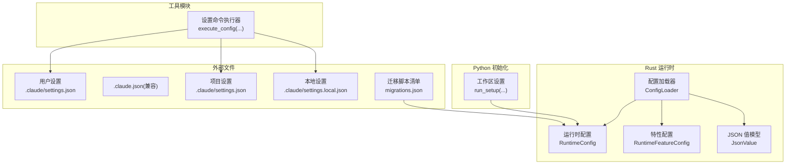
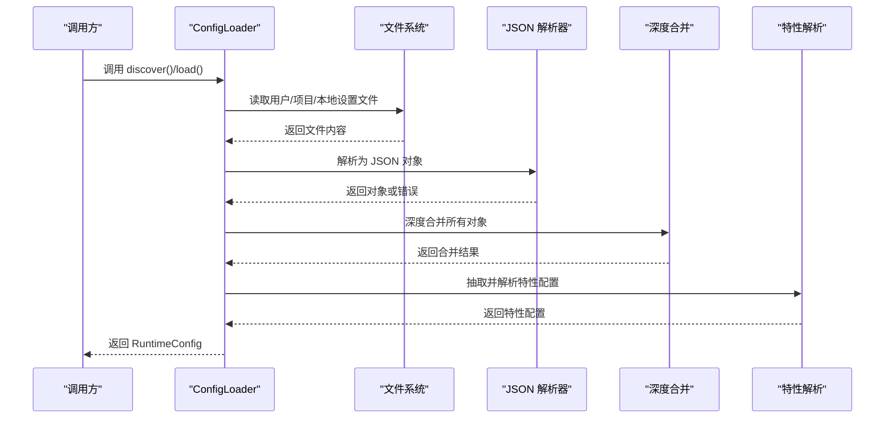
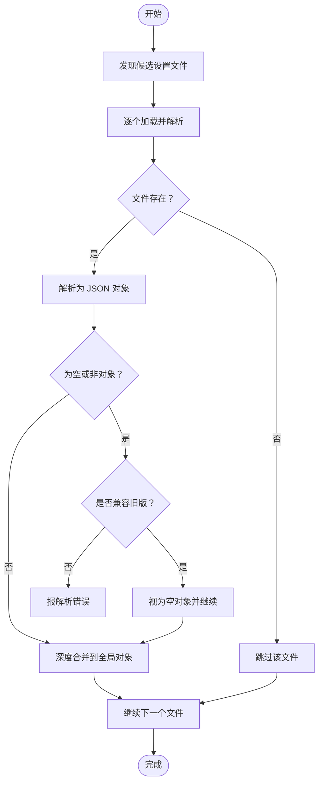
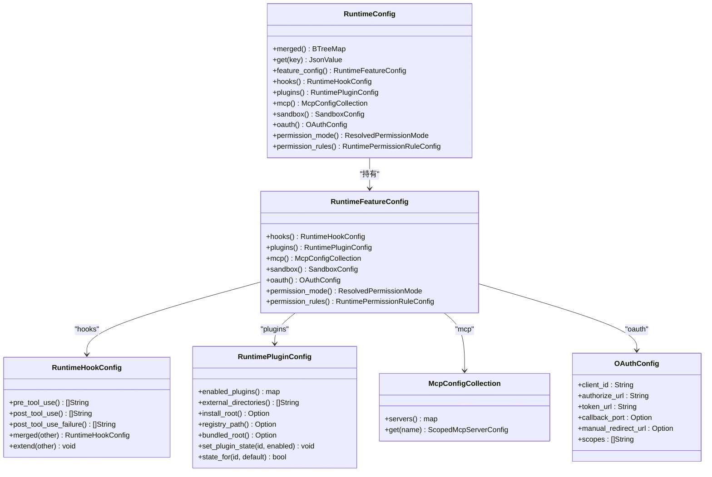
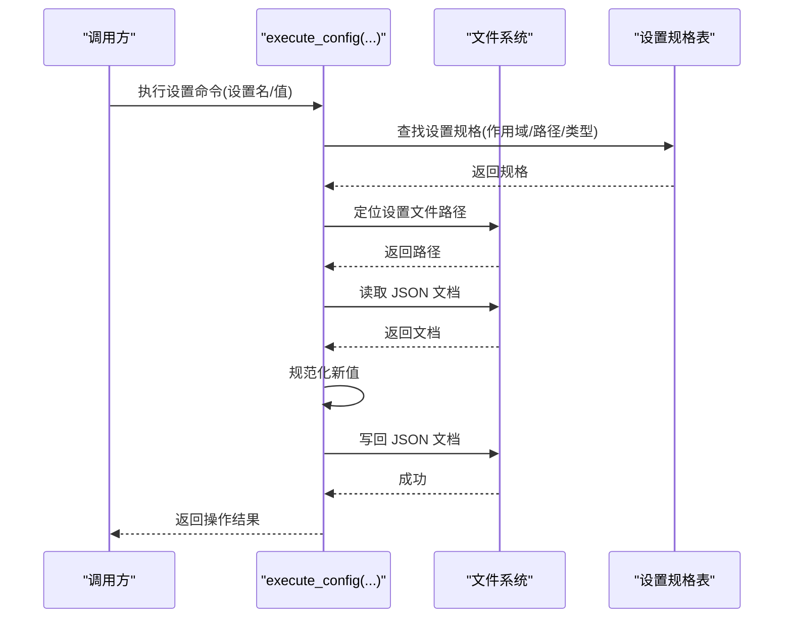
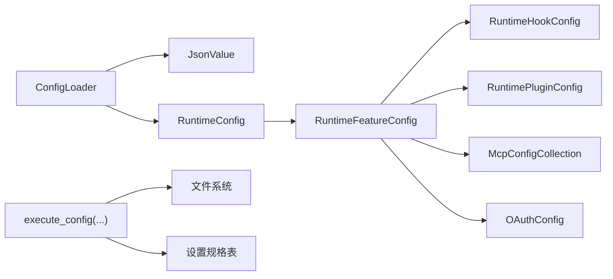

# 设置系统

<cite>
**本文引用的文件**
- [config.rs](file://rust/crates/runtime/src/config.rs)
- [lib.rs](file://rust/crates/runtime/src/lib.rs)
- [json.rs](file://rust/crates/runtime/src/json.rs)
- [.claude.json](file://.claude.json)
- [lib.rs（tools）](file://rust/crates/tools/src/lib.rs)
- [migrations.json](file://src/reference_data/subsystems/migrations.json)
- [setup.py](file://src/setup.py)
</cite>

## 目录
1. [简介](#简介)
2. [项目结构](#项目结构)
3. [核心组件](#核心组件)
4. [架构总览](#架构总览)
5. [详细组件分析](#详细组件分析)
6. [依赖关系分析](#依赖关系分析)
7. [性能考量](#性能考量)
8. [故障排查指南](#故障排查指南)
9. [结论](#结论)
10. [附录](#附录)

## 简介
本文件面向 CLAW 项目的“设置系统”，系统性阐述设置的存储位置、加载顺序、解析与合并策略、类型校验、默认值、用户自定义设置、环境变量映射、动态更新、迁移与版本兼容、备份与恢复等主题。目标是帮助开发者与使用者理解并正确使用设置系统，确保在不同层级（用户、项目、本地）的配置能够被安全、可预期地合并与应用。

## 项目结构
设置系统主要由以下部分组成：
- Rust 运行时配置模块：负责设置文件发现、解析、类型校验、深度合并、特性配置抽取与查询。
- JSON 解析与表示：提供轻量级 JSON 值模型与解析器，支撑设置文件的读取与校验。
- 工具模块设置命令：提供对特定设置项的读写能力，支持规范化与落盘。
- Python 启动与初始化：提供工作区初始化与报告生成，作为设置系统在 Python 层的入口之一。
- 迁移子系统：提供历史设置迁移脚本清单，保障版本演进与兼容。

图表来源
- [config.rs:184-270](file://rust/crates/runtime/src/config.rs#L184-L270)
- [json.rs:36-113](file://rust/crates/runtime/src/json.rs#L36-L113)
- [lib.rs（tools）:2612-2657](file://rust/crates/tools/src/lib.rs#L2612-L2657)
- [setup.py:64-78](file://src/setup.py#L64-L78)
- [migrations.json:1-18](file://src/reference_data/subsystems/migrations.json#L1-L18)

章节来源
- [config.rs:184-270](file://rust/crates/runtime/src/config.rs#L184-L270)
- [json.rs:36-113](file://rust/crates/runtime/src/json.rs#L36-L113)
- [lib.rs（tools）:2612-2657](file://rust/crates/tools/src/lib.rs#L2612-L2657)
- [setup.py:64-78](file://src/setup.py#L64-L78)
- [.claude.json:1-6](file://.claude.json#L1-L6)
- [migrations.json:1-18](file://src/reference_data/subsystems/migrations.json#L1-L18)

## 核心组件
- 配置加载器（ConfigLoader）
  - 负责发现并按优先级加载设置文件，支持用户级、项目级与本地级设置。
  - 提供统一的加载接口，返回运行时配置对象。
- 运行时配置（RuntimeConfig）
  - 暴露合并后的键值映射以及已加载条目列表。
  - 提供便捷访问器，用于获取模型、权限模式、权限规则、插件、MCP、沙箱、OAuth 等特性配置。
- JSON 值模型（JsonValue）
  - 自实现的 JSON 表达式模型，支持对象、数组、字符串、布尔、数字与空值。
  - 提供解析与渲染能力，用于设置文件的读取与写回。
- 特性配置（RuntimeFeatureConfig）
  - 将顶层设置解析为具体特性域（如 hooks、plugins、mcp、oauth、sandbox、permissions 等），并进行类型校验与默认值处理。
- 工具模块设置命令（execute_config）
  - 支持按路径读取或设置指定设置项，进行规范化与落盘。
- Python 启动与初始化（run_setup）
  - 构建工作区设置报告，启动预取与延迟初始化流程，作为设置系统在 Python 层的入口。

章节来源
- [config.rs:178-270](file://rust/crates/runtime/src/config.rs#L178-L270)
- [config.rs:272-346](file://rust/crates/runtime/src/config.rs#L272-L346)
- [json.rs:36-113](file://rust/crates/runtime/src/json.rs#L36-L113)
- [lib.rs（tools）:2612-2657](file://rust/crates/tools/src/lib.rs#L2612-L2657)
- [setup.py:64-78](file://src/setup.py#L64-L78)

## 架构总览
设置系统的整体流程如下：
- 文件发现：根据当前工作目录与配置根目录，按优先级枚举多个候选设置文件。
- 逐个读取：将每个文件解析为 JSON 对象；若为空或非对象则按策略处理（兼容旧版或报错）。
- 深度合并：将各层设置对象进行深度合并，后加载者覆盖先加载者同名键。
- 特性解析：从合并后的顶层对象中抽取并解析特性域配置，同时进行类型校验与默认值填充。
- 查询访问：通过运行时配置对象提供的访问器，读取所需特性配置。

图表来源
- [config.rs:206-270](file://rust/crates/runtime/src/config.rs#L206-L270)
- [config.rs:550-579](file://rust/crates/runtime/src/config.rs#L550-L579)
- [config.rs:995-1009](file://rust/crates/runtime/src/config.rs#L995-L1009)
- [config.rs:251-262](file://rust/crates/runtime/src/config.rs#L251-L262)

## 详细组件分析

### 配置文件发现与加载
- 发现顺序与路径
  - 用户级兼容文件：位于配置根目录父目录下的兼容文件，用于向后兼容。
  - 用户级设置：位于配置根目录下的标准设置文件。
  - 项目级兼容文件：位于工作目录下的兼容文件。
  - 项目级设置：位于工作目录下配置子目录的标准设置文件。
  - 本地设置：位于工作目录下配置子目录的本地设置文件。
- 加载策略
  - 若文件不存在则跳过；若为空则视为空对象；若非对象则按兼容策略处理（旧版兼容时忽略，否则报错）。
  - 按发现顺序依次加载，后加载者覆盖先加载者的同名键。
- 环境变量映射
  - 默认配置根目录可通过环境变量进行覆盖，便于多用户或多环境部署。

图表来源
- [config.rs:206-233](file://rust/crates/runtime/src/config.rs#L206-L233)
- [config.rs:550-579](file://rust/crates/runtime/src/config.rs#L550-L579)
- [config.rs:442-447](file://rust/crates/runtime/src/config.rs#L442-L447)

章节来源
- [config.rs:206-233](file://rust/crates/runtime/src/config.rs#L206-L233)
- [config.rs:550-579](file://rust/crates/runtime/src/config.rs#L550-L579)
- [config.rs:442-447](file://rust/crates/runtime/src/config.rs#L442-L447)

### 设置合并与类型校验
- 深度合并
  - 对象键采用递归深度合并，非对象键直接覆盖。
  - 保证后加载层对前加载层的键覆盖生效。
- 类型校验与默认值
  - hooks：字符串数组字段，支持去重扩展。
  - plugins：支持启用状态映射与目录/安装路径等字段，未提供时使用默认值。
  - mcpServers：按服务器名称聚合，支持多种传输类型与认证配置，字段类型严格校验。
  - sandbox：支持开关、隔离模式、挂载白名单等，模式标签进行合法性校验。
  - permissions：支持默认模式与允许/拒绝/询问规则，模式标签进行合法性校验。
  - oauth：客户端 ID、授权/令牌端点、回调端口、手动重定向地址与作用域等，字段类型严格校验。
- 错误处理
  - 非对象顶层、字段类型不匹配、越界整数、未知枚举值等情况均会抛出解析错误。

图表来源
- [config.rs:31-57](file://rust/crates/runtime/src/config.rs#L31-L57)
- [config.rs:251-262](file://rust/crates/runtime/src/config.rs#L251-L262)
- [config.rs:449-493](file://rust/crates/runtime/src/config.rs#L449-L493)
- [config.rs:402-439](file://rust/crates/runtime/src/config.rs#L402-L439)
- [config.rs:517-527](file://rust/crates/runtime/src/config.rs#L517-L527)
- [config.rs:146-153](file://rust/crates/runtime/src/config.rs#L146-L153)

章节来源
- [config.rs:995-1009](file://rust/crates/runtime/src/config.rs#L995-L1009)
- [config.rs:615-655](file://rust/crates/runtime/src/config.rs#L615-L655)
- [config.rs:657-685](file://rust/crates/runtime/src/config.rs#L657-L685)
- [config.rs:687-705](file://rust/crates/runtime/src/config.rs#L687-L705)
- [config.rs:721-744](file://rust/crates/runtime/src/config.rs#L721-L744)
- [config.rs:757-780](file://rust/crates/runtime/src/config.rs#L757-L780)
- [config.rs:782-819](file://rust/crates/runtime/src/config.rs#L782-L819)

### 设置文件格式与默认值
- 文件格式
  - 顶层必须为对象；数组、字符串、数字、布尔或 null 均不合法（除非兼容旧版）。
  - 兼容旧版文件（位于用户根目录下的兼容文件）在解析失败或非对象时会被忽略。
- 默认值
  - 未提供时，特性配置采用默认值（如 hooks 的空数组、plugins 的空映射与空路径、sandbox 的禁用与关闭隔离等）。
- 典型字段示例
  - hooks：PreToolUse、PostToolUse、PostToolUseFailure。
  - plugins：enabledPlugins、plugins.externalDirectories、plugins.installRoot、plugins.registryPath、plugins.bundledRoot。
  - mcpServers：按服务器名分组，支持多种传输类型与认证参数。
  - sandbox：enabled、namespaceRestrictions、networkIsolation、filesystemMode、allowedMounts。
  - permissions：defaultMode、allow、deny、ask。
  - oauth：clientId、authorizeUrl、tokenUrl、callbackPort、manualRedirectUrl、scopes。

章节来源
- [config.rs:569-578](file://rust/crates/runtime/src/config.rs#L569-L578)
- [config.rs:615-655](file://rust/crates/runtime/src/config.rs#L615-L655)
- [config.rs:657-685](file://rust/crates/runtime/src/config.rs#L657-L685)
- [config.rs:721-744](file://rust/crates/runtime/src/config.rs#L721-L744)
- [config.rs:757-780](file://rust/crates/runtime/src/config.rs#L757-L780)
- [.claude.json:1-6](file://.claude.json#L1-L6)

### 用户自定义设置与动态更新
- 用户自定义设置
  - 用户级设置与项目级设置分别位于用户配置根目录与工作目录的配置子目录。
  - 本地设置仅在本地生效，优先级最高，用于覆盖项目或用户设置。
- 动态设置更新（工具模块）
  - 支持按设置项路径读取或设置值，内部进行规范化与落盘。
  - 支持的设置项包括主题、编辑器模式、日志级别、通知通道、自动压缩/记忆、文件检查点、回合耗时显示、终端进度条等。
  - 设置项路径与作用域（全局/设置）在规格表中定义，便于扩展。

图表来源
- [lib.rs（tools）:2612-2657](file://rust/crates/tools/src/lib.rs#L2612-L2657)
- [lib.rs（tools）:2722-2799](file://rust/crates/tools/src/lib.rs#L2722-L2799)

章节来源
- [lib.rs（tools）:2612-2657](file://rust/crates/tools/src/lib.rs#L2612-L2657)
- [lib.rs（tools）:2722-2799](file://rust/crates/tools/src/lib.rs#L2722-L2799)

### 设置验证、类型检查与配置合并逻辑
- 验证与类型检查
  - 字段类型严格校验：字符串、布尔、整数（含范围）、数组（元素类型）、对象（嵌套对象）。
  - 枚举值校验：权限模式、文件系统隔离模式等。
  - 错误信息包含上下文路径，便于定位问题。
- 配置合并
  - 深度合并对象键，数组采用后加载层覆盖策略（hooks 使用去重扩展）。
  - mcpServers 按服务器名聚合，记录来源层级（用户/项目/本地）。

章节来源
- [config.rs:859-993](file://rust/crates/runtime/src/config.rs#L859-L993)
- [config.rs:995-1009](file://rust/crates/runtime/src/config.rs#L995-L1009)
- [config.rs:1011-1021](file://rust/crates/runtime/src/config.rs#L1011-L1021)
- [config.rs:581-606](file://rust/crates/runtime/src/config.rs#L581-L606)

### 环境变量映射与动态设置更新
- 环境变量映射
  - 默认配置根目录可通过环境变量进行覆盖，便于在不同用户或容器环境中切换配置根目录。
- 动态设置更新
  - 工具模块提供设置命令，支持在运行时读取/设置指定设置项，并写回对应文件。

章节来源
- [config.rs:442-447](file://rust/crates/runtime/src/config.rs#L442-L447)
- [lib.rs（tools）:2612-2657](file://rust/crates/tools/src/lib.rs#L2612-L2657)

### 设置迁移、版本兼容性与备份恢复
- 迁移与版本兼容
  - 迁移子系统提供历史迁移脚本清单，涵盖模型版本迁移、权限设置迁移、MCP 服务器启用迁移等。
  - 运行时配置加载过程中对旧版兼容文件的处理遵循“解析失败即忽略”的策略，避免破坏新配置。
- 备份与恢复
  - 建议在修改重要设置前备份对应设置文件（用户、项目、本地）。
  - 可通过版本控制或外部备份工具保留历史快照，以便回滚。

章节来源
- [migrations.json:1-18](file://src/reference_data/subsystems/migrations.json#L1-L18)
- [config.rs:564-578](file://rust/crates/runtime/src/config.rs#L564-L578)

### Python 启动与初始化中的设置
- 工作区设置构建
  - 提供工作区设置报告，包含 Python 版本、实现、平台、信任模式与当前工作目录等信息。
  - 启动阶段执行预取与延迟初始化，作为设置系统在 Python 层的入口。

章节来源
- [setup.py:56-78](file://src/setup.py#L56-L78)

## 依赖关系分析
- 组件耦合
  - ConfigLoader 依赖 JSON 值模型与运行时配置结构，负责文件发现与合并。
  - RuntimeConfig 暴露统一查询接口，内部持有特性配置集合。
  - 工具模块设置命令依赖设置规格表与文件系统读写。
- 外部依赖
  - 文件系统：读取/写入设置文件。
  - 环境变量：覆盖默认配置根目录。
- 循环依赖
  - 未见循环依赖迹象；模块边界清晰。

图表来源
- [config.rs:178-270](file://rust/crates/runtime/src/config.rs#L178-L270)
- [json.rs:36-113](file://rust/crates/runtime/src/json.rs#L36-L113)
- [lib.rs（tools）:2612-2657](file://rust/crates/tools/src/lib.rs#L2612-L2657)

章节来源
- [config.rs:178-270](file://rust/crates/runtime/src/config.rs#L178-L270)
- [json.rs:36-113](file://rust/crates/runtime/src/json.rs#L36-L113)
- [lib.rs（tools）:2612-2657](file://rust/crates/tools/src/lib.rs#L2612-L2657)

## 性能考量
- 文件读取与解析
  - 采用流式解析与最小化内存拷贝，避免大文件带来的峰值内存压力。
- 合并策略
  - 深度合并为 O(N) 级别（N 为键数量），在合理范围内开销可控。
- 数组扩展
  - hooks 的数组扩展采用去重插入，注意在高频更新场景下的线性查找成本。

## 故障排查指南
- 常见错误与定位
  - 非对象顶层：顶层必须为对象，否则报错。
  - 字段类型不匹配：字符串/布尔/整数/数组/对象类型不符时报错。
  - 越界整数：u16 范围外时报错。
  - 未知枚举值：权限模式或文件系统隔离模式不在支持集合时报错。
- 排查步骤
  - 检查设置文件是否存在且可读。
  - 使用 JSON 校验工具确认语法正确。
  - 根据错误信息定位到具体字段，修正类型或枚举值。
  - 如涉及旧版兼容文件，确认其是否应被忽略或需要迁移。

章节来源
- [config.rs:564-578](file://rust/crates/runtime/src/config.rs#L564-L578)
- [config.rs:859-993](file://rust/crates/runtime/src/config.rs#L859-L993)
- [config.rs:707-719](file://rust/crates/runtime/src/config.rs#L707-L719)

## 结论
CLAW 的设置系统以“文件发现—解析—深度合并—特性抽取—查询访问”为主线，实现了跨层级（用户/项目/本地）的配置管理。通过严格的类型校验与默认值策略，确保配置在不同环境下的一致性与安全性。工具模块提供了动态设置能力，迁移子系统保障了版本演进的平滑过渡。建议在生产环境中配合备份与版本控制，以获得更高的可靠性与可追溯性。

## 附录
- 关键 API 与数据结构
  - 配置加载器：ConfigLoader::discover()/load()
  - 运行时配置：RuntimeConfig::merged()/get()/feature_config()
  - 特性配置：RuntimeFeatureConfig::hooks()/plugins()/mcp()/sandbox()/oauth()/permission_mode()/permission_rules()
  - JSON 值模型：JsonValue::parse()/as_object()/as_str()/as_bool()/as_i64()
  - 工具设置命令：execute_config(...)
- 参考文件
  - 用户设置示例：.claude.json