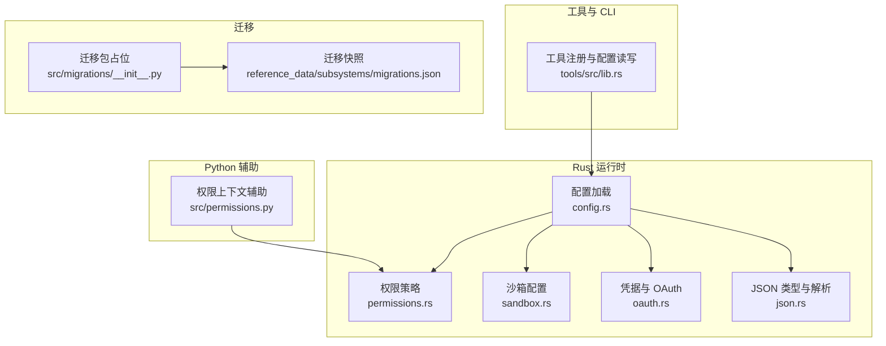
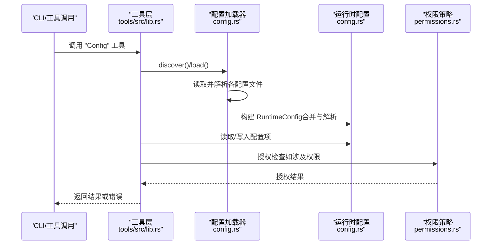
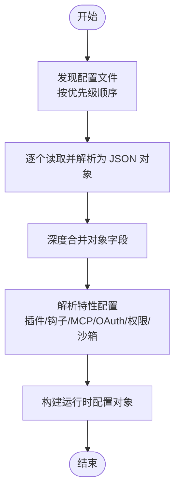
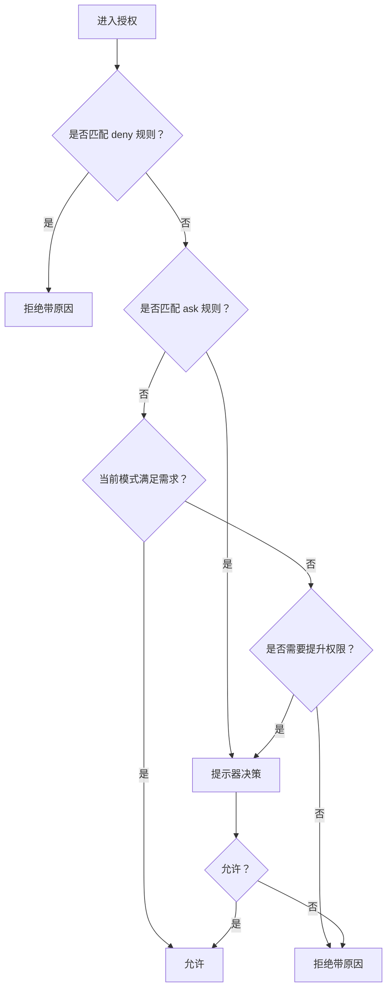
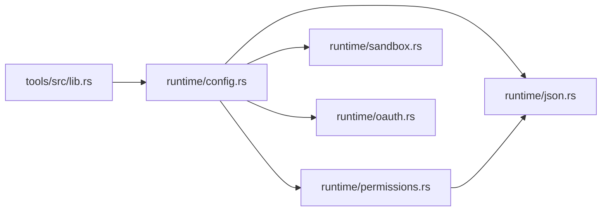

# 配置管理

<cite>
**本文引用的文件**
- [config.rs](file://rust/crates/runtime/src/config.rs)
- [permissions.rs](file://rust/crates/runtime/src/permissions.rs)
- [json.rs](file://rust/crates/runtime/src/json.rs)
- [sandbox.rs](file://rust/crates/runtime/src/sandbox.rs)
- [lib.rs（tools）](file://rust/crates/tools/src/lib.rs)
- [permissions.py](file://src/permissions.py)
- [migrations.json](file://src/reference_data/subsystems/migrations.json)
- [__init__.py（migrations）](file://src/migrations/__init__.py)
- [oauth.rs](file://rust/crates/runtime/src/oauth.rs)
</cite>

## 目录
1. [简介](#简介)
2. [项目结构](#项目结构)
3. [核心组件](#核心组件)
4. [架构总览](#架构总览)
5. [详细组件分析](#详细组件分析)
6. [依赖分析](#依赖分析)
7. [性能考虑](#性能考虑)
8. [故障排查指南](#故障排查指南)
9. [结论](#结论)
10. [附录](#附录)

## 简介
本文件系统化阐述 CLAW 项目的配置管理系统，覆盖工作区配置、权限配置与设置系统的核心机制。内容包括：
- 配置文件格式、优先级与合并策略
- 环境变量与运行时解析
- 动态配置与权限决策流程
- 配置验证与错误处理
- 配置模板与最佳实践
- 配置热重载与变更通知机制
- 配置迁移与版本兼容性处理

## 项目结构
配置系统由 Rust 运行时模块与 Python 工具模块协同实现，核心文件如下：
- 运行时配置加载与合并：[config.rs](file://rust/crates/runtime/src/config.rs)
- 权限策略与规则匹配：[permissions.rs](file://rust/crates/runtime/src/permissions.rs)
- JSON 值类型与解析器：[json.rs](file://rust/crates/runtime/src/json.rs)
- 沙箱隔离配置：[sandbox.rs](file://rust/crates/runtime/src/sandbox.rs)
- 工具侧配置读写与设置项规范：[lib.rs（tools）](file://rust/crates/tools/src/lib.rs)
- Python 权限上下文辅助：[permissions.py](file://src/permissions.py)
- 凭据与 OAuth 配置路径：[oauth.rs](file://rust/crates/runtime/src/oauth.rs)
- 迁移子系统快照：[migrations.json](file://src/reference_data/subsystems/migrations.json)、[__init__.py（migrations）](file://src/migrations/__init__.py)

**图表来源**
- [config.rs](file://rust/crates/runtime/src/config.rs)
- [permissions.rs](file://rust/crates/runtime/src/permissions.rs)
- [json.rs](file://rust/crates/runtime/src/json.rs)
- [sandbox.rs](file://rust/crates/runtime/src/sandbox.rs)
- [lib.rs（tools）](file://rust/crates/tools/src/lib.rs)
- [permissions.py](file://src/permissions.py)
- [migrations.json](file://src/reference_data/subsystems/migrations.json)
- [__init__.py（migrations）](file://src/migrations/__init__.py)

**章节来源**
- [config.rs](file://rust/crates/runtime/src/config.rs)
- [lib.rs（tools）](file://rust/crates/tools/src/lib.rs)

## 核心组件
- 配置发现与加载器：负责定位并按优先级加载多源配置文件，执行深度合并，并解析特性配置（插件、钩子、MCP、OAuth、权限模式与规则、沙箱等）。
- 运行时配置对象：封装已合并的键值映射与特性配置，提供便捷访问器。
- 权限策略引擎：基于权限模式与规则（允许/拒绝/询问）进行授权判定，支持提示器回调与钩子覆盖。
- JSON 值类型与解析器：自定义 JSON 解析与渲染，确保配置文件的健壮解析。
- 沙箱配置：统一解析与解析请求，生成沙箱状态与启动参数。
- 工具侧配置接口：暴露“Config”工具以读取/设置受支持的配置项，支持作用域（全局/工作区）与校验。

**章节来源**
- [config.rs](file://rust/crates/runtime/src/config.rs)
- [permissions.rs](file://rust/crates/runtime/src/permissions.rs)
- [json.rs](file://rust/crates/runtime/src/json.rs)
- [sandbox.rs](file://rust/crates/runtime/src/sandbox.rs)
- [lib.rs（tools）](file://rust/crates/tools/src/lib.rs)

## 架构总览
配置系统采用“多源发现 → 深度合并 → 特性解析 → 运行时访问”的流水线式设计。工具侧通过“Config”工具与运行时配置交互，实现读取与写入能力。

**图表来源**
- [lib.rs（tools）](file://rust/crates/tools/src/lib.rs)
- [config.rs](file://rust/crates/runtime/src/config.rs)
- [permissions.rs](file://rust/crates/runtime/src/permissions.rs)

## 详细组件分析

### 配置文件格式与优先级
- 文件位置与优先级（从低到高）：
  1) 用户兼容配置：用户主目录父路径下的 .claude.json（兼容旧版）
  2) 用户设置：$CLAUDE_CONFIG_HOME/settings.json 或 $HOME/.claude/settings.json
  3) 项目兼容配置：当前工作目录 .claude.json
  4) 项目设置：当前工作目录 .claude/settings.json
  5) 本地设置：当前工作目录 .claude/settings.local.json
- 合并策略：对对象字段执行深度合并；数组字段在特定场景下会去重合并（例如 hooks 列表）。
- 顶层必须为 JSON 对象；空文件视为存在但为空对象；非对象顶层将触发解析错误。

**图表来源**
- [config.rs](file://rust/crates/runtime/src/config.rs)

**章节来源**
- [config.rs](file://rust/crates/runtime/src/config.rs)

### 环境变量管理
- 配置根目录解析：
  - 优先使用环境变量 CLAUDE_CONFIG_HOME
  - 其次使用 HOME 并拼接 .claude
  - 若均不可得，默认使用当前目录 .claude
- 凭据存储根目录遵循相同逻辑，用于 OAuth 凭据等敏感信息的持久化。

**章节来源**
- [config.rs](file://rust/crates/runtime/src/config.rs)
- [oauth.rs](file://rust/crates/runtime/src/oauth.rs)

### 动态配置与配置验证
- 工具侧“Config”工具支持：
  - 读取指定设置项
  - 设置受支持的设置项（含作用域：全局/工作区）
  - 对不支持的设置返回失败
  - 对非法值返回错误
- 支持的设置项与作用域由工具层维护，读取时根据当前 CWD 与环境变量确定目标文件。

**章节来源**
- [lib.rs（tools）](file://rust/crates/tools/src/lib.rs)

### 权限配置与授权决策
- 权限模式：
  - 只读、工作区写入、危险全权、提示、允许
- 规则匹配：
  - allow/deny/ask 规则集，支持通配与前缀匹配
  - 规则内容可包含工具名与输入中的主体（如命令、路径等），通过提取器识别
- 决策流程：
  - 优先匹配 deny 规则
  - 其次评估 ask 规则（强制提示）
  - 最后比较当前模式与所需模式，必要时触发提示器
  - 支持钩子覆盖（允许/拒绝/要求确认）

**图表来源**
- [permissions.rs](file://rust/crates/runtime/src/permissions.rs)

**章节来源**
- [permissions.rs](file://rust/crates/runtime/src/permissions.rs)
- [permissions.py](file://src/permissions.py)

### 沙箱配置与隔离
- 支持的隔离模式：关闭、仅工作区、白名单
- 请求解析：根据配置与可选覆盖参数生成请求，再计算状态与可用性
- Linux 启动：当满足条件时生成 unshare 命令，注入必要的环境变量与挂载点

**章节来源**
- [sandbox.rs](file://rust/crates/runtime/src/sandbox.rs)
- [config.rs](file://rust/crates/runtime/src/config.rs)

### 配置模板与最佳实践
- 全局设置模板建议包含：
  - 模型选择、OAuth 客户端信息、默认权限模式、权限规则（allow/deny/ask）、插件启用列表与安装路径、MCP 服务器清单
- 工作区设置模板建议包含：
  - hooks（预/后/失败）、沙箱隔离参数、自动记忆/梦境开关等
- 最佳实践：
  - 将敏感信息放入凭据存储（遵循凭据根目录解析）
  - 使用 ask 规则对高风险工具进行强制确认
  - 在本地设置中仅放置与工作区强相关的覆盖项
  - 保持权限模式与规则清晰，避免宽泛的 allow

（本节为通用指导，不直接分析具体文件）

### 配置热重载与变更通知
- 当前实现要点：
  - 工具侧“Config”工具提供读取与写入能力
  - 运行时配置在加载阶段完成解析与合并
  - 未见显式的文件监控与自动重载机制
- 建议方案（概念性）：
  - 在工具层或运行时增加文件监控，检测配置文件变更后重新加载
  - 对关键配置（如权限模式、MCP 服务器）变更时触发广播或刷新

（本节为概念性说明，不直接分析具体文件）

### 配置迁移与版本兼容
- 迁移子系统快照显示存在迁移模块集合，包含模型迁移与功能开关迁移等样例
- Python 占位包导出迁移元数据，便于后续移植与集成

**章节来源**
- [migrations.json](file://src/reference_data/subsystems/migrations.json)
- [__init__.py（migrations）](file://src/migrations/__init__.py)

## 依赖分析
- 组件耦合关系：
  - 工具层依赖运行时配置加载器以解析与访问配置
  - 运行时配置依赖 JSON 值类型与解析器
  - 权限策略依赖运行时配置中的权限规则与模式
  - 沙箱配置依赖运行时配置中的沙箱字段
  - 凭据与 OAuth 配置依赖环境变量解析
- 外部依赖：
  - PATH 用于检测系统命令（如 unshare）
  - HOME/CLAUDE_CONFIG_HOME 用于定位配置与凭据根目录

**图表来源**
- [lib.rs（tools）](file://rust/crates/tools/src/lib.rs)
- [config.rs](file://rust/crates/runtime/src/config.rs)
- [json.rs](file://rust/crates/runtime/src/json.rs)
- [permissions.rs](file://rust/crates/runtime/src/permissions.rs)
- [sandbox.rs](file://rust/crates/runtime/src/sandbox.rs)
- [oauth.rs](file://rust/crates/runtime/src/oauth.rs)

**章节来源**
- [lib.rs（tools）](file://rust/crates/tools/src/lib.rs)
- [config.rs](file://rust/crates/runtime/src/config.rs)

## 性能考虑
- 配置加载为一次性操作，复杂度与配置层级成正比
- 深度合并与规则匹配在授权时发生，建议：
  - 控制权限规则数量与复杂度
  - 对高频授权场景缓存必要上下文
  - 将大型数组（如 hooks）拆分为必要片段

（本节为通用指导，不直接分析具体文件）

## 故障排查指南
- 常见错误与定位：
  - 非对象顶层：检查配置文件是否为 JSON 对象
  - 未知设置项：确认设置名称是否在受支持列表中
  - 非法值：核对设置值类型与枚举选项
  - 环境变量缺失：确认 HOME/CLAUDE_CONFIG_HOME 是否正确设置
- 建议步骤：
  - 使用工具侧“Config”工具读取关键设置项进行验证
  - 逐步减少配置文件数量，定位冲突来源
  - 检查权限规则是否过于宽泛或冲突

**章节来源**
- [config.rs](file://rust/crates/runtime/src/config.rs)
- [lib.rs（tools）](file://rust/crates/tools/src/lib.rs)

## 结论
CLAW 的配置系统以“多源发现 + 深度合并 + 特性解析”为核心，结合工具侧的“Config”工具实现了读取与写入能力。权限策略与沙箱配置完善地覆盖了安全与隔离需求。建议在未来引入文件监控与自动重载机制，并持续优化权限规则与配置模板，以提升易用性与安全性。

## 附录
- 配置文件示例（概念性，不对应具体文件）：
  - 全局设置：包含模型、OAuth、默认权限模式、权限规则、插件与 MCP 清单
  - 工作区设置：包含 hooks、沙箱隔离参数、自动记忆/梦境开关
- 迁移参考：
  - 参考迁移快照中的样例模块，了解历史配置演进方向

（本节为概念性说明，不直接分析具体文件）