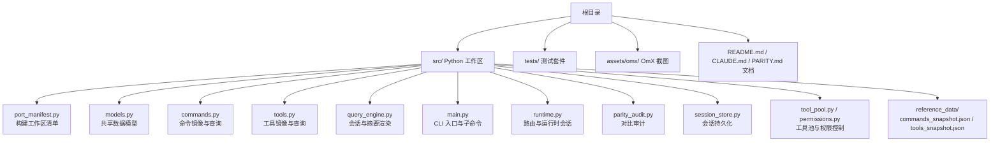
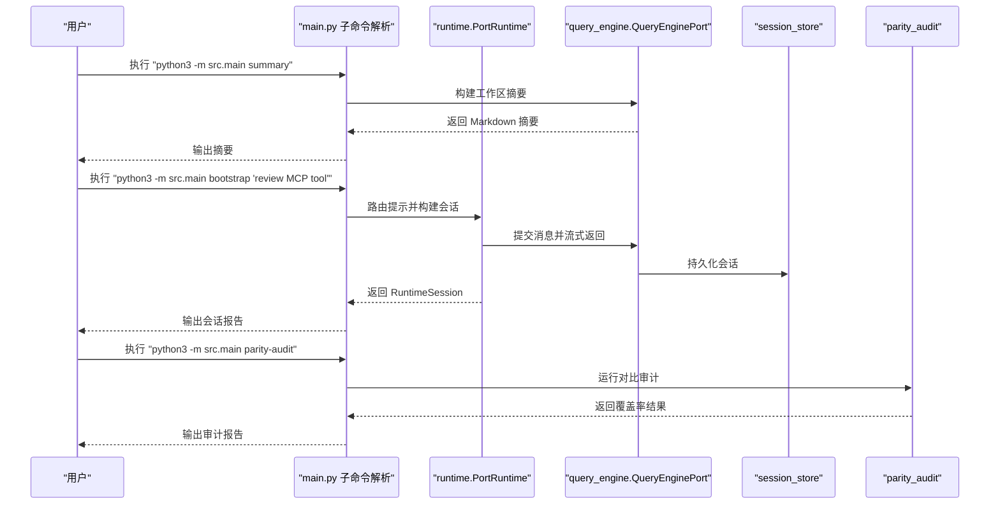
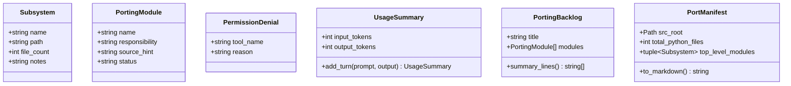
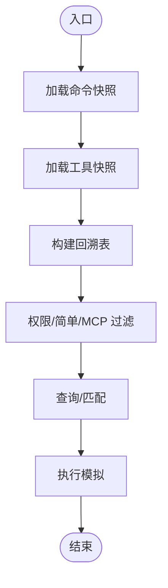
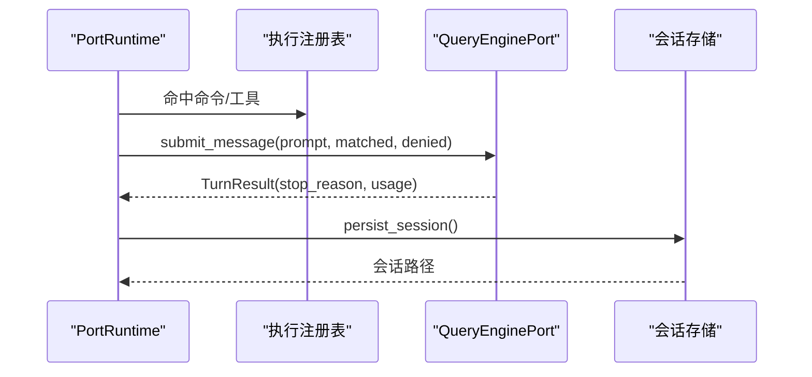
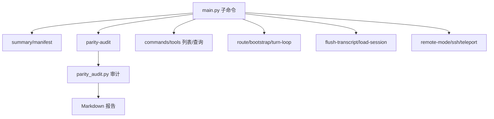
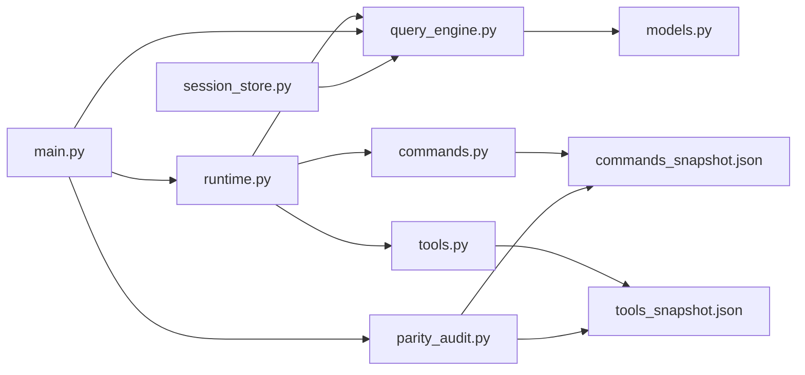

# 技术路线

<cite>
**本文引用的文件**
- [README.md](file://README.md)
- [CLAUDE.md](file://CLAUDE.md)
- [PARITY.md](file://PARITY.md)
- [src/port_manifest.py](file://src/port_manifest.py)
- [src/models.py](file://src/models.py)
- [src/commands.py](file://src/commands.py)
- [src/tools.py](file://src/tools.py)
- [src/query_engine.py](file://src/query_engine.py)
- [src/main.py](file://src/main.py)
- [src/reference_data/commands_snapshot.json](file://src/reference_data/commands_snapshot.json)
- [src/reference_data/tools_snapshot.json](file://src/reference_data/tools_snapshot.json)
- [src/runtime.py](file://src/runtime.py)
- [src/parity_audit.py](file://src/parity_audit.py)
- [src/session_store.py](file://src/session_store.py)
- [src/tool_pool.py](file://src/tool_pool.py)
- [src/permissions.py](file://src/permissions.py)
- [tests/test_porting_workspace.py](file://tests/test_porting_workspace.py)
</cite>

## 目录
1. [引言](#引言)
2. [项目结构](#项目结构)
3. [核心组件](#核心组件)
4. [架构总览](#架构总览)
5. [详细组件分析](#详细组件分析)
6. [依赖分析](#依赖分析)
7. [性能考虑](#性能考虑)
8. [故障排查指南](#故障排查指南)
9. [结论](#结论)
10. [附录](#附录)

## 引言
本技术路线围绕 CLAW 代码重写项目，系统阐述从 TypeScript 到 Python 的完整迁移路径与设计决策。重点包括：
- 为什么采用 Python-first 的重写策略；
- 清洁室（clean room）重写的必要性与实施方法；
- 使用 oh-my-codex（OmX）工作流进行 AI 辅助重构，包括 $team 并行评审与 $ralph 持续执行循环；
- 当前 Python 工作区的结构与功能，涵盖 port_manifest.py、models.py、commands.py、tools.py、query_engine.py 等核心模块；
- 技术路线图与未来发展方向。

## 项目结构
仓库采用“Python 首位”的工作区布局，核心在 src/，测试在 tests/，并通过参考数据快照映射原始 TypeScript 结构。整体布局如下：

图表来源
- [README.md:82-99](file://README.md#L82-L99)
- [src/port_manifest.py:12-53](file://src/port_manifest.py#L12-L53)
- [src/models.py:6-50](file://src/models.py#L6-L50)
- [src/commands.py:13-91](file://src/commands.py#L13-L91)
- [src/tools.py:14-97](file://src/tools.py#L14-L97)
- [src/query_engine.py:15-194](file://src/query_engine.py#L15-L194)
- [src/main.py:21-214](file://src/main.py#L21-L214)
- [src/runtime.py:89-193](file://src/runtime.py#L89-L193)
- [src/parity_audit.py:73-139](file://src/parity_audit.py#L73-L139)
- [src/session_store.py:8-36](file://src/session_store.py#L8-L36)
- [src/tool_pool.py:10-38](file://src/tool_pool.py#L10-L38)
- [src/permissions.py:6-21](file://src/permissions.py#L6-L21)
- [src/reference_data/commands_snapshot.json:1-1037](file://src/reference_data/commands_snapshot.json#L1-L1037)
- [src/reference_data/tools_snapshot.json:1-922](file://src/reference_data/tools_snapshot.json#L1-L922)

章节来源
- [README.md:82-150](file://README.md#L82-L150)

## 核心组件
- port_manifest.py：扫描 src/ 下的 Python 文件，统计顶层模块与文件数量，生成工作区清单。
- models.py：定义 Subsystem、PortingModule、PermissionDenial、UsageSummary、PortingBacklog 等数据结构。
- commands.py：加载命令快照，提供命令查询、匹配与执行模拟。
- tools.py：加载工具快照，提供工具查询、过滤与执行模拟。
- query_engine.py：会话引擎，负责回合提交、令牌预算、结构化输出、转录与持久化。
- main.py：CLI 入口，提供 summary、manifest、parity-audit、commands、tools、route、bootstrap、turn-loop、flush-transcript、load-session、remote-mode 等子命令。
- runtime.py：运行时会话构建器，负责路由提示、装配执行、流事件与历史记录。
- parity_audit.py：与本地忽略的 TypeScript 快照进行对比审计，评估覆盖率与缺失项。
- session_store.py：会话持久化与加载。
- tool_pool.py / permissions.py：工具池装配与权限上下文过滤。

章节来源
- [src/port_manifest.py:12-53](file://src/port_manifest.py#L12-L53)
- [src/models.py:6-50](file://src/models.py#L6-L50)
- [src/commands.py:13-91](file://src/commands.py#L13-L91)
- [src/tools.py:14-97](file://src/tools.py#L14-L97)
- [src/query_engine.py:15-194](file://src/query_engine.py#L15-L194)
- [src/main.py:21-214](file://src/main.py#L21-L214)
- [src/runtime.py:89-193](file://src/runtime.py#L89-L193)
- [src/parity_audit.py:73-139](file://src/parity_audit.py#L73-L139)
- [src/session_store.py:8-36](file://src/session_store.py#L8-L36)
- [src/tool_pool.py:10-38](file://src/tool_pool.py#L10-L38)
- [src/permissions.py:6-21](file://src/permissions.py#L6-L21)

## 架构总览
下图展示了从 CLI 到运行时、再到会话引擎与持久化的端到端流程，体现 Python-first 的工作流与 OmX 协作模式：

图表来源
- [src/main.py:94-214](file://src/main.py#L94-L214)
- [src/runtime.py:109-152](file://src/runtime.py#L109-L152)
- [src/query_engine.py:45-151](file://src/query_engine.py#L45-L151)
- [src/session_store.py:19-36](file://src/session_store.py#L19-L36)
- [src/parity_audit.py:121-139](file://src/parity_audit.py#L121-L139)

## 详细组件分析

### 组件一：工作区清单与模型层
- port_manifest.py：递归扫描 src/，排除缓存目录，按顶级模块聚合计数，生成清单文本；同时读取 models.Subsystem 数据类。
- models.py：定义轻量数据类，支撑清单、回溯表、权限拒绝与用量统计等。

图表来源
- [src/models.py:6-50](file://src/models.py#L6-L50)
- [src/port_manifest.py:12-53](file://src/port_manifest.py#L12-L53)

章节来源
- [src/port_manifest.py:12-53](file://src/port_manifest.py#L12-L53)
- [src/models.py:6-50](file://src/models.py#L6-L50)

### 组件二：命令与工具镜像层
- commands.py：从 commands_snapshot.json 加载命令条目，提供 LRU 缓存、名称匹配、查询过滤与执行模拟。
- tools.py：从 tools_snapshot.json 加载工具条目，支持简单模式、MCP 过滤与权限上下文过滤。

图表来源
- [src/commands.py:22-81](file://src/commands.py#L22-L81)
- [src/tools.py:23-86](file://src/tools.py#L23-L86)
- [src/reference_data/commands_snapshot.json:1-1037](file://src/reference_data/commands_snapshot.json#L1-L1037)
- [src/reference_data/tools_snapshot.json:1-922](file://src/reference_data/tools_snapshot.json#L1-L922)

章节来源
- [src/commands.py:13-91](file://src/commands.py#L13-L91)
- [src/tools.py:14-97](file://src/tools.py#L14-L97)
- [src/reference_data/commands_snapshot.json:1-1037](file://src/reference_data/commands_snapshot.json#L1-L1037)
- [src/reference_data/tools_snapshot.json:1-922](file://src/reference_data/tools_snapshot.json#L1-L922)

### 组件三：会话引擎与运行时
- query_engine.py：封装会话状态、令牌预算、结构化输出与转录压缩；提供回合提交、流式事件与持久化接口。
- runtime.py：实现路由逻辑（基于关键词评分）、会话装配（上下文、设置、历史）、执行注册表调用与流事件生成。

图表来源
- [src/runtime.py:89-193](file://src/runtime.py#L89-L193)
- [src/query_engine.py:45-151](file://src/query_engine.py#L45-L151)
- [src/session_store.py:19-36](file://src/session_store.py#L19-L36)

章节来源
- [src/query_engine.py:15-194](file://src/query_engine.py#L15-L194)
- [src/runtime.py:89-193](file://src/runtime.py#L89-L193)
- [src/session_store.py:8-36](file://src/session_store.py#L8-L36)

### 组件四：CLI 与审计
- main.py：统一 CLI 解析与子命令分发，覆盖摘要、清单、对比审计、命令/工具列表、路由、引导、回合循环、远程模式、会话加载与持久化等。
- parity_audit.py：与本地 TypeScript 快照对比，计算根文件覆盖率、目录覆盖率、命令/工具条目覆盖率，并输出缺失清单。

图表来源
- [src/main.py:21-214](file://src/main.py#L21-L214)
- [src/parity_audit.py:121-139](file://src/parity_audit.py#L121-L139)

章节来源
- [src/main.py:21-214](file://src/main.py#L21-L214)
- [src/parity_audit.py:73-139](file://src/parity_audit.py#L73-L139)

## 依赖分析
- 模块内聚与耦合：各子模块通过 models.py 的数据类解耦，commands.py 与 tools.py 通过快照文件独立演进；query_engine.py 作为会话中枢，依赖清单与权限上下文；runtime.py 作为编排层，连接路由、执行与会话。
- 外部依赖：CLI 通过标准库 argparse 与 subprocess（测试中）驱动；会话持久化使用标准库 json；权限控制通过 frozenset 与元组实现高效查找。
- 参考数据：commands_snapshot.json 与 tools_snapshot.json 作为“镜像清单”，不直接复制原始源码，满足清洁室要求。

图表来源
- [src/commands.py:22-36](file://src/commands.py#L22-L36)
- [src/tools.py:23-37](file://src/tools.py#L23-L37)
- [src/query_engine.py:8-12](file://src/query_engine.py#L8-L12)
- [src/runtime.py:5-13](file://src/runtime.py#L5-L13)
- [src/main.py:5-18](file://src/main.py#L5-L18)
- [src/parity_audit.py:7-11](file://src/parity_audit.py#L7-L11)
- [src/session_store.py:3-5](file://src/session_store.py#L3-L5)

章节来源
- [src/commands.py:22-36](file://src/commands.py#L22-L36)
- [src/tools.py:23-37](file://src/tools.py#L23-L37)
- [src/query_engine.py:8-12](file://src/query_engine.py#L8-L12)
- [src/runtime.py:5-13](file://src/runtime.py#L5-L13)
- [src/main.py:5-18](file://src/main.py#L5-L18)
- [src/parity_audit.py:7-11](file://src/parity_audit.py#L7-L11)
- [src/session_store.py:3-5](file://src/session_store.py#L3-L5)

## 性能考虑
- 查询与匹配：命令/工具查询采用 LRU 缓存与集合/元组结构，降低重复加载与查找成本。
- 令牌预算与转录压缩：QueryEnginePort 在达到阈值后仅保留最近若干轮对话，减少上下文长度与内存占用。
- 权限过滤：ToolPermissionContext 使用 frozenset 与前缀集合，避免频繁字符串比较。
- CLI 批处理：测试中通过 subprocess 批量验证子命令可用性，便于回归与集成。

## 故障排查指南
- CLI 子命令异常：检查 main.py 中子命令解析与参数校验，确认对应功能模块已正确导入。
- 会话持久化失败：检查 session_store 默认目录是否存在可写权限，确认序列化字段与类型一致。
- 权限过滤不生效：核对 ToolPermissionContext 的 deny_names 与 deny_prefixes 是否正确传入工具查询函数。
- 审计报告为空：确认本地 TypeScript 快照目录存在，且 reference_data 下的快照文件完整。

章节来源
- [src/main.py:94-214](file://src/main.py#L94-L214)
- [src/session_store.py:19-36](file://src/session_store.py#L19-L36)
- [src/permissions.py:11-21](file://src/permissions.py#L11-L21)
- [src/parity_audit.py:121-139](file://src/parity_audit.py#L121-L139)

## 结论
本项目以 Python-first 为核心策略，借助 OmX 的 $team/$ralph 工作流，完成从 TypeScript 到 Python 的清洁室重写。通过命令/工具镜像清单、运行时路由与会话引擎、结构化输出与审计机制，形成可验证、可扩展的 Python 工作区。未来方向包括逐步补齐命令/工具面、增强权限与安全控制、完善远程与插件生态，以及持续以 OmX 驱动的迭代开发。

## 附录

### 技术路线图（概要）
- 短期目标
  - 完成命令/工具镜像清单的完整覆盖与一致性校验。
  - 增强权限控制与安全基线，明确破坏性工具的默认拒绝策略。
  - 优化会话引擎的结构化输出与预算控制，提升稳定性。
- 中期目标
  - 引入执行注册表与插件/技能扩展点，逐步逼近原系统能力边界。
  - 完善远程模式与传输层抽象，支持多分支运行时场景。
- 长期目标
  - 以 OmX 持续驱动重构与验证，保持与原始架构模式的一致性。
  - 推进 Rust 版本的并行演进，形成双栈对照与互证。

### 清洁室重写要点
- 不复制专有源码：通过参考快照与注释说明实现，不直接粘贴 TypeScript 源码。
- 以模式与职责为依据：命令/工具清单来自快照，实现上仅复用语义与行为模式。
- 可验证性：提供 parity audit 与测试套件，确保覆盖率与行为一致性。

章节来源
- [README.md:36-81](file://README.md#L36-L81)
- [PARITY.md:1-27](file://PARITY.md#L1-L27)
- [tests/test_porting_workspace.py:15-249](file://tests/test_porting_workspace.py#L15-L249)