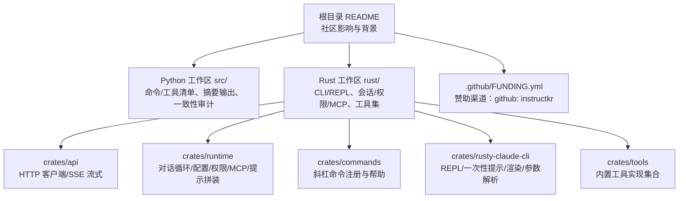
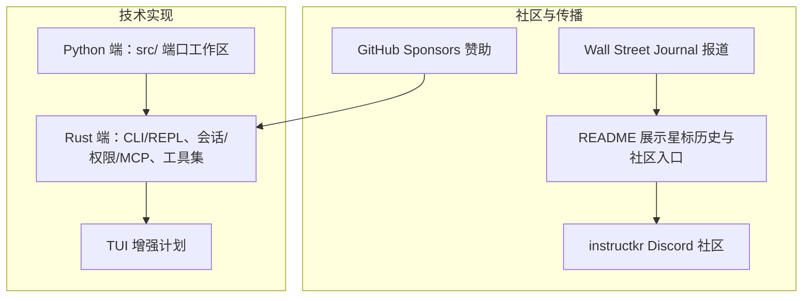
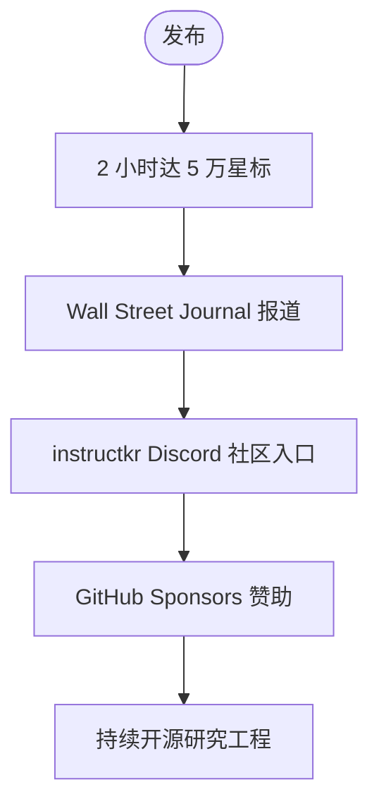
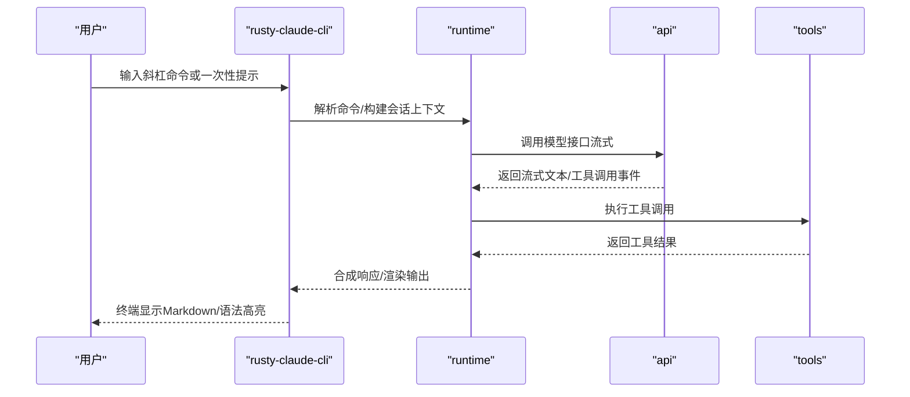
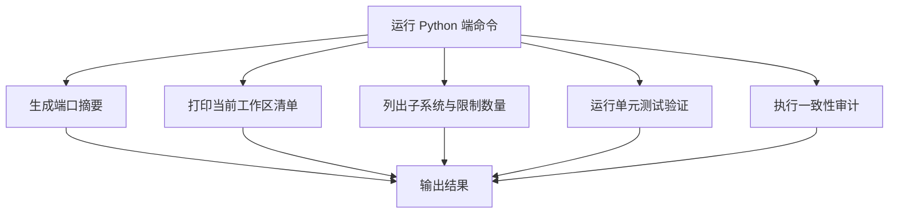
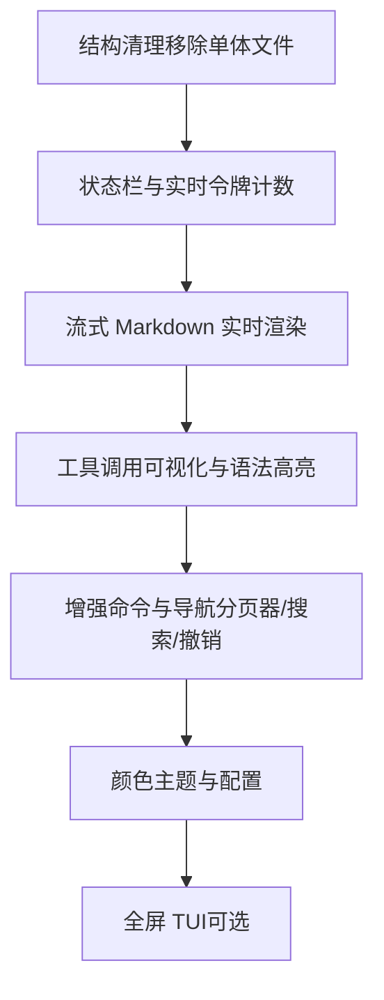
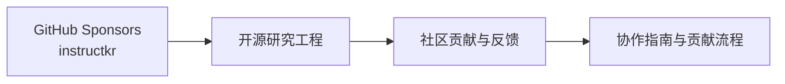
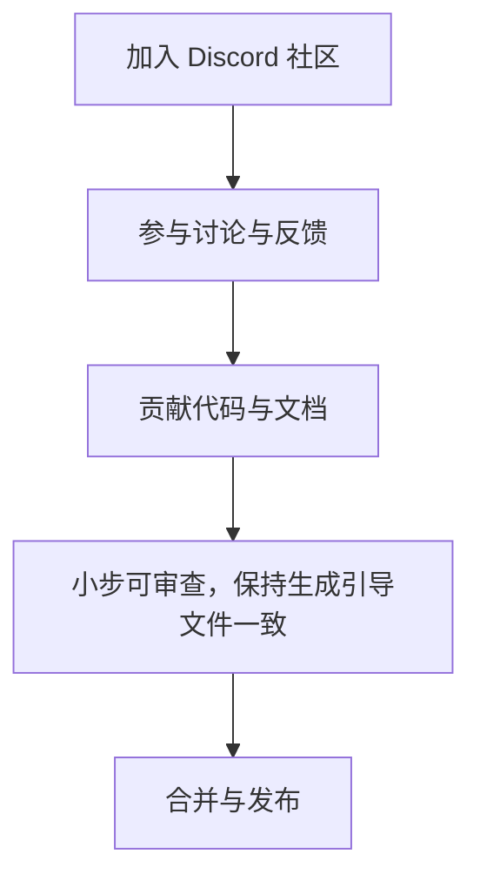
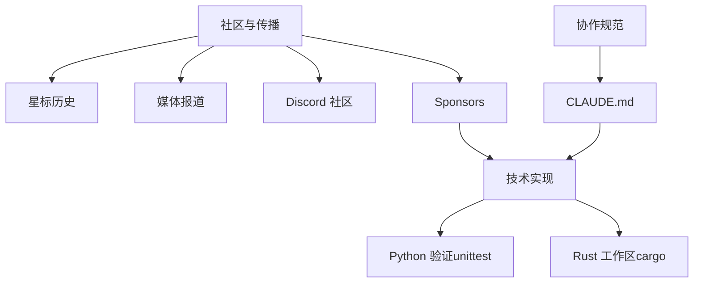

# 社区影响

<cite>
**本文引用的文件**
- [README.md](file://README.md)
- [.github/FUNDING.yml](file://.github/FUNDING.yml)
- [CLAUDE.md](file://CLAUDE.md)
- [PARITY.md](file://PARITY.md)
- [rust/README.md](file://rust/README.md)
- [rust/TUI-ENHANCEMENT-PLAN.md](file://rust/TUI-ENHANCEMENT-PLAN.md)
- [rust/crates/rusty-claude-cli/src/init.rs](file://rust/crates/rusty-claude-cli/src/init.rs)
- [rust/crates/rusty-claude-cli/src/main.rs](file://rust/crates/rusty-claude-cli/src/main.rs)
- [rust/crates/commands/src/lib.rs](file://rust/crates/commands/src/lib.rs)
- [rust/crates/runtime/src/prompt.rs](file://rust/crates/runtime/src/prompt.rs)
- [src/history.py](file://src/history.py)
</cite>

## 目录
1. [引言](#引言)
2. [项目结构](#项目结构)
3. [核心组件](#核心组件)
4. [架构总览](#架构总览)
5. [详细组件分析](#详细组件分析)
6. [依赖分析](#依赖分析)
7. [性能考量](#性能考量)
8. [故障排查指南](#故障排查指南)
9. [结论](#结论)
10. [附录](#附录)

## 引言
本文件聚焦 CLAW 代码重写项目的社区影响力与生态建设，围绕以下主题展开：  
- 在发布后仅 2 小时即达到 5 万星标的历史性里程碑  
- 成为开源社区与主流媒体关注焦点，尤其在 AI 助手工具研究领域的示范效应  
- 与 Wall Street Journal 的合作与报道，提升项目在主流媒体中的曝光度  
- instructkr 社区（Discord）的建设与活跃度  
- 赞助模式与开源贡献机制，支撑持续的开源研究工程  
- 社区参与方式、贡献指南与未来社区发展计划  

## 项目结构
仓库采用“双实现并行”的组织方式：  
- Python 端作为“可运行的端口工作区”，提供命令行入口、清单与一致性审计能力  
- Rust 端作为高性能重写版本，提供 CLI、会话管理、权限控制、MCP 支持等能力，并规划 TUI 增强

图表来源
- [README.md: 82-99:82-99](file://README.md#L82-L99)
- [rust/README.md: 187-200:187-200](file://rust/README.md#L187-L200)

章节来源
- [README.md: 82-99:82-99](file://README.md#L82-L99)
- [rust/README.md: 187-200:187-200](file://rust/README.md#L187-L200)

## 核心组件
- Python 端：提供命令行入口与清单输出，支持一致性审计；作为“端口工作区”验证与记录迁移状态  
- Rust 端：提供完整的 CLI/REPL、会话持久化、权限系统、MCP 生命周期、成本追踪、Markdown 渲染、工具调用等；规划 TUI 增强以提升交互体验  
- 社区与赞助：通过 GitHub Sponsors 与 instructkr Discord 维系社区，推动持续研究工程

章节来源
- [README.md: 112-149:112-149](file://README.md#L112-L149)
- [rust/README.md: 147-167:147-167](file://rust/README.md#L147-L167)

## 架构总览
下图展示了社区影响与技术实现之间的关系：  
- 发布与社区传播（README 展示星标历史与社区入口）  
- 主流媒体曝光（Wall Street Journal 报道）  
- 社区建设（Discord 入口与活跃度）  
- 开源赞助（GitHub Sponsors）  
- 技术实现（Python 端端口工作区、Rust 端高性能 CLI）

图表来源
- [README.md: 4-15:4-15](file://README.md#L4-L15)
- [README.md: 48-62:48-62](file://README.md#L48-L62)
- [README.md: 174-182:174-182](file://README.md#L174-L182)
- [README.md: 32](file://README.md#L32)
- [rust/README.md: 147-167:147-167](file://rust/README.md#L147-L167)
- [rust/TUI-ENHANCEMENT-PLAN.md: 1-7:1-7](file://rust/TUI-ENHANCEMENT-PLAN.md#L1-L7)

## 详细组件分析

### 社区影响力与里程碑
- 发布后仅 2 小时达到 5 万星标，体现社区高度关注与认可  
- README 中嵌入星标历史图表，直观展示增长曲线  
- 通过 Wall Street Journal 的专题报道，扩大在主流媒体中的影响力  
- 提供 instructkr Discord 入口，引导用户加入社区交流

图表来源
- [README.md: 4-15:4-15](file://README.md#L4-L15)
- [README.md: 48-62:48-62](file://README.md#L48-L62)
- [README.md: 174-182:174-182](file://README.md#L174-L182)
- [README.md: 32](file://README.md#L32)

章节来源
- [README.md: 4-15:4-15](file://README.md#L4-L15)
- [README.md: 48-62:48-62](file://README.md#L48-L62)
- [README.md: 174-182:174-182](file://README.md#L174-L182)
- [README.md: 32](file://README.md#L32)

### Rust 端 CLI 与社区协作
- 提供高性能 CLI/REPL，支持权限系统、会话持久化、MCP 生命周期、成本追踪、Markdown 渲染等  
- 通过 CLAUDE.md 指导协作流程，强调小步可审查、保持生成引导文件与实际工作流一致  
- 计划引入 TUI 增强，改善终端交互体验，降低使用门槛

图表来源
- [rust/README.md: 147-167:147-167](file://rust/README.md#L147-L167)
- [rust/README.md: 187-200:187-200](file://rust/README.md#L187-L200)
- [rust/crates/rusty-claude-cli/src/main.rs: 1196-1237:1196-1237](file://rust/crates/rusty-claude-cli/src/main.rs#L1196-L1237)
- [rust/crates/commands/src/lib.rs: 134-178:134-178](file://rust/crates/commands/src/lib.rs#L134-L178)

章节来源
- [rust/README.md: 147-167:147-167](file://rust/README.md#L147-L167)
- [rust/README.md: 187-200:187-200](file://rust/README.md#L187-L200)
- [rust/crates/rusty-claude-cli/src/main.rs: 1196-1237:1196-1237](file://rust/crates/rusty-claude-cli/src/main.rs#L1196-L1237)
- [rust/crates/commands/src/lib.rs: 134-178:134-178](file://rust/crates/commands/src/lib.rs#L134-L178)

### Python 端端口工作区与一致性审计
- 提供命令行入口用于渲染摘要、打印清单、列出模块、执行验证与一致性审计  
- 作为“端口工作区”，记录迁移进度与模块状态，支撑社区理解与参与

图表来源
- [README.md: 112-149:112-149](file://README.md#L112-L149)

章节来源
- [README.md: 112-149:112-149](file://README.md#L112-L149)

### TUI 增强计划与交互体验
- 当前 REPL 为内联滚动输出，存在可读性与可用性挑战  
- TUI 增强计划涵盖：状态栏与实时令牌计数、增强流式渲染、工具调用可视化、彩色 diff、分页器、颜色主题、全屏 TUI 等  
- 优先级建议从结构清理与状态栏开始，逐步推进到全屏 TUI

图表来源
- [rust/TUI-ENHANCEMENT-PLAN.md: 69-173:69-173](file://rust/TUI-ENHANCEMENT-PLAN.md#L69-L173)

章节来源
- [rust/TUI-ENHANCEMENT-PLAN.md: 69-173:69-173](file://rust/TUI-ENHANCEMENT-PLAN.md#L69-L173)

### 赞助模式与开源贡献
- 通过 GitHub Sponsors 对 instructkr 进行赞助，支持持续的开源研究工程  
- Rust 端协作指南强调：小步可审查、保持生成引导文件与实际工作流一致、不自动覆盖现有协作文档  
- Python 端 README 鼓励社区赞助以支持后续研究

图表来源
- [README.md: 32](file://README.md#L32)
- [CLAUDE.md: 18-22:18-22](file://CLAUDE.md#L18-L22)
- [.github/FUNDING.yml: 1](file://.github/FUNDING.yml#L1)

章节来源
- [README.md: 32](file://README.md#L32)
- [CLAUDE.md: 18-22:18-22](file://CLAUDE.md#L18-L22)
- [.github/FUNDING.yml: 1](file://.github/FUNDING.yml#L1)

### 社区参与方式与贡献指南
- 加入 instructkr Discord，参与 LLM、代理工作流、工具工程等话题讨论  
- 参与 Rust 端协作：遵循 CLAUDE.md 的工作约定，保持生成引导文件与实际工作流一致  
- 参与 Python 端贡献：基于 src/ 的端口工作区进行验证与一致性审计，提交 PR 时同步更新测试与指导文档

图表来源
- [README.md: 174-182:174-182](file://README.md#L174-L182)
- [CLAUDE.md: 18-22:18-22](file://CLAUDE.md#L18-L22)

章节来源
- [README.md: 174-182:174-182](file://README.md#L174-L182)
- [CLAUDE.md: 18-22:18-22](file://CLAUDE.md#L18-L22)

### 未来社区发展计划
- 持续完善 Rust 端功能矩阵，补齐插件系统、技能注册表、钩子执行等缺失能力  
- 推进 TUI 增强计划，提升终端交互体验，吸引更多非专业用户参与  
- 通过 GitHub Sponsors 与社区活动，扩大 instructkr 社区规模与活跃度  
- 结合主流媒体与社区口碑，持续扩大在 AI 助手工具研究领域的影响力

章节来源
- [rust/README.md: 110-136:110-136](file://rust/README.md#L110-L136)
- [rust/TUI-ENHANCEMENT-PLAN.md: 152-173:152-173](file://rust/TUI-ENHANCEMENT-PLAN.md#L152-L173)
- [README.md: 32](file://README.md#L32)

## 依赖分析
- 社区依赖：README 中的星标历史、Wall Street Journal 报道、Discord 社区入口、GitHub Sponsors  
- 技术依赖：Python 端依赖 unittest 进行验证；Rust 端依赖 cargo 生态与各 crate 协同  
- 工作流依赖：CLAUDE.md 规范化协作流程，确保生成引导文件与实际工作流一致

图表来源
- [README.md: 4-15:4-15](file://README.md#L4-L15)
- [README.md: 48-62:48-62](file://README.md#L48-L62)
- [README.md: 174-182:174-182](file://README.md#L174-L182)
- [README.md: 32](file://README.md#L32)
- [CLAUDE.md: 9-22:9-22](file://CLAUDE.md#L9-L22)

章节来源
- [README.md: 4-15:4-15](file://README.md#L4-L15)
- [README.md: 48-62:48-62](file://README.md#L48-L62)
- [README.md: 174-182:174-182](file://README.md#L174-L182)
- [README.md: 32](file://README.md#L32)
- [CLAUDE.md: 9-22:9-22](file://CLAUDE.md#L9-L22)

## 性能考量
- Rust 端通过内存安全与零拷贝优化，提供更快的工具执行与会话处理能力  
- Python 端通过清单与审计减少重复工作，提高开发效率  
- TUI 增强计划中强调“流式优先”与“避免性能回退”，确保富渲染不影响核心交互速度

## 故障排查指南
- 初始化与引导：通过初始化流程确保 .gitignore、CLAUDE.md 等关键文件存在  
- 权限与提示：检查权限模式与系统提示，确保工具调用与安全策略符合预期  
- 会话与持久化：确认会话列表、切换与恢复功能正常，必要时进行压缩与导出  
- 日志与历史：使用会话历史记录功能，辅助定位问题与复盘

章节来源
- [rust/crates/rusty-claude-cli/src/init.rs: 95-128:95-128](file://rust/crates/rusty-claude-cli/src/init.rs#L95-L128)
- [rust/crates/runtime/src/prompt.rs: 462-490:462-490](file://rust/crates/runtime/src/prompt.rs#L462-L490)
- [src/history.py: 12-22:12-22](file://src/history.py#L12-L22)

## 结论
CLAW 代码重写项目凭借其快速迭代的技术实现与开放协作的社区模式，在发布后迅速获得社区与媒体的双重关注。通过 GitHub Sponsors 与 instructkr 社区，项目形成了可持续的开源研究工程生态。Rust 端的高性能实现与 Python 端的端口工作区相辅相成，既满足了专业用户的深度需求，也为更广泛的参与者提供了清晰的参与路径。未来，随着 TUI 增强与功能补齐，项目将持续扩大在 AI 助手工具研究领域的影响力。

## 附录
- 社区入口与赞助：  
  - [README.md: 174-182:174-182](file://README.md#L174-L182)  
  - [README.md: 32](file://README.md#L32)  
  - [.github/FUNDING.yml: 1](file://.github/FUNDING.yml#L1)  
- 协作与贡献：  
  - [CLAUDE.md: 18-22:18-22](file://CLAUDE.md#L18-L22)  
  - [rust/README.md: 147-167:147-167](file://rust/README.md#L147-L167)  
- 技术实现与计划：  
  - [rust/README.md: 187-200:187-200](file://rust/README.md#L187-L200)  
  - [rust/TUI-ENHANCEMENT-PLAN.md: 1-7:1-7](file://rust/TUI-ENHANCEMENT-PLAN.md#L1-L7)  
  - [PARITY.md: 7-27:7-27](file://PARITY.md#L7-L27)