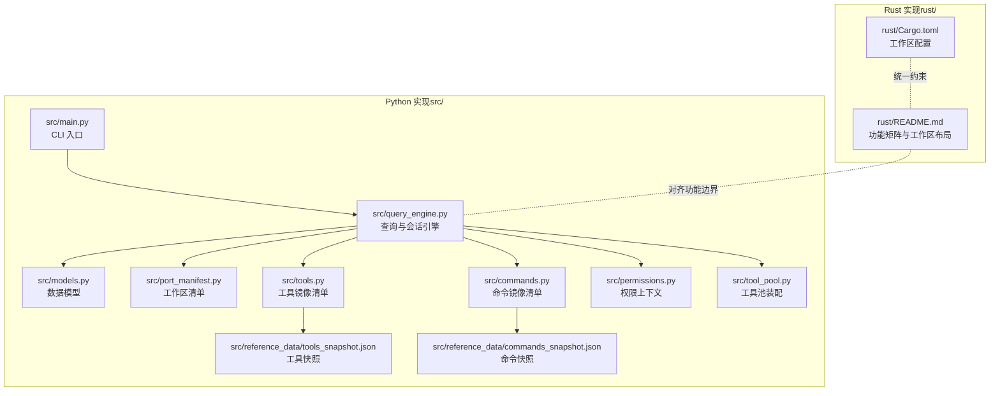
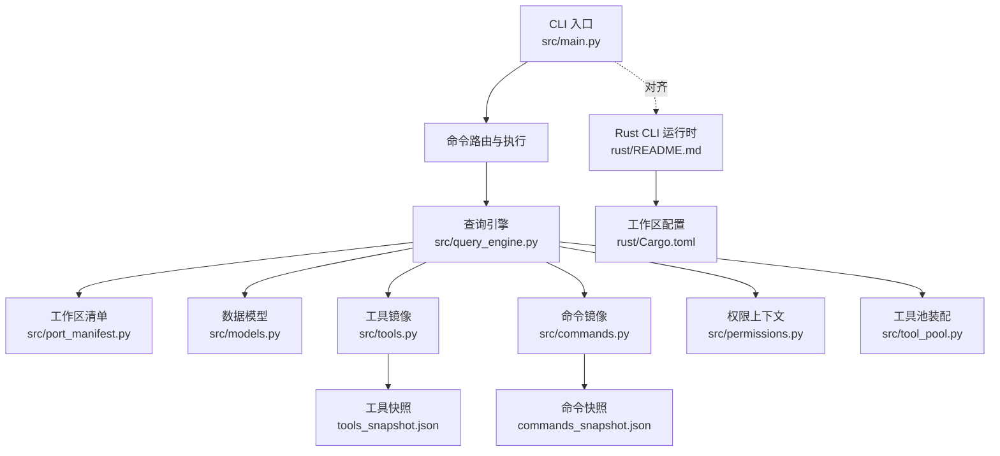
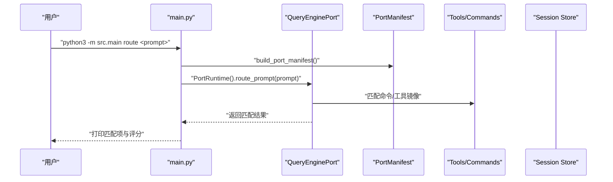
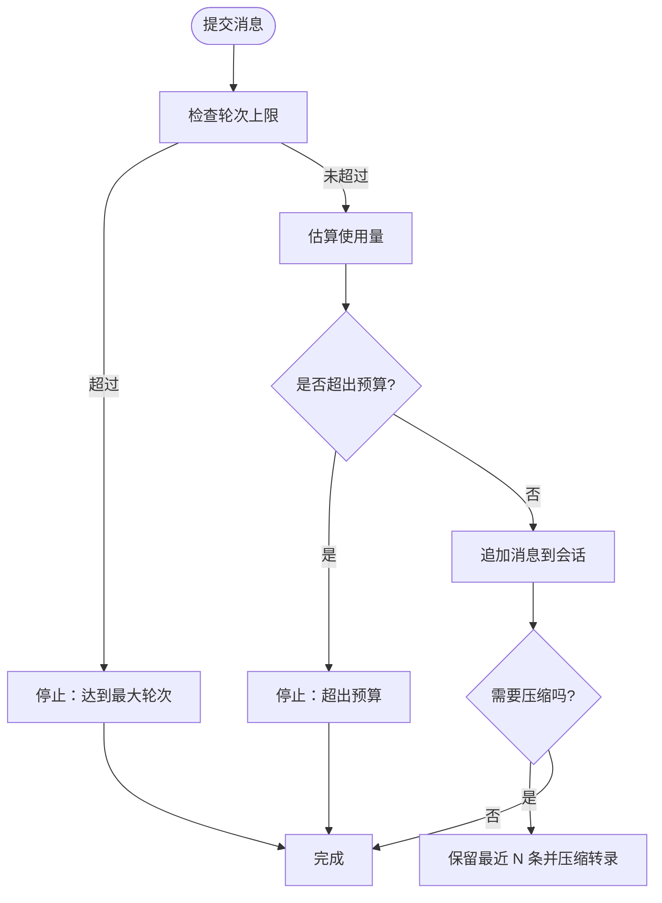
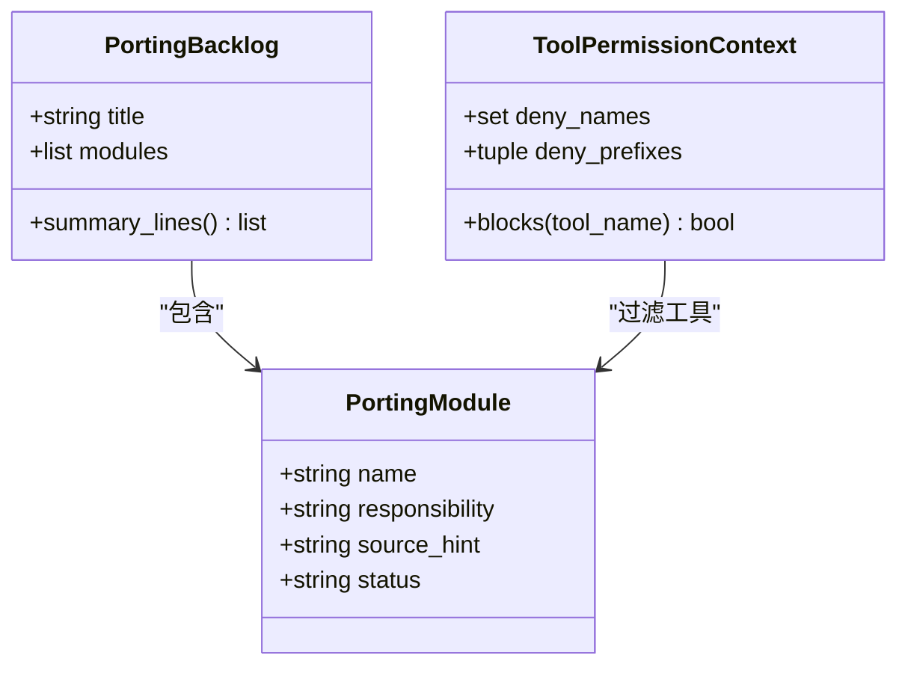
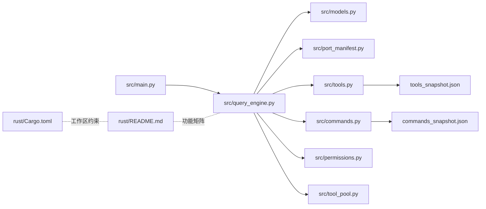

# 项目愿景

<cite>
**本文引用的文件**
- [README.md](file://README.md)
- [CLAUDE.md](file://CLAUDE.md)
- [PARITY.md](file://PARITY.md)
- [rust/README.md](file://rust/README.md)
- [src/main.py](file://src/main.py)
- [src/port_manifest.py](file://src/port_manifest.py)
- [src/models.py](file://src/models.py)
- [src/query_engine.py](file://src/query_engine.py)
- [src/tool_pool.py](file://src/tool_pool.py)
- [src/commands.py](file://src/commands.py)
- [src/tools.py](file://src/tools.py)
- [src/permissions.py](file://src/permissions.py)
- [src/reference_data/tools_snapshot.json](file://src/reference_data/tools_snapshot.json)
- [src/reference_data/commands_snapshot.json](file://src/reference_data/commands_snapshot.json)
- [Cargo.toml](file://rust/Cargo.toml)
</cite>

## 目录
1. [引言](#引言)
2. [项目结构](#项目结构)
3. [核心组件](#核心组件)
4. [架构总览](#架构总览)
5. [详细组件分析](#详细组件分析)
6. [依赖分析](#依赖分析)
7. [性能考量](#性能考量)
8. [故障排查指南](#故障排查指南)
9. [结论](#结论)
10. [附录](#附录)

## 引言
本项目以“不仅仅是存储泄露的 Claude 代码档案，而是更好地掌握工具”为核心使命，致力于在 AI 助手工具领域构建可演进、可验证、可持续的工程化基础设施。我们通过 Python 清洗实现与 Rust 高性能重写两条路径，持续研究代理系统架构模式（如工具编排、权限控制、会话持久化、MCP 协议集成等），探索如何将工具、任务与运行时上下文有机连接，形成稳定且可扩展的“Harness 工程学”。

技术愿景是：以最小可复现的镜像清单（命令与工具快照）为锚点，建立跨语言、跨协议的可移植执行面；社区愿景是：推动开源生态中工具即代码、插件即服务、权限即策略的范式，降低代理系统接入门槛；未来方向是：在 Rust 端实现更完备的功能集（插件、钩子、技能注册表、远程传输层等），同时在 Python 端保持高可读性与可审计性，支撑教学、研究与快速迭代。

## 项目结构
仓库采用双实现并行推进的组织方式：
- Python 端 src/ 提供清洗后的可运行工作区，包含命令与工具的镜像清单、查询引擎、会话与权限模型、CLI 入口等；
- Rust 端 rust/ 提供高性能 CLI 运行时与工具集，覆盖 Anthropic API、OAuth、会话持久化、MCP 生命周期、权限系统等；
- tests/ 与参考数据 reference_data/ 支持一致性校验与快照比对；
- 文档与协作规范 CLAUDE.md、PARITY.md、rust/README.md 等明确工作流与状态边界。

图表来源
- [src/main.py:1-214](file://src/main.py#L1-L214)
- [src/query_engine.py:1-194](file://src/query_engine.py#L1-L194)
- [src/port_manifest.py:1-53](file://src/port_manifest.py#L1-L53)
- [src/tools.py:1-97](file://src/tools.py#L1-L97)
- [src/commands.py:1-91](file://src/commands.py#L1-L91)
- [src/permissions.py:1-21](file://src/permissions.py#L1-L21)
- [src/tool_pool.py:1-38](file://src/tool_pool.py#L1-L38)
- [src/reference_data/tools_snapshot.json:1-200](file://src/reference_data/tools_snapshot.json#L1-L200)
- [src/reference_data/commands_snapshot.json:1-200](file://src/reference_data/commands_snapshot.json#L1-L200)
- [rust/README.md:1-222](file://rust/README.md#L1-L222)
- [Cargo.toml:1-20](file://rust/Cargo.toml#L1-L20)

章节来源
- [README.md:82-192](file://README.md#L82-L192)
- [rust/README.md:187-222](file://rust/README.md#L187-L222)
- [Cargo.toml:1-20](file://rust/Cargo.toml#L1-L20)

## 核心组件
- CLI 入口与命令路由：提供 summary、manifest、parity-audit、command-graph、tool-pool、bootstrap-graph、subsystems、commands、tools、route、turn-loop、flush-transcript、load-session、remote-mode、ssh-mode、teleport-mode、direct-connect-mode、deep-link-mode、show-command、show-tool、exec-command、exec-tool 等子命令，统一入口与可观测性。
- 查询引擎与会话：封装会话状态、令牌预算、结构化输出、转录压缩与持久化，支持增量提交与流式事件模拟。
- 工作区清单与模型：PortManifest 汇总顶层模块与文件数；Subsystem/PortingModule/UsageSummary 等承载元数据与统计。
- 工具与命令镜像：从快照加载命令与工具清单，支持过滤、权限屏蔽、简单模式与 MCP 开关。
- 权限上下文：基于名称与前缀的拒绝策略，贯穿工具选择与执行。
- 工具池装配：按模式与权限装配工具集合，生成可读摘要。

章节来源
- [src/main.py:21-214](file://src/main.py#L21-L214)
- [src/query_engine.py:15-194](file://src/query_engine.py#L15-L194)
- [src/port_manifest.py:12-53](file://src/port_manifest.py#L12-L53)
- [src/models.py:6-50](file://src/models.py#L6-L50)
- [src/tools.py:23-97](file://src/tools.py#L23-L97)
- [src/commands.py:22-91](file://src/commands.py#L22-L91)
- [src/permissions.py:6-21](file://src/permissions.py#L6-L21)
- [src/tool_pool.py:10-38](file://src/tool_pool.py#L10-L38)

## 架构总览
整体架构由“Python 清洗实现 + Rust 高性能实现”双轨并行构成，二者通过参考快照与功能矩阵对齐。Python 端强调可读性与可审计性，Rust 端强调性能与工程化落地。两者共同服务于代理系统中的“工具连接、任务编排、运行时上下文管理”三大主题。

图表来源
- [src/main.py:94-214](file://src/main.py#L94-L214)
- [src/query_engine.py:36-194](file://src/query_engine.py#L36-L194)
- [src/port_manifest.py:30-53](file://src/port_manifest.py#L30-L53)
- [src/models.py:6-50](file://src/models.py#L6-L50)
- [src/tools.py:23-97](file://src/tools.py#L23-L97)
- [src/commands.py:22-91](file://src/commands.py#L22-L91)
- [src/permissions.py:6-21](file://src/permissions.py#L6-L21)
- [src/tool_pool.py:28-38](file://src/tool_pool.py#L28-L38)
- [src/reference_data/tools_snapshot.json:1-200](file://src/reference_data/tools_snapshot.json#L1-L200)
- [src/reference_data/commands_snapshot.json:1-200](file://src/reference_data/commands_snapshot.json#L1-L200)
- [rust/README.md:147-222](file://rust/README.md#L147-L222)
- [Cargo.toml:1-20](file://rust/Cargo.toml#L1-L20)

## 详细组件分析

### CLI 与命令路由
- 职责：解析子命令、驱动查询引擎、渲染清单与摘要、执行命令/工具镜像调用。
- 关键流程：参数解析 → 构建清单/查询引擎 → 执行路由/回放/持久化 → 输出结果或错误码。
- 可观测性：支持命令图谱、工具池、引导会话、轮询对话、远端分支模拟等。

图表来源
- [src/main.py:142-149](file://src/main.py#L142-L149)
- [src/query_engine.py:171-194](file://src/query_engine.py#L171-L194)
- [src/port_manifest.py:30-53](file://src/port_manifest.py#L30-L53)
- [src/tools.py:75-86](file://src/tools.py#L75-L86)
- [src/commands.py:75-80](file://src/commands.py#L75-L80)

章节来源
- [src/main.py:21-214](file://src/main.py#L21-L214)

### 查询引擎与会话
- 职责：维护会话消息、累计使用量、结构化输出、转录压缩与持久化。
- 关键点：最大轮次、预算令牌、紧凑阈值、结构化重试、增量提交与流式事件。
- 价值：为代理循环提供稳定的上下文与成本控制能力。

图表来源
- [src/query_engine.py:61-104](file://src/query_engine.py#L61-L104)
- [src/query_engine.py:129-132](file://src/query_engine.py#L129-L132)

章节来源
- [src/query_engine.py:15-194](file://src/query_engine.py#L15-L194)

### 工具与命令镜像
- 职责：从快照加载命令/工具清单，支持过滤（排除插件/技能、MCP、前缀）、权限屏蔽、简单模式。
- 价值：以“镜像清单”为锚点，确保 Python/Rust 两端行为一致，便于对比与回归。

图表来源
- [src/models.py:14-50](file://src/models.py#L14-L50)
- [src/tools.py:56-72](file://src/tools.py#L56-L72)
- [src/permissions.py:6-21](file://src/permissions.py#L6-L21)

章节来源
- [src/tools.py:23-97](file://src/tools.py#L23-L97)
- [src/commands.py:22-91](file://src/commands.py#L22-L91)
- [src/reference_data/tools_snapshot.json:1-200](file://src/reference_data/tools_snapshot.json#L1-L200)
- [src/reference_data/commands_snapshot.json:1-200](file://src/reference_data/commands_snapshot.json#L1-L200)

### 工具池装配
- 职责：根据简单模式、MCP 开关与权限上下文装配工具集合，生成可读摘要。
- 价值：在不同安全与场景需求下快速生成可用工具集。

章节来源
- [src/tool_pool.py:10-38](file://src/tool_pool.py#L10-L38)

### 数据模型与清单
- 职责：PortManifest 汇总顶层模块与文件数；Subsystem 描述模块元信息；UsageSummary 提供令牌统计。
- 价值：为 CLI 摘要与审计提供统一的数据结构。

章节来源
- [src/port_manifest.py:12-53](file://src/port_manifest.py#L12-L53)
- [src/models.py:6-50](file://src/models.py#L6-L50)

## 依赖分析
- Python 端内部依赖：CLI 解析器依赖查询引擎、清单、工具/命令模块、权限上下文与工具池装配；查询引擎依赖会话存储与转录存储。
- Rust 端依赖：工作区统一配置（Cargo.toml）约束各 crate 的职责边界（api、commands、runtime、rusty-claude-cli、tools、compat-harness）。
- 参考数据：tools_snapshot.json 与 commands_snapshot.json 作为 Python 端命令/工具镜像的权威来源。

图表来源
- [src/main.py:1-214](file://src/main.py#L1-L214)
- [src/query_engine.py:1-194](file://src/query_engine.py#L1-L194)
- [src/port_manifest.py:1-53](file://src/port_manifest.py#L1-L53)
- [src/tools.py:1-97](file://src/tools.py#L1-L97)
- [src/commands.py:1-91](file://src/commands.py#L1-L91)
- [src/permissions.py:1-21](file://src/permissions.py#L1-L21)
- [src/tool_pool.py:1-38](file://src/tool_pool.py#L1-L38)
- [src/reference_data/tools_snapshot.json:1-200](file://src/reference_data/tools_snapshot.json#L1-L200)
- [src/reference_data/commands_snapshot.json:1-200](file://src/reference_data/commands_snapshot.json#L1-L200)
- [rust/README.md:187-222](file://rust/README.md#L187-L222)
- [Cargo.toml:1-20](file://rust/Cargo.toml#L1-L20)

章节来源
- [Cargo.toml:1-20](file://rust/Cargo.toml#L1-L20)

## 性能考量
- Rust 端通过内存安全与零拷贝优化、MCP 生命周期管理、会话压缩与成本追踪，显著提升吞吐与稳定性。
- Python 端通过查询引擎的紧凑阈值与结构化输出重试机制，在可读性与可审计性之间取得平衡。
- 建议：在生产环境优先采用 Rust CLI；在研究与教学场景使用 Python 实现以获得更高透明度。

## 故障排查指南
- 认证与环境
  - Rust 端需设置 Anthropic 凭据或使用 OAuth 登录；若出现认证失败，请确认分支差异与凭据变量。
- 功能对齐
  - 使用 parity-audit 子命令对比 Python 与 Rust 的功能矩阵，定位缺失或不一致项。
- 权限与工具
  - 使用工具池装配与权限上下文，结合 deny-tool 与 deny-prefix 参数进行精细控制。
- 会话与转录
  - 使用 flush-transcript 与 load-session 验证转录持久化与会话恢复。

章节来源
- [src/main.py:104-106](file://src/main.py#L104-L106)
- [src/main.py:160-170](file://src/main.py#L160-L170)
- [src/permissions.py:11-21](file://src/permissions.py#L11-L21)
- [rust/README.md:102-109](file://rust/README.md#L102-L109)

## 结论
本项目以“Harness 工程学”为指引，通过 Python 清洗实现与 Rust 高性能重写双轨并行，持续探索代理系统在工具连接、任务编排与运行时上下文管理方面的最佳实践。我们承诺：以最小可复现的镜像清单为锚点，推动开源社区在工具即代码、插件即服务、权限即策略的范式演进，最终实现“更好的工具掌控力”，而非仅停留在档案存储层面。

## 附录
- 技术路线图
  - Rust 端：补齐插件、钩子、技能注册表、远程传输层；完善多提供商路由与兼容适配。
  - Python 端：保持高可读性与可审计性，强化测试与快照比对，支撑教学与研究。
- 社区协作
  - 依托 CLAUDE.md 规范与 PARITY.md 对齐，确保变更同步与质量门禁。
- 开源价值
  - 提供可移植的工具执行面、可验证的命令/工具镜像清单与可审计的会话与权限模型，降低代理系统接入门槛，促进生态繁荣。

章节来源
- [CLAUDE.md:18-22](file://CLAUDE.md#L18-L22)
- [PARITY.md:7-27](file://PARITY.md#L7-L27)
- [rust/README.md:110-136](file://rust/README.md#L110-L136)
- [README.md:29-33](file://README.md#L29-L33)