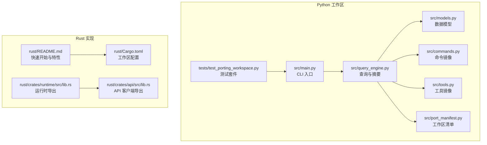
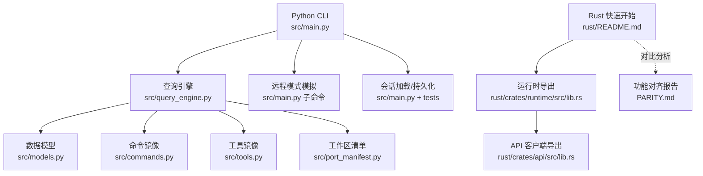
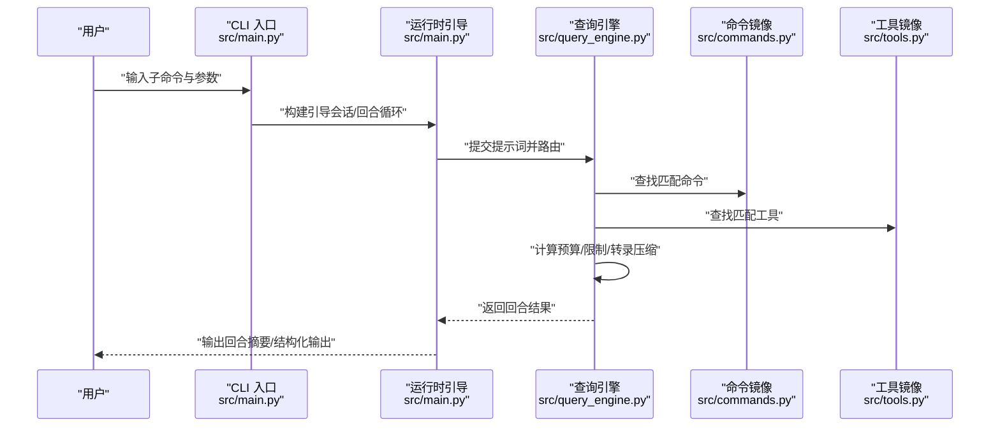
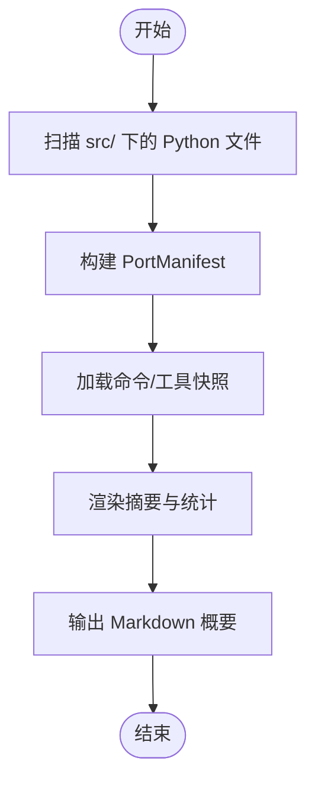
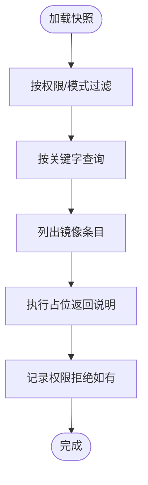
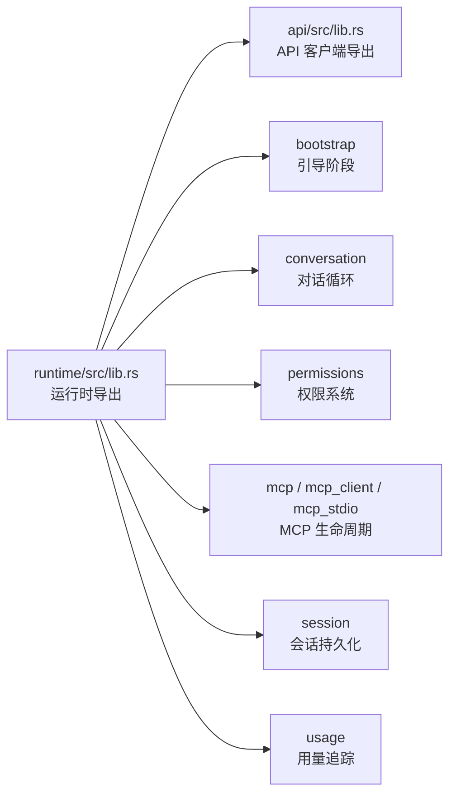
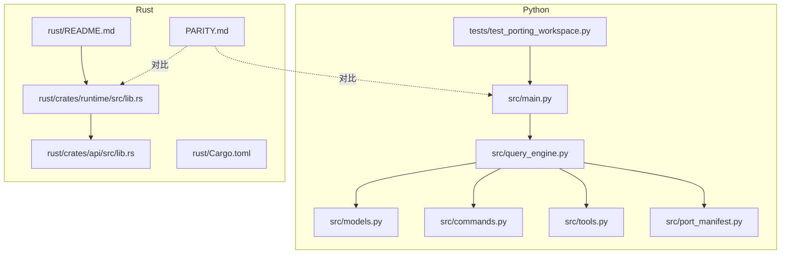

# 项目概述

<cite>
**本文引用的文件**
- [README.md](file://README.md)
- [CLAUDE.md](file://CLAUDE.md)
- [PARITY.md](file://PARITY.md)
- [src/main.py](file://src/main.py)
- [src/port_manifest.py](file://src/port_manifest.py)
- [src/query_engine.py](file://src/query_engine.py)
- [src/models.py](file://src/models.py)
- [src/commands.py](file://src/commands.py)
- [src/tools.py](file://src/tools.py)
- [tests/test_porting_workspace.py](file://tests/test_porting_workspace.py)
- [rust/README.md](file://rust/README.md)
- [rust/Cargo.toml](file://rust/Cargo.toml)
- [rust/crates/runtime/src/lib.rs](file://rust/crates/runtime/src/lib.rs)
- [rust/crates/api/src/lib.rs](file://rust/crates/api/src/lib.rs)
</cite>

## 目录
1. [引言](#引言)
2. [项目结构](#项目结构)
3. [核心组件](#核心组件)
4. [架构总览](#架构总览)
5. [详细组件分析](#详细组件分析)
6. [依赖关系分析](#依赖关系分析)
7. [性能考量](#性能考量)
8. [故障排查指南](#故障排查指南)
9. [结论](#结论)
10. [附录](#附录)

## 引言
本项目是针对“Claude Code”（claude.ai/code）代理工作台的一次大规模代码重写工程，目标是以更安全、可维护且高性能的方式重建其核心能力。项目采用“从零到一”的清洁重写策略：不复制原始受版权保护的 TypeScript 源码，而是基于对公开快照的理解，用 Python 与 Rust 双线实现，形成“镜像功能面 + 清晰演进路径”的可验证架构。

- 背景与动机：在 2026 年 3 月 31 日凌晨，Claude Code 源码被泄露，社区陷入热潮。项目发起者在压力之下，利用 AI 协作工作流（oh-my-codex，简称 OmX）快速完成一次端到端的 Python 重写，形成“清洁重写版本”，并在随后推进 Rust 端高性能实现。
- 技术愿景：通过模块化、可验证、可扩展的架构，构建一个“工具即插拔、权限可治理、会话可持久化、成本可追踪”的代理运行时，服务于 AI 助手工具链与自动化工作流领域。
- 价值主张：在法律与伦理边界内，提供可复用、可审计、可社区协作的代理运行时基础设施；既满足初学者上手，也为资深工程师提供深入定制空间。

章节来源
- [README.md:36-62](file://README.md#L36-L62)
- [README.md:76-81](file://README.md#L76-L81)
- [README.md:156-163](file://README.md#L156-L163)

## 项目结构
仓库采用“双实现 + 参考快照”的组织方式：
- Python 领域：src/ 作为当前活跃的移植工作区，提供命令与工具的镜像清单、查询引擎、会话与权限等核心能力的最小可用实现。
- Rust 领域：rust/ 作为高性能重实现，覆盖 API 客户端、运行时、命令系统、工具集、MCP 支持、权限与会话持久化等，目标是成为最终稳定版。
- 测试与验证：tests/ 提供对 Python 工作区的端到端验证，确保 CLI 行为、路由、会话加载、权限过滤等功能符合预期。
- 文档与协作：README.md、CLAUDE.md、PARITY.md 提供背景、协作约定与与 Rust 实现的对比分析。

图表来源
- [src/main.py:21-91](file://src/main.py#L21-L91)
- [src/query_engine.py:35-60](file://src/query_engine.py#L35-L60)
- [src/port_manifest.py:30-52](file://src/port_manifest.py#L30-L52)
- [tests/test_porting_workspace.py:15-249](file://tests/test_porting_workspace.py#L15-L249)
- [rust/README.md:1-222](file://rust/README.md#L1-L222)
- [rust/Cargo.toml:1-20](file://rust/Cargo.toml#L1-L20)
- [rust/crates/runtime/src/lib.rs:1-94](file://rust/crates/runtime/src/lib.rs#L1-L94)
- [rust/crates/api/src/lib.rs:1-18](file://rust/crates/api/src/lib.rs#L1-L18)

章节来源
- [README.md:82-99](file://README.md#L82-L99)
- [rust/README.md:187-201](file://rust/README.md#L187-L201)

## 核心组件
- CLI 入口与子命令体系：src/main.py 提供 summary、manifest、parity-audit、commands、tools、route、bootstrap、turn-loop、flush-transcript、load-session、remote-mode/ssh-mode/teleport-mode/direct-connect-mode/deep-link-mode、show-command/show-tool、exec-command/exec-tool 等子命令，覆盖工作区概览、镜像命令/工具清单、运行时会话引导与状态回放、远程分支模拟等。
- 查询引擎与摘要：src/query_engine.py 提供 QueryEnginePort，负责回合管理、令牌预算、结构化输出、会话转录与持久化，以及对命令/工具匹配结果的汇总渲染。
- 数据模型与清单：src/models.py 定义 Subsystem、PortingModule、PermissionDenial、UsageSummary、PortingBacklog 等，支撑跨模块的数据一致性；src/port_manifest.py 生成顶层模块清单与统计。
- 命令与工具镜像：src/commands.py 与 src/tools.py 从 reference_data 快照加载镜像条目，支持按名称检索、权限过滤、简单模式筛选、执行占位等。
- 测试与验证：tests/test_porting_workspace.py 对 CLI 行为、路由、会话加载、权限过滤、远程模式、执行注册表等进行端到端验证。

章节来源
- [src/main.py:21-91](file://src/main.py#L21-L91)
- [src/main.py:94-214](file://src/main.py#L94-L214)
- [src/query_engine.py:15-60](file://src/query_engine.py#L15-L60)
- [src/query_engine.py:171-194](file://src/query_engine.py#L171-L194)
- [src/models.py:6-50](file://src/models.py#L6-L50)
- [src/port_manifest.py:12-52](file://src/port_manifest.py#L12-L52)
- [src/commands.py:13-91](file://src/commands.py#L13-L91)
- [src/tools.py:14-97](file://src/tools.py#L14-L97)
- [tests/test_porting_workspace.py:15-249](file://tests/test_porting_workspace.py#L15-L249)

## 架构总览
整体架构由“Python 移植工作区 + Rust 高性能实现 + 参考快照 + 测试验证”构成。Python 侧聚焦于“镜像命令/工具 + 运行时引导 + 会话与权限”，Rust 侧聚焦于“真实运行时、MCP、权限、会话持久化、成本追踪”。两者通过 PARITY.md 进行对照，确保功能面与行为差异透明可控。

图表来源
- [src/main.py:21-91](file://src/main.py#L21-L91)
- [src/query_engine.py:35-60](file://src/query_engine.py#L35-L60)
- [src/models.py:6-50](file://src/models.py#L6-L50)
- [src/commands.py:13-91](file://src/commands.py#L13-L91)
- [src/tools.py:14-97](file://src/tools.py#L14-L97)
- [rust/README.md:1-222](file://rust/README.md#L1-L222)
- [rust/crates/runtime/src/lib.rs:1-94](file://rust/crates/runtime/src/lib.rs#L1-L94)
- [rust/crates/api/src/lib.rs:1-18](file://rust/crates/api/src/lib.rs#L1-L18)
- [PARITY.md:1-215](file://PARITY.md#L1-L215)

## 详细组件分析

### 组件 A：CLI 与运行时引导流程
该流程展示从用户输入 prompt 到生成回合结果的端到端过程，包括命令/工具匹配、权限拒绝记录、令牌预算控制与会话转录。

图表来源
- [src/main.py:142-160](file://src/main.py#L142-L160)
- [src/query_engine.py:61-104](file://src/query_engine.py#L61-L104)
- [src/commands.py:60-73](file://src/commands.py#L60-L73)
- [src/tools.py:62-73](file://src/tools.py#L62-L73)

章节来源
- [src/main.py:142-160](file://src/main.py#L142-L160)
- [src/query_engine.py:61-104](file://src/query_engine.py#L61-L104)
- [src/commands.py:60-73](file://src/commands.py#L60-L73)
- [src/tools.py:62-73](file://src/tools.py#L62-L73)

### 组件 B：Python 工作区清单与摘要渲染
该流程展示如何从工作区扫描模块、生成清单、渲染摘要，以及与命令/工具镜像的联动。

图表来源
- [src/port_manifest.py:30-52](file://src/port_manifest.py#L30-L52)
- [src/query_engine.py:171-194](file://src/query_engine.py#L171-L194)
- [src/commands.py:23-34](file://src/commands.py#L23-L34)
- [src/tools.py:24-35](file://src/tools.py#L24-L35)

章节来源
- [src/port_manifest.py:30-52](file://src/port_manifest.py#L30-L52)
- [src/query_engine.py:171-194](file://src/query_engine.py#L171-L194)
- [src/commands.py:23-34](file://src/commands.py#L23-L34)
- [src/tools.py:24-35](file://src/tools.py#L24-L35)

### 组件 C：命令与工具镜像索引与执行
该流程展示镜像条目的加载、过滤、查询与执行占位逻辑，体现“镜像而非复制”的设计原则。

图表来源
- [src/commands.py:23-34](file://src/commands.py#L23-L34)
- [src/commands.py:60-73](file://src/commands.py#L60-L73)
- [src/tools.py:24-35](file://src/tools.py#L24-L35)
- [src/tools.py:62-73](file://src/tools.py#L62-L73)

章节来源
- [src/commands.py:23-34](file://src/commands.py#L23-L34)
- [src/commands.py:60-73](file://src/commands.py#L60-L73)
- [src/tools.py:24-35](file://src/tools.py#L24-L35)
- [src/tools.py:62-73](file://src/tools.py#L62-L73)

### 组件 D：Rust 运行时与 API 导出
Rust 侧提供高性能运行时与 API 客户端导出，涵盖会话、配置、权限、MCP、OAuth、使用量追踪等模块化接口，便于 CLI 与工具链集成。

图表来源
- [rust/crates/runtime/src/lib.rs:1-94](file://rust/crates/runtime/src/lib.rs#L1-L94)
- [rust/crates/api/src/lib.rs:1-18](file://rust/crates/api/src/lib.rs#L1-L18)

章节来源
- [rust/crates/runtime/src/lib.rs:1-94](file://rust/crates/runtime/src/lib.rs#L1-L94)
- [rust/crates/api/src/lib.rs:1-18](file://rust/crates/api/src/lib.rs#L1-L18)

## 依赖关系分析
- Python 工作区内部依赖：CLI 入口依赖查询引擎与运行时引导；查询引擎依赖数据模型、命令/工具镜像与会话存储；命令/工具镜像依赖参考快照与权限上下文；测试依赖 CLI 与运行时能力。
- Rust 工作区内部依赖：runtime crate 向外导出会话、配置、权限、MCP、OAuth、使用量等模块；api crate 提供消息请求/响应类型与 SSE 解析器；Cargo.toml 统一工作区与 lint 规则。
- 对比与对齐：PARITY.md 明确列出 Rust 与 TypeScript 在工具、钩子、插件、技能、CLI、助手编排与服务层等方面的差距，指导后续补齐方向。

图表来源
- [src/main.py:21-91](file://src/main.py#L21-L91)
- [src/query_engine.py:35-60](file://src/query_engine.py#L35-L60)
- [src/models.py:6-50](file://src/models.py#L6-L50)
- [src/commands.py:13-91](file://src/commands.py#L13-L91)
- [src/tools.py:14-97](file://src/tools.py#L14-L97)
- [src/port_manifest.py:30-52](file://src/port_manifest.py#L30-L52)
- [tests/test_porting_workspace.py:15-249](file://tests/test_porting_workspace.py#L15-L249)
- [rust/crates/runtime/src/lib.rs:1-94](file://rust/crates/runtime/src/lib.rs#L1-L94)
- [rust/crates/api/src/lib.rs:1-18](file://rust/crates/api/src/lib.rs#L1-L18)
- [rust/Cargo.toml:1-20](file://rust/Cargo.toml#L1-L20)
- [rust/README.md:1-222](file://rust/README.md#L1-L222)
- [PARITY.md:1-215](file://PARITY.md#L1-L215)

章节来源
- [rust/Cargo.toml:1-20](file://rust/Cargo.toml#L1-L20)
- [PARITY.md:1-215](file://PARITY.md#L1-L215)

## 性能考量
- Python 工作区：当前以“可验证性优先”，通过轻量的数据结构与缓存机制（LRU）降低启动与查询开销；会话压缩阈值与令牌预算控制用于避免长对话膨胀。
- Rust 实现：面向高性能与内存安全，提供原生工具执行、MCP 生命周期管理、OAuth 登录、成本追踪与会话持久化；通过模块化 crate 与严格的 lint 规则保障质量。
- 对比视角：PARITY.md 指出 Rust 在工具覆盖、钩子执行、插件系统、技能注册表等方面仍处于 MVP 或规划阶段，后续将逐步补齐。

章节来源
- [src/query_engine.py:129-132](file://src/query_engine.py#L129-L132)
- [src/query_engine.py:171-194](file://src/query_engine.py#L171-L194)
- [rust/README.md:110-136](file://rust/README.md#L110-L136)
- [PARITY.md:17-26](file://PARITY.md#L17-L26)

## 故障排查指南
- CLI 行为验证：通过 tests/test_porting_workspace.py 的断言覆盖命令/工具列表、路由、引导会话、权限过滤、远程模式、执行注册表等关键路径，建议先运行单元测试确认环境与依赖正常。
- 权限与工具过滤：当工具被拒绝或前缀被屏蔽时，检查 deny-tool 与 deny-prefix 参数是否正确传递至工具索引与执行。
- 会话加载与持久化：使用 load-session 子命令加载已保存会话，核对会话 ID、消息数量与令牌用量；必要时使用 flush-transcript 与 persist_session 进行转录清理与保存。
- Rust 环境：若在 Rust 分支遇到认证或提供商问题，参考 rust/README.md 的认证矩阵与错误提示，确保设置正确的环境变量或使用登录流程。

章节来源
- [tests/test_porting_workspace.py:15-249](file://tests/test_porting_workspace.py#L15-L249)
- [src/main.py:167-170](file://src/main.py#L167-L170)
- [src/main.py:160-166](file://src/main.py#L160-L166)
- [rust/README.md:102-109](file://rust/README.md#L102-L109)

## 结论
本项目以“清洁重写 + 双实现 + 对齐对照”的方式，在尊重法律与伦理的前提下，构建了可验证、可扩展、可社区协作的代理运行时框架。Python 工作区提供快速验证与镜像能力，Rust 实现提供高性能与生产就绪能力。通过 PARITY.md 的持续对齐与测试验证，项目正稳步向完整功能面迈进，为 AI 助手工具领域的基础设施建设提供坚实基础。

## 附录
- 快速开始（Python）
  - 渲染摘要：python3 -m src.main summary
  - 打印清单：python3 -m src.main manifest
  - 列出命令/工具：python3 -m src.main commands/tools --limit N
  - 引导会话：python3 -m src.main bootstrap "prompt"
  - 回合循环：python3 -m src.main turn-loop "prompt" --max-turns N
  - 加载会话：python3 -m src.main load-session <id>
  - 远程/SSH/传送/直连/深链模式：python3 -m src.main remote-mode/ssh-mode/teleport-mode/direct-connect-mode/deep-link-mode "target"
- 快速开始（Rust）
  - 构建与运行：cd rust/ && cargo build --release && ./target/release/claw
  - 设置凭据：导出 ANTHROPIC_API_KEY 或使用 claw login
  - 查看特性：参考 rust/README.md 的特性矩阵与 CLI 说明

章节来源
- [README.md:112-150](file://README.md#L112-L150)
- [rust/README.md:5-20](file://rust/README.md#L5-L20)
- [rust/README.md:147-186](file://rust/README.md#L147-L186)