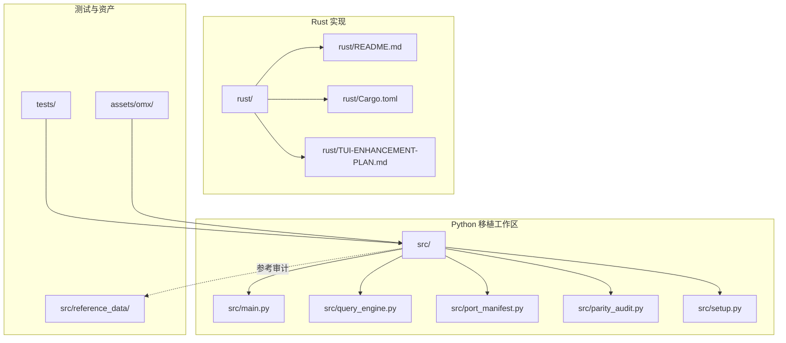
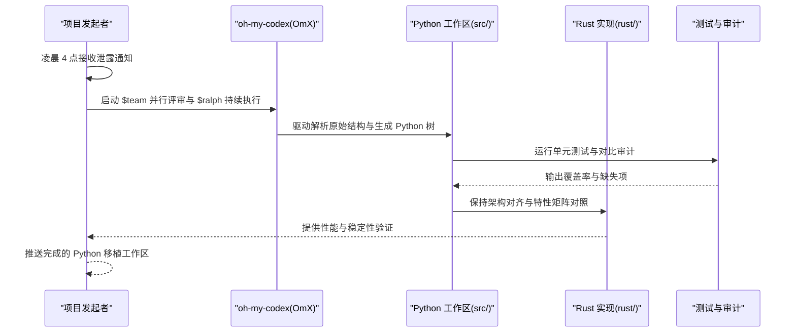
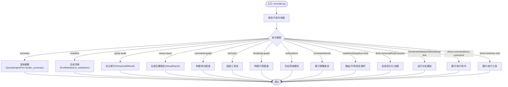
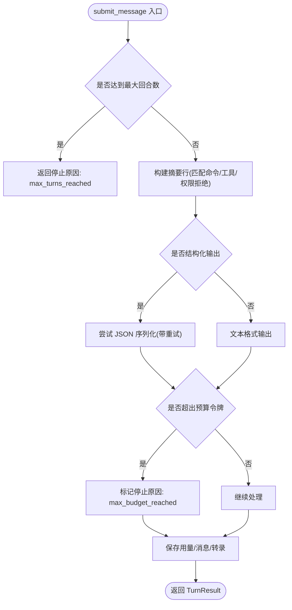
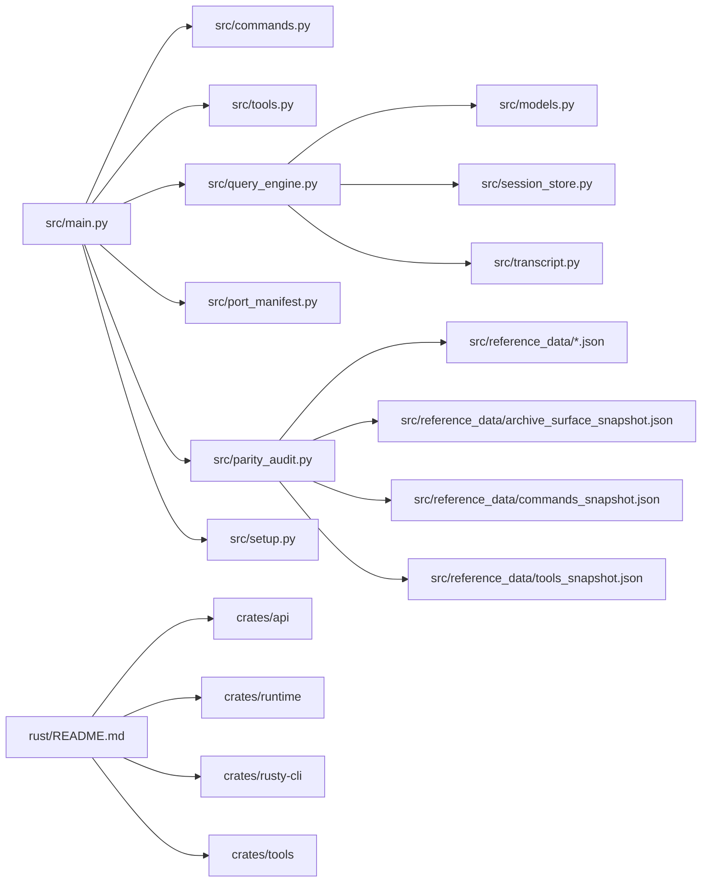

# 项目背景

<cite>
**本文引用的文件**
- [README.md](file://README.md)
- [CLAUDE.md](file://CLAUDE.md)
- [PARITY.md](file://PARITY.md)
- [src/main.py](file://src/main.py)
- [src/port_manifest.py](file://src/port_manifest.py)
- [src/query_engine.py](file://src/query_engine.py)
- [src/parity_audit.py](file://src/parity_audit.py)
- [src/setup.py](file://src/setup.py)
- [rust/README.md](file://rust/README.md)
- [rust/Cargo.toml](file://rust/Cargo.toml)
- [rust/TUI-ENHANCEMENT-PLAN.md](file://rust/TUI-ENHANCEMENT-PLAN.md)
</cite>

## 目录
1. [引言](#引言)
2. [项目结构](#项目结构)
3. [核心组件](#核心组件)
4. [架构总览](#架构总览)
5. [详细组件分析](#详细组件分析)
6. [依赖关系分析](#依赖关系分析)
7. [性能考量](#性能考量)
8. [故障排查指南](#故障排查指南)
9. [结论](#结论)
10. [附录](#附录)

## 引言
本项目记录了 2026 年 3 月 31 日凌晨发生的一次重大技术事件：Claude Code 源代码泄露。在收到紧急通知后，项目发起者于凌晨 4 点启动紧急响应，采用清洁室（clean-room）重写的方式，从 TypeScript 核心功能出发，在日出前完成 Python 版本的端到端重构与验证。该决定基于法律与道德考量，避免直接使用泄露代码，转而通过独立实现捕捉架构模式与工作流。

此次重写以 oh-my-codex（OmX）工作流为核心，结合 $team 并行评审与 $ralph 持续执行循环，实现了从“理解原始结构”到“生成可运行的 Python 树与测试”的完整自动化编排。项目当前以 Python 为主导的移植工作区（src/）作为主干，同时保留与上游 TypeScript 的可比性审计能力，并在 Rust 分支推进高性能实现。

此外，项目在社区中引发广泛关注，相关成果曾被《华尔街日报》专题报道，体现了其在代理系统、工具编排与运行时上下文管理等方向上的探索价值。

**章节来源**
- [README.md:36-99](file://README.md#L36-L99)

## 项目结构
仓库采用多语言并行演进策略：
- Python 移植工作区（src/）：提供命令与工具清单镜像、查询引擎摘要渲染、会话持久化与对比审计等能力，作为当前主干。
- Rust 实现（rust/）：高性能 CLI 运行时，覆盖核心 API 客户端、权限系统、会话与 MCP 支持等，目标是更快、内存安全的最终版本。
- 测试与资产：tests/ 提供单元测试；assets/omx/ 展示 OmX 工作流截图；参考数据目录 reference_data/ 用于与历史快照进行一致性审计。

**图表来源**
- [src/main.py:1-214](file://src/main.py#L1-L214)
- [src/query_engine.py:1-194](file://src/query_engine.py#L1-L194)
- [src/port_manifest.py:1-53](file://src/port_manifest.py#L1-L53)
- [src/parity_audit.py:1-139](file://src/parity_audit.py#L1-L139)
- [src/setup.py:1-78](file://src/setup.py#L1-L78)
- [rust/README.md:1-222](file://rust/README.md#L1-L222)
- [rust/Cargo.toml:1-20](file://rust/Cargo.toml#L1-L20)
- [rust/TUI-ENHANCEMENT-PLAN.md:1-222](file://rust/TUI-ENHANCEMENT-PLAN.md#L1-L222)

**章节来源**
- [README.md:82-99](file://README.md#L82-L99)
- [CLAUDE.md:13-22](file://CLAUDE.md#L13-L22)

## 核心组件
- CLI 入口与子命令分发：src/main.py 提供 summary、manifest、parity-audit、setup-report、command-graph、tool-pool、bootstrap-graph、subsystems、commands、tools、route、bootstrap、turn-loop、flush-transcript、load-session、remote-mode/ssh-mode/teleport-mode/direct-connect-mode/deep-link-mode、show-command/show-tool、exec-command/exec-tool 等子命令，统一驱动移植工作区的可视化与验证流程。
- 查询引擎与摘要渲染：src/query_engine.py 提供 QueryEnginePort，负责回合提交、权限拒绝追踪、用量统计、结构化输出渲染与会话持久化，支持流式事件序列。
- 工作区清单与模块统计：src/port_manifest.py 基于 src/ 统计顶级模块数量与文件分布，生成 Markdown 清单。
- 对比审计：src/parity_audit.py 将当前 Python 工作区与历史 TypeScript 快照进行根文件、目录与命令/工具条目的覆盖率对比，输出缺失项清单。
- 启动与预取：src/setup.py 聚合平台信息、预取任务与延迟初始化结果，输出可读的设置报告。
- Rust 实现与特性矩阵：rust/README.md 描述多提供商认证支持、特性状态、CLI 与 TUI 增强计划等；rust/Cargo.toml 定义工作区与 lint 规则；rust/TUI-ENHANCEMENT-PLAN.md 提供终端用户界面增强的阶段化规划。

**章节来源**
- [src/main.py:21-214](file://src/main.py#L21-L214)
- [src/query_engine.py:35-194](file://src/query_engine.py#L35-L194)
- [src/port_manifest.py:12-53](file://src/port_manifest.py#L12-L53)
- [src/parity_audit.py:73-139](file://src/parity_audit.py#L73-L139)
- [src/setup.py:12-78](file://src/setup.py#L12-L78)
- [rust/README.md:1-222](file://rust/README.md#L1-L222)
- [rust/Cargo.toml:1-20](file://rust/Cargo.toml#L1-L20)
- [rust/TUI-ENHANCEMENT-PLAN.md:1-222](file://rust/TUI-ENHANCEMENT-PLAN.md#L1-L222)

## 架构总览
下图展示了从“紧急响应与清洁室重写”到“OmX 协作编排”的整体流程，以及 Python 工作区与 Rust 实现之间的互补关系：

**图表来源**
- [README.md:36-43](file://README.md#L36-L43)
- [src/main.py:94-214](file://src/main.py#L94-L214)
- [src/parity_audit.py:121-139](file://src/parity_audit.py#L121-L139)
- [rust/README.md:1-222](file://rust/README.md#L1-L222)

## 详细组件分析

### CLI 入口与子命令体系
- 功能概览：统一解析子命令，调用对应模块（命令/工具索引、会话加载、远程分支模拟、回合循环、摘要渲染等），支撑快速验证与审计。
- 关键路径：
  - summary：渲染 Python 移植工作区摘要
  - manifest：打印当前工作区清单
  - parity-audit：与本地忽略的 TypeScript 快照进行对比
  - setup-report：输出启动/预取设置报告
  - command-graph/tool-pool/bootstrap-graph：可视化命令/工具与引导图谱
  - subsystems/commands/tools：列出模块与镜像条目
  - route/bootstrap/turn-loop：路由提示、构建会话与小规模回合循环
  - flush-transcript/load-session：会话持久化与加载
  - remote-mode/ssh-mode/teleport-mode/direct-connect-mode/deep-link-mode：模拟不同运行分支
  - show-command/show-tool/exec-command/exec-tool：展示与执行镜像条目

**图表来源**
- [src/main.py:21-214](file://src/main.py#L21-L214)

**章节来源**
- [src/main.py:21-214](file://src/main.py#L21-L214)

### 查询引擎与回合处理
- 数据结构：QueryEngineConfig、TurnResult、QueryEnginePort，封装回合配置、权限拒绝、用量统计与会话存储。
- 处理逻辑：
  - submit_message：限制最大回合数与预算令牌，格式化输出，更新用量与压缩消息。
  - stream_submit_message：事件式流式输出 message_start/message_delta/message_stop。
  - compact_messages_if_needed：超过阈值时压缩消息窗口。
  - persist_session/flush_transcript：会话持久化与转录清理。
  - render_summary：汇总清单、命令/工具镜像条目与会话状态。

**图表来源**
- [src/query_engine.py:61-104](file://src/query_engine.py#L61-L104)
- [src/query_engine.py:129-132](file://src/query_engine.py#L129-L132)
- [src/query_engine.py:140-150](file://src/query_engine.py#L140-L150)
- [src/query_engine.py:171-194](file://src/query_engine.py#L171-L194)

**章节来源**
- [src/query_engine.py:15-194](file://src/query_engine.py#L15-L194)

### 工作区清单与模块统计
- 作用：扫描 src/ 下的 Python 文件，按顶级模块聚合统计，生成 Markdown 清单，标注模块职责与文件数量。
- 关键点：排除缓存目录，使用 dataclass 组织清单结构，便于 CLI 展示与审计。

**章节来源**
- [src/port_manifest.py:12-53](file://src/port_manifest.py#L12-L53)

### 对比审计与覆盖率评估
- 目标：将当前 Python 工作区与历史 TypeScript 快照进行对比，评估根文件、目录、命令与工具条目的覆盖率。
- 方法：映射 ARCHIVE_ROOT_FILES 与 ARCHIVE_DIR_MAPPINGS，统计命中与缺失，读取参考表面与快照计数，输出 Markdown 结果。
- 输出：覆盖率比例、缺失清单与可读摘要。

**章节来源**
- [src/parity_audit.py:73-139](file://src/parity_audit.py#L73-L139)

### 启动与预取流程
- 作用：收集平台信息、执行预取侧效应（如密钥链、项目扫描）、延迟初始化（受信任门控），并输出可读设置报告。
- 关键点：PrefetchResult 与 DeferredInitResult 的组合，确保环境健康与可信模式。

**章节来源**
- [src/setup.py:12-78](file://src/setup.py#L12-L78)

### Rust 实现与特性矩阵
- 快速开始：构建与运行交互式 REPL、一次性提示、指定模型等。
- 认证与提供商支持：在 dev/rust 分支仅支持 Anthropic Messages API，main 分支具备多提供商路由层。
- 特性状态：API 流式、OAuth 登录、REPL、工具系统、Web 工具、子代理编排、待办、笔记本编辑、项目记忆、配置层次、权限系统、MCP 生命周期、会话持久化与恢复、成本跟踪、Git 集成、Markdown 终端渲染、模型别名、斜杠命令等。
- 工作区布局：crates/api、commands、compat-harness、runtime、rusty-cli、tools。

**章节来源**
- [rust/README.md:1-222](file://rust/README.md#L1-L222)

### TUI 增强计划（Rust）
- 当前架构：rusty-claude-cli 主二进制承担 REPL 循环、参数解析、渲染、API 桥接；runtime 提供会话与配置；tools 提供内置工具实现。
- 增强阶段：结构清理（拆分 monolith）、状态栏与实时 HUD、增强流式输出、工具调用可视化、增强斜杠命令与导航、颜色主题与配置、全屏 TUI 模式（可选）。
- 设计原则：保持内联 REPL 默认体验；一切可测试且不直接假设 stdout；流式优先；尊重 crossterm；重依赖按特性门控。

**章节来源**
- [rust/TUI-ENHANCEMENT-PLAN.md:1-222](file://rust/TUI-ENHANCEMENT-PLAN.md#L1-L222)

## 依赖关系分析
- Python 工作区内部依赖：src/main.py 作为入口，协调 commands、tools、query_engine、port_manifest、parity_audit、setup 等模块；query_engine 依赖 models、session_store、transcript 等。
- Rust 工作区依赖：Cargo.toml 定义工作区成员与 lint 规则；各 crate 职责清晰，api/commands/runtime/rusty-cli/tools 彼此协作。
- 对比审计依赖：parity_audit 依赖 reference_data 中的快照与参考表面，用于覆盖率计算与缺失项输出。

**图表来源**
- [src/main.py:1-214](file://src/main.py#L1-L214)
- [src/query_engine.py:1-194](file://src/query_engine.py#L1-L194)
- [src/parity_audit.py:1-139](file://src/parity_audit.py#L1-L139)
- [rust/README.md:187-200](file://rust/README.md#L187-L200)

**章节来源**
- [src/main.py:1-214](file://src/main.py#L1-L214)
- [rust/Cargo.toml:1-20](file://rust/Cargo.toml#L1-L20)

## 性能考量
- Python 工作区：通过紧凑消息窗口与结构化输出重试机制控制内存与 I/O；CLI 子命令按需加载与渲染，避免不必要的计算。
- Rust 实现：以高性能为目标，提供内存安全与原生工具执行能力；特性矩阵显示已覆盖核心功能，部分高级特性仍在规划或开发中。
- 对比审计：仅在存在历史快照时启用，避免无意义的比较开销。

[本节为通用指导，无需特定文件分析]

## 故障排查指南
- 设置报告核验：使用 setup-report 子命令检查 Python 版本、平台、可信模式与预取结果，定位环境问题。
- 并对比审：使用 parity-audit 子命令查看根文件、目录、命令与工具条目的覆盖率，识别缺失模块与条目。
- 会话持久化：使用 flush-transcript 与 load-session 验证会话存储与转录清理行为。
- 命令/工具执行：使用 show-command/show-tool 与 exec-command/exec-tool 检查镜像条目定义与执行结果。
- Rust 环境：参考 rust/README.md 的认证与提供商支持矩阵，确认环境变量与登录状态。

**章节来源**
- [src/setup.py:38-53](file://src/setup.py#L38-L53)
- [src/parity_audit.py:84-110](file://src/parity_audit.py#L84-L110)
- [src/main.py:160-170](file://src/main.py#L160-L170)
- [src/main.py:186-207](file://src/main.py#L186-L207)
- [rust/README.md:22-109](file://rust/README.md#L22-L109)

## 结论
本项目以 2026 年 3 月 31 日凌晨的泄露事件为背景，展现了在高压环境下通过清洁室重写与 AI 协作编排完成的快速迁移实践。Python 工作区提供了可验证的移植摘要、命令/工具镜像与对比审计能力；Rust 实现则追求性能与稳定性，二者互为补充。项目不仅在技术上取得阶段性成果，也在社区与媒体层面产生了积极影响。

[本节为总结性内容，无需特定文件分析]

## 附录
- 泄露事件与清洁室重写：项目背景明确指出在凌晨 4 点启动紧急响应，采用 OmX 工作流进行并行评审与持续执行，产出清洁室 Python 重写版本。
- 与《华尔街日报》的关系：项目在 README 中提及曾被该报专题报道，体现其在代理系统探索领域的影响力。
- Rust 分支进展：README 指出 Rust 实现正在 dev/rust 分支推进，预期将合并至主干，成为最终版本。

**章节来源**
- [README.md:36-63](file://README.md#L36-L63)
- [README.md:29-33](file://README.md#L29-L33)
- [rust/README.md:1-222](file://rust/README.md#L1-L222)